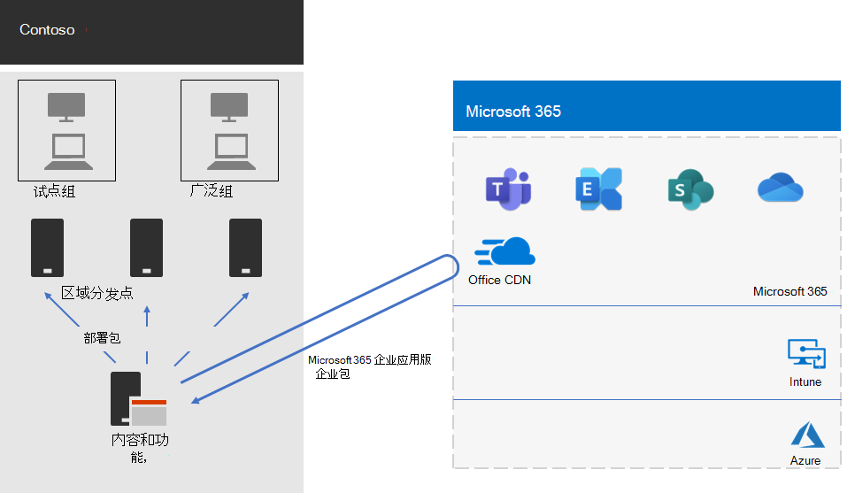

# Contoso 的 Microsoft 365 企业应用版部署Microsoft 365 Apps for enterprise deployment for Contoso

Contoso 将电脑升级到 Windows 10 企业版 Microsoft 365 企业应用版，以实现更有效的协作、更好的安全性和更现代化的桌面体验。Contoso upgraded their PCs to Windows 10 Enterprise and Microsoft 365 Apps for enterprise to enable more effective collaboration, better security, and a more modern desktop experience. 在评估其基础结构和业务需求后，Contoso 确定了这些部署的关键要求：After they assessed their infrastructure and business needs, Contoso identified these key requirements for the deployment:

- 所有电脑都应在Microsoft 365 企业应用版。All PCs should run Microsoft 365 Apps for enterprise.
- 如果可能，部署应使用现有管理工具和基础结构。Deployment should use existing management tools and infrastructure when possible.
- 部署必须在用户设备上支持多种语言和现有体系结构。Deployment must support multiple languages and existing architectures on users' devices.
- 电脑应保持最新和安全，并尽量减少 IT 管理成本，并尽量减少对用户的影响。PCs should stay up-to-date and secure with minimal IT administrative costs and minimal impact to users.

## 部署工具Deployment tools

根据要求，Contoso 选择通过 Configuration Manager Windows 10 企业版 Microsoft 365 企业应用版 Current Branch (部署) 。Based on their requirements, Contoso chose to deploy Windows 10 Enterprise and Microsoft 365 Apps for enterprise through Configuration Manager (Current Branch). Configuration Manager 可针对大型环境进行扩展，并提供对安装、更新和设置的广泛控制。Configuration Manager scales for large environments and provides extensive control over installation, updates, and settings. 它还具有内置功能，以便更加轻松和高效地部署和管理Office，包括：It also has built-in features to make it easier and more efficient to deploy and manage Office, including:

- 对等缓存，在部署到远程位置的设备时，可帮助实现有限的网络容量。Peer cache, which can help with limited network capacity when deploying to devices in remote locations.
- The Office Client Management dashboard， which makes it easy to deploy Office and monitor updates and gives administrators access to the latest deployment and management features.The Office Client Management dashboard, which makes it easy to deploy Office and monitor updates and gives administrators access to the latest deployment and management features.
- 智能语言包部署，包括自动部署与操作系统相同的语言。Intelligent language pack deployment, including automatically deploying the same language as the operating system.
- 一种完全受支持且易于使用的方法，用于部署期间从客户端Office现有版本的客户端。A fully supported and easy-to-use method of removing existing versions of Office from a client during deployment.

除了 Configuration Manager 之外，Contoso 还使用 Toolkit for Office 加载项和[VBA（Microsoft](/deployoffice/readiness-toolkit-application-compatibility-microsoft-365-apps)免费提供的工具）来评估其 Office 宏和加载项的兼容性问题。In addition to Configuration Manager, Contoso used the [Readiness Toolkit for Office add-ins and VBA](/deployoffice/readiness-toolkit-application-compatibility-microsoft-365-apps), a free tool from Microsoft, to assess compatibility issues with their Office macros and add-ins.

## 管理部署和更新Managing deployment and updates

Microsoft 365 企业应用版新的发布模型：Office即服务。Microsoft 365 Apps for enterprise has a new release model: Office as a service. 服务模型使使用新功能保持最新状态变得容易。The service model makes it easy to stay up to date with new features. 但通常需要 IT 部门更改其部署和测试新版本。But it often requires IT departments to change how they deploy and test new releases. 为了最大限度地减少兼容性问题并确保其计算机保持最新，Contoso 分两个阶段Windows Office和部署计算机：To minimize compatibility issues and to ensure their computers stay up to date, Contoso deployed Windows and Office in two stages:

- 首先，他们Microsoft 365 企业应用版组织中一小组具有代表性的设备进行部署。First, they deployed Microsoft 365 Apps for enterprise to a small set of representative devices across the organization. 此试点组用于测试应用、加载项和硬件Microsoft 365 企业应用版。This pilot group was used to test apps, add-ins, and hardware with Microsoft 365 Apps for enterprise.
- 四个月后，在解决了试点组中有关应用、加载项和硬件的所有关键问题后，Contoso 将 Microsoft 365 企业应用版部署到组织中的剩余设备（广泛组）。Four months later, after addressing all critical issues with apps, add-ins, and hardware in the pilot group, Contoso deployed Microsoft 365 Apps for enterprise to the rest of the devices in the organization (the broad group).

Contoso 从云Office自动更新，而不是使用 Configuration Manager 管理更新。Instead of managing updates to Office by using Configuration Manager, Contoso enabled automatic updates from the cloud. 基于云的更新可减少管理开销，同时确保设备保持最新状态。Cloud-based updates reduce administrative overhead while ensuring that devices stay up to date.

Contoso 对功能更新采用与用于部署 Office 相同的两阶段方法：试点组中设备接收功能更新的时间比组织中其余组织的设备早四个月 (广泛组) 。Contoso followed the same two-stage approach for feature updates as they used for deploying Office: Devices in the pilot group received feature updates four months earlier than devices in the rest of the organization (the broad group). 若要为用户启用Office，Contoso 使用了两个推荐的[更新频道](/DeployOffice/overview-update-channels)：To enable this for Office, Contoso used two recommended [update channels](/DeployOffice/overview-update-channels):

- 试点组更新的 Enterprise 半年频道（预览）。Semi-Annual Enterprise Channel (Preview) for updates to the pilot group
- Semi-Annual Enterprise频道获取广泛组更新Semi-Annual Enterprise Channel for updates to the broad group

因为半年 Enterprise 频道（预览）发布 Microsoft 365 企业应用版的时间比半年 Enterprise 频道早 4 个月，所以，Contoso 有时间来验证更新，无需对其进行管理。Because the Semi-Annual Enterprise Channel (Preview) releases a version of Microsoft 365 Apps for enterprise four months earlier than the Semi-Annual Enterprise Channel, Contoso has time to validate the updates without having to manage them.

## 部署过程Deployment process

为完成 Office 的部署，Contoso 实施了以下过程，其中包括来自 Microsoft 的最佳做法建议：To complete the deployment of Office, Contoso implemented the following process, which includes best practice recommendations from Microsoft:

1. 在部署之前，Contoso 使用 Toolkit 和 VBA 的 Readiness Office 测试其应用和 Office 外接程序来评估其与 Microsoft 365 企业应用版 的兼容性。Before deployment, Contoso used the Readiness Toolkit for Office add-in and VBA to test their apps and Office Add-ins to assess their compatibility with Microsoft 365 Apps for enterprise.
1. 在 Configuration Manager 中，他们在客户端设备上启用了对等缓存，这有助于在部署到远程位置的客户端设备时具有有限的网络容量。In Configuration Manager, they enabled peer cache on their client devices, which helps with limited network capacity when deploying to client devices in remote locations. 
1. Contoso 在 Configuration Manager 中将两个部署组定义为设备集合：试点组和广泛组。Contoso defined two deployment groups as device collections in Configuration Manager: a pilot group and a broad group. 试点组包括一小组跨组织的代表设备，用于对应用、加载项和硬件进行附加测试，Windows 10 企业版Microsoft 365 企业应用版。The pilot group, which included a small set of representative devices across the organization, was used for additional testing of apps, add-ins, and hardware with Windows 10 Enterprise and Microsoft 365 Apps for enterprise.
1. 他们通过使用 Office 客户端管理仪表板和 Office 365 Installer 向导为 Office 创建了部署包，这两者都是 Configuration Manager 控制台的一部分。They created deployment packages for Office by using the Office Client Management dashboard and the Office 365 Installer wizard, which are both part of the Configuration Manager console. 他们构建了两Microsoft 365 企业应用版包，一个适用于 Semi-Annual Enterprise Channel (Preview) 上的试点组，另一个适用于 Semi-Annual Enterprise Channel 上的广泛组。They built two Microsoft 365 Apps for enterprise packages, one for the pilot group on the Semi-Annual Enterprise Channel (Preview) and one for the broad group on the Semi-Annual Enterprise Channel.
2. 每个Office包都包含英语、法语和德语语言包。Each Office package included English, French, and German Language packs. 如果设备所需的语言未包含在 Office 程序包中，则会自动从 Office 内容分发网络 (CDN) 。If a device required a language that wasn't included in the Office package, that language pack was automatically downloaded from the Office Content Delivery Network (CDN).
3. 在安装 Microsoft 365 企业应用版前，它们使用 Office 包中的内置功能来自动删除所有现有的 Office 的 MSI 版本。They used the built-in feature in the Office package to automatically remove all existing MSI versions of Office before installing Microsoft 365 Apps for enterprise.
4. 在 Configuration Manager 中，他们部署了 Windows，Office程序包跨网络部署到分发点。In Configuration Manager, they deployed the Windows and Office packages to distribution points across their network. 然后，他们运行 Configuration Manager 部署任务序列，将试点Microsoft 365 企业应用版包部署到试点组。Then they ran the Configuration Manager deployment task sequences to deploy the pilot Microsoft 365 Apps for enterprise package to the pilot group.
5. 在解决了试点组的兼容性问题后，Contoso 运行任务序列以将Microsoft 365 企业应用版包部署到广泛组。After they addressed compatibility issues with the pilot group, Contoso ran the task sequences to deploy the Microsoft 365 Apps for enterprise package to the broad group.

因为 Contoso 选择从云中自动更新设备，所以无需在 Configuration Manager 中管理过程。Because Contoso chose to automatically update devices from the cloud, there was no need to manage the process in Configuration Manager. 其设备会直接从基于云的自动更新，该更新通道是在初始部署中定义的。Their devices are automatically updated directly from the cloud-based on the update channel that was defined in the initial deployment.

下面是 Contoso Microsoft 365 企业应用版安装和持续更新部署体系结构。Here is the Contoso Microsoft 365 Apps for enterprise installation and ongoing updates deployment architecture.

 
## 后续步骤Next step

了解 Contoso如何使用 Microsoft Intune Microsoft 365 企业版来管理其设备和他们在组织中运行的应用。Learn how Contoso is [using Microsoft Intune](contoso-mdm.md) in Microsoft 365 for enterprise to manage its devices and the apps that they run across the organization.

## 另请参阅See also

[Microsoft 365 企业应用版Microsoft 365 Apps for enterprise](/deployoffice/deployment-guide-microsoft-365-apps)

[Microsoft 365 企业版概述Microsoft 365 for enterprise overview](microsoft-365-overview.md)

[测试实验室指南Test lab guides](m365-enterprise-test-lab-guides.md)