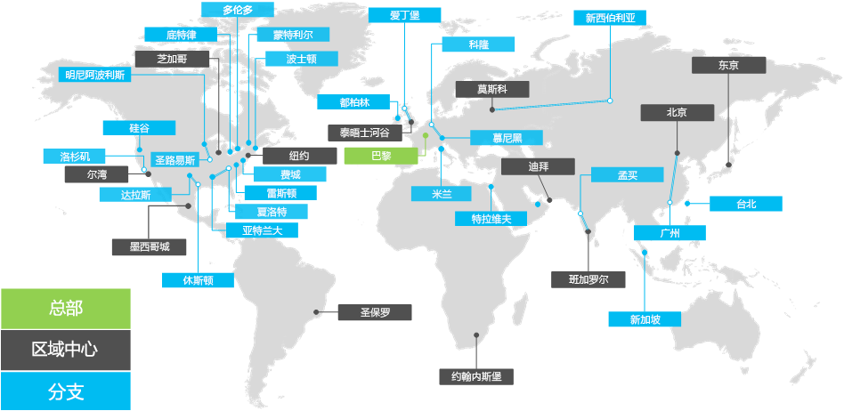

# Contoso Corporation 概述

Contoso Corporation 是一家跨国公司，总部位于巴黎。 公司是一家制造、销售和支持组织，拥有 100，000 多个产品。

## 全球的 Contoso

图 1 显示了巴黎总部办事处以及区域中心以及各个洲的附属办事处。

**图 1：全球的 Contoso 办事处**
 
Contoso 有三层办公室：

- 总部

  Contoso 总部是位于巴黎园区的公司园区，拥有数十座用于管理、工程和制造设施建筑物。 所有 Contoso 数据中心及其 Internet 状态均位于巴黎总部。

  总部拥有 25,000 名工作人员。

- 区域中心

  中心办事处为世界上的一个特定区域提供 60% 的销售和支持人员。 每个区域中心都通过高带宽 WAN 链路连接到巴黎总部。

  区域中心平均拥有 2，000 个工作人员。

- 分支办事处

  附属办事处包含 80% 的销售和支持人员。 它们为主要城市或子区域中的 Contoso 客户提供现场状态。 每个附属办事处都通过高带宽 WAN 链接连接到区域中心。

  附属办事处平均拥有 250 个工作人员。

大约 25% 的 Contoso 员工是仅移动设备。 区域中心和附属办事处工作人员所占的百分比更高。 为仅移动工作人员提供有力的支持是 Contoso 的重要业务目标。

## 企业版Microsoft 365设计注意事项

Contoso IT 架构师确定了以下用于为企业部署Microsoft 365要求因素：

- 具有本地管理法规和合规性要求的多个地理位置
- 总部办公室的中央 Intranet 数据中心和承载内部业务线应用程序的区域应用程序服务器
- 现有 Microsoft Endpoint Configuration Manager 基础结构
- 运行 Windows、Mac 和 Linux 的客户端计算设备的组合
- 同时涉及个人和公司所拥有的移动设备，包括 iOS（iPhone 和 iPad）和 Android 智能手机和平板电脑
- 许多远程和移动工作人员
- 许多商业合作伙伴
- 要管理和保护大量客户和其他机密信息
- 以产品设计规格和制造工艺商业机密形式存在的大量高价值知识产权

## 后续步骤

了解 Contoso Corporation 本地[IT](contoso-infra-needs.md)基础结构，以及如何使用适用于企业的 Microsoft 365满足公司的业务需求。

## 另请参阅

[Microsoft 365 企业版概述](microsoft-365-overview.md)

[测试实验室指南](m365-enterprise-test-lab-guides.md)
