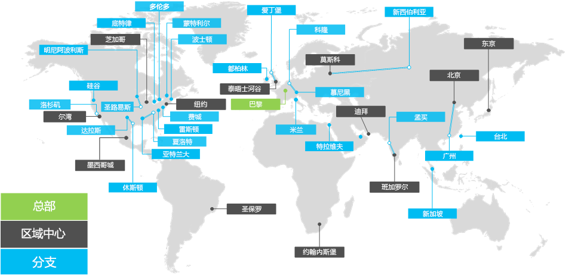

# Contoso Corporation 概述Overview of the Contoso Corporation

Contoso Corporation 是一家跨国公司，总部设在法国巴黎。这是一家集制造、销售和支持服务为一体的大型组织，提供 100,000 多种产品。The Contoso Corporation is a multi-national business with headquarters in Paris, France. It is a conglomerate manufacturing, sales, and support organization with over 100,000 products.

## 全球的 ContosoContoso around the world

图 1 显示了在巴黎的总部办公室和在各大洲的区域中心和分支办事处。Figure 1 shows the headquarters office in Paris and regional hub and satellite offices in various continents.

**图 1：全球的 Contoso 办事处****Figure 1: Contoso's offices around the world**
 
世界各地的 Contoso 办事处按照三层进行设计。Contoso's offices around the world follow a three-tier design.

- 总部Headquarters

  Contoso Corporation 总部位于巴黎郊外的一个大型企业园区，拥有数十座用于管理、设计和制造设施的建筑物。Contoso 的所有数据中心和 Internet 展示均位于巴黎总部。The Contoso Corporation headquarters is a large corporate campus on the outskirts of Paris with dozens of buildings for administrative, engineering, and manufacturing facilities. All of Contoso's datacenters and its Internet presence are housed in the Paris headquarters.

  总部拥有 25,000 名工作人员。The headquarters has 25,000 workers.

- 区域中心Regional hubs

  区域中心办事处拥有 60% 的销售和支持人员，为世界上的特定区域服务。每个区域中心都通过高带宽的 WAN 链接连接到巴黎总部。 Regional hub offices serve a specific region of the world with 60% sales and support staff. Each regional hub is connected to the Paris headquarters with a high-bandwidth WAN link.

  每个区域中心平均拥有 2,000 名工作人员。Each regional hub has an average of 2,000 workers.

- 分支办事处Satellite offices

  分支办事处包含 80% 的销售和支持人员，并为主要城市或子地区的 Contoso 客户提供现场展示。每个分支办事处通过高带宽 WAN 链接连接到区域中心。Satellite offices contain 80% sales and support staff and provide an on-site presence for Contoso customers in key cities or sub-regions. Each satellite office is connected to a regional hub with a high-bandwidth WAN link.

  每个分支办事处平均拥有 250 名工作人员。Each satellite office has an average of 250 workers.

25% 的 Contoso 工作人员为仅移动工作人员，区域中心和分支办事处的仅移动工作人员的百分比更高。为仅移动工作人员提供更有力的支持是 Contoso 的重要业务目标。25% of Contoso's workforce is mobile-only, with a higher percentage of mobile-only workers in the regional hubs and satellite offices. Providing better support for mobile-only workers is an important business goal for Contoso.

## 有关 Microsoft 365 企业版的设计注意事项Design considerations for Microsoft 365 Enterprise

Contoso 的 IT 架构师在部署 Microsoft 365 企业版时确定了以下设计要求和注意事项：Contoso's IT architects identified the following design requirements and considerations when deploying Microsoft 365 Enterprise: 

- 具有本地管理法规和合规性要求的多个地理位置Multiple geographic locations with local regulations and compliance requirements
- 总部办公室的中央 Intranet 数据中心和托管内部业务线应用程序的区域应用程序服务器A central intranet datacenter in the headquarters office and regional application servers that host internal line of business applications
- 现有 Microsoft Endpoint Configuration Manager 基础结构An existing Microsoft Endpoint Configuration Manager infrastructure
- 涉及各种客户端计算设备，包括 Windows、Mac 和 LinuxA mix of client computing devices, including Windows, Mac, and Linux
- 同时涉及个人和公司所拥有的移动设备，包括 iOS（iPhone 和 iPad）和 Android 智能手机和平板电脑A mix of personal and company-owned mobile devices, including iOS (iPhone and iPad) and Android smart phones and tablets
- 许多远程和移动工作人员Many remote and mobile workers
- 许多商业合作伙伴Many business partners
- 大量的客户和个人身份信息A large amount of customer and personally identifiable information
- 以产品设计规格和制造工艺商业机密形式存在的大量高价值知识产权A large amount of high-value intellectual property in the form of design specifications for products and manufacturing trade secrets

## 后续步骤Next step

[了解](contoso-infra-needs.md) Contoso Corporation 的本地 IT 基础结构以及如何通过 Microsoft 365 企业版解决他们的业务需求。[Learn](contoso-infra-needs.md) about the Contoso Corporation’s on-premises IT infrastructure and how their business needs were addressed with Microsoft 365 Enterprise.

## 另请参阅See also

[部署指南Deployment guide](deploy-microsoft-365-enterprise.md)

[测试实验室指南Test lab guides](m365-enterprise-test-lab-guides.md)

