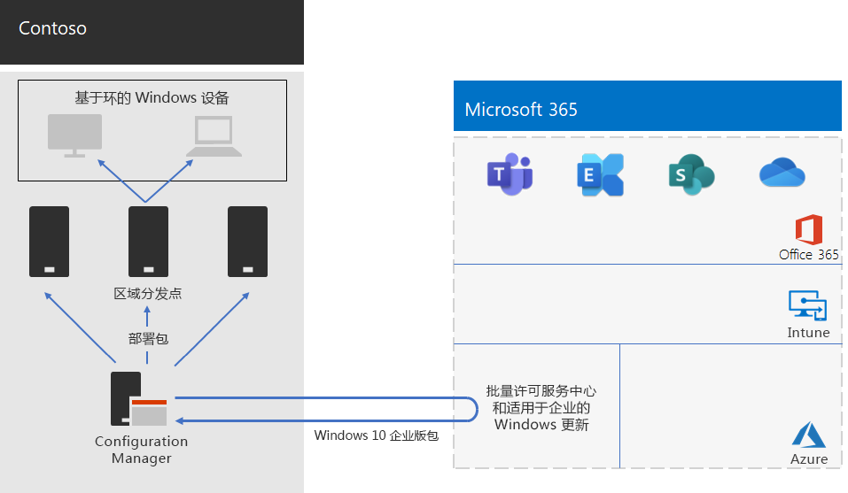

# Contoso Windows 10 企业版部署

**摘要：** 了解 Contoso 如何使用 System Center Configuration Manager 来部署 Windows 10 企业版的就地升级。

在广泛推出 Microsoft 365 企业版之前，Contoso 的 Windows 兼容电脑和设备混合运行 Windows 7 (10%)、Windows 8.1 (65%) 和 Windows 10 (25%)。Contoso 想要将其电脑升级为 Windows 10 企业版，以利用自动部署更新中改进的安全性并减少 IT 开销。 

在评估其基础结构和业务需求之后，Contoso 确定了这些部署的关键要求：

- 应有尽可能多的电脑和设备运行 Windows 10 企业版
- 就地升级的推广利用现有 System Center Configuration Manager 基础结构
- 控制哪些版本的 Windows 10 企业版的部署和更新是通过环来完成的
- 电脑和设备应保持最新的更新、使用最低的 IT 管理成本，并尽量减少对最终用户带来的影响

最新更新定义为满足 Contoso 业务需求的受支持的 Windows 10 企业版，这可能不同于使所有 Windows 兼容的电脑运行最新版本的 Windows 10 企业版。

## 部署工具

在 Windows 10 企业版就地升级之前和升级期间，Contoso 使用下列 Windows Analytics 解决方案：

- 升级就绪情况  

  收集系统、应用程序和驱动程序数据进行分析，然后识别可能阻止升级的兼容性问题，并建议修复 Microsoft 已知问题。

- 更新合规性  

  收集系统和诊断数据，包括更新安装进度、适用于企业的 Windows 更新 (WUfB) 配置数据、Windows Defender 防病毒数据和其他特定于更新的信息，然后将此数据存储在云分析和使用情况中。

- 设备运行状况  

  收集 Windows 10 系统和诊断数据，包括更新安装进度、适用于企业的 Windows 更新 (WUfB) 配置数据、Windows Defender 防病毒数据和其他特定于更新的信息，然后将此数据存储在云分析和使用情况中。
 
Contoso 具有一个现有的 System Center Configuration Manager (Current Branch) 基础结构。Configuration Manager 针对大型环境进行缩放，并在安装、更新和设置过程中提供广泛的控制。它还具有内置功能，能够更为轻松和高效地部署和管理 Windows 10 企业版。

## 规划过程

在部署之前，Contoso 定义以下环：

- 进行验证和部署暂存的三个环 
  - 一个用于预览版本 
  - 一个用于新发布版本
  - 一个用于以前的版本 
- 一个环基于验证环中的数据，用于广泛部署 Windows 10 企业版

此外，Contoso 还使用 Windows Analytics 的升级就绪情况解决方案来确定安装的应用集及其与 Windows 10 企业版的兼容性。

## 部署过程

若要完成 Windows 10 企业版的就地升级部署，Contoso 实施了以下过程，其中包括来自 Microsoft 的最佳做法建议：

1. 为 Configuration Manager 启用对等缓存。
2. 基于来自批量许可服务中心的图像创建自定义 Windows 程序包。
3. Configuration Manager 用于跨网络向分发点部署 Windows 包，并向三个验证和部署暂存环部署内部版本。
4. 使用 Windows Analytics 的设备运行状况和更新合规性解决方案，为三个验证和部署暂存环中的电脑和设备执行成功评估。
5. 基于 Windows Analytics 信息，Contoso 已确定 Windows 10 企业版将部署到广泛部署环的版本。
6. 运行 Configuration Manager 部署任务序列，将选定的 Windows 包部署到广泛部署环中。
7. 使用由 Windows Analytics 提供的用于解决问题的设备运行状况和更新合规性解决方案监视广泛部署环中的电脑和设备。

图 1 显示就地升级和持续更新部署体系结构。

 
**图 1：Contoso 的 Windows 10 企业版部署基础结构**

此基础结构的组成部分：

- System Center Configuration Manager：
  - 从 Microsoft 网络的 Microsoft 批量许可中心获取 Windows 10 企业版包的图像。
  - 是用于部署包的集中管理点。
- 通常位于 Contoso 分支办事处的区域分发点。
- 不同位置的 Windows 电脑和设备接收和安装部署包，用于就地升级或基于环成员的持续更新。

## 后续步骤

[了解](contoso-o365pp.md) Contoso 如何利用其 System Center Configuration Manager 基础结构在组织中部署 Office 365 专业增强版并使之保持最新。 

## 另请参阅

[Microsoft 365 企业版的 Windows 10 企业版](windows10-infrastructure.md)

[部署指南](deploy-microsoft-365-enterprise.md)

[测试实验室指南](m365-enterprise-test-lab-guides.md)
