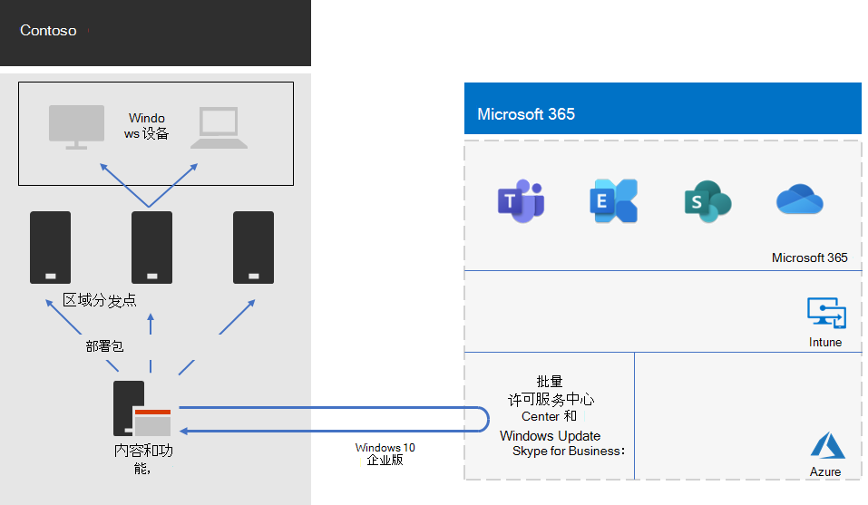

# Contoso Windows 10 企业版部署Windows 10 Enterprise deployment for Contoso

在 Microsoft 365 for enterprise 的广泛部署之前，Contoso 拥有运行 Windows 7 (10% ) 的 Windows 兼容的电脑和设备，Windows 8.1 (65% ) 和 Windows 10 (25% ) 。Contoso 希望升级其适用于 Windows 10 企业版的电脑，利用高级安全措施，并通过自动部署更新降低 IT 开销。Prior to the wide rollout of Microsoft 365 for enterprise, Contoso had Windows-compatible PCs and devices running a mixture of Windows 7 (10%), Windows 8.1 (65%), and Windows 10 (25%). Contoso wanted to upgrade their PCs for Windows 10 Enterprise take advantage of advanced security and lowered IT overhead from automated deployments of updates. 

在评估其基础结构和业务需求之后，Contoso 确定了这些部署的关键要求：After assessing their infrastructure and business needs, Contoso identified these key requirements for the deployment:

- 应有尽可能多的电脑和设备运行 Windows 10 企业版As many PCs and devices as possible should run Windows 10 Enterprise
- 就地升级的推广利用了现有的 Configuration Manager 基础结构Rollout of the in-place upgrades leverages existing Configuration Manager infrastructure
- 控制哪些版本的 Windows 10 企业版的部署和更新是通过环来完成的Control over which versions of Windows 10 Enterprise to deploy and updates are done through rings
- 电脑和设备应保持最新的更新、使用最低的 IT 管理成本，并尽量减少对最终用户带来的影响PCs and devices should stay up to date with minimal IT administrative costs and with minimal impact to end-users

最新更新定义为满足 Contoso 业务需求的受支持的 Windows 10 企业版，这可能不同于使所有 Windows 兼容的电脑运行最新版本的 Windows 10 企业版。Up to date is defined as the supported version of Windows 10 Enterprise that meets Contoso’s business needs, which can be different from having all Windows-compatible PCs running the latest version of Windows 10 Enterprise.

## 部署工具Deployment tools

在 Windows 10 企业版就地升级之前和升级期间，Contoso 使用下列 Windows Analytics 解决方案：Prior to and during in-place upgrades of Windows 10 Enterprise, Contoso used the following solutions of Windows Analytics:

- 升级就绪情况Upgrade Readiness  

  收集系统、应用程序和驱动程序数据进行分析，然后识别可能阻止升级的兼容性问题，并建议修复 Microsoft 已知问题。Collects system, application, and driver data for analysis, and then identifies compatibility issues that can block an upgrade and suggested fixes the issues are known to Microsoft.

- 更新合规性Update Compliance  

  显示有关 Windows 更新的设备状态，以便你可以根据需要确保它们位于最新的更新中。Shows you the state of your devices with respect to the Windows updates so that you can ensure that they are on the most current updates as appropriate.

- 设备运行状况Device Health  

  识别由于经常崩溃而可能需要重新生成或替换的设备以及导致设备崩溃的设备驱动程序，还包括有关这些驱动程序的可减少崩溃次数的替代版本建议。Identifies devices that crash frequently, and therefore might need to be rebuilt or replaced and device drivers that are causing device crashes, with suggestions of alternative versions of those drivers that might reduce the number of crashes. 提供 Windows 信息保护错误配置的通知，向最终用户发送相关提示。Provides notification of Windows Information Protection misconfigurations that send prompts to end users.
 
Contoso 具有一个现有的 Configuration Manager (Current Branch) 基础结构。Configuration Manager 针对大型环境进行扩展，并在安装、更新和设置过程中提供广泛的控制。它还具有内置功能，能够更为轻松和高效地部署和管理 Windows 10 企业版。Contoso has an existing Configuration Manager (Current Branch) infrastructure. Configuration Manager scales for large environments and provides extensive control over installation, updates, and settings. It also has built-in features to make it easier and more efficient to deploy and manage Windows 10 Enterprise.

## 规划过程Planning process

在部署之前，Contoso 定义以下环：Prior to deployment, Contoso defined the following rings:

- 进行验证和部署暂存的三个环Three rings for validation and deployment staging 
  - 一个用于预览版本One for preview builds 
  - 一个用于新发布版本One for new release builds
  - 一个用于以前的版本One for a previous build 
- 一个环基于验证环中的数据，用于广泛部署 Windows 10 企业版One ring for broad deployment of Windows 10 Enterprise based on data from the validation rings

此外，Contoso 还使用 Windows Analytics 的升级就绪情况解决方案来确定安装的应用集及其与 Windows 10 企业版的兼容性。Contoso also used the Upgrade Readiness solution of Windows Analytics to determine the set of installed apps and their compatibility with Windows 10 Enterprise.

## 部署过程Deployment process

若要完成 Windows 10 企业版的就地升级部署，Contoso 实施了以下过程，其中包括来自 Microsoft 的最佳做法建议：To complete the in-place upgrade deployment of Windows 10 Enterprise, Contoso implemented the following process, which includes best practice recommendations from Microsoft:

1. 为 Configuration Manager 启用对等缓存。Enabled peer cache for Configuration Manager.
2. 基于来自批量许可服务中心的图像创建自定义 Windows 程序包。Created customized Windows packages based on images from the Volume Licensing Service Center.
3. Configuration Manager 用于跨网络向分发点部署 Windows 包，并向三个验证和部署暂存环部署内部版本。Used Configuration Manager to deploy the Windows packages to distribution points across their network and deployed builds to the three validation and deployment staging rings.
4. 使用 Windows Analytics 的设备运行状况和更新合规性解决方案，为三个验证和部署暂存环中的电脑和设备执行成功评估。Performed assessment of success for PCs and devices in the three validation and deployment staging rings using the Device Health and Update Compliance solutions of Windows Analytics.
5. 基于 Windows Analytics 信息，Contoso 已确定 Windows 10 企业版将部署到广泛部署环的版本。Based on the Windows Analytics information, Contoso determined the version of Windows 10 Enterprise to deploy to the broad deployment ring.
6. 运行 Configuration Manager 部署任务序列，将选定的 Windows 包部署到广泛部署环中。Ran the Configuration Manager deployment task sequences to deploy the selected Windows package to the broad deployment ring.
7. 使用可解决问题的设备运行状况和更新合规性解决方案来监视广泛部署环中的电脑和设备。Monitored PCs and devices in the broad deployment ring using the Device Health and Update Compliance solutions to address issues.

下面是 Contoso 的就地升级和持续更新部署体系结构。Here is Contoso’s in-place upgrade and ongoing updates deployment architecture.

此基础结构的组成部分：This infrastructure consists of:

- Configuration Manager：Configuration Manager, which:
  - 从 Microsoft 网络的 Microsoft 批量许可中心获取 Windows 10 企业版包的图像。Obtains images for Windows 10 Enterprise packages from the Microsoft Volume Licensing Center in the Microsoft Network.
  - 是用于部署包的集中管理点。Is the central administration point for deployment packages.
- 通常位于 Contoso 区域中心办事处的区域分发点。Regional distribution points that are typically located in Contoso’s regional hub offices.
- 不同位置的 Windows 电脑和设备接收和安装部署包，用于就地升级或基于环成员的持续更新。Windows PCs and devices in various locations that receive and install the deployment packages for the in-place upgrade or ongoing updates based on ring membership.

## 后续步骤Next step

[了解](contoso-o365pp.md) Contoso 如何利用其 Configuration Manager 基础结构在组织中部署 Microsoft 365 企业应用版并使之保持最新。[Learn](contoso-o365pp.md) how Contoso is leveraging its Configuration Manager infrastructure to deploy and keep current Microsoft 365 Apps for enterprise across its organization. 

## 另请参阅See also

[Windows 10 企业版Windows 10 Enterprise](https://docs.microsoft.com/windows/deployment/)

[Microsoft 365 企业版概述Microsoft 365 for enterprise overview](microsoft-365-overview.md)

[测试实验室指南Test lab guides](m365-enterprise-test-lab-guides.md)
