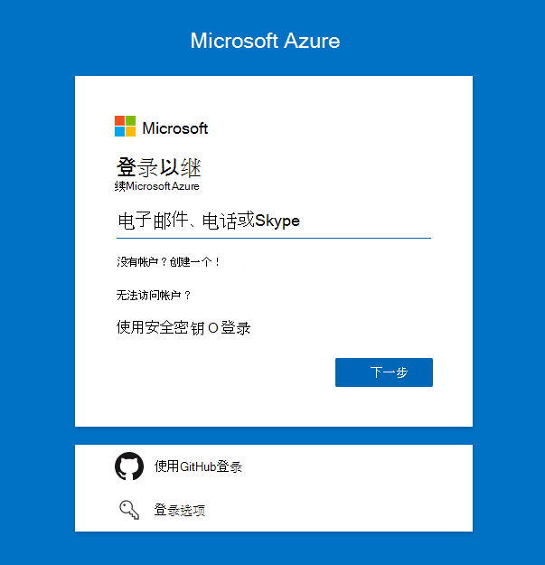
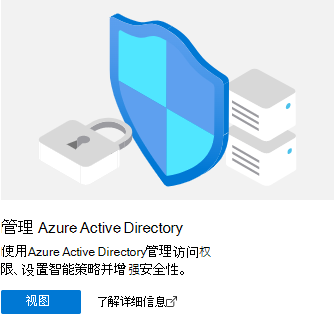
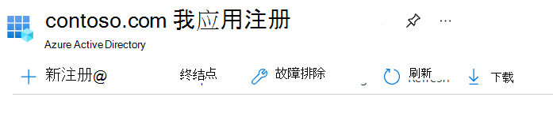
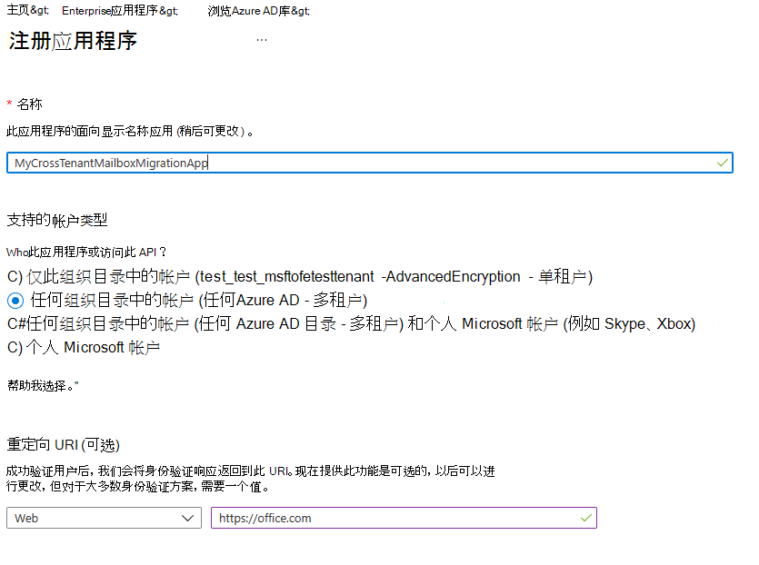
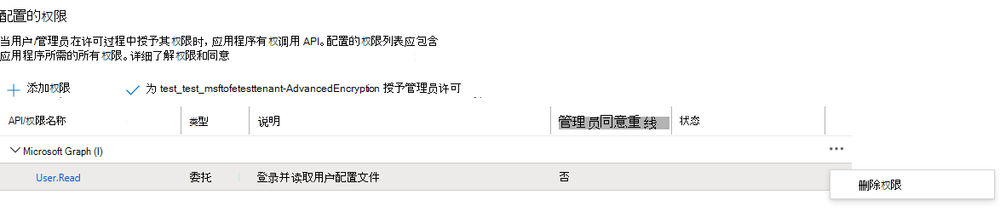
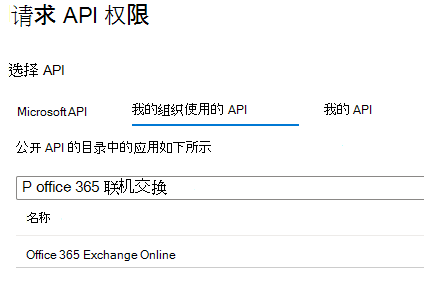
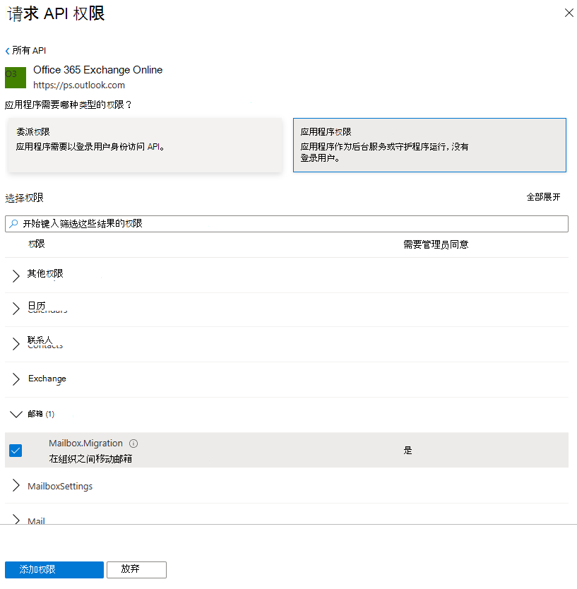

# <a name="cross-tenant-mailbox-migration-preview"></a>跨租户邮箱迁移 (预览) 

通常，在合并或资产重组期间，需要能够将用户的邮箱Exchange Online新租户。 跨租户邮箱迁移允许租户管理员使用远程 PowerShell 和 MRS 等已知界面将用户转换到其新组织。

管理员可以使用 New-MigrationBatch cmdlet（通过"移动邮箱"管理角色提供）来执行跨租户移动。

用户迁移必须在目标租户系统中Exchange Online MailUsers，并标记为特定属性才能启用跨租户移动。 对于未在目标租户中正确设置的用户，系统移动将失败。

移动完成后，源用户邮箱将转换为 MailUser，并且 targetAddress (显示为 Exchange) 中的 ExternalEmailAddress，并标记目标租户的路由地址。 此过程将旧版 MailUser 保留于源租户中，并允许共存和邮件路由。 当业务流程允许时，源租户可能会删除源 MailUser 或将其转换为邮件联系人。

跨租户Exchange邮箱迁移仅支持混合或云中的租户，或两者的任意组合。

本文介绍跨租户邮箱移动的过程，并提供有关如何为跨租户邮箱内容移动准备源Exchange Online目标租户的指南。

   > [!NOTE]
   > 我们最近更新了设置步骤，以允许跨租户邮箱迁移不再需要 Azure Key Vault！ 如果这是第一次载入此预览版，则无需任何操作，可以继续按照本文档中详述的步骤操作。 如果你已使用以前的 AKV 方法开始配置租户，我们强烈建议你停止或删除该配置，以开始使用此新方法。 如果邮箱迁移正在进行中采用以前的 AKV 方法，请等到现有迁移完成，然后按照以下步骤启用新的简化方法。 Azure Key Vault 所需的设置步骤已存档，但可以 **[在此处](https://github.com/microsoft/cross-tenant/wiki/V1-Content#cross-tenant-mailbox-migration-preview)** 找到，仅供参考。

## <a name="preparing-source-and-target-tenants"></a>准备源租户和目标租户

### <a name="prerequisites-for-source-and-target-tenants"></a>源租户和目标租户的先决条件

在启动之前，请确保你拥有在 Azure、EXO 迁移终结点和 EXO 组织关系中配置移动邮箱应用程序所需的权限。

此外，源租户中至少需要一个启用邮件的安全组。 这些组用于将邮箱列表的范围从源租户 (有时称为资源) 租户移动到目标租户。 这允许源租户管理员限制或限定需要移动的特定邮箱集，以防止迁移非预期用户。 不支持嵌套组。

你还需要与你的受信任合作伙伴公司 (，你要将邮箱移动到) 以获取其Microsoft 365 ID。 此租户 ID 用于"组织关系域名"字段。

若要获取订阅的租户 ID，请登录到 Microsoft 365 管理中心[并转到](https://go.microsoft.com/fwlink/p/?linkid=2024339) [https://aad.portal.azure.com/\#blade/Microsoft_AAD_IAM/ActiveDirectoryMenuBlade/Properties](https://aad.portal.azure.com/#blade/Microsoft_AAD_IAM/ActiveDirectoryMenuBlade/Properties) 。 单击"租户 ID"属性的复制图标，将其复制到剪贴板。

### <a name="configuration-steps-to-enable-your-tenants-for-cross-tenant-mailbox-migrations"></a>为租户启用跨租户邮箱迁移的配置步骤

   > [!NOTE]
   > 必须先配置目标 (目标) 。 若要完成这些步骤，你无需拥有或知道源租户和目标租户的租户管理员凭据。 不同管理员可分别针对每个租户执行步骤。

### <a name="prepare-the-target-destination-tenant-by-creating-the-migration-application-and-secret"></a>通过创建 (和) 准备目标目标租户

1. 使用目标租户Azure AD () 登录你的租户 <https://portal.azure.com> 门户

   

2. 单击"管理项目"下的Azure Active Directory。

   

3. 在左侧导航栏上，选择"应用注册"。

4. 选择“新注册”

   

5. 在"注册应用程序"页上的"支持的帐户类型"下，选择任何组织直接 ("Azure AD - 多租户) 。 然后在"重定向 URI (可选) ，选择"Web"并输入 <https://office.com> 。 最后，选择注册。

   

6. 在页面的右上角，你将看到一个通知弹出窗口，指出已成功创建应用。

7. 返回到"主页"，Azure Active Directory然后单击"应用注册"。

8. 在"拥有的应用程序"下，找到你创建的应用并单击它。

9. 在 ^Essentials 下，你将需要向下复制应用程序 (客户端) ID，因为稍后将需要它来创建目标租户的 URL。

10. 现在，在左侧导航栏上，单击"API 权限"以查看分配给你的应用的权限。

11. 默认情况下，用户。 "读取"权限将分配给您创建的应用程序，但我们不要求它们进行邮箱迁移，您可以删除该权限。

    

12. 现在我们需要添加邮箱迁移的权限，选择"添加权限"

13. 在"请求 API 权限"窗口中，选择"我的组织用户 API"，然后在线搜索 Office 365 exchange，选择它。

    

14. 接下来，选择"应用程序权限"

15. 然后，在"选择权限"下，展开"邮箱"，并选中"Mailbox.Migration"和"在屏幕底部添加权限"。

    

16. 现在，在&左侧导航栏上选择"证书"和密码。

17. 在"客户端密码"下，选择新的客户端密码。

    

18. 在"添加客户端密码"窗口中，输入说明并配置所需的过期设置。

      > [!NOTE]
      > 这是创建迁移终结点时将使用的密码。 将此密码复制到剪贴板或将此密码复制到安全/密码安全位置非常重要。 这是唯一一次能看到此密码的时间！ 如果因某种某种方法丢失证书或需要重置它，可以登录 Azure 门户，转到应用注册，查找迁移应用，选择密钥 & 证书，然后为应用创建新密码。

19. 现在，你已成功创建迁移应用程序和密码，你将需要同意该应用程序。 若要同意应用程序，请返回到 Azure Active Directory 登录页面，单击左侧导航栏中的 Enterprise 应用程序，找到你创建的迁移应用，选择它，然后选择左侧导航上的权限。

20. 单击"授予 [你的租户] 管理员同意"按钮。

21. 将打开一个新的浏览器窗口，然后选择"接受"。

22. 你可以返回到门户窗口，然后选择"刷新"以确认接受。

23. 制定要发送到受信任合作伙伴的 URL (源租户) 以便他们还可以接受应用程序以启用邮箱迁移。 下面是要提供的 URL 示例，将需要你创建的应用的应用程序 ID：

    ```powershell
    https://login.microsoftonline.com/sourcetenant.onmicrosoft.com/adminconsent?client_id=[application_id_of_the_app_you_just_created]&redirect_uri=https://office.com
    ```

    > [!NOTE]
    > 将需要刚创建的邮箱迁移应用程序的应用程序 ID。
    >
    > 你将需要将 sourcetenant.onmicrosoft.com 示例中的租户替换为正确的源 onmicrosoft.com 名称。
    >
    > 您还需要将 [application_id_of_the_app_you_just_created] 替换为刚创建的邮箱迁移应用程序的应用程序 ID。

### <a name="prepare-the-target-tenant-by-creating-the-exchange-online-migration-endpoint-and-organization-relationship"></a>通过创建迁移终结点和组织Exchange Online准备目标租户

1. 创建与目标租户的远程 PowerShell Exchange Online连接。

2. 为跨租户邮箱移动创建新的迁移终结点

   > [!NOTE]
   > 您需要刚创建的邮箱迁移应用程序的应用程序 ID，以及 (过程中) 的密码。 此外，根据Microsoft 365使用终结点的云实例可能会有所不同。 请参阅"Microsoft 365[终结点](/microsoft-365/enterprise/microsoft-365-endpoints)"页面，为租户选择正确的实例，并查看"Exchange Online"所需地址并根据需要进行替换。

   ```powershell
   $AppId = "[guid copied from the migrations app]"

   $Credential = New-Object -TypeName System.Management.Automation.PSCredential -ArgumentList $AppId, (ConvertTo-SecureString -String "[this is your secret password you saved in the previous steps]" -AsPlainText -Force)

   New-MigrationEndpoint -RemoteServer outlook.office.com -RemoteTenant "sourcetenant.onmicrosoft.com" -Credentials $Credential -ExchangeRemoteMove:$true -Name "[the name of your migration endpoint]" -ApplicationId $AppId
   ```

3. 创建新的组织关系对象或编辑源租户的现有组织关系对象。

   ```powershell
   $sourceTenantId="[tenant id of your trusted partner, where the source mailboxes are]"
   $orgrels=Get-OrganizationRelationship
   $existingOrgRel = $orgrels | ?{$_.DomainNames -like $sourceTenantId}
   If ($null -ne $existingOrgRel)
   {
       Set-OrganizationRelationship $existingOrgRel.Name -Enabled:$true -MailboxMoveEnabled:$true -MailboxMoveCapability Inbound
   }
   If ($null -eq $existingOrgRel)
   {
       New-OrganizationRelationship "[name of the new organization relationship]" -Enabled:$true -MailboxMoveEnabled:$true -MailboxMoveCapability Inbound -DomainNames $sourceTenantId
   }
   ```

### <a name="prepare-the-source-current-mailbox-location-tenant-by-accepting-the-migration-application-and-configuring-the-organization-relationship"></a>通过接受 (并配置) 关系，为租户中的当前邮箱位置准备源

1. 在浏览器中，转到受信任合作伙伴提供的 URL 链接，以同意邮箱迁移应用程序。 URL 如下所示：

   ```powershell
   https://login.microsoftonline.com/sourcetenant.onmicrosoft.com/adminconsent?client_id=[application_id_of_the_app_you_just_created]&redirect_uri=https://office.com
   ```

   > [!NOTE]
   > 将需要刚创建的邮箱迁移应用程序的应用程序 ID。
   > 你将需要将 sourcetenant.onmicrosoft.com 示例中的租户替换为正确的源 onmicrosoft.com 名称。
   > 您还需要将 [application_id_of_the_app_you_just_created] 替换为刚创建的邮箱迁移应用程序的应用程序 ID。

2. 出现弹出窗口时接受应用程序。 还可以登录到应用程序门户Azure Active Directory应用程序下找到Enterprise应用程序。

3. 从远程 PowerShell 窗口创建新的组织关系对象或 (目标) 租户Exchange Online组织关系对象。

   ```powershell
   $targetTenantId="[tenant id of your trusted partner, where the mailboxes are being moved to]"
   $appId="[application id of the mailbox migration app you consented to]"
   $scope="[name of the mail enabled security group that contains the list of users who are allowed to migrate]"
   $orgrels=Get-OrganizationRelationship
   $existingOrgRel = $orgrels | ?{$_.DomainNames -like $targetTenantId}
   If ($null -ne $existingOrgRel)
   {
       Set-OrganizationRelationship $existingOrgRel.Name -Enabled:$true -MailboxMoveEnabled:$true -MailboxMoveCapability RemoteOutbound -OAuthApplicationId $appId -MailboxMovePublishedScopes $scope
   }
   If ($null -eq $existingOrgRel)
   {
       New-OrganizationRelationship "[name of your organization relationship]" -Enabled:$true -MailboxMoveEnabled:$true -MailboxMoveCapability RemoteOutbound -DomainNames $targetTenantId -OAuthApplicationId $appId -MailboxMovePublishedScopes $scope
   }
   ```
   
> [!NOTE]
> 作为租户输入的租户 ID $sourceTenantId$targetTenantId GUID 而不是租户域名。 有关租户 ID 的示例和有关查找租户 ID 的信息，请参阅查找租户[Microsoft 365 ID。](/onedrive/find-your-office-365-tenant-id)
   
### <a name="how-do-i-know-this-worked"></a>我如何知道这有效？

可以通过针对在目标租户上创建的跨租户迁移终结点运行 [Test-MigrationServerAvailability](/powershell/module/exchange/Test-MigrationServerAvailability) cmdlet 来验证跨租户邮箱迁移配置。

   > [!NOTE]
   > Test-MigrationServerAvailability -Endpoint "[the name of your cross-tenant migration endpoint]" -TestMailbox "[email address of a source mailbox that is part of your migration scope]"

### <a name="move-mailboxes-back-to-the-original-source"></a>将邮箱移回原始源

如果需要将邮箱移回原始源租户，则需要在新的源租户和新目标租户中运行相同的步骤和脚本集。 将更新或追加现有组织关系对象，而不是重新创建

## <a name="prepare-target-user-objects-for-migration"></a>准备目标用户对象进行迁移

迁移的用户必须存在于目标租户中，Exchange Online系统 (MailUsers) 特定属性进行标记，以启用跨租户移动。 对于未在目标租户中正确设置的用户，系统移动将失败。 以下部分详细介绍了目标租户的 MailUser 对象要求。

### <a name="prerequisites-for-target-user-objects"></a>目标用户对象的先决条件

确保在目标组织中设置以下对象和属性。

1. 对于从源组织移动的任何邮箱，必须在目标组织中设置 MailUser 对象：

   - 目标 MailUser 必须具有源邮箱中的这些属性或分配有新的 User 对象：
      - ExchangeGUID (源到目标邮箱的直接) ：邮箱 GUID 必须匹配。 如果目标对象上不存在移动过程，则移动过程将不会继续进行。
      - ArchiveGUID (源到目标) ：存档 GUID 必须匹配。 如果目标对象上不存在移动过程，则移动过程将不会继续进行。  (仅在源邮箱已启用存档) 。
      - LegacyExchangeDN (作为 proxyAddress， "x500： \<LegacyExchangeDN> ") ： LegacyExchangeDN 必须作为 x500： proxyAddress 存在于目标 MailUser 上。 此外，还需要将源邮箱的所有 x500 地址复制到目标邮件用户。 如果目标对象上不存在移动过程，则移动过程将不会继续进行。
      - UserPrincipalName：UPN 将与用户的新标识或目标公司 (例如，user@northwindtraders.onmicrosoft.com) 。
      - 主 SMTP 地址：主 SMTP 地址与用户的 NEW 公司地址 (例如，user@northwind.com) 。
      - TargetAddress/ExternalEmailAddress：MailUser 将引用托管在源租户中的用户当前邮箱 (例如 user@contoso.onmicrosoft.com) 。 分配此值时，请验证是否还分配了 PrimarySMTPAddress，否则此值将设置 PrimarySMTPAddress，这可能会导致移动失败。
      - 不能将源邮箱中的旧版 smtp 代理地址添加到目标 MailUser。 例如，无法在租户 contoso.com MEU 上 fabrikam.onmicrosoft.com MEU) 。 域仅与一个Azure AD或Exchange Online相关联。

     示例 **目标** MailUser 对象：

     | 属性            | 值                                                                                                                   |
     | -------------------- | ----------------------------------------------------------------------------------------------------------------------- |
     | Alias                | LaraN                                                                                                                   |
     | RecipientType        | MailUser                                                                                                                |
     | RecipientTypeDetails | MailUser                                                                                                                |
     | UserPrincipalName    | LaraN@northwintraders.onmicrosoft.com                                                                                   |
     | PrimarySmtpAddress   | Lara.Newton@northwind.com                                                                                               |
     | ExternalEmailAddress | SMTP:LaraN@contoso.onmicrosoft.com                                                                                      |
     | ExchangeGuid         | 1ec059c7-8396-4d0b-af4e-d6bd4c12a8d8                                                                                    |
     | LegacyExchangeDN     | /o=First Organization/ou=Exchange Administrative Group                                                                  |
     |                      |  (FYDIBOHF23SPDLT) /cn=Recipients/cn=74e5385fce4b46d19006876949855035Lara                                                 |
     | EmailAddresses       | x500：/o=First Organization/ou=Exchange Administrative Group (FYDIBOHF23SPDLT) /cn=Recipients/cn=d11ec1a2cacd4f81858c8190 |
     |                      | 7273f1f9-Lara                                                                                                           |
     |                      | smtp:LaraN@northwindtraders.onmicrosoft.com                                                                             |
     |                      | SMTP:Lara.Newton@northwind.com                                                                                          |
     |                      |                                                                                                                         |

     示例 **源** Mailbox 对象：

     | 属性            | 值                                                                   |
     | -------------------- | ----------------------------------------------------------------------- |
     | Alias                | LaraN                                                                   |
     | RecipientType        | UserMailbox                                                             |
     | RecipientTypeDetails | UserMailbox                                                             |
     | UserPrincipalName    | LaraN@contoso.onmicrosoft.com                                           |
     | PrimarySmtpAddress   | Lara.Newton@contoso.com                                                 |
     | ExchangeGuid         | 1ec059c7-8396-4d0b-af4e-d6bd4c12a8d8                                    |
     | LegacyExchangeDN     | /o=First Organization/ou=Exchange Administrative Group                  |
     |                      |  (FYDIBOHF23SPDLT) /cn=Recipients/cn=d11ec1a2cacd4f81858c81907273f1f9Lara |
     | EmailAddresses       | smtp:LaraN@contoso.onmicrosoft.com                                      |
     |                      | SMTP:Lara.Newton@contoso.com                                            |
     |                      |                                                                         |

   - 混合回写中可能Exchange其他属性。 如果没有，应包含它们。
   - msExchBlockedSendersHash – 将来自客户端的联机安全发件人和阻止的发件人数据写回本地 Active Directory。
   - msExchSafeRecipientsHash – 将来自客户端的联机安全发件人和阻止的发件人数据写回本地 Active Directory。
   - msExchSafeSendersHash – 将来自客户端的联机安全发件人和阻止的发件人数据写回本地 Active Directory。

2. 如果源邮箱位于 LitigationHold 中，且源邮箱"可恢复的项目"大小大于数据库默认 (30 GB) ，将不会继续移动，因为目标配额小于源邮箱大小。 您可以更新目标 MailUser 对象以将 ELC 邮箱标志从源环境转换到目标，这将触发目标系统将 MailUser 的配额扩展到 100 GB，从而允许移动到目标。 这些说明仅适用于运行 Azure AD 连接 的混合标识，因为标记 ELC 标志的命令不会向租户管理员公开。

    > [!NOTE]
    > 示例 - 就像现在一样，无担保
    >
    > 此脚本假定连接到源邮箱 (源值) 和目标本地 Active Directory (标记 ADUser 对象) 。 如果源已启用诉讼或单个项目恢复，则对目标帐户设置此项。  这会将目标帐户的垃圾站大小增加至 100 GB。

    ```powershell
    $ELCValue = 0
    if ($source.LitigationHoldEnabled) {$ELCValue = $ELCValue + 8} if ($source.SingleItemRecoveryEnabled) {$ELCValue = $ELCValue + 16} if ($ELCValue -gt 0) {Set-ADUser -Server $domainController -Identity $destination.SamAccountName -Replace @{msExchELCMailboxFlags=$ELCValue}}
    ```

3. 非混合目标租户可以在迁移之前修改 MailUsers 的"可恢复的项目"文件夹的配额，方法为运行以下命令以对 MailUser 对象启用诉讼保留，将配额增加至 100 `Set-MailUser -EnableLitigationHoldForMigration` GB：。 请注意，这适用于混合租户。

4. 目标组织的用户必须获得适用于Exchange Online相应订阅的许可。 您可以在邮箱移动之前应用许可证，但仅在使用 ExchangeGUID 和代理地址正确设置目标 MailUser 之后。 在应用 ExchangeGUID 之前应用许可证将导致在目标组织中设置新邮箱。

    > [!NOTE]
    > 在 Mailbox 或 MailUser 对象上应用许可证时，会擦除所有 SMTP 类型 proxyAddresses，以确保仅验证的域包括在 Exchange EmailAddresses 数组中。

5. 必须确保目标 MailUser 之前没有与 Source ExchangeGuid 不匹配的 ExchangeGuid。 如果目标 MEU 之前已获得邮箱许可，Exchange Online配置邮箱，则可能会发生这种情况。 如果目标 MailUser 以前已获得许可，或者拥有与 Source ExchangeGuid 不匹配的 ExchangeGuid，则需要清理云 MEU。 对于这些云 MEUS，你可以运行 `Set-User <identity> -PermanentlyClearPreviousMailboxInfo` 。

    > [!CAUTION]
    > 此过程是不可逆的。 如果对象具有 softDeleted 邮箱，则此时之后将无法还原。 但是，清除后，您可以将正确的 ExchangeGuid 同步到目标对象，MRS 将源邮箱连接到新创建的目标邮箱。  (参数上引用 EHLO 博客。) 

    使用此命令查找以前是邮箱的对象。

    ```powershell
    Get-User <identity> | select Name, *recipient* | Format-Table -AutoSize
    ```

    以下是示例。

    ```powershell
    Get-User John@northwindtraders.com |select name, *recipient*| Format-Table -AutoSize

    Name       PreviousRecipientTypeDetails     RecipientType RecipientTypeDetails
    ----       ---------------------------- ------------- --------------------
    John       UserMailbox                  MailUser      MailUser
    ```

    使用此命令清除软删除的邮箱。

    ```powershell
    Set-User <identity> -PermanentlyClearPreviousMailboxInfo
    ```

    以下是示例。

    ```powershell
    Set-User John@northwindtraders.com -PermanentlyClearPreviousMailboxInfo -Confirm
    
    Are you sure you want to perform this action?
    Delete all existing information about user "John@northwindtraders.com"?. This operation will clear existing values from Previous home MDB and Previous Mailbox GUID of the user. After deletion, reconnecting to the previous mailbox that existed in the cloud will not be possible and any content it had will be unrecoverable PERMANENTLY.
    Do you want to continue?
    [Y] Yes  [A] Yes to All  [N] No  [L] No to All  [?] Help (default is "Y"): Y
    ```

### <a name="perform-mailbox-migrations"></a>执行邮箱迁移

跨租户Exchange邮箱迁移作为迁移批处理从目标租户启动。 这就像从本地迁移批处理迁移到本地Exchange迁移批处理Microsoft 365。

### <a name="create-migration-batches"></a>创建迁移批处理

下面是用于启动移动的迁移批处理 cmdlet 示例。

```powershell
New-MigrationBatch -Name T2Tbatch -SourceEndpoint target_source_7977 -CSVData ([System.IO.File]::ReadAllBytes('users.csv')) -Autostart -TargetDeliveryDomain target.onmicrosoft.com

Identity                   Status  Type               TotalCount
--------                   ------  ----               ----------
T2Tbatch                   Syncing ExchangeRemoteMove 1
```

> [!NOTE]
> CSV 文件中的电子邮件地址必须是目标租户中指定的电子邮件地址，而不是源租户中指定的电子邮件地址。
>
> [有关 cmdlet 详细信息，请单击此处](/powershell/module/exchange/new-migrationbatch)
>
> [有关 CSV 文件示例，请单击此处](/exchange/csv-files-for-mailbox-migration-exchange-2013-help)

选择跨租户选项时，还支持从<a href="https://go.microsoft.com/fwlink/p/?linkid=2059104" target="_blank">Exchange管理中心</a>提交迁移批处理。

### <a name="update-on-premises-mailusers"></a>更新本地 MailUsers

邮箱从源移动到目标之后，应确保源和目标中的本地邮件用户都使用新的 targetAddress 进行更新。 在示例中，移动中使用的 targetDeliveryDomain contoso.onmicrosoft.com **。** 更新具有此 targetAddress 的邮件用户。

## <a name="frequently-asked-questions"></a>常见问题解答

**移动后是否需要更新源本地中的 RemoteMailboxes？**

是，当源租户邮箱移动到目标租户时，应更新源 (用户的 targetAddress (RemoteRoutingAddress/ExternalEmailAddress) 。  虽然邮件路由可以遵循不同 targetAddresses 的多个邮件用户的引荐，但邮件用户的忙/闲查找必须面向邮箱用户的位置。 忙/闲查找不会追踪多个重定向。

**是否Teams跨租户迁移会议？**

会议将移动，但Teams迁移跨租户时，会议 URL 不会更新。 由于该 URL 在目标租户中将无效，因此你将需要删除并重新创建Teams会议。

**聊天Teams内容是否跨租户迁移？**

否，Teams文件夹内容不会迁移跨租户。

**如何查看跨租户移动，而不是我的载入和离开移动？**

使用 _Flags_ 参数。 以下是示例。

```powershell
Get-MoveRequest -Flags "CrossTenant"
```

**能否提供用于复制测试中使用的属性的示例脚本？**

> [!NOTE]
> SAMPLE – AS IS， NO WARRANTY 此脚本假定连接到源邮箱 (，以获取源值) 和目标本地 Active Directory 域服务 (以标记 ADUser 对象) 。 如果源已启用诉讼或单个项目恢复，则对目标帐户设置此项。  这会将目标帐户的垃圾站大小增加至 100 GB。


   ```powershell
   # This will export users from the source tenant with the CustomAttribute1 = "Cross-Tenant-Project"
   # These are the 'target' users to be moved to the Northwind org tenant
   $outFileUsers = "$home\desktop\UsersToMigrate.txt"
   $outFileUsersXML = "$home\desktop\UsersToMigrate.xml"
   Get-Mailbox -Filter "CustomAttribute1 -like 'Cross-Tenant-Project'" -ResultSize Unlimited | Select-Object -ExpandProperty  Alias | Out-File $outFileUsers
   $mailboxes = Get-Content $outFileUsers
   $mailboxes | ForEach-Object {Get-Mailbox $_} | Select-Object PrimarySMTPAddress,Alias,SamAccountName,FirstName,LastName,DisplayName,Name,ExchangeGuid,ArchiveGuid,LegacyExchangeDn,EmailAddresses | Export-Clixml $outFileUsersXML
   ```

   ```powershell
   # Copy the file $outfile to the desktop of the target on-premises then run the below to create MEU in Target
   $mailboxes = Import-Clixml $home\desktop\UsersToMigrate.xml
   add-type -AssemblyName System.Web
   foreach ($m in $mailboxes) {
       $organization = "@contoso.onmicrosoft.com"
       $mosi = $m.Alias+$organization
       $Password = [System.Web.Security.Membership]::GeneratePassword(16,4) | ConvertTo-SecureString -AsPlainText -Force
       $x500 = "x500:" +$m.LegacyExchangeDn
       $tmpUser = New-MailUser -MicrosoftOnlineServicesID $mosi -PrimarySmtpAddress $mosi -ExternalEmailAddress $m.PrimarySmtpAddress -FirstName $m.FirstName -LastName $m.LastName -Name $m.Name -DisplayName $m.DisplayName -Alias $m.Alias -Password $Password
       $tmpUser | Set-MailUser -EmailAddresses @{add=$x500} -ExchangeGuid $m.ExchangeGuid -ArchiveGuid $m.ArchiveGuid -CustomAttribute1 "Cross-Tenant-Project"
       $tmpx500 = $m.EmailAddresses | ?{$_ -match "x500"}
       $tmpx500 | %{Set-MailUser $m.Alias -EmailAddresses @{add="$_"}}
       }
   ```

   ```powershell
   # Now sync the changes from On-Premises to Azure and Exchange Online in the Target tenant
   # This action should create the target mail enabled users (MEUs) in the Target tenant
   Start-ADSyncCycle
   ```

**移动使用邮箱Outlook第 1 天如何访问邮箱？**

由于只有一个租户可以拥有一个域，因此邮箱移动完成后，以前的主 SMTPAddress 不会与目标租户中的用户关联;仅与新租户关联的域。 Outlook用户使用新的 UPN 对服务进行身份验证，Outlook 配置文件需要查找旧版主 SMTPAddress 以匹配目标系统中邮箱。 由于旧地址不在目标系统中，Outlook 配置文件将不会连接以查找新移动的邮箱。

对于此初始部署，用户将需要使用新的 UPN 主 SMTP 地址重新生成其配置文件，并重新同步 OST 内容。

> [!NOTE]
> 在批处理用户以完成时进行相应规划。 创建客户端配置文件并随后将 OST 和 OAB 文件下载到Outlook时，您需要考虑网络利用率和容量。

**我需要Exchange哪些 RBAC 角色来设置或完成跨租户移动？**

根据执行邮箱移动时委派的职责假设，存在一个角色矩阵。 目前，需要两个角色：

- 第一个角色用于建立将内容移入或移出租户/组织边界的授权的一次设置任务。 由于将数据从组织控制中移出是所有公司的重要问题，因此，我们选择了组织管理员 (OrgAdmin) 。 此角色必须更改或设置一个新的 OrganizationRelationship，该关系定义远程组织的 -MailboxMoveCapability。 只有 OrgAdmin 可以更改 MailboxMoveCapability 设置，而 OrganizationRelationship 上的其他属性也可由联合共享管理员管理。

- 执行实际移动命令的角色可以委派给较低级别的函数。 将"移动邮箱"角色分配给将邮箱移进组织或将邮箱移出组织的功能。

**如何确定在转换后的邮箱上为 targetAddress (TargetDeliveryDomain) 选择了哪个 SMTP 地址 (MailUser 转换) ？**

Exchange通过匹配目标对象上的电子邮件地址 (proxyAddress) ，使用 MRS 在原始源邮箱上创建 targetAddress 进行移动。 该过程采用传入 move 命令的 -TargetDeliveryDomain 值，然后在目标端检查该域的匹配代理。 当我们找到匹配项时，匹配的 proxyAddress 将用于在转换的邮箱上设置 ExternalEmailAddress (targetAddress) （现在 (MailUser) 对象）。

**邮箱权限如何转换？**

邮箱权限包括"代表发送"和"邮箱访问"：

- 代表用户 (AD：publicDelegates) 将具有用户邮箱访问权限的收件人的 DN 存储为代理。 此值存储在 Active Directory 中，当前不会作为邮箱转换的一部分移动。 如果源邮箱设置了 publicDelegates，则运行 在目标环境中完成 MEU 到邮箱转换后，您需要在目标邮箱上重新标记 `Set-Mailbox <principle> -GrantSendOnBehalfTo <delegate>` publicDelegates。

- 将主体和代理移动到目标系统时，邮箱中存储的邮箱权限将随邮箱一起移动。 例如，向用户TestUser_7租户中的邮箱TestUser_8 FullAccess SourceCompany.onmicrosoft.com。 邮箱移动完成后，TargetCompany.onmicrosoft.com 目标目录中设置相同的权限。 对源 *租户和目标TestUser_7 Get-MailboxPermission* 的示例如下所示。 Exchange cmdlet 的前缀为 source 和 target。

下面是移动之前邮箱权限输出的示例。

```powershell
Get-SourceMailboxPermission TestUser_7 | Format-Table -AutoSize User, AccessRights, IsInherited, Deny

User                                             AccessRights                         IsInherited Deny
----                                             ------------                         ----------- ----
NT AUTHORITY\SELF                                {FullAccess, ReadPermission}         False       False
TestUser_8@SourceCompany.onmicrosoft.com         {FullAccess}                         False       False
```

下面是移动后邮箱权限输出的示例。

```powershell
Get-TargetMailboxPermission TestUser_7 | Format-Table -AutoSize User, AccessRights, IsInherited, Deny

User                                             AccessRights                         IsInherited Deny
----                                             ------------                         ----------- ----
NT AUTHORITY\SELF                                {FullAccess, ReadPermission}         False       False
TestUser_8@TargetCompany.onmicrosoft.com         {FullAccess}                         False       False
```

> [!NOTE]
> 不支持跨租户邮箱和日历权限。 必须将主体和代理组织到合并移动批处理中，以便同时从源租户转换这些连接的邮箱。

**应向目标 MailUser 代理地址添加哪些 X500 代理以启用迁移？**

跨租户邮箱迁移要求将源邮箱对象的 LegacyExchangeDN 值标记为目标 MailUser 对象上的 x500 电子邮件地址。

示例：

```powershell
LegacyExchangeDN value on source mailbox is:
/o=First Organization/ou=Exchange Administrative Group(FYDIBOHF23SPDLT)/cn=Recipients/cn=d11ec1a2cacd4f81858c81907273f1f9Lara

so, the x500 email address to be added to target MailUser object would be:
x500:/o=First Organization/ou=Exchange Administrative Group (FYDIBOHF23SPDLT)/cn=Recipients/cn=d11ec1a2cacd4f81858c81907273f1f9-Lara
```

> [!NOTE]
> 除了此 X500 代理之外，还需要将源中的邮箱的所有 X500 代理复制到目标中的邮箱。

**源租户和目标租户能否使用相同的域名？**

否。 源和目标租户域名必须是唯一的。 例如，域的源 contoso.com 和目标域 fourthcoffee.com。

**共享邮箱是否移动且仍正常工作？**

是的，但是，我们仅保留存储权限，如以下文章所述：

- [Microsoft Docs |管理邮件中收件人Exchange Online](/exchange/recipients-in-exchange-online/manage-permissions-for-recipients)

- [Microsoft 支持|如何在专用Exchange Outlook和邮箱Office 365权限](https://support.microsoft.com/topic/how-to-grant-exchange-and-outlook-mailbox-permissions-in-office-365-dedicated-bac01b2c-08ff-2eac-e1c8-6dd01cf77287)

**您是否对批处理有任何建议？**

每个批次不要超过 2000 个邮箱。 强烈建议在截止日期前两周提交批处理，因为同步期间对最终用户没有影响。 如果需要超过 50，000 个邮箱数量的指南，可以联系工程反馈通讯组列表，crosstenantmigrationpreview@service.microsoft.com。

**如果我将服务加密与客户密钥一同使用，该做什么？**

移动之前将解密邮箱。 如果仍然需要客户密钥，请确保在目标租户中配置客户密钥。 有关详细信息 [，](/microsoft-365/compliance/customer-key-overview) 请参阅此处。

**估计的迁移时间是什么？**

为了帮助您规划迁移，此处的表显示了有关[](/exchange/mailbox-migration/office-365-migration-best-practices#estimated-migration-times)何时应完成批量邮箱迁移或单个迁移的准则。 这些估计基于以前客户迁移的数据分析。 由于每个环境都是唯一的，因此确切的迁移速度可能会有所不同。

请记住，此功能当前处于预览阶段和 SLA 中，任何适用的服务级别不适用于此功能的预览状态期间的任何性能或可用性问题。

**保护目标租户中用户可消耗的源租户中的文档。**

跨租户迁移仅迁移邮箱数据，不迁移任何其他内容。 还有其他多个选项，以下博客文章记录了这些选项，这些选项可能会有所帮助： <https://techcommunity.microsoft.com/t5/security-compliance-and-identity/mergers-and-spinoffs/ba-p/910455>

**我能否在目标租户中拥有与源租户中相同的标签，可以是迁移用户的唯一一组标签或另一组标签，具体取决于组织之间的对齐方式。**

由于跨租户迁移不会导出标签，并且无法共享租户之间的标签，因此只有重新创建目标租户中的标签才能实现此目的。

**是否支持移动Microsoft 365组？**

目前，跨租户邮箱迁移功能不支持迁移Microsoft 365组。

**源租户管理员能否在邮箱迁移到新/目标租户后对邮箱执行电子数据展示搜索？**

否，在跨租户邮箱迁移后，针对源中已迁移用户的邮箱进行电子数据展示将不起作用。 这是因为源中不再存在要搜索的邮箱，因为该邮箱已迁移到目标租户，现在属于目标租户。 电子数据展示，邮箱迁移后只能在目标租户中完成 (邮箱现在位于) 。 如果源邮箱的副本需要在迁移后保留于源租户中，则源中的管理员可以将内容复制到备用邮箱预迁移中，以针对数据进行将来的电子数据展示操作。

## <a name="known-issues"></a>已知问题

- **问题：Teams租户中的迁移后迁移功能将受到限制。** 将邮箱迁移到目标租户后，Teams租户中的邮箱将无法再访问用户的邮箱。 因此，如果用户使用源租户凭据登录到 Teams，将会丢失功能，例如无法更新个人资料图片、没有日历应用程序，以及无法搜索和加入公共团队。

- **问题：无法迁移自动展开的存档。** 跨租户迁移功能支持迁移特定用户的主邮箱和存档邮箱。 但是，如果源中的用户具有自动展开的存档（这意味着多个存档邮箱）无法迁移其他存档，并且应该会失败。

- **问题：具有非拥有 smtp 代理的云邮件用户地址块 MRS 移动后台。** 创建目标租户 MailUser 对象时，必须确保所有 SMTP 代理地址都属于目标租户组织。 如果不属于本地租户的目标邮件用户上存在 SMTP proxyAddress，则阻止 MailUser 到 Mailbox 的转换。 这是因为我们保证邮箱对象只能从租户对租户声明的域具有权威性 (域发送邮件) ：

  - 使用 Azure AD 连接 从本地同步用户时，使用指向邮箱所在的源租户的 ExternalEmailAddress 预配本地 MailUser 对象 (LaraN@contoso.onmicrosoft.com) 并且将 PrimarySMTPAddress 标记为驻留在目标租户 (Lara.Newton@northwind.com) 中的域。 这些值向下同步到租户，并设置相应的邮件用户并准备迁移。 此处显示了一个示例对象。

    ```powershell
    Get-MailUser LaraN | select ExternalEmailAddress, EmailAddresses

    ExternalEmailAddress               EmailAddresses
    --------------------               --------------
    SMTP:LaraN@contoso.onmicrosoft.com {SMTP:lara.newton@northwind.com}
    ```

   > [!NOTE]
   > EmailAddresses / proxyAddresses 数组中 *contoso.onmicrosoft.com* 地址。 

- **问题：具有"外部"主 SMTP 地址的 MailUser 对象被修改/重置为"内部"公司声明的域**

  MailUser 对象是指向非本地邮箱的指针。 对于跨租户邮箱迁移，从目标组织的角度看，我们使用 MailUser 对象表示源邮箱 () 或目标邮箱 (（从源组织的角度来看) ）。 MailUsers 将具有一个 ExternalEmailAddress (targetAddress) ，该地址指向实际邮箱 (ProxyTest@fabrikam.onmicrosoft.com) 的 smtp 地址和表示目录中邮箱用户的显示 SMTP 地址的 primarySMTP 地址。 一些组织选择将主 SMTP 地址显示为外部 SMTP 地址，而不是本地租户拥有/验证的地址 (如 fabrikam.com 而不是 contoso.com) 。  但是，一旦Exchange服务计划对象通过许可操作应用于 MailUser，主 SMTP 地址将修改为本地组织验证 (contoso.com) 。 有两个可能的原因：

  - 当任何 Exchange 服务计划应用于 MailUser 时，Azure AD 进程将开始强制执行代理清理，以确保本地组织无法从另一个租户发送邮件、欺骗邮件或邮件。 如果本地组织未验证该地址，将删除具有这些服务计划的收件人对象上的任何 SMTP 地址。 与示例中的情况一样，Fabikam.com 租户未验证 contoso.onmicrosoft.com 域，因此清理会删除该 fabrikam.com 域。 如果希望在迁移之前或迁移后，在 MailUser 上保留这些外部域，则需要更改迁移过程，以在移动完成后或移动之前去除许可证，以确保用户应用了预期的外部品牌。 您需要确保邮箱对象已正确许可，不会影响邮件服务。
  - 删除邮件租户中 MailUser 上的服务 contoso.onmicrosoft.com 脚本如下所示。

    ```powershell
    $LO = New-MsolLicenseOptions -AccountSkuId "contoso:ENTERPRISEPREMIUM" DisabledPlans "LOCKBOX_ENTERPRISE","EXCHANGE_S_ENTERPRISE","INFORMATION_BARRIERS","MIP_S_CLP2","MIP_S_CLP1","MYANALYTICS_P2","EXCHANGE_ANALYTICS","EQUIVIO_ANALYTICS","THREAT_INTELLIGENCE","PAM_ENTERPRISE","PREMIUM_ENCRYPTION"
    Set-MsolUserLicense -UserPrincipalName ProxyTest@contoso.com LicenseOptions $lo
    ```

       此处显示了分配的 ServicePlans 集的结果。

    ```powershell
    (Get-MsolUser -UserPrincipalName ProxyTest@contoso.com).licenses | Select-Object -ExpandProperty ServiceStatus |sort ProvisioningStatus -Descending

    ServicePlan           ProvisioningStatus
    -----------           ------------------
    ATP_ENTERPRISE        PendingProvisioning
    MICROSOFT_SEARCH      PendingProvisioning
    INTUNE_O365           PendingActivation
    PAM_ENTERPRISE        Disabled
    EXCHANGE_ANALYTICS    Disabled
    EQUIVIO_ANALYTICS     Disabled
    THREAT_INTELLIGENCE   Disabled
    LOCKBOX_ENTERPRISE    Disabled
    PREMIUM_ENCRYPTION    Disabled
    EXCHANGE_S_ENTERPRISE Disabled
    INFORMATION_BARRIERS  Disabled
    MYANALYTICS_P2        Disabled
    MIP_S_CLP1            Disabled
    MIP_S_CLP2            Disabled
    ADALLOM_S_O365        PendingInput
    RMS_S_ENTERPRISE      Success
    YAMMER_ENTERPRISE     Success
    PROJECTWORKMANAGEMENT Success
    BI_AZURE_P2           Success
    WHITEBOARD_PLAN3      Success
    SHAREPOINTENTERPRISE  Success
    SHAREPOINTWAC         Success
    KAIZALA_STANDALONE    Success
    OFFICESUBSCRIPTION    Success
    MCOSTANDARD           Success
    Deskless              Success
    STREAM_O365_E5        Success
    FLOW_O365_P3          Success
    POWERAPPS_O365_P3     Success
    TEAMS1                Success
    MCOEV                 Success
    MCOMEETADV            Success
    BPOS_S_TODO_3         Success
    FORMS_PLAN_E5         Success
    SWAY                  Success
    ```

    用户的 PrimarySMTPAddress 不再被清理。 the fabrikam.com domain is not owned by the contoso.onmicrosoft.com tenant and will persist as the primary SMTP address shown in the directory.

    以下是示例。

    ```powershell
    Get-Recipient ProxyTest | Format-Table -AutoSize UserPrincipalName, PrimarySmtpAddress, ExternalEmailAddress, ExternalDirectoryObjectId
    UserPrincipalName               PrimarySmtpAddress              ExternalEmailAddress                 ExternalDirectoryObjectId
    -----------------               ------------------              --------------------                 -------------------------
    ProxyTest@fabrikam.com          ProxyTest@fabrikam.com          SMTP:ProxyTest@fabrikam.com          e2513482-1d5b-4066-936a-cbc7f8f6f817
    ```

    - 当 msExchRemoteRecipientType 设置为 8 (DeprovisionMailbox) 时，对于迁移到目标租户的本地 MailUsers，Azure 中的代理清理逻辑将删除非拥有域，将 primarySMTP 重置为拥有域。 通过清除本地 MailUser 中的 msExchRemoteRecipientType，代理清理逻辑将不再适用。

      下面是包含一组完整的当前服务计划，其中包括Exchange Online。

      | 名称                                             |
      | ------------------------------------------------ |
      | Advanced eDiscovery 存储 (500 GB)               |
      | 客户密码箱                                 |
      | 数据丢失防护                             |
      | Exchange Enterprise CAL Services (EOP、DLP)       |
      | Exchange Essentials                              |
      | Exchange Foundation                              |
      | Exchange Online (P1)                              |
      | Exchange Online（计划 1）                         |
      | Exchange Online（计划 2）                         |
      | 适用于 Exchange Online 的 Exchange Online Archiving    |
      | 适用于 Exchange Server 的 Exchange Online Archiving    |
      | Exchange Online非活动用户加载项             |
      | Exchange Online Kiosk                            |
      | Exchange Online 多地理位置功能                        |
      | Exchange Online 计划 1                           |
      | Exchange Online POP                              |
      | Exchange Online Protection                       |
      | 信息屏障                             |
      | 适用于 Office 365 的信息保护 - 高级版  |
      | 适用于 Office 365 的信息保护 - 标准版 |
      | Insights MyAnalytics                          |
      | Microsoft 365高级审核                  |
      | Microsoft Bookings                               |
      | Microsoft 商业中心                        |
      | Microsoft MyAnalytics（完整版）                     |
      | Office 365 高级电子数据展示                   |
      | Microsoft Defender for Office 365 (计划 1)        |
      | Microsoft Defender for Office 365 (计划 2)        |
      | Office 365 特权访问管理          |
      | 高级版加密Office 365                 |
      |                                                  |
