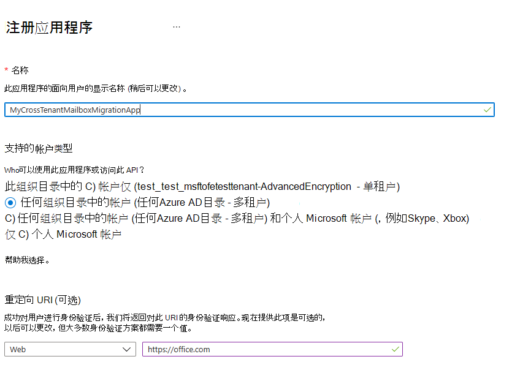

# <a name="cross-tenant-mailbox-migration-preview"></a>跨租户邮箱迁移 (预览) 

通常，在合并或剥离期间，需要能够将用户的Exchange Online邮箱移动到新租户中。 跨租户邮箱迁移允许租户管理员使用远程 PowerShell 和 MRS 等已知接口将用户转换为其新组织。

管理员可以使用通过移动邮箱管理角色提供的New-MigrationBatch cmdlet 执行跨租户移动。

迁移的用户必须以 MailUsers 身份出现在目标租户Exchange Online系统中，并使用特定属性进行标记以启用跨租户移动。 对于目标租户中未正确设置的用户，系统将失败。

移动完成后，源用户邮箱将转换为 MailUser，Exchange) 中显示为 ExternalEmailAddress 的 targetAddress (用路由地址标记到目标租户。 此过程将旧版 MailUser 留在源租户中，并允许共存和邮件路由。 当业务流程允许时，源租户可能会删除源 MailUser 或将其转换为邮件联系人。

跨租户Exchange邮箱迁移仅支持混合或云中的租户，或两者的任何组合。

本文介绍跨租户邮箱移动的过程，并提供有关如何为Exchange Online邮箱内容移动准备源和目标租户的指导。

   > [!NOTE]
   > 我们最近更新了设置步骤，使跨租户邮箱迁移不再需要 Azure 密钥保管库！ 如果这是首次加入此预览版，则无需执行任何操作，并且可以继续执行本文档中详述的步骤。 如果已开始使用以前的 AKV 方法配置租户，强烈建议停止或删除该配置以开始使用此新方法。 如果使用以前的 AKV 方法正在进行邮箱迁移，请等待现有迁移完成，并按照以下步骤启用新的简化方法。 Azure 密钥保管库所需的设置步骤已存档，但可 **[在此](https://github.com/microsoft/cross-tenant/wiki/V1-Content#cross-tenant-mailbox-migration-preview)** 处找到供参考。

## <a name="preparing-source-and-target-tenants"></a>准备源租户和目标租户

### <a name="prerequisites-for-source-and-target-tenants"></a>源租户和目标租户的先决条件

在开始之前，请确保拥有在 Azure、EXO 迁移终结点和 EXO 组织关系中配置 Move 邮箱应用程序所需的权限。

此外，源租户中至少需要一个启用邮件的安全组。 这些组用于限制邮箱列表的范围，这些邮箱可以从源 (或有时称为资源) 租户移动到目标租户。 这允许源租户管理员限制或限制需要移动的特定邮箱集，防止意外用户迁移。 不支持嵌套组。

你还需要与受信任的合作伙伴公司通信 (你将移动邮箱) 以获取其Microsoft 365租户 ID。 此租户 ID 在组织关系域名字段中使用。

若要获取订阅的租户 ID，请登录[到Microsoft 365 管理中心](https://go.microsoft.com/fwlink/p/?linkid=2024339)并转到[https://aad.portal.azure.com/\#blade/Microsoft_AAD_IAM/ActiveDirectoryMenuBlade/Properties](https://aad.portal.azure.com/#blade/Microsoft_AAD_IAM/ActiveDirectoryMenuBlade/Properties)。 单击"租户 ID"属性的复制图标将其复制到剪贴板。

### <a name="configuration-steps-to-enable-your-tenants-for-cross-tenant-mailbox-migrations"></a>为租户启用跨租户邮箱迁移的配置步骤

   > [!NOTE]
   > 必须先配置目标 (目标) 。 若要完成这些步骤，不需要拥有或知道源租户和目标租户的租户管理员凭据。 不同管理员可以为每个租户单独执行步骤。

### <a name="prepare-the-target-destination-tenant-by-creating-the-migration-application-and-secret"></a>通过创建迁移应用程序和机密，准备目标 (目标) 租户

1. 使用目标租户管理员凭据登录到Azure AD门户 (<https://portal.azure.com>) 

   

2. 单击"管理Azure Active Directory"下的视图。

   

3. 在左侧导航栏上，选择应用注册。

4. 选择"新建注册"

   

5. 在"注册应用程序"页上，在"受支持的帐户类型"下，选择任何组织目录中的帐户 (任何Azure AD目录 - 多租户) 。 然后，在"重定向 URI" (可选) 下，选择"Web"并输入 <https://office.com>。 最后，选择"注册"。

   

6. 在页面右上角，你将看到一个通知弹出窗口，指出应用已成功创建。

7. 返回到"开始"，Azure Active Directory并单击应用注册。

8. 在"拥有的应用程序"下，找到创建的应用并单击它。

9. 在"^概要"下，需要复制应用程序 (客户端) ID，因为以后需要它才能为目标租户创建 URL。

10. 现在，在左侧导航栏上，单击 API 权限以查看分配给应用的权限。

11. 默认情况下，用户。 读取权限分配给你创建的应用，但我们不要求它们进行邮箱迁移，你可以删除该权限。

    

12. 现在，我们需要添加邮箱迁移权限，选择"添加权限"

13. 在"请求 API 权限"窗口中，选择组织使用的 API，搜索Office 365 Exchange Online，然后选择它。

    

14. 接下来，选择应用程序权限

15. 然后，在"选择权限"下，展开"邮箱"，然后选中"邮箱.迁移"，并在屏幕底部添加权限。

    

16. 现在，选择应用程序左侧导航栏上的证书&机密。

17. 在客户端机密下，选择新的客户端机密。

    

18. 在"添加客户端机密"窗口中，输入说明并配置所需的过期设置。

      > [!NOTE]
      > 这是创建迁移终结点时将使用的密码。 将此密码复制到剪贴板或复制此密码以保护/机密密码安全位置非常重要。 这是你唯一一次能够看到此密码！ 如果以某种方式丢失或需要重置它，则可以登录到我们的Azure 门户、转到应用注册、查找迁移应用、选择机密&证书，并为应用创建新机密。

19. 成功创建迁移应用程序和机密后，需要同意该应用程序。 若要同意应用程序，请返回到Azure Active Directory登陆页，单击左侧导航栏中的Enterprise应用程序，找到创建的迁移应用，选择它，然后在左侧导航栏中选择"权限"。

20. 单击"授予[你的租户]"按钮的管理员许可。

21. 新的浏览器窗口将打开并选择"接受"。

22. 可以返回到门户窗口，然后选择"刷新"以确认接受。

23. 制定要发送到受信任合作伙伴的 URL (源租户管理员) ，以便他们也可以接受应用程序来启用邮箱迁移。 下面是向其提供 URL 的示例，需要创建的应用的应用程序 ID：

    ```powershell
    https://login.microsoftonline.com/sourcetenant.onmicrosoft.com/adminconsent?client_id=[application_id_of_the_app_you_just_created]&redirect_uri=https://office.com
    ```

    > [!NOTE]
    > 需要刚创建的邮箱迁移应用的应用程序 ID。
    >
    > 需要将上述示例中的 sourcetenant.onmicrosoft.com 替换为源租户正确的 onmicrosoft.com 名称。
    >
    > 还需要将 [application_id_of_the_app_you_just_created] 替换为刚创建的邮箱迁移应用的应用程序 ID。

### <a name="prepare-the-target-tenant-by-creating-the-exchange-online-migration-endpoint-and-organization-relationship"></a>通过创建Exchange Online迁移终结点和组织关系来准备目标租户

1. 创建与目标Exchange Online租户的远程 PowerShell 连接。

2. 为跨租户邮箱移动创建新的迁移终结点

   > [!NOTE]
   > 需要刚创建的邮箱迁移应用的应用程序 ID，以及在此过程中配置的机密)  (密码。 此外，根据使用终结点Microsoft 365云实例可能有所不同。 请参阅[Microsoft 365终结点](/microsoft-365/enterprise/microsoft-365-endpoints)页，为租户选择正确的实例，并查看Exchange Online优化所需的地址并根据需要替换。

   ```powershell

   # Enable customization if tenant is dehydrated
     $dehydrated=Get-OrganizationConfig | fl isdehydrated
     if ($dehydrated -eq $true) {Enable-OrganizationCustomization}

   $AppId = "[guid copied from the migrations app]"

   $Credential = New-Object -TypeName System.Management.Automation.PSCredential -ArgumentList $AppId, (ConvertTo-SecureString -String "[this is your secret password you saved in the previous steps]" -AsPlainText -Force)

   New-MigrationEndpoint -RemoteServer outlook.office.com -RemoteTenant "sourcetenant.onmicrosoft.com" -Credentials $Credential -ExchangeRemoteMove:$true -Name "[the name of your migration endpoint]" -ApplicationId $AppId
   ```

3. 创建新的或编辑源租户的现有组织关系对象。

   ```powershell
   $sourceTenantId="[tenant id of your trusted partner, where the source mailboxes are]"
   $orgrels=Get-OrganizationRelationship
   $existingOrgRel = $orgrels | ?{$_.DomainNames -like $sourceTenantId}
   If ($null -ne $existingOrgRel)
   {
       Set-OrganizationRelationship $existingOrgRel.Name -Enabled:$true -MailboxMoveEnabled:$true -MailboxMoveCapability Inbound
   }
   If ($null -eq $existingOrgRel)
   {
       New-OrganizationRelationship "[name of the new organization relationship]" -Enabled:$true -MailboxMoveEnabled:$true -MailboxMoveCapability Inbound -DomainNames $sourceTenantId
   }
   ```

### <a name="prepare-the-source-current-mailbox-location-tenant-by-accepting-the-migration-application-and-configuring-the-organization-relationship"></a>通过接受迁移应用程序并配置组织关系，准备当前邮箱位置) 租户的源 (

1. 在浏览器中，转到受信任合作伙伴提供的 URL 链接，以同意邮箱迁移应用程序。 URL 如下所示：

   ```powershell
   https://login.microsoftonline.com/sourcetenant.onmicrosoft.com/adminconsent?client_id=[application_id_of_the_app_you_just_created]&redirect_uri=https://office.com
   ```

   > [!NOTE]
   > 需要刚创建的邮箱迁移应用的应用程序 ID。
   > 需要将上述示例中的 sourcetenant.onmicrosoft.com 替换为源租户正确的 onmicrosoft.com 名称。
   > 还需要将 [application_id_of_the_app_you_just_created] 替换为刚创建的邮箱迁移应用的应用程序 ID。

2. 出现弹出窗口时接受应用程序。 还可以登录Azure Active Directory门户，在Enterprise应用程序下查找应用程序。

3. 从Exchange Online远程 PowerShell 窗口创建新的或编辑目标 (目标) 租户的现有组织关系对象。

   ```powershell
   $targetTenantId="[tenant id of your trusted partner, where the mailboxes are being moved to]"
   $appId="[application id of the mailbox migration app you consented to]"
   $scope="[name of the mail enabled security group that contains the list of users who are allowed to migrate]"
   $orgrels=Get-OrganizationRelationship
   $existingOrgRel = $orgrels | ?{$_.DomainNames -like $targetTenantId}
   If ($null -ne $existingOrgRel)
   {
       Set-OrganizationRelationship $existingOrgRel.Name -Enabled:$true -MailboxMoveEnabled:$true -MailboxMoveCapability RemoteOutbound -OAuthApplicationId $appId -MailboxMovePublishedScopes $scope
   }
   If ($null -eq $existingOrgRel)
   {
       New-OrganizationRelationship "[name of your organization relationship]" -Enabled:$true -MailboxMoveEnabled:$true -MailboxMoveCapability RemoteOutbound -DomainNames $targetTenantId -OAuthApplicationId $appId -MailboxMovePublishedScopes $scope
   }
   ```

> [!NOTE]
> 作为$sourceTenantId和$targetTenantId输入的租户 ID 是 GUID，而不是租户域名。 有关租户 ID 的示例以及有关查找租户 ID 的信息，请参阅["查找Microsoft 365租户 ID](/onedrive/find-your-office-365-tenant-id)"。

### <a name="how-do-i-know-this-worked"></a>我如何知道这有效？

可以通过针对在目标租户上创建的跨租户迁移终结点运行 [Test-MigrationServerAvailability](/powershell/module/exchange/Test-MigrationServerAvailability) cmdlet 来验证跨租户邮箱迁移配置。

   > [!NOTE]
   >
   > - 目标租户：
   >
   > Test-MigrationServerAvailability -Endpoint"[跨租户迁移终结点的名称]"
   >
   > Get-OrganizationRelationship |fl name， DomainNames， MailboxMoveEnabled， MailboxMoveCapability
   >
   > - 源租户：
   >
   > Get-OrganizationRelationship |fl name， DomainNames， MailboxMoveEnabled， MailboxMoveCapability

### <a name="move-mailboxes-back-to-the-original-source"></a>将邮箱移回原始源

如果需要邮箱才能移回原始源租户，则需要在新源租户和新目标租户中运行相同的步骤和脚本集。 将更新或追加现有组织关系对象，而不是重新创建

## <a name="prepare-target-user-objects-for-migration"></a>准备用于迁移的目标用户对象

迁移的用户必须位于目标租户和Exchange Online系统 (中，因为 MailUsers) 用特定属性标记，以启用跨租户移动。 对于目标租户中未正确设置的用户，系统将失败。 以下部分详细介绍了目标租户的 MailUser 对象要求。

### <a name="prerequisites-for-target-user-objects"></a>目标用户对象的先决条件

确保在目标组织中设置以下对象和属性。

1. 对于从源组织移动的任何邮箱，必须在目标组织中预配 MailUser 对象：

   - 目标 MailUser 必须具有源邮箱中的这些属性，或使用新的 User 对象分配这些属性：
      - ExchangeGUID (从源到目标) 的直接流：邮箱 GUID 必须匹配。 如果目标对象上不存在此操作，则移动过程将不会继续。
      - ArchiveGUID (从源到目标) 的直接流：存档 GUID 必须匹配。 如果目标对象上不存在此操作，则移动过程将不会继续。  (仅当源邮箱启用了存档) 时，才需要此功能。
      - LegacyExchangeDN (流作为 proxyAddress，"x500：\<LegacyExchangeDN>") ：LegacyExchangeDN 必须在目标 MailUser 上以 x500： proxyAddress 表示。 此外，还需要将源邮箱中的所有 x500 地址复制到目标邮件用户。 如果目标对象上不存在这些过程，则不会继续移动进程。
      - UserPrincipalName：UPN 将与用户的新标识或目标公司 (保持一致，例如 user@northwindtraders.onmicrosoft.com) 。
      - 主 SMTPAddress：主 SMTP 地址将与用户的新公司 (（例如 user@northwind.com) ）保持一致。
      - TargetAddress/ExternalEmailAddress：MailUser 将引用源租户中托管的用户当前邮箱 (例如 user@contoso.onmicrosoft.com) 。 分配此值时，请验证是否已/正在分配 PrimarySMTPAddress，否则此值将设置 PrimarySMTPAddress，这将导致移动失败。
      - 无法将旧版 smtp 代理地址从源邮箱添加到目标 MailUser。 例如，不能在 FABRIKAM.ONMICROSOFT.COM 租户对象) 中维护 MEU 上的 contoso.com。 域仅与一个Azure AD或Exchange Online租户关联。

     示例 **目标** MailUser 对象：

     | 属性            | 值                                                                                                                   |
     | -------------------- | ----------------------------------------------------------------------------------------------------------------------- |
     | 别名                | LaraN                                                                                                                   |
     | RecipientType        | MailUser                                                                                                                |
     | RecipientTypeDetails | MailUser                                                                                                                |
     | UserPrincipalName    | LaraN@northwintraders.onmicrosoft.com                                                                                   |
     | PrimarySmtpAddress   | Lara.Newton@northwind.com                                                                                               |
     | ExternalEmailAddress | SMTP:LaraN@contoso.onmicrosoft.com                                                                                      |
     | ExchangeGuid         | 1ec059c7-8396-4d0b-af4e-d6bd4c12a8d8                                                                                    |
     | LegacyExchangeDN     | /o=First Organization/ou=Exchange 管理组                                                                  |
     |                      |  (FYDIBOHF23SPDLT) /cn=Recipients/cn=74e5385fce4b46d19006876949855035Lara                                                 |
     | EmailAddresses       | x500：/o=First Organization/ou=Exchange 管理组 (FYDIBOHF23SPDLT) /cn=Recipients/cn=d11ec1a2cacd4f81858c8190 |
     |                      | 7273f1f9-Lara                                                                                                           |
     |                      | smtp:LaraN@northwindtraders.onmicrosoft.com                                                                             |
     |                      | SMTP:Lara.Newton@northwind.com                                                                                          |

     示例 **源** 邮箱对象：

     | 属性            | 值                                                                   |
     | -------------------- | ----------------------------------------------------------------------- |
     | 别名                | LaraN                                                                   |
     | RecipientType        | UserMailbox                                                             |
     | RecipientTypeDetails | UserMailbox                                                             |
     | UserPrincipalName    | LaraN@contoso.onmicrosoft.com                                           |
     | PrimarySmtpAddress   | Lara.Newton@contoso.com                                                 |
     | ExchangeGuid         | 1ec059c7-8396-4d0b-af4e-d6bd4c12a8d8                                    |
     | LegacyExchangeDN     | /o=First Organization/ou=Exchange 管理组                  |
     |                      |  (FYDIBOHF23SPDLT) /cn=Recipients/cn=d11ec1a2cacd4f81858c81907273f1f9Lara |
     | EmailAddresses       | smtp:LaraN@contoso.onmicrosoft.com                                      |
     |                      | SMTP:Lara.Newton@contoso.com                                            |

   - 其他属性可能已包含在混合写回Exchange中。 如果没有，则应包括它们。
   - msExchBlockedSendersHash - 将联机安全和阻止的发件人数据从客户端写回本地 Active Directory。
   - msExchSafeRecipientsHash - 将联机安全和阻止的发件人数据从客户端写回本地 Active Directory。
   - msExchSafeSendersHash - 将联机安全和阻止的发件人数据从客户端写回本地 Active Directory。

2. 如果源邮箱位于 LitigationHold 上，并且源邮箱可恢复项目大小大于数据库默认值 (30 GB) ，则不会继续移动，因为目标配额小于源邮箱大小。 可以更新目标 MailUser 对象，将 ELC 邮箱标志从源环境转换为目标，这会触发目标系统将 MailUser 的配额扩展到 100 GB，从而允许移动到目标。 这些说明仅适用于运行Azure AD 连接的混合标识，因为用于标记 ELC 标志的命令不会向租户管理员公开。

    > [!NOTE]
    > 示例 – 与现在一样，没有保修
    >
    > 此脚本假定连接到源邮箱 (以获取源值) 和目标本地 Active Directory (，以标记 ADUser 对象) 。 如果源已启用诉讼或单项恢复，请在目标帐户上设置此项。  这会将目标帐户的转储箱大小增加到 100 GB。

    ```powershell
    $ELCValue = 0
    if ($source.LitigationHoldEnabled) {$ELCValue = $ELCValue + 8} if ($source.SingleItemRecoveryEnabled) {$ELCValue = $ELCValue + 16} if ($ELCValue -gt 0) {Set-ADUser -Server $domainController -Identity $destination.SamAccountName -Replace @{msExchELCMailboxFlags=$ELCValue}}
    ```

3. 非混合目标租户可以通过运行以下命令在 MailUser 对象上启用诉讼保留并将配额增加到 100 GB，在迁移前修改 MailUsers 的"可恢复邮件"文件夹上的配额：

   ```powershell
   Set-MailUser -Identity <MailUserIdentity> -EnableLitigationHoldForMigration
   ```

   请注意，这不适用于混合租户。

4. 目标组织中的用户必须获得适用于组织的适当Exchange Online订阅的许可。 你可以在邮箱移动之前应用许可证，但只有在使用 ExchangeGUID 和代理地址正确设置目标 MailUser 后。 在应用 ExchangeGUID 之前应用许可证将导致在目标组织中预配新的邮箱。

    > [!NOTE]
    > 在邮箱或 MailUser 对象上应用许可证时，会擦洗所有 SMTP 类型 proxyAddresses，以确保仅已验证的域包含在 emailAddresses Exchange数组中。

5. 必须确保目标 MailUser 没有与源 ExchangeGuid 不匹配的前一个 ExchangeGuid。 如果目标 MEU 以前已获得Exchange Online许可并预配了邮箱，则可能会发生这种情况。 如果目标 MailUser 以前已获得与源 ExchangeGuid 不匹配的 ExchangeGuid 的许可，则需要对云 MEU 执行清理。 对于这些云 MEUS，可以运行 `Set-User <identity> -PermanentlyClearPreviousMailboxInfo`。

    > [!CAUTION]
    > 此过程不可逆。 如果对象具有 softDeleted 邮箱，则在此时间点之后无法还原该邮箱。 但是，清除后，可以将正确的 ExchangeGuid 同步到目标对象，MRS 会将源邮箱连接到新创建的目标邮箱。  (有关新参数的参考 EHLO 博客。) 

    使用此命令查找以前是邮箱的对象。

    ```powershell
    Get-User <identity> | select Name, *recipient* | Format-Table -AutoSize
    ```

    以下是示例。

    ```powershell
    Get-User John@northwindtraders.com |select name, *recipient*| Format-Table -AutoSize

    Name       PreviousRecipientTypeDetails     RecipientType RecipientTypeDetails
    ----       ---------------------------- ------------- --------------------
    John       UserMailbox                  MailUser      MailUser
    ```

    使用此命令清除软删除的邮箱。

    ```powershell
    Set-User <identity> -PermanentlyClearPreviousMailboxInfo
    ```

    以下是示例。

    ```powershell
    Set-User John@northwindtraders.com -PermanentlyClearPreviousMailboxInfo -Confirm

    Are you sure you want to perform this action?
    Delete all existing information about user "John@northwindtraders.com"?. This operation will clear existing values from Previous home MDB and Previous Mailbox GUID of the user. After deletion, reconnecting to the previous mailbox that existed in the cloud will not be possible and any content it had will be unrecoverable PERMANENTLY.
    Do you want to continue?
    [Y] Yes  [A] Yes to All  [N] No  [L] No to All  [?] Help (default is "Y"): Y
    ```

### <a name="perform-mailbox-migrations"></a>执行邮箱迁移

跨租户Exchange邮箱迁移从目标租户作为迁移批处理启动。 就像在从本地Exchange迁移到Microsoft 365时，载入迁移批处理的工作方式一样。

### <a name="create-migration-batches"></a>创建迁移批处理

下面是用于启动移动的迁移批处理 cmdlet 的示例。

```powershell
New-MigrationBatch -Name T2Tbatch -SourceEndpoint target_source_7977 -CSVData ([System.IO.File]::ReadAllBytes('users.csv')) -Autostart -TargetDeliveryDomain target.onmicrosoft.com

Identity                   Status  Type               TotalCount
--------                   ------  ----               ----------
T2Tbatch                   Syncing ExchangeRemoteMove 1
```

> [!NOTE]
> CSV 文件中的电子邮件地址必须是目标租户中指定的电子邮件地址，而不是源租户。
>
> [有关 cmdlet 的详细信息，请单击此处](/powershell/module/exchange/new-migrationbatch)
>
> [有关示例 CSV 文件，请单击此处](/exchange/csv-files-for-mailbox-migration-exchange-2013-help)

选择跨租户选项时，新<a href="https://go.microsoft.com/fwlink/p/?linkid=2059104" target="_blank">Exchange管理中心</a>也支持迁移批处理提交。

### <a name="update-on-premises-mailusers"></a>更新本地 MailUsers

邮箱从源移动到目标后，应确保源和目标中的本地邮件用户使用新的 targetAddress 进行更新。 在示例中，contoso.onmicrosoft.com 移动中使用的 targetDeliveryDomain **。** 使用此 targetAddress 更新邮件用户。

## <a name="frequently-asked-questions"></a>常见问题解答

**移动后，是否需要更新本地源中的 RemoteMailboxes？**

是的，当源租户邮箱移到目标租户时，应更新源本地用户的 targetAddress (RemoteRoutingAddress/ExternalEmailAddress) 。  虽然邮件路由可以跟踪具有不同 targetAddresses 的多个邮件用户的引荐，但邮件用户的闲/忙查找必须面向邮箱用户的位置。 忙/忙的查找不会追逐多个重定向。

**Teams会议是否迁移跨租户？**

会议将移动，但在项目跨租户迁移时，Teams会议 URL 不会更新。 由于目标租户中的 URL 无效，因此需要删除并重新创建Teams会议。

**Teams聊天文件夹内容是否跨租户迁移？**

否，Teams聊天文件夹内容不会跨租户迁移。

**如何只看到跨租户移动的移动，而不是我的载入和卸载移动？**

使用 _Flags_ 参数。 以下是示例。

```powershell
Get-MoveRequest -Flags "CrossTenant"
```

**是否可以提供用于复制测试中使用的属性的示例脚本？**

> [!NOTE]
> SAMPLE – AS IS，NO WARRANTY 此脚本假定与源邮箱 (连接，以获取源值) 和目标本地 Active Directory域服务 (，以标记 ADUser 对象) 。 如果源已启用诉讼或单项恢复，请在目标帐户上设置此项。  这会将目标帐户的转储箱大小增加到 100 GB。

   ```powershell
   # This will export users from the source tenant with the CustomAttribute1 = "Cross-Tenant-Project"
   # These are the 'target' users to be moved to the Northwind org tenant
   $outFileUsers = "$home\desktop\UsersToMigrate.txt"
   $outFileUsersXML = "$home\desktop\UsersToMigrate.xml"
   Get-Mailbox -Filter "CustomAttribute1 -like 'Cross-Tenant-Project'" -ResultSize Unlimited | Select-Object -ExpandProperty  Alias | Out-File $outFileUsers
   $mailboxes = Get-Content $outFileUsers
   $mailboxes | ForEach-Object {Get-Mailbox $_} | Select-Object PrimarySMTPAddress,Alias,SamAccountName,FirstName,LastName,DisplayName,Name,ExchangeGuid,ArchiveGuid,LegacyExchangeDn,EmailAddresses | Export-Clixml $outFileUsersXML
   ```

   ```powershell
   # Copy the file $outfile to the desktop of the target on-premises then run the below to create MEU in Target
   $mailboxes = Import-Clixml $home\desktop\UsersToMigrate.xml
   add-type -AssemblyName System.Web
   foreach ($m in $mailboxes) {
       $organization = "@contoso.onmicrosoft.com"
       $mosi = $m.Alias+$organization
       $Password = [System.Web.Security.Membership]::GeneratePassword(16,4) | ConvertTo-SecureString -AsPlainText -Force
       $x500 = "x500:" +$m.LegacyExchangeDn
       $tmpUser = New-MailUser -MicrosoftOnlineServicesID $mosi -PrimarySmtpAddress $mosi -ExternalEmailAddress $m.PrimarySmtpAddress -FirstName $m.FirstName -LastName $m.LastName -Name $m.Name -DisplayName $m.DisplayName -Alias $m.Alias -Password $Password
       $tmpUser | Set-MailUser -EmailAddresses @{add=$x500} -ExchangeGuid $m.ExchangeGuid -ArchiveGuid $m.ArchiveGuid -CustomAttribute1 "Cross-Tenant-Project"
       $tmpx500 = $m.EmailAddresses | ?{$_ -match "x500"}
       $tmpx500 | %{Set-MailUser $m.Alias -EmailAddresses @{add="$_"}}
       }
   ```

   ```powershell
   # Now sync the changes from On-Premises to Azure and Exchange Online in the Target tenant
   # This action should create the target mail enabled users (MEUs) in the Target tenant
   Start-ADSyncCycle
   ```

**移动使用邮箱后，如何在第 1 天访问Outlook？**

由于只有一个租户可以拥有域，因此当邮箱移动完成时，以前的主 SMTPAddress 不会与目标租户中的用户关联;仅与新租户关联的域。 Outlook使用用户新的 UPN 向服务进行身份验证，Outlook配置文件希望找到与目标系统中的邮箱匹配的旧主 SMTPAddress。 由于旧地址不在目标系统中，Outlook 配置文件将无法连接以查找新移动的邮箱。

对于此初始部署，用户需要使用其新的 UPN、主要 SMTP 地址和重新同步 OST 内容重新生成其配置文件。

> [!NOTE]
> 在批处理用户以完成时相应地进行规划。 创建Outlook客户端配置文件并将后续 OST 和 OAB 文件下载到客户端时，需要考虑网络利用率和容量。

**若要设置或完成跨租户移动，我需要成为哪些 Exchange RBAC 角色？**

执行邮箱移动时，根据委派职责的假设，存在角色矩阵。 目前需要两个角色：

- 第一个角色是一次性设置任务，该任务建立将内容移入或移出租户/组织边界的授权。 由于将数据移出组织控制是所有公司最关心的问题，因此我们选择了组织管理员 (OrgAdmin) 的最高分配角色。 此角色必须更改或设置新的 OrganizationRelationship，用于定义远程组织的 -MailboxMoveCapability。 只有 OrgAdmin 可以更改 MailboxMoveCapability 设置，而 OrganizationRelationship 上的其他属性可以由联合共享管理员管理。

- 执行实际移动命令的角色可以委派到较低级别的函数。 移动邮箱的角色分配给将邮箱移入或移出组织的能力。

**如何针对转换后的邮箱 (到 MailUser 转换) 上的 targetAddress (TargetDeliveryDomain) 选择哪个 SMTP 地址？**

Exchange邮箱通过匹配目标对象上的电子邮件地址 (proxyAddress) ，在转换为 MailUser 时，使用 MRS 在原始源邮箱上创建 targetAddress 移动。 该过程将传递到 move 命令中的 -TargetDeliveryDomain 值，然后检查目标端上该域的匹配代理。 找到匹配项时，匹配的 proxyAddress 用于在转换后的邮箱上设置 ExternalEmailAddress (targetAddress) ， (现在 MailUser) 对象。

**邮箱权限如何转换？**

邮箱权限包括代表发送和邮箱访问：

- 代表 (AD：publicDelegates 发送) 存储以委托身份访问用户邮箱的收件人的 DN。 此值存储在 Active Directory 中，当前不会作为邮箱转换的一部分移动。 如果源邮箱已设置 publicDelegates，则在 MEU 到邮箱转换通过运行 `Set-Mailbox <principle> -GrantSendOnBehalfTo <delegate>`完成后，需要在目标邮箱上重新设置 publicDelegates。

- 当主体和委托都移动到目标系统时，邮箱中存储的邮箱权限将随邮箱一起移动。 例如，向用户TestUser_7授予了租户 SourceCompany.onmicrosoft.com 中邮箱TestUser_8的 FullAccess。 邮箱移动完成 TargetCompany.onmicrosoft.com 后，目标目录中会设置相同的权限。 下面显示了在源租户和目标租户中使用 *Get-MailboxPermission* 进行TestUser_7的示例。 Exchange cmdlet 以源和目标为前缀。

下面是移动前邮箱权限输出的示例。

```powershell
Get-SourceMailboxPermission TestUser_7 | Format-Table -AutoSize User, AccessRights, IsInherited, Deny

User                                             AccessRights                         IsInherited Deny
----                                             ------------                         ----------- ----
NT AUTHORITY\SELF                                {FullAccess, ReadPermission}         False       False
TestUser_8@SourceCompany.onmicrosoft.com         {FullAccess}                         False       False
```

下面是移动后邮箱权限输出的示例。

```powershell
Get-TargetMailboxPermission TestUser_7 | Format-Table -AutoSize User, AccessRights, IsInherited, Deny

User                                             AccessRights                         IsInherited Deny
----                                             ------------                         ----------- ----
NT AUTHORITY\SELF                                {FullAccess, ReadPermission}         False       False
TestUser_8@TargetCompany.onmicrosoft.com         {FullAccess}                         False       False
```

> [!NOTE]
> 不支持跨租户邮箱和日历权限。 必须将主体和委托组织到合并移动批处理中，以便同时从源租户转换这些连接的邮箱。

**应将哪些 X500 代理添加到目标 MailUser 代理地址以启用迁移？**

跨租户邮箱迁移要求将源邮箱对象的 LegacyExchangeDN 值标记为目标 MailUser 对象上的 x500 电子邮件地址。

示例：

```powershell
LegacyExchangeDN value on source mailbox is:
/o=First Organization/ou=Exchange Administrative Group(FYDIBOHF23SPDLT)/cn=Recipients/cn=d11ec1a2cacd4f81858c81907273f1f9Lara

so, the x500 email address to be added to target MailUser object would be:
x500:/o=First Organization/ou=Exchange Administrative Group (FYDIBOHF23SPDLT)/cn=Recipients/cn=d11ec1a2cacd4f81858c81907273f1f9-Lara
```

> [!NOTE]
> 除了此 X500 代理，还需要将源中邮箱中的所有 X500 代理复制到目标中的邮箱。

**源租户和目标租户是否可以使用相同的域名？**

否。 源和目标租户域名必须是唯一的。 例如，contoso.com 的源域和 fourthcoffee.com 的目标域。

**共享邮箱是否仍可移动？**

是的，但是，我们只保留这些文章中所述的存储权限：

- [Microsoft Docs |在Exchange Online中管理收件人的权限](/exchange/recipients-in-exchange-online/manage-permissions-for-recipients)

- [Microsoft 支持部门 |如何在专用Office 365中授予Exchange和Outlook邮箱权限](https://support.microsoft.com/topic/how-to-grant-exchange-and-outlook-mailbox-permissions-in-office-365-dedicated-bac01b2c-08ff-2eac-e1c8-6dd01cf77287)

**是否对批处理有任何建议？**

每批不超过 2000 个邮箱。 我们强烈建议在截止日期前两周提交批处理，因为同步期间不会对最终用户造成任何影响。 如果需要有关超过 50，000 个邮箱数量的指导，可在 crosstenantmigrationpreview@service.microsoft.com 联系到工程反馈分发列表。

**如果我将服务加密与客户密钥配合使用，该怎么办？**

在移动之前，将解密邮箱。 如果仍需要客户密钥，请确保在目标租户中配置客户密钥。 有关详细信息，请参阅 [此处](/microsoft-365/compliance/customer-key-overview) 。

**估计的迁移时间是怎样的？**

为了帮助你规划迁移， [此](/exchange/mailbox-migration/office-365-migration-best-practices#estimated-migration-times) 处的表格显示有关何时需要批量邮箱迁移或单个迁移完成的指南。 这些估计基于对以前客户迁移的数据分析。 由于每个环境都是唯一的，因此确切的迁移速度可能会有所不同。

请记住，此功能当前为预览版和 SLA，并且任何适用的服务级别不适用于此功能预览状态期间的任何性能或可用性问题。

**保护目标租户中的用户可使用的源租户中的文档。**

跨租户迁移仅迁移邮箱数据，而不迁移其他任何数据。 还有多个其他选项，可在以下博客文章中记录这些选项，这些选项可能会有所帮助： <https://techcommunity.microsoft.com/t5/security-compliance-and-identity/mergers-and-spinoffs/ba-p/910455>

**是否可以将目标租户中的标签与在源租户中的标签相同，作为唯一的标签集或迁移用户的附加标签集，具体取决于组织之间的对齐方式。**

因此，跨租户迁移不会导出标签，并且无法在租户之间共享标签，只能通过在目标租户中重新创建标签来实现此目的。

**是否支持移动Microsoft 365 组？**

目前，跨租户邮箱迁移功能不支持迁移Microsoft 365 组。

**源租户管理员是否可以在邮箱迁移到新的/目标租户后对邮箱执行电子数据展示搜索？**

否，跨租户邮箱迁移后，针对源中已迁移用户邮箱的电子数据展示不起作用。 这是因为源中不再有要搜索的邮箱，因为邮箱已迁移到目标租户，现在属于目标租户。 电子数据展示，邮箱迁移只能在目标租户中完成 (其中邮箱现在存在) 。 如果源邮箱的副本在迁移后需要保留在源租户中，则源中的管理员可以将内容复制到备用邮箱预迁移，以便将来针对数据执行电子数据展示操作。

## <a name="known-issues"></a>已知问题

- **问题：迁移后，源租户中的Teams功能将受到限制。** 将邮箱迁移到目标租户后，源租户中的Teams将不再有权访问用户的邮箱。 因此，如果用户使用源租户凭据登录到Teams，则会丢失功能，例如无法更新配置文件图片、没有日历应用程序，以及无法搜索和加入公共团队。

- **问题：无法迁移自动扩展的存档。** 跨租户迁移功能支持迁移特定用户的主要邮箱和存档邮箱。 但是，如果源中的用户具有自动扩展的存档（这意味着多个存档邮箱），则该功能无法迁移其他存档，并且应该会失败。

- **问题：云 MailUsers 与非拥有的 smtp proxyAddress 块 MRS 移动背景。** 创建目标租户 MailUser 对象时，必须确保所有 SMTP 代理地址都属于目标租户组织。 如果不属于本地租户的目标邮件用户上存在 SMTP proxyAddress，则阻止将 MailUser 转换为邮箱。 这是由于我们保证邮箱对象只能发送来自租户具有权威性的域的邮件 (租户) 声明的域：

  - 使用 Azure AD 连接 从本地同步用户时，使用 ExternalEmailAddress 预配本地 MailUser 对象，指向邮箱所在的源租户 (LaraN@contoso.onmicrosoft.com) ，并将 PrimarySMTPAddress 标记为驻留在目标租户 (Lara.Newton@northwind.com) 中的域。 这些值同步到租户，并预配了适当的邮件用户并准备好进行迁移。 此处显示了一个示例对象。

    ```powershell
    Get-MailUser LaraN | select ExternalEmailAddress, EmailAddresses

    ExternalEmailAddress               EmailAddresses
    --------------------               --------------
    SMTP:LaraN@contoso.onmicrosoft.com {SMTP:lara.newton@northwind.com}
    ```

   > [!NOTE]
   > EmailAddresses/proxyAddresses 数组中 _不存在_ _contoso.onmicrosoft.com_ 地址。

- **问题：具有"外部"主 SMTP 地址的 MailUser 对象被修改/重置为"内部"公司声明的域**

  MailUser 对象是指向非本地邮箱的指针。 对于跨租户邮箱迁移，我们使用 MailUser 对象从目标组织的角度表示源邮箱 () 或目标邮箱 (从源组织的角度) 。 MailUsers 将有一个 ExternalEmailAddress (targetAddress) ，该地址指向实际邮箱 (ProxyTest@fabrikam.onmicrosoft.com) 和 primarySMTP 地址的 smtp 地址，该地址代表目录中邮箱用户显示的 SMTP 地址。 某些组织选择将主 SMTP 地址显示为外部 SMTP 地址，而不是由本地租户 (（例如 fabrikam.com）拥有/验证的地址，而不是作为 contoso.com) 。  但是，一旦通过许可操作将Exchange服务计划对象应用到 MailUser，主 SMTP 地址将修改为显示为由本地组织 (contoso.com) 验证的域。 有两个潜在原因：

  - 将任何Exchange服务计划应用到 MailUser 时，Azure AD进程将开始强制执行代理清理，以确保本地组织无法从其他租户发送邮件、欺骗或邮件。 如果本地组织未验证该地址，则将删除具有这些服务计划的收件人对象上的任何 SMTP 地址。 与示例中的情况一样，Fabikam.com 域未由 contoso.onmicrosoft.com 租户验证，因此清理会删除该 fabrikam.com 域。 如果希望在迁移前或迁移后在 MailUser 上保留这些外部域，则需要在移动完成后或移动之前更改迁移过程以剥离许可证，以确保用户应用了预期的外部品牌。 你需要确保邮箱对象已正确获得许可，不会影响邮件服务。
  - 此处显示了一个示例脚本，用于删除 contoso.onmicrosoft.com 租户中 MailUser 上的服务计划。

    ```powershell
    $LO = New-MsolLicenseOptions -AccountSkuId "contoso:ENTERPRISEPREMIUM" DisabledPlans "LOCKBOX_ENTERPRISE","EXCHANGE_S_ENTERPRISE","INFORMATION_BARRIERS","MIP_S_CLP2","MIP_S_CLP1","MYANALYTICS_P2","EXCHANGE_ANALYTICS","EQUIVIO_ANALYTICS","THREAT_INTELLIGENCE","PAM_ENTERPRISE","PREMIUM_ENCRYPTION"
    Set-MsolUserLicense -UserPrincipalName ProxyTest@contoso.com LicenseOptions $lo
    ```

       此处显示了分配的 ServicePlans 集的结果。

    ```powershell
    (Get-MsolUser -UserPrincipalName ProxyTest@contoso.com).licenses | Select-Object -ExpandProperty ServiceStatus |sort ProvisioningStatus -Descending

    ServicePlan           ProvisioningStatus
    -----------           ------------------
    ATP_ENTERPRISE        PendingProvisioning
    MICROSOFT_SEARCH      PendingProvisioning
    INTUNE_O365           PendingActivation
    PAM_ENTERPRISE        Disabled
    EXCHANGE_ANALYTICS    Disabled
    EQUIVIO_ANALYTICS     Disabled
    THREAT_INTELLIGENCE   Disabled
    LOCKBOX_ENTERPRISE    Disabled
    PREMIUM_ENCRYPTION    Disabled
    EXCHANGE_S_ENTERPRISE Disabled
    INFORMATION_BARRIERS  Disabled
    MYANALYTICS_P2        Disabled
    MIP_S_CLP1            Disabled
    MIP_S_CLP2            Disabled
    ADALLOM_S_O365        PendingInput
    RMS_S_ENTERPRISE      Success
    YAMMER_ENTERPRISE     Success
    PROJECTWORKMANAGEMENT Success
    BI_AZURE_P2           Success
    WHITEBOARD_PLAN3      Success
    SHAREPOINTENTERPRISE  Success
    SHAREPOINTWAC         Success
    KAIZALA_STANDALONE    Success
    OFFICESUBSCRIPTION    Success
    MCOSTANDARD           Success
    Deskless              Success
    STREAM_O365_E5        Success
    FLOW_O365_P3          Success
    POWERAPPS_O365_P3     Success
    TEAMS1                Success
    MCOEV                 Success
    MCOMEETADV            Success
    BPOS_S_TODO_3         Success
    FORMS_PLAN_E5         Success
    SWAY                  Success
    ```

    不再擦洗用户的 PrimarySMTPAddress。 fabrikam.com 域不归 contoso.onmicrosoft.com 租户所有，并将保留为目录中显示的主要 SMTP 地址。

    以下是示例。

    ```powershell
    Get-Recipient ProxyTest | Format-Table -AutoSize UserPrincipalName, PrimarySmtpAddress, ExternalEmailAddress, ExternalDirectoryObjectId
    UserPrincipalName               PrimarySmtpAddress              ExternalEmailAddress                 ExternalDirectoryObjectId
    -----------------               ------------------              --------------------                 -------------------------
    ProxyTest@fabrikam.com          ProxyTest@fabrikam.com          SMTP:ProxyTest@fabrikam.com          e2513482-1d5b-4066-936a-cbc7f8f6f817
    ```

    - 当 msExchRemoteRecipientType 设置为 8 (DeprovisionMailbox) 时，对于迁移到目标租户的本地 MailUsers，Azure 中的代理擦除逻辑将删除非拥有域并将 primarySMTP 重置为自有域。 通过清除本地 MailUser 中的 msExchRemoteRecipientType，代理擦洗逻辑不再适用。

      下面是包括Exchange Online的完整当前服务计划集。

      | 名称                                             |
      | ------------------------------------------------ |
      | Advanced eDiscovery 存储 (500 GB)              |
      | 客户密码箱                                 |
      | 数据丢失防护                             |
      | Exchange Enterprise CAL Services (EOP、DLP)       |
      | Exchange概要                              |
      | Exchange基础                              |
      | Exchange Online (P1)                              |
      | Exchange Online（计划 1）                         |
      | Exchange Online（计划 2）                         |
      | 适用于 Exchange Online 的 Exchange Online Archiving    |
      | 适用于 Exchange Server 的 Exchange Online Archiving    |
      | Exchange Online非活动用户加载项             |
      | Exchange Online Kiosk                            |
      | Exchange Online 多地理位置功能                        |
      | Exchange Online 计划 1                           |
      | Exchange Online POP                              |
      | Exchange Online Protection                       |
      | 信息屏障                             |
      | 适用于 Office 365 的信息保护 - 高级版  |
      | 适用于 Office 365 的信息保护 - 标准版 |
      | 由 MyAnalytics Insights                          |
      | Microsoft 365高级审核                  |
      | Microsoft Bookings                               |
      | Microsoft 商业中心                        |
      | Microsoft MyAnalytics（完整版）                     |
      | Office 365 高级电子数据展示                   |
      | Microsoft Defender for Office 365 (计划 1)        |
      | Microsoft Defender for Office 365 (计划 2)        |
      | Office 365 特权访问管理          |
      | 高级版Office 365中的加密                 |
