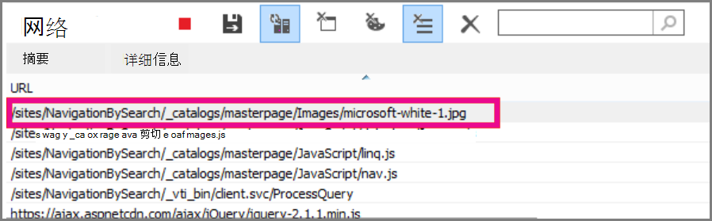
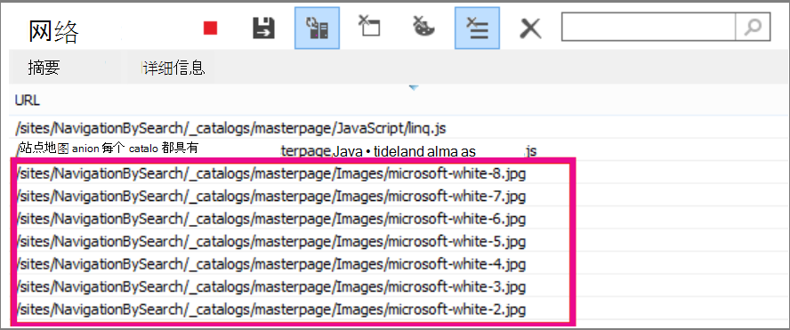

# <a name="delay-loading-images-and-javascript-in-sharepoint-online"></a>在 SharePoint Online 中延迟加载图像和 JavaScript

本文介绍如何通过使用 JavaScript 延迟加载图像，以及等到页面加载后加载非必要的 JavaScript 来减少 SharePoint Online 页面的加载时间。
  
图像可能会对 SharePoint Online 上的页面加载速度产生负面影响。 默认情况下，大多数现代 Internet 浏览器在加载 HTML 页面时预取图像。 如果图像在屏幕上不可见，直到用户向下滚动，这可能会导致页面加载速度不必要地变慢。 图像可以阻止浏览器加载页面的可见部分。 若要解决此问题，可以先使用 JavaScript 跳过加载图像。 此外，加载非必要的 JavaScript 也会减慢页面的下载SharePoint速度。 本主题介绍一些可用于在 SharePoint Online 中通过 JavaScript 改进页面加载时间的方法。
  
## <a name="improve-page-load-times-by-delaying-image-loading-in-sharepoint-online-pages-by-using-javascript"></a>通过使用 JavaScript 延迟 SharePoint Online 页面中的图像加载，改进页面加载时间

可以使用 JavaScript 阻止 Web 浏览器预取图像。 这将加快文档呈现的总体速度。 为此，请从 标记中删除 src 属性的值，并将其替换为数据属性中文件的路径，例如 \ ：data-src。 例如：
  
```html

```

通过使用此方法，浏览器不会立即下载图像。 如果图像已位于视口中，JavaScript 会通知浏览器从 data 属性检索 URL 并将其作为 src 属性的值插入。 图像仅在用户滚动并进入视图时加载。
  
若要实现所有这些功能，你需要使用 JavaScript。
  
在文本文件中，定义 **isElementInViewport ()** 函数以检查元素是否位于用户可见的浏览器部分。
  
```javascript
function isElementInViewport(el) {
  if (!el)
    return false;
  var rect = el.getBoundingClientRect();
  return (
    rect.top >= 0 &amp;&amp;
    rect.left >= 0 &amp;&amp;
    rect.bottom <= (window.innerHeight || document.documentElement.clientHeight) &amp;&amp;
    rect.right <= (window.innerWidth || document.documentElement.clientWidth)
  );
}
```

接下来，在 **loadItemsInView** () 函数中，使用 **isElementInViewport ()** 对象。 **loadItemsInView ()** 函数将加载具有 data-src 属性的值的所有图像（如果它们位于用户可见的浏览器部分）。 将以下函数添加到文本文件：
  
```javascript
function loadItemsInView() {
  //Select elements by the row id.
  $("#row [data-src]").each(function () {
      var isVisible = isElementInViewport(this);
      if (isVisible) {
          if ($(this).attr("src") == undefined) {
              $(this).attr("src", $(this).data("src"));
          }
      }
  });
}
```

最后，从 **window.onscroll** () 调用 **loadItemsInView** () ，如以下示例所示。 这可确保视口中任何图像在用户需要时加载，而不是之前加载。 将以下内容添加到文本文件：
  
```javascript
//Example of calling loadItemsInView() from within window.onscroll()
$(window).on("scroll", function () {
    loadItemsInView();
});

```

For SharePoint Online， you need to attach the following function to the scroll event on the #s4-workspace \<div\> tag. 这是因为窗口事件被重写，以确保功能区仍附加到页面顶部。
  
```javascript
//Keep the ribbon at the top of the page
$('#s4-workspace').on("scroll", function () {
    loadItemsInView();
});
```

将文本文件另存为扩展名为 .js JavaScript 文件，例如delayLoadImages.js。
  
编写完文件delayLoadImages.js，您可以将文件内容添加到 SharePoint Online 中的母版页。 为此，在母版页中添加指向页眉的脚本链接。 在母版页中发布后，JavaScript 将应用于 SharePoint Online 网站中使用该母版页布局的所有页面。 或者，如果你希望仅在网站的一个页面上使用它，请使用脚本编辑器Web 部件 JavaScript 嵌入页面。 有关详细信息，请参阅以下主题：
  
- [如何：向 SharePoint 2013 中的网站应用母版页](/sharepoint/dev/general-development/how-to-apply-a-master-page-to-a-site-in-sharepoint)

- [如何：在 SharePoint 2013 中创建页面布局](/sharepoint/dev/general-development/how-to-create-a-page-layout-in-sharepoint)

### <a name="example-referencing-the-javascript-delayloadimagesjs-file-from-a-master-page-in-sharepoint-online"></a>示例：从 delayLoadImages.js Online 中的母版页引用 JavaScript SharePoint文件
  
为此，还需要在母版页中引用 jQuery。 在下面的示例中，在初始页面加载中，可以看到仅加载了一个图像，但页面上还有多个图像。
  

  
以下屏幕截图显示了滚动到视图后下载的其余图像。
  

  
使用 JavaScript 延迟图像加载是提高性能的有效技术;但是，如果该技术应用于公共网站，则搜索引擎无法按对常规格式的图像进行爬网的方式来爬网图像。 这可能会影响搜索引擎的排名，因为图像本身的元数据在页面加载之前并不存在。 搜索引擎爬网程序仅读取 HTML，因此不会将图像视为页面上的内容。 图像是用于在搜索结果中对页面进行排名的因素之一。 解决此问题的方法之一是为图像使用介绍性文本。
  
## <a name="github-code-sample-injecting-javascript-to-improve-performance"></a>GitHub示例：注入 JavaScript 以提高性能

不要错过有关[JavaScript](https://go.microsoft.com/fwlink/p/?LinkId=524759)注入的文章和代码示例，GitHub。
  
## <a name="see-also"></a>另请参阅

[Office 2013 和 Microsoft 365 企业应用版](https://support.office.com/article/57342811-0dc4-4316-b773-20082ced8a82)
  
[如何：向 SharePoint 2013 中的网站应用母版页](/sharepoint/dev/general-development/how-to-apply-a-master-page-to-a-site-in-sharepoint)
  
[如何：在 SharePoint 2013 中创建页面布局](/sharepoint/dev/general-development/how-to-create-a-page-layout-in-sharepoint)