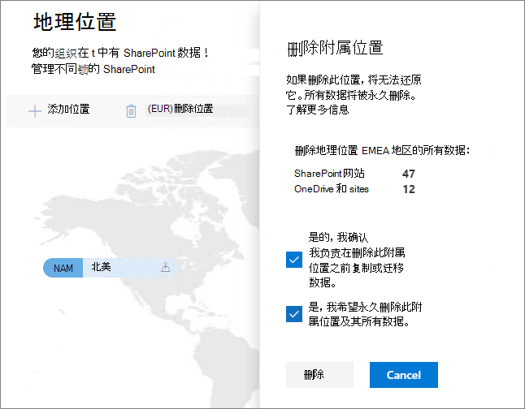

# 删除 Microsoft 365 多地理位置中的附属位置。

如果不再需要附属位置，可以在 SharePoint 管理中心内将它从租户中删除。

> [!WARNING]
> 附属位置中的所有用户数据都将被永久删除。 这包括所有 OneDrive for Business 内容、SharePoint 网站和 Exchange 邮箱（包括 Microsoft 365 组邮箱）。 删除附属位置前，必须先将所有数据都迁移到其他附属位置或中心位置。 此操作无法撤消。

只有全局管理员可以删除附属位置。

删除附属位置的具体步骤

1. 打开 SharePoint 管理中心

2. 导航到“地理位置”选项卡。

3. 在地图上，单击要删除的地理位置。

4. 单击“删除位置”。

5. 通过选择确认复选框来确认删除。

6. 单击“删除”。
