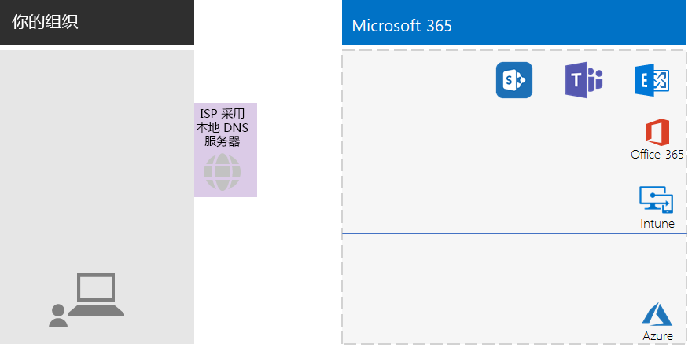
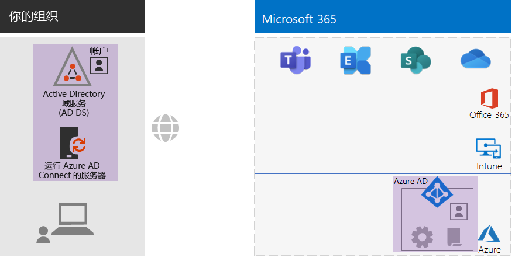
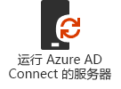
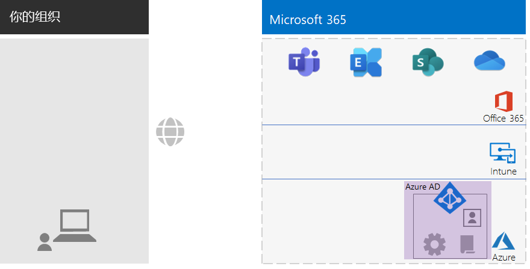
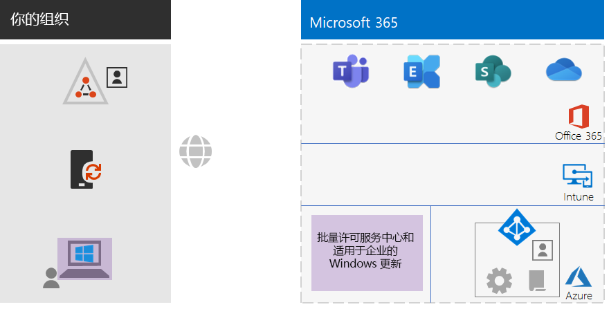
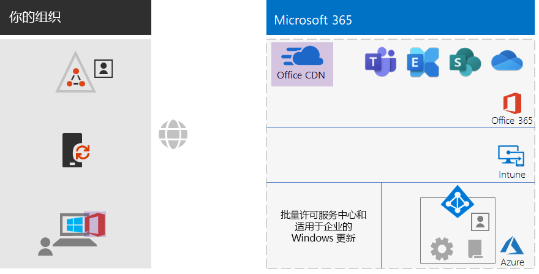
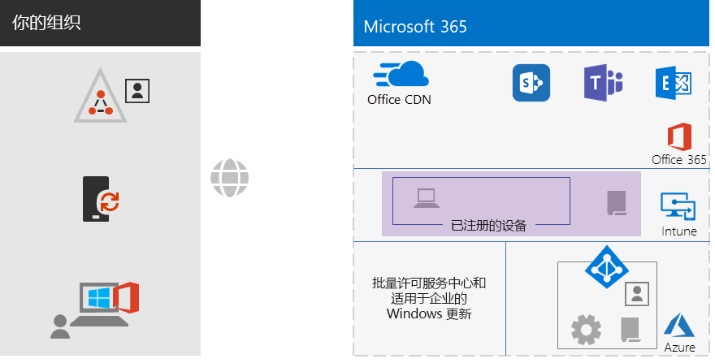
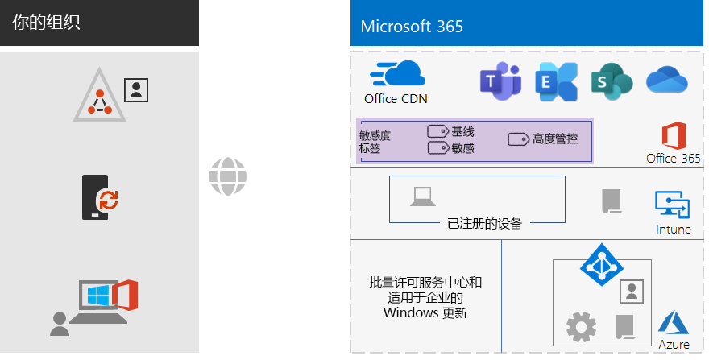
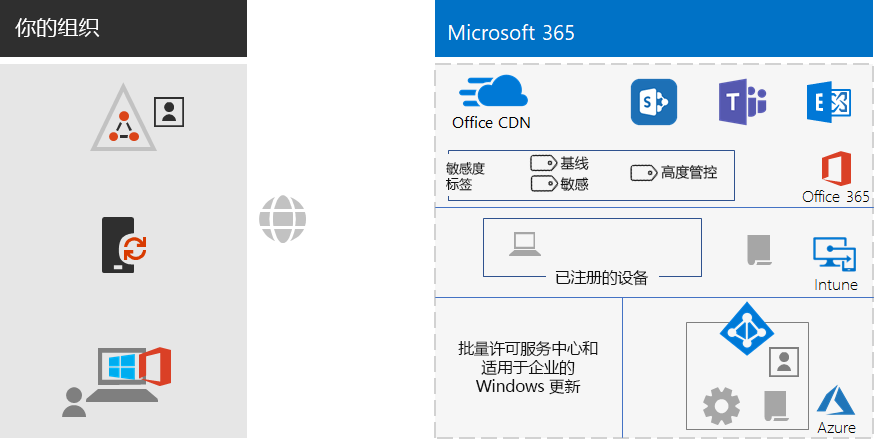
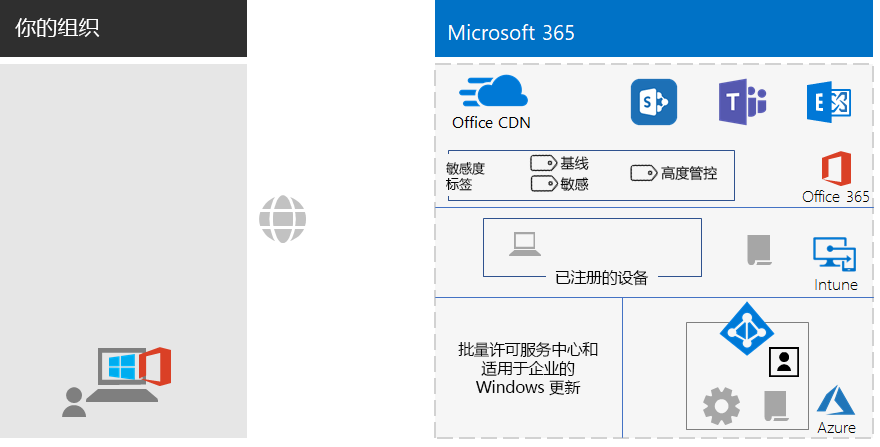

# 适用于非企业组织的 Microsoft 365 企业版基础结构Microsoft 365 Enterprise foundation infrastructure

非企业组织也可以部署 Microsoft 365 企业版，并实现集成式安全基础结构的业务价值，从而实现团队协作并激发创造力。Non-enterprise organizations can also deploy Microsoft 365 Enterprise and realize the business value of an integrated and secure infrastructure that enables teamwork and unlocks creativity. 非企业组织通常具有：A non-enterprise typically has:

- 少量的本地 IT 基础结构，例如电子邮件和文件服务器以及 Active Directory 域服务 (AD DS) 域，或者根本不存在。A small amount of on-premises IT infrastructure, such as email and file servers and an Active Directory Domain Services (AD DS) domain, or none at all.
- 少量的 IT 人员，其中大多数是 IT 通才，而不是特定技术或工作负载（如网络或电子邮件）领域的专家。A small IT staff, most of whom are IT generalists, rather than specialists in a specific technology or workload such as networking or email.

Microsoft 为小型非企业组织提供了 [Microsoft 365 商业版](https://www.microsoft.com/microsoft-365/business)。For smaller, non-enterprise organizations, Microsoft offers [Microsoft 365 Business](https://www.microsoft.com/microsoft-365/business). 但是，出于某些原因你可能需要使用 Microsoft 365 企业版，例如：However, there are reasons why you might need Microsoft 365 Enterprise, such as:

- 你的组织需要超过 300 个 Microsoft 365 许可证，而 Microsoft 365 商业版的最大许可证数量为 300 个。Your organization needs more or will need more than 300 Microsoft 365 licenses, which is the maximum for Microsoft 365 Business.
- 你的组织需要高级生产力、语音、安全性和分析功能，这些功能是 Microsoft 365 商业版所不具备的。Your organization needs the advanced productivity, voice, security, and analytics capabilities that are not available with Microsoft 365 Business.

本文将指导你完成适用于非企业组织的 Microsoft 365 企业版基础结构的简化部署。This article steps you through a simplified deployment of the foundation infrastructure of Microsoft 365 Enterprise suitable for your non-enterprise.

## 首先，设置你的订阅First, set up your subscription

你必须为订阅设置域名系统 (DNS) 域。You must set up the Domain Name System (DNS) domains for your subscription. 如果你已经拥有 Office 365 订阅，则应该已完成此步骤。If you already have an Office 365 subscription, this should have been done. 如果没有，请按照[将域添加到 Office 365](https://docs.microsoft.com/office365/admin/setup/add-domain?view=o365-worldwide) 中的说明执行操作。If not, follow the instructions in [Add a domain to Office 365](https://docs.microsoft.com/office365/admin/setup/add-domain?view=o365-worldwide).

接下来，你需要为 Microsoft 365 配置其他安全性。Next, you need to configure additional security for Microsoft 365. 请按照[配置增强的安全性](https://docs.microsoft.com/office365/securitycompliance/tenant-wide-setup-for-increased-security)中的说明执行操作。Follow the instructions in [Configure increased security](https://docs.microsoft.com/office365/securitycompliance/tenant-wide-setup-for-increased-security).

## 阶段 1：网络Phase 1: Networking

非企业组织通常在每个办公室都建立了本地 Internet 连接，并且未使用代理服务器、防火墙或数据包检查设备。Non-enterprise organizations typically have local Internet connections in each office and do not use proxy servers, firewalls, or packet inspection devices. 为每个办公室服务的 Internet 服务提供商 (ISP) 都有一个区域性的本地 DNS 服务器，用于将流量定向到离你的办公室和本地用户最近的 Microsoft 365 网络位置。The Internet service provider (ISP) serving each office has a regionally local DNS server so that traffic is directed to the Microsoft 365 network location that is closest to your offices and their on-premises users. 有关详细信息，请参阅[配置每个办公室的本地 Internet 连接](networking-dns-resolution-same-location.md)。For more information, see [Configure local Internet connections for each office](networking-dns-resolution-same-location.md).

因此，你只需要与 ISP 确认每个办公地点的连接：Therefore, you only need to verify with your ISP that the connection at each of your office locations:

- 使用区域性的本地 DNS 服务器。Uses a regionally local DNS server.
- 随着用户开始使用更多的 Microsoft 365 云服务，足以满足当前和未来的需求。Is adequate for current and future needs as your users begin using more Microsoft 365 cloud services.

如果你使用的是代理服务器、防火墙或数据包检查设备，请参阅[配置流量旁路](networking-configure-proxies-firewalls.md)，以获取有关如何优化 Microsoft 365 服务性能的信息。If you do use proxy servers, firewalls, or packet inspection devices, see [Configure traffic bypass](networking-configure-proxies-firewalls.md) for information on how to optimize performance to Microsoft 365 services.

### 你的当前配置Your configuration so far

以下是突出显示第 1 阶段元素的可视化摘要。Here is a visual summary with the Phase 1 element highlighted. **你的组织**可能拥有多个办公室，每个办公室都与使用区域性本地 DNS 服务器的 ISP 建立了本地 Internet 连接。**Your organization** can be multiple offices, each of which has a local Internet connection with an ISP that uses a regionally local DNS server. 通过 ISP，每个办公室的用户都可以访问最近的 Microsoft 365 网络位置和 Microsoft 365 订阅的资源。Through the ISP, users in each office can reach the nearest Microsoft 365 network location and the resources of your Microsoft 365 subscription.

## 阶段 2：标识Phase 2: Identity

组织内的每个员工都必须能够登录，这需要使用 Microsoft 365 企业版订阅的 Azure Active Directory (Azure AD) 租户中的用户帐户。Each employee of your organization must be able to sign in, which requires a user account in the Azure Active Directory (Azure AD) tenant of your Microsoft 365 Enterprise subscription. 然后，组将用于包含用户帐户和其他组以进行通信或访问许可的资源，例如 SharePoint Online 网站或团队。Groups are then used to contain user accounts and other groups to communicate or gain access to permissioned resources, such as a SharePoint Online site or a team. 

### 管理员帐户Administrator accounts

通过要求强密码和多因素身份验证 (MFA) 来保护你的全局管理员用户帐户。Protect your global administrator user accounts by requiring strong passwords and multi-factor authentication (MFA). 有关详细信息，请参阅[保护全局管理员帐户](identity-create-protect-global-admins.md#protect-global-administrator-accounts)。See [Protect your Office 365 global administrator accounts](identity-create-protect-global-admins.md#protect-global-administrator-accounts) for more information about configuration.

如果贵组织需要高安全性并且你拥有 Microsoft 365 企业版 E5，请使用 Azure AD Privileged Identity Management 来启用实时管理员访问。If your organization requires high security and you have Microsoft 365 Enterprise E5, use Azure AD Privileged Identity Management to enable just-in-time administrator access. 有关详细信息，请参阅[设置按需全局管理员](identity-create-protect-global-admins.md#identity-pim)。See [Set up on-demand global administrators](identity-create-protect-global-admins.md#identity-pim) for more information.

### 有关组的建议Recommendations for groups

如果你具有本地 AD DS 域，请继续将 Microsoft 365 企业版中的这些组用作 Azure AD 中的组。If you have an on-premises AD DS domain, continue to use those groups in Microsoft 365 Enterprise as groups in Azure AD.

如果你没有本地 AD DS 域，请使用这些安全级别在 Azure AD 中创建安全组。If you don’t have an on-premises AD DS domain, create security groups in Azure AD using these levels of security.

| 安全级别Security level | 说明Description | 示例Examples |
|:-------|:-----|:-----|
| 基线Baseline | 这是保护数据以及访问数据的标识和设备的最低和默认标准。This is a minimum and default  standard for protecting data and the identities and devices that access your data.    这通常是大多数用户管理的大部分组织数据。This is typically most of your organization’s data managed by most of your users. | 一线员工组，例如销售、营销、支持、管理和制造。Groups for first line workers, such as sales, marketing, support, administration, and manufacturing. |
| 敏感Sensitive | 这是对数据子集的额外保护，这种保护必须超出基线级别。This is additional protection for a subset of your data that must be protected beyond the baseline level. 这些组包含使用和创建敏感数据的用户，这些数据特定于相关部门以及不向所有人公开的项目。These groups contain users that use and create sensitive data that is specific to departments and projects that are not meant to be available to everyone. | 负责开发未来产品的产品或营销团队Product or marketing teams that are developing future products |
| 高度管控Highly regulated | 这通常是对少量数据的最高级别的保护，这些数据是高度机密、视为知识产权或商业机密或必须遵守安全法规的数据。Highly regulated: This is the highest level of protection for organizations that typically have a very small amount of data that is highly classified, considered intellectual property or trade secrets, or data that must adhere to strict security regulations. Microsoft 365 Enterprise has capabilities to help organizations meet these high security requirements, including equivalent protection for identities and devices. |  研发、法律和财务团队，或者负责存储或使用客户或合作伙伴数据的团队。Research, legal, and financial teams, or teams storing or using customer or partner data. |
||||

### 混合标识Hybrid identity

如果你有本地 AD DS 域，则需要将该域的一组用户帐户、组和联系人与 Microsoft 365 企业版订阅的 Azure AD 租户同步。If you have an on-premises AD DS domain, you need to synchronize the set of user accounts, groups, and contacts of your domain with the Azure AD tenant of your Microsoft 365 Enterprise subscription. 对于非企业组织，请在使用密码哈希同步 (PHS) 功能的服务器上配置 Azure AD Connect。For your non-enterprise, you configure Azure AD Connect on a server with password hash synchronization (PHS). 有关详细信息，请参阅[同步标识](identity-add-user-accounts.md#synchronize-identities-for-hybrid-identity)。See [Synchronize identities](identity-add-user-accounts.md#synchronize-identities-for-hybrid-identity) for more information.

### 通过条件访问策略实现更安全的用户访问More secure user access with Conditional Access policies

Azure AD 将会评估用户登录的条件，并且可以使用条件访问策略来授予或拒绝访问权限，并强制执行必须采取的进一步操作以完成登录。Azure AD evaluates the conditions of user sign-ins and can use Conditional Access policies to grant or deny access and impose further actions that must be taken to complete the sign-in. 例如，如果 Azure AD 确定登录是在中或高风险条件下发生的，则可能要求用户执行 MFA 以完成登录。For example, if Azure AD determines that the sign-in is happening under medium or high-risk conditions, it can require the user to perform MFA to complete the sign-in.

你可以将条件访问策略应用于用户帐户或组。You apply Conditional Access policies to user accounts or groups. 为了便于更轻松地分配条件访问策略，请在组织中创建以下 Azure AD 安全组：To facilitate an easier assignment of Conditional Access policies, create these Azure AD security groups in your organization:

- 基线Baseline

  包含有权访问基线数据的用户的组或用户帐户。Contains the groups or user accounts for users with access to baseline data.

- 敏感Sensitive

  包含有权访问敏感数据的用户的组或用户帐户。Contains the groups or user accounts for users with access to sensitive data.

- 高度管控HIGHLY-REGULATED

  包含有权访问高度管控数据的用户的组或用户帐户。Contains the groups or user accounts for users with access to highly regulated data.

- 条件-访问-排除COND-ACCESS-EXCLUDE

  可用于临时从条件访问策略中排除用户的空组。An empty group that you can use to temporarily exclude a user from Conditional Access policies.

以下是要启用或创建的 Azure AD 条件访问策略的列表。Here is the list of Azure AD Conditional Access policies to enable or create.

| Azure AD 条件访问策略Azure AD Conditional Access policy | 应用到的组Groups to which it applies |
|:------|:-----|
| 基线策略：要求管理员执行 MFABaseline policy: Require MFA for admins | 此策略适用于管理员角色，因此不需要指定任何组。This policy applies to admin roles, so no groups need to be specified. 只需要启用此策略。This policy just needs to be enabled. 需要创建和启用所有后续策略。All subsequent policies need to be created and enabled. |
| 阻止不支持新式身份验证的客户端Block clients that don't support modern authentication | 在策略设置中选择“所有用户”。Select “All users” in the policy settings. |
| 当登录风险为中或高时需要执行 MFA（需要使用 Microsoft 365 企业版 E5）Require MFA when sign-in risk is medium or high (requires Microsoft 365 Enterprise E5) | 基线Baseline |
| 当登录风险为低、中或高时需要执行 MFA（需要使用 Microsoft 365 企业版 E5）Require MFA when sign-in risk is low, medium, or high (requires Microsoft 365 Enterprise E5) | 敏感Sensitive |
| 始终需要进行 MFAAlways require MFA | 高度管控HIGHLY-REGULATED |
| 需要在 iOS 和 Android 设备上使用经过批准的应用Require approved apps on iOS and Android devices | 基线、敏感、高度管控BASELINE, SENSITIVE, HIGHLY-REGULATED |
| 需要兼容电脑Require compliant PCs | 基线Baseline |
| 需要兼容电脑以及 iOS 和 Android 设备Require compliant PCs and iOS and Android devices | 敏感、高度管控SENSITIVE, HIGHLY-REGULATED |
|||

以下是要创建和启用的 Azure AD Identity Protection（需要使用 Microsoft 365 企业版 E5）用户风险策略。Here is the Azure AD Identity Protection (requires Microsoft 365 Enterprise E5) user risk policy to create and enable.

| Azure AD Identity Protection 用户风险策略Azure AD Identity Protection user risk policy | 应用到的组Groups to which it applies |
|:------|:-----|
| 高风险用户必须更改密码High risk users must change passwords | 在策略设置中选择“所有用户”。Select “All users” in the policy settings. |
|||

有关说明，请参阅[通用标识和设备访问策略](identity-access-policies.md)。See [Common identity and device access policies](identity-access-policies.md) for the instructions.

### 通过组实现更轻松的管理Groups for easier management

以下是一些可以使你更轻松地进行组和许可管理的功能。Here are some features that can make group and licensing management easier for you.

| 功能Feature | 用途Use |
|:------|:-----|
| 自助服务组管理Self-service group management | 允许组所有者而不是 IT 人员管理 Azure AD 组。Allow management of Azure AD groups by group owners instead of IT staff. 有关详细信息，请参阅[自助服务组管理](identity-use-group-management.md#allow-users-to-create-and-manage-their-own-groups)。See [Self-service group management](identity-use-group-management.md#allow-users-to-create-and-manage-their-own-groups) for more information. |
| 动态组成员身份Dynamic group membership | 根据用户帐户属性（如“部门”或“国家/地区”）配置在 Azure AD 组中自动添加或删除用户帐户。Configure automatic addition or removal of user accounts from Azure AD groups based on user account attributes, such as Department or Country. 关详细信息，请参阅[动态组成员身份](identity-use-group-management.md#set-up-dynamic-group-membership)。See [Dynamic group membership](identity-use-group-management.md#set-up-dynamic-group-membership) for more information. |
| 基于组的许可Group-based licensing | 使用组成员身份自动为用户帐户分配或取消分配许可证。Use group membership to automatically assign or unassign licenses to user accounts. 有关详细信息，请参阅[基于组的许可](identity-use-group-management.md#set-up-automatic-licensing)。See [Group-based licensing](identity-use-group-management.md#set-up-automatic-licensing) for more information. |
|  |  |

如果你使用的是基于组的许可，请创建一个名为“已许可”的组，以包含分配了 Microsoft 365 企业版许可证的用户帐户名。If you are using group-based licensing, create a group named LICENSED to contain user account names that are assigned a Microsoft 365 Enterprise license.

### 监视用户访问Monitor user access

如果你具有 Microsoft 365 企业版 E5，则可以使用 Azure AD Identity Protection 来监视和分析用户登录是否存在凭据泄露。If you have Microsoft 365 Enterprise E5, you can use Azure AD Identity Protection to monitor and analyze user sign-ins for credential compromise. 有关详细信息，请参阅[防范凭据泄露](identity-secure-user-sign-ins.md#protect-against-credential-compromise)。See [Protect against credential compromise](identity-secure-user-sign-ins.md#protect-against-credential-compromise) for more information.

### 你的当前配置Your configuration so far

以下是混合标识的标识阶段的可视化摘要，其中突出显示了现有元素和新元素。Here is a visual summary of the Identity phase for hybrid identity, with existing and new elements highlighted.

 
新的和突出显示的混合标识元素包括：The new and highlighted hybrid identity elements include:
 
|||
|:------:|:-----|
|  | 具有用户帐户和组的本地 AD DS 域。An on-premises AD DS domain with user accounts and groups. |
|  | 运行 Azure AD Connect 的基于 Windows 的服务器。A Windows-based server running Azure AD Connect. |
|  | Azure AD 中的 AD DS 用户帐户和组的同步集。The synchronized set of AD DS user accounts and groups in Azure AD. |
|  | 用于身份验证、保护全局帐户以及更轻松地管理组和许可证的 Azure AD 设置。Azure AD settings for authentication, securing global accounts, and making it easier to manage groups and licenses. |
|  | Azure AD 条件访问策略。Azure AD Conditional Access policies. |
|||

以下是仅限云标识的标识阶段的可视化摘要，其中突出显示了新元素。Here is a visual summary of the Identity phase for cloud-only identity, with the new elements highlighted.

 
新的和突出显示的仅限云标识元素包括：The new and highlighted cloud-only identity elements include:
 
|||
|:------:|:-----|
|  | Azure AD 中的用户帐户和组。The user accounts and groups in Azure AD. |
|  | 用于身份验证、保护全局帐户以及更轻松地管理组和许可证的 Azure AD 设置。Azure AD settings for authentication, securing global accounts, and making it easier to manage groups and licenses. |
|  | Azure AD 条件访问策略。Azure AD Conditional Access policies. |
|||

## 阶段 3：Windows 10 企业版Phase 3: Windows 10 Enterprise

为确保将 Windows 10 企业版设备集成到 Microsoft 365 企业版的标识和安全基础结构中，可以使用以下选项：To ensure that your Windows 10 Enterprise devices are integrated into the identity and security infrastructure of Microsoft 365 Enterprise, here are your options:

- 混合（你具有本地 AD DS 域）Hybrid (you have an on-premises AD DS domain)

  对于已加入 AD DS 域的每台现有的 Windows 10 企业版设备，请将它们加入 Azure AD 租户。For each existing Windows 10 Enterprise device already joined to your AD DS domain, join them to the Azure AD tenant. 有关说明，请参阅[如何配置联接到混合 Azure Active Directory 的设备](https://go.microsoft.com/fwlink/p/?linkid=872870)。See [How to configure hybrid Azure Active Directory joined devices](https://go.microsoft.com/fwlink/p/?linkid=872870) for the instructions.

  对于每台新的 Windows 10 企业版设备，请将它们加入 AD DS 域，然后将它们加入 Azure AD 租户。For each new Windows 10 Enterprise device, join them to your AD DS domain, and then join them to the Azure AD tenant.

  对于每台 Windows 10 企业版设备，请注册它们以进行移动设备管理。For each Windows 10 Enterprise device, enroll them for mobile device management. 有关说明，请参阅[使用组策略注册带有 Intune 的 Windows 10 设备](https://go.microsoft.com/fwlink/p/?linkid=872871)。See [Enroll a Windows 10 device with Intune by using a Group Policy](https://go.microsoft.com/fwlink/p/?linkid=872871) for the instructions.

- 仅限云（如果你没有本地 AD DS 域）Cloud-only (you do not have an on-premises AD DS domain)

  将每台 Windows 10 企业版设备加入订阅的 Azure AD 租户。Join each Windows 10 Enterprise device to the Azure AD tenant of your subscription.

  有关详细信息，请参阅[将工作设备加入组织的网络](https://docs.microsoft.com/azure/active-directory/user-help/user-help-join-device-on-network)。See [Join your work device to your organization's network](https://docs.microsoft.com/azure/active-directory/user-help/user-help-join-device-on-network) for more information.

安装并加入后，每台 Windows 10 企业版设备都会自动从 Windows Update for Business 云服务安装更新。Once installed and joined, each Windows 10 Enterprise device automatically installs updates from the Windows Update for Business cloud service. 在非企业组织中，通常无需设置基础结构即可分发和安装 Windows 10 更新。There is typically no need in a non-enterprise organization to set up an infrastructure to distribute and install Windows 10 updates.

### 你的当前配置Your configuration so far

以下是 Windows 10 企业版阶段的可视化摘要，其中突出显示了新元素。Here is a visual summary of the Windows 10 Enterprise phase with the new elements highlighted.

 
新的和突出显示的 Windows 10 企业版元素包括：The new and highlighted Windows 10 Enterprise elements include:

|||
|:------:|:-----|
|  | Windows 设备上安装的 Windows 10 企业版，以本地笔记本电脑为例。Windows 10 Enterprise installed on Windows devices, with an on-premises laptop as an example. |
|  | 批量许可服务中心（它为新安装的 Windows 10 企业版提供映像）和 Windows Update for Business 服务（它提供最新的更新）。The Volume Licensing Service Center, which provides images for new installations of Windows 10 Enterprise, and the Windows Update for Business service, which provides the latest updates. |
|||

## 阶段 4：Office 365 专业增强版Phase 4: Office 365 ProPlus

Microsoft 365 企业版包括 Office 365 专业增强版，即 Microsoft Office 的订阅版本。Microsoft 365 Enterprise includes Office 365 ProPlus, the subscription version of Microsoft Office. 与 Office 2016 或 Office 2019 一样，Office 365 专业增强版也直接安装在客户端设备上。Like Office 2016 or Office 2019, Office 365 ProPlus is installed directly on your client devices. 但是，Office 365 专业增强版会定期接收包含新功能的更新。However, Office 365 ProPlus receives updates that include new features on a regular basis. 有关详细信息，请参阅[关于企业中的 Office 365 专业增强版](https://docs.microsoft.com/deployoffice/about-office-365-proplus-in-the-enterprise)。See [About Office 365 ProPlus in the enterprise](https://docs.microsoft.com/deployoffice/about-office-365-proplus-in-the-enterprise) for more information.

对于非企业组织，请在设备（包括 Windows、iOS 和 Android 设备）上手动安装 Office 365 专业增强版。For your non-enterprise organization, you manually install Office 365 ProPlus on devices, which can include Windows, iOS, and Android devices. 这可以作为准备使用新设备的一部分来完成，也可以由用户在载入过程中完成。This can be done as part of preparing a new device for use, or by the user as part of their onboarding process.

在任何一种情况下，管理员或用户都需要登录 Office 365 门户：https://portal.office.com。In either case, the administrator or the user signs in to the Office 365 portal at https://portal.office.com. 在“**Microsoft Office 家庭版**”选项卡上，单击“**安装 Office**”并逐步完成安装过程。On the **Microsoft Office Home** tab, click **Install Office** and step through the installation process.

安装它的每台计算机每月都会下载 Office 365 专业增强版的功能更新。Feature updates to Office 365 ProPlus are downloaded monthly by each computer on which it is installed. 在非企业组织中，通常无需设置基础结构即可分发 Office 365 专业增强版更新。There is typically no need in a non-enterprise organization to set up an infrastructure to distribute Office 365 ProPlus updates. 

### 你的当前配置Your configuration so far

以下是 Office 365 专业增强版阶段的可视化摘要，其中突出显示了新元素。Here is a visual summary of the Office 365 ProPlus phase with the new elements highlighted.

 
新的和突出显示的 Office 365 专业增强版元素包括：The new and highlighted Office 365 ProPlus elements include:
 
|||
|:------:|:-----|
|  | 设备上安装的 Office 365 专业增强版，以本地笔记本电脑为例。Office 365 ProPlus installed on devices, with an on-premises laptop as an example. |
|  | Office 365 专业增强版的 Office 内容交付网络 (CDN)，设备可以通过它访问 Office 365 专业增强版更新。The Office Content Delivery Network (CDN) for Office 365 ProPlus, which devices access for Office 365 ProPlus updates. |
|||

## 阶段 5：移动设备管理Phase 5: Mobile device management

Microsoft 365 企业版包含用于移动设备管理的 Microsoft Intune。Microsoft 365 Enterprise includes Microsoft Intune for mobile device management. 使用 Intune，你可以管理 Windows、iOS、Android 和 macOS，以保护对组织资源（包括数据）的访问。With Intune, you can manage Windows, iOS, Android, and macOS devices to protect access to your organization's resources, including your data. Intune 使用 Azure AD 的用户、组和计算机帐户。Intune uses the user, group, and computer accounts of Azure AD.

Intune 提供了两种类型的移动设备管理：Intune provides two types of mobile device management:

- 在 Intune 中注册设备后进行移动设备管理 (MDM)。Mobile device management (MDM) is when devices get enrolled in Intune. 注册后，它们将成为受管理设备，可以接收组织使用的策略、规则和设置。Once enrolled, they are managed devices and can receive the policies, rules, and settings used by your organization. 这些类型的设备通常由贵组织拥有并分发给你的员工。These types of devices are typically owned by your organization and issued to your employees.

- 拥有个人设备的用户可能不想注册他们的设备，也不希望由 Intune 使用你的策略和设置进行管理。Users with their own personal devices may not want to enroll their devices or be managed by Intune with your policies and settings. 但是，你仍需要保护组织的资源和数据。However, you still need to protect your organization's resources and data. 在这种情况下，你可以使用移动应用程序管理 (MAM) 来保护你的应用。For this scenario, you can protect your apps with mobile application management (MAM).  

Intune 策略可以强制执行设备合规性和应用保护。Intune policies can enforce device compliance and app protection. 以下是要创建的 Intune 策略的列表。Here is the list of Intune policies to create.

| Intune 策略Intune policies | 应用到的组Groups to which it applies |
|:------|:-----|
| Windows 的设备合规性策略Device compliance policy for Windows | 基线、敏感、高度管控BASELINE, SENSITIVE, HIGHLY-REGULATED |
| iOS 的设备合规性策略Device compliance policy for iOS | 敏感、高度管控SENSITIVE, HIGHLY-REGULATED |
| macOS 的设备合规性Device compliance for macOS | 敏感、高度管控SENSITIVE, HIGHLY-REGULATED |
| Android 和 Android Enterprise 的设备合规性策略Device compliance policy for Android and Android Enterprise | 敏感、高度管控SENSITIVE, HIGHLY-REGULATED |
| iOS 的应用保护策略App protection policy for iOS | 基线、敏感、高度管控BASELINE, SENSITIVE, HIGHLY-REGULATED |
| macOS 的应用保护策略App protection policy for macOS | 基线、敏感、高度管控BASELINE, SENSITIVE, HIGHLY-REGULATED |
| Android 和 Android Enterprise 的应用保护策略App protection policy for Android and Android Enterprise | 基线、敏感、高度管控BASELINE, SENSITIVE, HIGHLY-REGULATED |
|||
    
有关说明，请参阅[通用标识和设备访问策略](identity-access-policies.md)。See [Common identity and device access policies](identity-access-policies.md) for the instructions.

### 你的当前配置Your configuration so far

以下是移动设备管理阶段的可视化摘要，其中突出显示了新元素。Here is a visual summary of the Mobile Device Management phase with the new elements highlighted.

 
新的和突出显示的移动设备管理元素包括：The new and highlighted mobile device management elements include:

|||
|:------:|:-----|
|  | 在 Intune 中注册的设备，显示正运行 Windows 10 企业版的本地笔记本电脑为例。Devices that are enrolled in Intune, showing an on-premises laptop running Windows 10 Enterprise as an example. |
|  | Intune 的设备合规性和应用保护策略。Intune policies for device compliance and app protection. |
|||

## 阶段 6：信息保护Phase 6: Information protection

Microsoft 365 企业版具有许多信息保护功能，允许你通过应用不同级别的管理、安全性和保护来区别对待数据分类。Microsoft 365 Enterprise has a host of information protection features that allow you to treat classifications of data differently by applying different levels of governance, security, and protection. 

例如，通常大多数员工与他们所处理文档之间的对应关系都需要特定的基线保护级别。For example, normal correspondence between most employees and the documents on which they work need a certain baseline level of protection. 财务记录、客户数据和你的知识产权需要更高级别的保护。Financial records, customer data, and your intellectual property need a higher level of protection.

信息保护策略的第一步是确定保护级别。The first step to an information protection strategy is to determine the levels of protection. 许多组织都会使用已用于条件访问策略的保护级别：Many organizations use these levels, which are already being used for Conditional Access policies:

- 基线Baseline

  示例包括正常的业务通信（电子邮件）和供管理、销售和支持工作人员使用的文件。Examples of Level 1 data are normal business communications (email) and files for administrative, sales, and support workers.

- 敏感Sensitive

  示例包括财务和法律信息，以及新产品或服务的研发数据。Examples of Level 2 data are financial and legal information and research and development data for new products.

- 高度管控Highly regulated

  示例包括客户和合作伙伴的个人身份信息以及组织的战略计划或知识产权。Examples include customer and partner personally identifiable information and your organization’s strategic plans or intellectual property.

基于这些数据安全级别，下一步是确定并实施：Based on these levels of data security, the next step is to identify and implement:

- 自定义敏感信息类型Custom sensitive information types

  Microsoft 365 提供了各种敏感信息类型，例如健康服务和信用卡号。Microsoft 365 supplies a wide selection of sensitive information types, such as health service and credit card numbers. 如果你未在提供的列表中找到所需的类型，则可以创建自己的信息类型。If you do not find one that you need in the supplied list, you can create your own.

- 保留标签Retention labels

  为了遵守组织政策和区域法规，你可能必须指定特定类型的文档或含有特定内容的文档应保留多长时间。To comply with organization policies and regional regulations, you might have to specify how long specific types of documents or documents with specific contents should be retained. 你可以使用保留标签为电子邮件和文档实施此策略。You can implement this for email and documents using retention labels. 保留标签还可以与数据丢失防护 (DLP) 策略结合使用，该策略可以限制在组织外部共享文件或电子邮件。Retention labels can also be used in conjunction with Data Loss Prevention (DLP) policies that can restrict the sharing of files or email outside your organization.

- 敏感度标签Sensitivity labels

  你可以使用指定的敏感度标签来标记电子邮件或文档，以便能够应用其他安全级别。You can label email or documents with a named sensitivity label so that additional levels of security can be applied. 示例包括水印、加密和权限，这些将指定允许谁访问电子邮件或文档以及允许他们执行哪些操作。Examples are watermarks, encryption, and permissions, which specify who is allowed to access the email or document and what they are allowed to do.

有关详细信息，请参阅 [Microsoft 365 分类类型](infoprotect-configure-classification.md#microsoft-365-classification-types)。See [Microsoft 365 classification types](infoprotect-configure-classification.md#microsoft-365-classification-types) for more information.

如果你使用具有权限的敏感度标签，则可能必须创建其他 Azure AD 安全组，以定义允许谁对已应用敏感度标签的电子邮件和文档执行哪些操作。If you use sensitivity labels with permissions, you might have to create additional Azure AD security groups to define who is allowed to do what with email and documents that have the sensitivity label applied. 

例如，你需要创建一个“研发”敏感度标签来保护研发团队的电子邮件和文档。For example, you need to create a RESEARCH sensitivity label to protect the email and documents of your research team. 你确定：You determine that:

- 研发人员必须具有更改带“研发”敏感度标签文档的权限。Researchers must have the ability to change documents marked with the RESEARCH sensitivity label.
- 非研发员工只需具有查看带“研发”敏感度标签文档的权限。Non-research employees only need to have the ability to view documents marked with the RESEARCH sensitivity label. 

这意味着你需要创建和管理两个附加组：This means you need to create and manage two additional groups:

- 研发-全部RESEARCH-ALL
- 研发-查看RESEARCH-VIEW

这些组及其权限将成为“研发”敏感度标签配置的一部分。These groups and their permissions become part of the RESEARCH sensitivity label's configuration.

对于已配置基于组的权限的敏感度标签，你必须管理这些组的成员身份。For sensitivity labels configured with group-based permissions, you must manage the membership of these groups.

### 你的当前配置Your configuration so far

以下是信息保护阶段的可视化摘要，其中突出显示了新元素。Here is a visual summary of the Information Protection phase with the new elements highlighted.

 
新的和突出显示的信息保护元素包括：The new and highlighted information protection elements include:
 
|||
|:------:|:-----|
|  | 用户可以应用于文档和电子邮件的三个安全级别的敏感度标签。Sensitivity labels for the three levels of security that users can apply to documents and email. |
|||

未显示客户信息类型和保留标签。Custom information types and retention labels are not shown.

## 载入Onboarding

有了 Microsoft 365 企业版基础结构，你可以轻松载入员工。With your Microsoft 365 Enterprise infrastructure in place, you can easily onboard your employees.

### 新的 Windows 10 企业版设备A new Windows 10 Enterprise device

在为员工提供新的 Windows 10 企业版设备之前：Before giving an employee a new Windows 10 Enterprise device:

- 对于混合标识For hybrid identity

  依次将设备加入 AD DS 域和 Azure AD 租户，然后在 Intune 中注册设备。Join the device to your AD DS domain, join the device to your Azure AD tenant, and then enroll the device in Intune.

- 对于仅限云标识For cloud-only identity

  将设备加入 Azure AD 租户。Join the device to your Azure AD tenant.

### 具有 AD DS 用户帐户的现有员工Existing employee with an AD DS user account

在使用混合标识时，作为组织的初始载入的一部分，请将 AD DS 用户帐户添加到这些 Azure AD 组：As part of the initial onboarding for your organization when using hybrid identity, add the AD DS user account to these Azure AD groups:

- 已许可Licensed
- 相应的 AD DS 或 Azure AD 安全组，它们是“基线”、“敏感”和“高度管控”Azure AD 组的成员The appropriate AD DS or Azure AD security groups that are members of the BASELINE, SENSITIVE, and HIGHLY-REGULATED Azure AD groups
- 敏感度标签组（根据需要）Sensitivity label groups (as needed)

现有员工应已添加到相应的工作组、部门和区域 AD DS 组。The existing employee should already be added to the appropriate workgroup, departmental, and regional AD DS groups.

可向 Microsoft 365 管理中心内的多个 Azure AD 组添加用户帐户。You can add a user account to multiple Azure AD groups in the Microsoft 365 admin center. 从用户帐户的属性中，单击“**管理组” > “添加成员身份**”。From the properties of the user account, click **Manage groups > Add memberships**.

如果要使用 PowerShell，请参阅[可下载的 Excel 工作簿](https://github.com/MicrosoftDocs/microsoft-365-docs/blob/public/microsoft-365/enterprise/media/Group-License-Mgmt-PowerShell.xlsx?raw=true)，它基于指定的用户帐户和选定的组名称生成 PowerShell 命令。If you want to use PowerShell, see this [downloadable Excel workbook](https://github.com/MicrosoftDocs/microsoft-365-docs/blob/public/microsoft-365/enterprise/media/Group-License-Mgmt-PowerShell.xlsx?raw=true), which generates the PowerShell commands based on a specified user account and selected group names.

### 使用仅限云用户帐户的新员工New employee with a cloud-only user account

在使用仅限云标识时，作为组织的初始载入的一部分，请将新用户帐户添加到这些组：As part of the initial onboarding for your organization when using cloud-only identity, add the new user account to these groups:

- 已许可Licensed
- 相应的 Azure AD 安全组，它们是“基线”、“敏感”和“高度管控”Azure AD 组的成员The appropriate Azure AD security groups that are members of the BASELINE, SENSITIVE, and HIGHLY-REGULATED Azure AD groups
- 工作组、部门和区域组Workgroup, departmental, and regional groups
- 敏感度标签组（根据需要）Sensitivity label groups (as needed)

### 初次登录 Microsoft 365Initial sign-in to Microsoft 365

当员工首次登录 Microsoft 365 时，请指示他们：For the first time employees sign in to Microsoft 365, instruct them to:

1. 使用其用户帐户凭据登录其设备。Sign into their devices with their user account credentials.
2. 使用浏览器登录 Office 365 门户：https://portal.office.com。Using a browser on your local computer, sign in to the https://portal.office.com using your global administrator account.
3. 在“**Office 365 家庭版**”选项卡中，单击“**安装 Office**”以在设备上安装 Office 365 专业增强版。From the **Office 365 Home** tab, click **Install Office** to install Office 365 ProPlus on their device.

## 结果End results

以下是为非企业组织配置 Microsoft 365 企业版基础结构的结果。Here are the results of configuring the Microsoft 365 Enterprise foundation infrastructure for your non-enterprise organization.

### 基础结构结果Infrastructure results

在构建和配置 Microsoft 365 企业版基础结构之后，你应该：After the build-out and configuration of your Microsoft 365 Enterprise infrastructure, you should have:

- 为每个办公室建立了本地 Internet 连接，其具有由使用区域性本地 DNS 服务器的 ISP 提供的足够带宽。A local Internet connection for each of your offices with sufficient bandwidth supplied by an ISP that uses a regionally local DNS server.
- 对于混合标识，具有在服务器上运行的 Azure AD Connect，该服务器可将你的本地 AD DS 域与 Azure AD 租户同步。For hybrid identity, Azure AD Connect running on a server that synchronizes your on-premises AD DS domain with your Azure AD tenant.
- 这些组：These universal groups include:
  - 已许可Licensed
  - 条件-访问-排除COND-ACCESS-EXCLUDE
  - 相应的 AD DS 或 Azure AD 安全组，它们也是“基线”、“敏感”和“高度管控”Azure AD 组的成员The appropriate AD DS or Azure AD security groups that are also members of the BASELINE, SENSITIVE, and HIGHLY-REGULATED Azure AD groups 
  - 工作组、部门和区域组Workgroup, departmental, and regional groups
  - 敏感度标签组（根据需要）Sensitivity label groups (as needed)
- Azure AD 登录条件访问策略，它们使用“基线”、“敏感”、“高度管控”和“条件-访问-排除”Azure AD 组。Azure AD sign-in Conditional Access policies that use the BASELINE, SENSITIVE, and HIGHLY-REGULATED, and COND-ACCESS-EXCLUDE Azure AD groups.
- Intune 应用程序和设备合规性策略。Intune application and device compliance policies.
- 自定义敏感信息类型（根据需要）。Custom sensitive information types (as needed).
- 保留标签（根据需要）。Retention labels (as needed).
- 敏感度标签（根据需要）。Sensitivity labels (as needed).

以下是当组织使用混合标识时基础结构的可视化摘要，它包含 AD DS 域、Azure AD Connect 服务器以及同步的 AD DS 用户和组。Here is a visual summary of the infrastructure if your organization uses hybrid identity, which includes your AD DS domain, an Azure AD Connect server, and synchronized AD DS users and groups.

 
以下是当组织使用仅限云标识时基础结构的可视化摘要。Here is a visual summary of the infrastructure if your organization uses cloud-only identity.
 

### 员工结果Employee results

载入后，每位员工都应该具有：After their onboarding, each employee should have:

- 从其设备到其区域内的 Microsoft 365 云服务的高性能本地网络路径。A performant, on-premises network path from their device to the Microsoft 365 cloud services in their region.
- 包含这些组成员身份的用户帐户：A user account with these group memberships:
   - 已许可Licensed
   - 相应的 AD DS 或 Azure AD 安全组，它们也是“基线”、“敏感”和“高度管控”Azure AD 条件访问策略组的成员The appropriate AD DS or Azure AD security groups, which are also members of the BASELINE, SENSITIVE, and HIGHLY-REGULATED Azure AD groups for Conditional Access policies 
   - 相应的工作组、部门和区域组The appropriate workgroup, departmental, and regional groups
   - 敏感度标签组（根据需要）Sensitivity label groups (as needed)
- Windows 10 企业版设备：A Windows 10 Enterprise device that:
   - 已加入 Azure AD 租户（仅限云）或已同时加入 Azure AD 租户和 AD DS 域（混合）。Is joined to the Azure AD tenant (cloud-only) or to both the Azure AD tenant and your AD DS domain (hybrid).
   - 使用最新的 Windows 10 企业版产品改进和安全增强功能进行自动更新。Automatically updates itself with the latest Windows 10 Enterprise product improvements and security enhancements.
   - 已安装 Office 365 专业增强版，它使用最新的 Office 产品改进和安全增强功能进行自动更新。Has Office 365 ProPlus installed, which automatically updates itself with the latest Office product improvements and security enhancements.
   - 已在 Intune 中注册并受 Intune 设备合规性策略和应用保护策略的制约。Is enrolled in Intune and subject to Intune device compliance policies and app protection policies.

## 后续步骤Next step

部署[工作负载和方案](deploy-workloads.md)以利用 Microsoft 365 企业版基础结构的功能和配置。If you're following the end-to-end deployment of Microsoft 365 Enterprise, you're now ready to have your [workloads and scenarios](deploy-workloads.md) take advantage of all the features and configuration of your foundation infrastructure.
