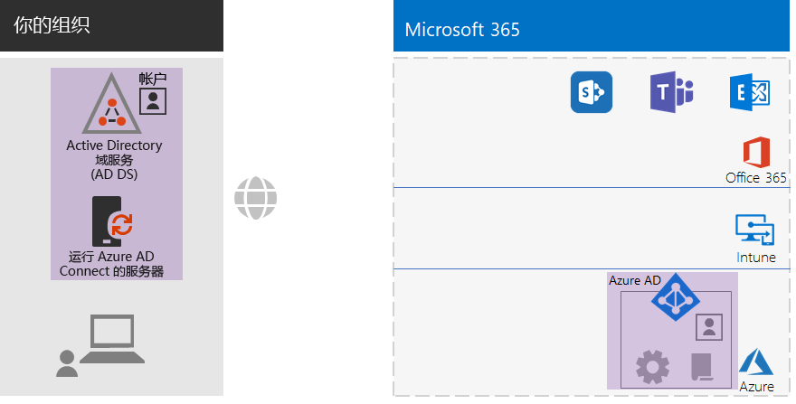
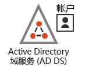
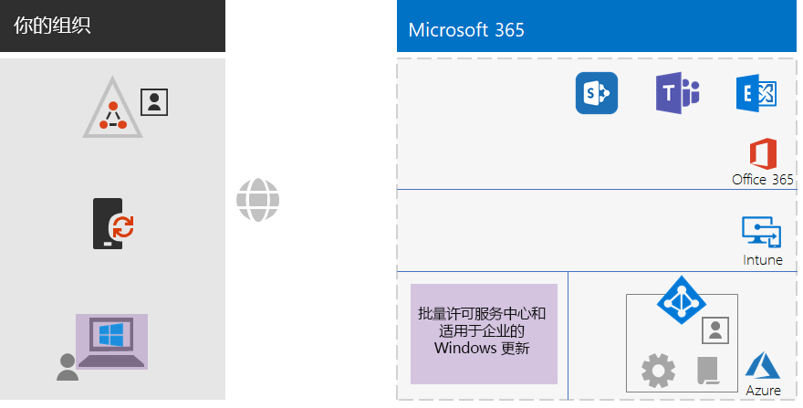
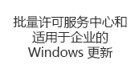
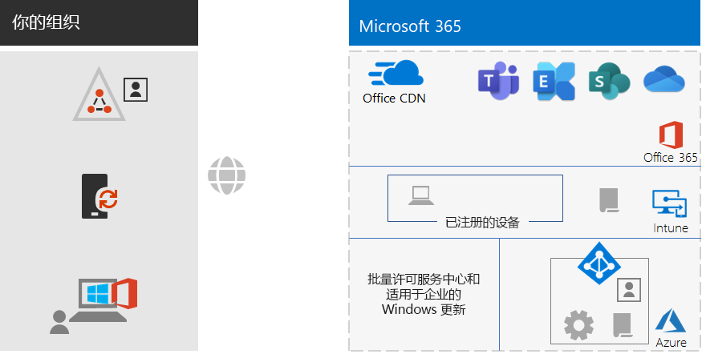

# 适用于非企业组织的 Microsoft 365 企业版基础结构

非企业组织也可以部署 Microsoft 365 企业版，并实现集成式安全基础结构的业务价值，从而实现团队协作并激发创造力。 非企业组织通常具有：

- 少量的本地 IT 基础结构，例如电子邮件和文件服务器以及 Active Directory 域服务 (AD DS) 域，或者根本不存在。
- 少量的 IT 人员，其中大多数是 IT 通才，而不是特定技术或工作负载（如网络或电子邮件）领域的专家。

Microsoft 为小型非企业组织提供了 [Microsoft 365 商业版](https://www.microsoft.com/microsoft-365/business)。 但是，你可能出于某些原因需要使用 Microsoft 365 企业版，例如：

- 组织需要或将需要超过 300 个 Microsoft 365 许可证，300 个是 Microsoft 365 商业版的上限。
- 组织需要 Microsoft 365 商业版没有的高级生产力、语音、安全性和分析功能。

本文将指导你完成适用于非企业组织的 Microsoft 365 企业版基础结构的简化部署。

## 首先，设置你的订阅

你必须为订阅设置域名系统 (DNS) 域。 如果已有 Microsoft 365 订阅，应该已完成此步骤。 如果没有，请按照[将域添加到 Office 365](https://docs.microsoft.com/office365/admin/setup/add-domain?view=o365-worldwide) 中的说明执行操作。

接下来，你需要为 Microsoft 365 配置其他安全性。 请按照[配置增强的安全性](https://docs.microsoft.com/office365/securitycompliance/tenant-wide-setup-for-increased-security)中的说明执行操作。

## 阶段 1：网络

非企业组织通常在每个办公室都建立了本地 Internet 连接，并且未使用代理服务器、防火墙或数据包检查设备。 为每个办公室服务的 Internet 服务提供商 (ISP) 都有一个区域性的本地 DNS 服务器，用于将流量定向到离你的办公室和本地用户最近的 Microsoft 365 网络位置。 有关详细信息，请参阅[配置每个办公室的本地 Internet 连接](networking-dns-resolution-same-location.md)。

因此，你只需要与 ISP 确认每个办公地点的连接：

- 使用区域性的本地 DNS 服务器。
- 随着用户开始使用更多的 Microsoft 365 云服务，足以满足当前和未来的需求。

如果你使用的是代理服务器、防火墙或数据包检查设备，请参阅[配置流量旁路](networking-configure-proxies-firewalls.md)，以获取有关如何优化 Microsoft 365 服务性能的信息。

### 你的当前配置

以下是突出显示第 1 阶段元素的可视化摘要。 **你的组织**可能拥有多个办公室，每个办公室都与使用区域性本地 DNS 服务器的 ISP 建立了本地 Internet 连接。 通过 ISP，每个办公室的用户都可以访问最近的 Microsoft 365 网络位置和 Microsoft 365 订阅的资源。

## 阶段 2：标识

组织内的每个员工都必须能够登录，这需要使用 Microsoft 365 企业版订阅的 Azure Active Directory (Azure AD) 租户中的用户帐户。 然后，组将用于包含用户帐户和其他组以进行通信或访问许可的资源，例如 SharePoint Online 网站或团队。 

### 管理员帐户

通过要求强密码和多因素身份验证 (MFA) 来保护你的全局管理员用户帐户。 有关详细信息，请参阅[保护全局管理员帐户](identity-create-protect-global-admins.md#protect-global-administrator-accounts)。

如果贵组织需要高安全性并且你拥有 Microsoft 365 企业版 E5，请使用 Azure AD Privileged Identity Management 来启用实时管理员访问。 有关详细信息，请参阅[设置按需全局管理员](identity-create-protect-global-admins.md#identity-pim)。

### 有关组的建议

如果你具有本地 AD DS 域，请继续将 Microsoft 365 企业版中的这些组用作 Azure AD 中的组。

如果你没有本地 AD DS 域，请使用这些安全级别在 Azure AD 中创建安全组。

| 安全级别 | 说明 | 示例 |
|:-------|:-----|:-----|
| 基线 | 这是保护数据以及访问数据的标识和设备的最低和默认标准。    这通常是大多数用户管理的大部分组织数据。 | 一线员工组，例如销售、营销、支持、管理和制造。 |
| 敏感 | 这是对数据子集的额外保护，这种保护必须超出基线级别。 这些组包含使用和创建敏感数据的用户，这些数据特定于相关部门以及不向所有人公开的项目。 | 负责开发未来产品的产品或营销团队 |
| 高度管控 | 这通常是对少量数据的最高级别的保护，这些数据是高度机密、视为知识产权或商业机密或必须遵守安全法规的数据。 |  研发、法律和财务团队，或者负责存储或使用客户或合作伙伴数据的团队。 |
||||

### 混合标识

如果你有本地 AD DS 域，则需要将该域的一组用户帐户、组和联系人与 Microsoft 365 企业版订阅的 Azure AD 租户同步。 对于非企业组织，请在使用密码哈希同步 (PHS) 功能的服务器上配置 Azure AD Connect。 有关详细信息，请参阅[同步标识](identity-add-user-accounts.md#synchronize-identities-for-hybrid-identity)。

### 通过条件访问策略实现更安全的用户访问

Azure AD 将会评估用户登录的条件，并且可以使用条件访问策略来授予或拒绝访问权限，并强制执行必须采取的进一步操作以完成登录。 例如，如果 Azure AD 确定登录是在中或高风险条件下发生的，则可能要求用户执行 MFA 以完成登录。

你可以将条件访问策略应用于用户帐户或组。 为了便于更轻松地分配条件访问策略，请在组织中创建以下 Azure AD 安全组：

- 基线

  包含有权访问基线数据的用户的组或用户帐户。

- 敏感

  包含有权访问敏感数据的用户的组或用户帐户。

- 高度管控

  包含有权访问高度管控数据的用户的组或用户帐户。

- 条件-访问-排除

  可用于临时从条件访问策略中排除用户的空组。

以下是要启用或创建的 Azure AD 条件访问策略的列表。

| Azure AD 条件访问策略 | 应用到的组 |
|:------|:-----|
| 基线策略：要求管理员执行 MFA | 此策略适用于管理员角色，因此不需要指定任何组。 只需要启用此策略。 需要创建和启用所有后续策略。 |
| 阻止不支持新式身份验证的客户端 | 在策略设置中选择“所有用户”。 |
| 当登录风险为中或高时需要执行 MFA（需使用 Microsoft 365 E5） | 基线 |
| 无论登录风险是低、中还是高，都需要执行 MFA（需使用 Microsoft 365 E5） | 敏感 |
| 始终需要进行 MFA | 高度管控 |
| 需要在 iOS 和 Android 设备上使用经过批准的应用 | 基线、敏感、高度管控 |
| 需要兼容电脑 | 基线 |
| 需要兼容电脑以及 iOS 和 Android 设备 | 敏感、高度管控 |
|||

以下是要创建和启用的 Azure AD Identity Protection（需使用 Microsoft 365 E5）用户风险策略。

| Azure AD Identity Protection 用户风险策略 | 应用到的组 |
|:------|:-----|
| 高风险用户必须更改密码 | 在策略设置中选择“所有用户”。 |
|||

有关说明，请参阅[通用标识和设备访问策略](identity-access-policies.md)。

### 通过组实现更轻松的管理

以下是一些可以使你更轻松地进行组和许可管理的功能。

| 功能 | 用途 |
|:------|:-----|
| 自助服务组管理 | 允许组所有者而不是 IT 人员管理 Azure AD 组。 有关详细信息，请参阅[自助服务组管理](identity-use-group-management.md#allow-users-to-create-and-manage-their-own-groups)。 |
| 动态组成员身份 | 根据用户帐户属性（如“部门”或“国家/地区”）配置在 Azure AD 组中自动添加或删除用户帐户。 关详细信息，请参阅[动态组成员身份](identity-use-group-management.md#set-up-dynamic-group-membership)。 |
| 基于组的许可 | 使用组成员身份自动为用户帐户分配或取消分配许可证。 有关详细信息，请参阅[基于组的许可](identity-use-group-management.md#set-up-automatic-licensing)。 |
|  |  |

如果你使用的是基于组的许可，请创建一个名为“已许可”的组，以包含分配了 Microsoft 365 企业版许可证的用户帐户名。

### 监视用户访问

如果你具有 Microsoft 365 E5，则可使用 Azure AD Identity Protection 来监视和分析用户登录是否存在凭据泄露情况。 有关详细信息，请参阅[防范凭据泄露](identity-secure-user-sign-ins.md#protect-against-credential-compromise)。

### 你的当前配置

以下是混合标识的标识阶段的可视化摘要，其中突出显示了现有元素和新元素。

 
新的和突出显示的混合标识元素包括：
 
|||
|:------:|:-----|
|  | 具有用户帐户和组的本地 AD DS 域。 |
|  | 运行 Azure AD Connect 的基于 Windows 的服务器。 |
|  | Azure AD 中的 AD DS 用户帐户和组的同步集。 |
|  | 用于身份验证、保护全局帐户以及更轻松地管理组和许可证的 Azure AD 设置。 |
|  | Azure AD 条件访问策略。 |
|||

以下是仅限云标识的标识阶段的可视化摘要，其中突出显示了新元素。

 
新的和突出显示的仅限云标识元素包括：
 
|||
|:------:|:-----|
|  | Azure AD 中的用户帐户和组。 |
|  | 用于身份验证、保护全局帐户以及更轻松地管理组和许可证的 Azure AD 设置。 |
|  | Azure AD 条件访问策略。 |
|||

## 阶段 3：Windows 10 企业版

为确保将 Windows 10 企业版设备集成到 Microsoft 365 企业版的标识和安全基础结构中，可使用以下选项：

- 混合（你具有本地 AD DS 域）

  对于已加入 AD DS 域的每台现有的 Windows 10 企业版设备，请将它们加入 Azure AD 租户。 有关说明，请参阅[如何配置联接到混合 Azure Active Directory 的设备](https://go.microsoft.com/fwlink/p/?linkid=872870)。

  对于每台新的 Windows 10 企业版设备，请将它们加入 AD DS 域，然后将它们加入 Azure AD 租户。

  对于每台 Windows 10 企业版设备，请注册它们以进行移动设备管理。 有关说明，请参阅[使用组策略注册带有 Intune 的 Windows 10 设备](https://go.microsoft.com/fwlink/p/?linkid=872871)。

- 仅限云（如果你没有本地 AD DS 域）

  将每台 Windows 10 企业版设备加入订阅的 Azure AD 租户。

  有关详细信息，请参阅[将工作设备加入组织的网络](https://docs.microsoft.com/azure/active-directory/user-help/user-help-join-device-on-network)。

安装并加入后，每台 Windows 10 企业版设备都会自动从 Windows Update for Business 云服务安装更新。 在非企业组织中，通常无需设置基础结构即可分发和安装 Windows 10 更新。

### 你的当前配置

以下是 Windows 10 企业版阶段的可视化摘要，其中突出显示了新元素。

 
新的和突出显示的 Windows 10 企业版元素包括：

|||
|:------:|:-----|
|  | Windows 设备上安装的 Windows 10 企业版，以本地笔记本电脑为例。 |
|  | 批量许可服务中心（它为新安装的 Windows 10 企业版提供映像）和 Windows Update for Business 服务（它提供最新的更新）。 |
|||

## 第 4 阶段：Microsoft 365 企业应用版

Microsoft 365 企业版包括 Microsoft 365 企业应用版（即订阅版 Microsoft Office）。 与 Office 2016 或 Office 2019 一样，Microsoft 365 企业应用版直接安装在客户端设备上。 不同之处在于，Microsoft 365 企业应用版定期接收包含新功能的更新。 有关详细信息，请参阅[关于 Microsoft 365 企业应用版](https://docs.microsoft.com/deployoffice/about-microsoft-365-apps)。

对于非企业组织，请在设备（包括 Windows、iOS 和 Android 设备）上手动安装 Microsoft 365 企业应用版。 这可以作为准备使用新设备的一部分来完成，也可以由用户在载入过程中完成。

在任何一种情况下，管理员或用户都需要登录 Office 365 门户：https://portal.office.com。 在“**Microsoft Office 家庭版**”选项卡上，单击“**安装 Office**”并逐步完成安装过程。

安装它的每台计算机每月都会下载 Microsoft 365 企业应用版的功能更新。 在非企业组织中，通常无需设置用于分发 Microsoft 365 企业应用版更新的基础结构。 

### 你的当前配置

以下是 Microsoft 365 企业应用版阶段的可视化摘要，其中突出显示了新元素。

 
新的和突出显示的 Microsoft 365 企业应用版元素包括：
 
|||
|:------:|:-----|
|  | 设备上安装的 Microsoft 365 企业应用版（以本地笔记本电脑为例）。 |
|  | Microsoft 365 企业应用版的 Office 内容分发网络 (CDN)，设备访问它以获取 Microsoft 365 企业应用版更新。 |
|||

## 阶段 5：移动设备管理

Microsoft 365 企业版包含用于移动设备管理的 Microsoft Intune。 使用 Intune，你可以管理 Windows、iOS、Android 和 macOS，以保护对组织资源（包括数据）的访问。 Intune 使用 Azure AD 的用户、组和计算机帐户。

Intune 提供了两种类型的移动设备管理：

- 在 Intune 中注册设备后进行移动设备管理 (MDM)。 注册后，它们将成为受管理设备，可以接收组织使用的策略、规则和设置。 这些类型的设备通常由贵组织拥有并分发给你的员工。

- 拥有个人设备的用户可能不想注册他们的设备，也不希望由 Intune 使用你的策略和设置进行管理。 但是，你仍需要保护组织的资源和数据。 在这种情况下，你可以使用移动应用程序管理 (MAM) 来保护你的应用。  

Intune 策略可以强制执行设备合规性和应用保护。 以下是要创建的 Intune 策略的列表。

| Intune 策略 | 应用到的组 |
|:------|:-----|
| Windows 的设备合规性策略 | 基线、敏感、高度管控 |
| iOS 的设备合规性策略 | 敏感、高度管控 |
| macOS 的设备合规性 | 敏感、高度管控 |
| Android 和 Android Enterprise 的设备合规性策略 | 敏感、高度管控 |
| iOS 的应用保护策略 | 基线、敏感、高度管控 |
| macOS 的应用保护策略 | 基线、敏感、高度管控 |
| Android 和 Android Enterprise 的应用保护策略 | 基线、敏感、高度管控 |
|||
    
有关说明，请参阅[通用标识和设备访问策略](identity-access-policies.md)。

### 你的当前配置

以下是移动设备管理阶段的可视化摘要，其中突出显示了新元素。

 
新的和突出显示的移动设备管理元素包括：

|||
|:------:|:-----|
|  | 在 Intune 中注册的设备，显示正运行 Windows 10 企业版的本地笔记本电脑为例。 |
|  | Intune 的设备合规性和应用保护策略。 |
|||

## 阶段 6：信息保护

Microsoft 365 企业版具有许多信息保护功能，让你能够通过应用不同级别的管理、安全性和保护来区别对待数据分类。 

例如，通常大多数员工与他们所处理文档之间的对应关系都需要特定的基线保护级别。 财务记录、客户数据和你的知识产权需要更高级别的保护。

信息保护策略的第一步是确定保护级别。 许多组织都会使用已用于条件访问策略的保护级别：

- 基线

  示例包括正常的业务通信（电子邮件）和供管理、销售和支持工作人员使用的文件。

- 敏感

  示例包括财务和法律信息，以及新产品或服务的研发数据。

- 高度管控

  示例包括客户和合作伙伴的个人身份信息以及组织的战略计划或知识产权。

基于这些数据安全级别，下一步是确定并实施：

- 自定义敏感信息类型

  Microsoft 365 提供了各种敏感信息类型，例如健康服务和信用卡号。 如果你未在提供的列表中找到所需的类型，则可以创建自己的信息类型。

- 保留标签

  为了遵守组织政策和区域法规，你可能必须指定特定类型的文档或含有特定内容的文档应保留多长时间。 你可以使用保留标签为电子邮件和文档实施此策略。 保留标签还可以与数据丢失防护 (DLP) 策略结合使用，该策略可以限制在组织外部共享文件或电子邮件。

- 敏感度标签

  你可以使用指定的敏感度标签来标记电子邮件或文档，以便能够应用其他安全级别。 示例包括水印、加密和权限，这些将指定允许谁访问电子邮件或文档以及允许他们执行哪些操作。

有关详细信息，请参阅 [Microsoft 365 分类类型](infoprotect-configure-classification.md#microsoft-365-classification-types)。

如果使用有权限的敏感度标签，可能需要创建其他安全组，以定义允许谁对已应用敏感度标签的电子邮件和文档执行哪些操作。 

例如，你需要创建一个“研发”敏感度标签来保护研发团队的电子邮件和文档。 你确定：

- 研发人员必须具有更改带“研发”敏感度标签文档的权限。
- 非研发员工只需具有查看带“研发”敏感度标签文档的权限。 

也就是说，需要创建和管理两个附加 Microsoft 365 组：

- 研发-全部
- 研发-查看

这些组及其权限将成为“研发”敏感度标签配置的一部分。

对于已配置基于组的权限的敏感度标签，你必须管理这些组的成员身份。

### 你的当前配置

以下是信息保护阶段的可视化摘要，其中突出显示了新元素。

 
新的和突出显示的信息保护元素包括：
 
|||
|:------:|:-----|
|  | 用户可以应用于文档和电子邮件的三个安全级别的敏感度标签。 |
|||

未显示客户信息类型和保留标签。

## 载入

有了 Microsoft 365 企业版基础结构，你就可轻松载入员工。

### 新的 Windows 10 企业版设备

在为员工提供新的 Windows 10 企业版设备之前：

- 对于混合标识

  依次将设备加入 AD DS 域和 Azure AD 租户，然后在 Intune 中注册设备。

- 对于仅限云标识

  将设备加入 Azure AD 租户。

### 具有 AD DS 用户帐户的现有员工

在使用混合标识时，作为组织的初始载入的一部分，请将 AD DS 用户帐户添加到这些 Azure AD 组：

- 已许可
- 相应的 AD DS 或 Azure AD 安全组，它们是“基线”、“敏感”和“高度管控”Azure AD 组的成员
- 敏感度标签组（根据需要）

现有员工应已添加到相应的工作组、部门和区域 AD DS 组。

可向 Microsoft 365 管理中心内的多个 Azure AD 组添加用户帐户。 从用户帐户的属性中，单击“**管理组” > “添加成员身份**”。

如果要使用 PowerShell，请参阅[可下载的 Excel 工作簿](https://github.com/MicrosoftDocs/microsoft-365-docs/raw/public/microsoft-365/media/deploy-foundation-infrastructure-non-enterprises/Group-License-Mgmt-PowerShell.xlsx)，它基于指定的用户帐户和选定的组名称生成 PowerShell 命令。

### 使用仅限云用户帐户的新员工

在使用仅限云标识时，作为组织的初始载入的一部分，请将新用户帐户添加到这些组：

- 已许可
- 相应的 Azure AD 安全组，它们是“基线”、“敏感”和“高度管控”Azure AD 组的成员
- 工作组、部门和区域组
- 敏感度标签组（根据需要）

### 初次登录 Microsoft 365

当员工首次登录 Microsoft 365 时，请指示他们：

1. 使用其用户帐户凭据登录其设备。
2. 使用浏览器登录 Office 365 门户：https://portal.office.com。
3. 在“Office 365 主页”**** 选项卡中，单击“安装 Office”****，以在设备上安装 Microsoft 365 企业应用版。

## 结果

以下是为非企业组织配置 Microsoft 365 企业版基础结构的结果。

### 基础结构结果

在构建和配置 Microsoft 365 企业版基础结构之后，你应该会具有：

- 为每个办公室建立了本地 Internet 连接，其具有由使用区域性本地 DNS 服务器的 ISP 提供的足够带宽。
- 对于混合标识，具有在服务器上运行的 Azure AD Connect，该服务器可将你的本地 AD DS 域与 Azure AD 租户同步。
- 这些组：
  - 已许可
  - 条件-访问-排除
  - 相应的 AD DS 或 Azure AD 安全组，它们也是“基线”、“敏感”和“高度管控”Azure AD 组的成员 
  - 工作组、部门和区域组
  - 敏感度标签 Microsoft 365 组（根据需要）
- Azure AD 登录条件访问策略，它们使用“基线”、“敏感”、“高度管控”和“条件-访问-排除”Azure AD 组。
- Intune 应用程序和设备合规性策略。
- 自定义敏感信息类型（根据需要）。
- 保留标签（根据需要）。
- 敏感度标签（根据需要）。

以下是当组织使用混合标识时基础结构的可视化摘要，它包含 AD DS 域、Azure AD Connect 服务器以及同步的 AD DS 用户和组。

 
以下是当组织使用仅限云标识时基础结构的可视化摘要。
 

### 员工结果

载入后，每位员工都应该具有：

- 从其设备到其区域内的 Microsoft 365 云服务的高性能本地网络路径。
- 包含这些组成员身份的用户帐户：
   - 已许可
   - 相应的 AD DS 或 Azure AD 安全组，它们也是“基线”、“敏感”和“高度管控”Azure AD 条件访问策略组的成员 
   - 相应的工作组、部门和区域组
   - 敏感度标签 Microsoft 365 组（根据需要）
- Windows 10 企业版设备：
   - 已加入 Azure AD 租户（仅限云）或已同时加入 Azure AD 租户和 AD DS 域（混合）。
   - 使用最新的 Windows 10 企业版产品改进和安全增强功能进行自动更新。
   - 已安装 Microsoft 365 企业应用版，它自动接收包含最新 Office 产品改进和安全增强功能的更新。
   - 已在 Intune 中注册并受 Intune 设备合规性策略和应用保护策略的制约。

## 后续步骤

部署[工作负载和方案](deploy-workloads.md)以利用 Microsoft 365 企业版基础结构的功能和配置。
