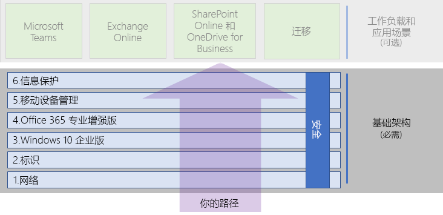

# Microsoft 365 企业版底层基础结构Microsoft 365 Enterprise foundation infrastructure

如果你是自行端到端部署 Microsoft 365 企业版，则应首先奠定坚实的基础，在此基础上，应用程序和服务可以在安全的环境中激发创造力和提高团队协作。If you're doing the end-to-end deployment of Microsoft 365 Enterprise yourself, you should first build a firm foundation upon which applications and services can unlock creativity and teamwork in a secure environment. 该底层有时称为*核心部署*。This foundation is sometimes referred to as the core deployment.

对于为部署定义的端到端路径，你可以使用这些阶段来规划和部署 Microsoft 365 企业版的底层基础结构：For a defined end-to-end path for deployment, you can use these phases to plan for and deploy the foundation infrastructure of Microsoft 365 Enterprise:

| | 阶段Phase | 结果Results |
|:-------|:-----|:-----|
||[阶段 1：网络Phase 1: Networking](networking-infrastructure.md)| 网络已经过优化，以便访问 Microsoft 365 基于云的服务。Your network is optimized for access to Microsoft 365's cloud-based services. |
||[阶段 2：标识Phase 2: Identity](identity-infrastructure.md)| 管理员帐户受到保护，用户和组经过同步，并且采用强用户身份验证。Your admin accounts are protected, your users and groups are synchronized, and your user authentication is strong. |
||[阶段 3：Windows 10 企业版Phase 3: Windows 10 Enterprise](windows10-infrastructure.md)| 现有基于 Windows 的计算机可以升级至 Windows 10 企业版，并且新设备已安装了 Windows 10 企业版。Your existing Windows-based computers can upgrade to Windows 10 Enterprise and new devices are installed with Windows 10 Enterprise. |
||[阶段 4：Office 365 专业增强版Phase 4: Office 365 ProPlus](office365proplus-infrastructure.md)| 现有 Microsoft Office 用户可以升级到 Office 365 专业增强版。Your existing users of Microsoft Office can upgrade to Office 365 ProPlus. |
||[阶段 5：移动设备管理Phase 5: Mobile device management](mobility-infrastructure.md)| 可以注册和管理你的设备。Your devices can be enrolled and managed. |
||[阶段 6：信息保护Phase 6: Information protection](infoprotect-infrastructure.md)| Office 365 安全功能已启用，你的标签和策略已准备好保护文档和电子邮件。Office 365 security features are enabled and your sensitivity or Azure Information Protection labels are ready to protect documents. |

将从最基本的阶段（网络和标识）开始，然后创建基础结构设置和组层，以：The phases start with the most foundational (networking and identity), and then create layers of infrastructure settings and groups to:

- 在设备上安装最新、最安全的 Windows 版本，并保证其处于最新状态。Install the most current and secure version of Windows on your devices.
- 在设备上安装最新的 Microsoft Office 版本，并保证其处于最新状态。Install the most current version of Microsoft Office on your devices and keep it current.
- 管理组织的设备及其对应用的访问。Manage your organization's devices and their access to apps.
- 保护这些设备和云中的信息。Protect the information on those devices and in the cloud.

但是，你可以灵活地配置和部署阶段中的各个阶段和步骤，以满足你的 IT 资源和业务需求。However, you have the flexibility of configuring and rolling out the phases or steps within phases to fit your IT resources and business needs.

- **如果你是较小或较新的组织**，请根据需要按照各个阶段操作，以便有条不紊地构建基础结构。**If you are a smaller or newer organization**, follow the phases as needed to methodically build out your infrastructure. 有关针对非企业的简化部署，请单击[此处](deploy-foundation-infrastructure-non-enterprises.md)。For a simplified deployment for non-enterprises, click [here](deploy-foundation-infrastructure-non-enterprises.md).

-  **如果你是企业组织**，请将阶段视作 IT 基础架构的层，而不是定义的路径，并确定如何更好地工作，以最终满足组织中每个层的要求。**If you are an enterprise organization**, view the phases as layers of IT infrastructure, rather than a defined path, and determine how to best work toward eventual adherence to the requirements for each layer across your organization.

在每个阶段结束时，你可以检查其*退出条件*，其中包括必须满足的必要条件以及可以考虑的可选条件。At the end of each phase, you should examine its exit criteria, which include required conditions that you must meet and optional conditions to consider. 每个阶段的退出条件可确保本地和云基础结构以及相应的端到端配置满足 Microsoft 365 企业版部署的要求。Exit criteria for each phase ensures that your on-premises and cloud infrastructure and resulting end-to-end configuration meet the requirements for a Microsoft 365 Enterprise deployment.

如需查看内容的组织方式，请观看此短片。To see how the content is structured, watch this short video.

> [!VIDEO https://www.microsoft.com/videoplayer/embed/RE23VRG]

以下是 Microsoft 365 企业版整体部署指南中的底层基础结构：Here's the foundation infrastructure in the overall Microsoft 365 Enterprise deployment guide:

## 概览At-a-glance

[Microsoft 365 企业版底层基础结构海报](media/deploy-foundation-infrastructure/Microsoft365EnterpriseFoundInfra.pdf)是一个可查看各阶段相关情况的中心位置：The [Microsoft 365 Enterprise foundation infrastructure poster](media/deploy-foundation-infrastructure/Microsoft365EnterpriseFoundInfra.pdf) is a central location for you to view, for each phase:

- 所处阶段对管理员和用户的整体目标The overall goals of the phase for administrators and users
- 服务、功能和工具The services, features, and tools
- 针对规划的关键设计决策The key design decisions for planning
- 配置结果The configuration results
- 新用户的载入进度The process for onboarding a new user
- 监视和更新方式How to monitor and update

要下载海报副本，请单击[此处](https://github.com/MicrosoftDocs/microsoft-365-docs/raw/public/microsoft-365/enterprise/media/deploy-foundation-infrastructure/Microsoft365EnterpriseFoundInfra.pdf)。To download a copy of the poster, click [here](https://github.com/MicrosoftDocs/microsoft-365-docs/raw/public/microsoft-365/enterprise/media/deploy-foundation-infrastructure/Microsoft365EnterpriseFoundInfra.pdf).

## 基础结构配置与用户部署Infrastructure configuration vs. user rollout

底层基础结构是一组经过配置的软件和服务，如果针对某一用户将它们组合到一起，可以充分利用 Microsoft 365 企业版具有的全部功能和保护。The foundation infrastructure is a set of configured software and services that, when combined together for a user, allow them to take advantage of the entire spectrum of capabilities and protections that Microsoft 365 Enterprise offers. 端到端部署旅程的最终目标是将此基础结构应用于所有用户及其基于 Windows 的设备。The ultimate destination of your end-to-end deployment journey is to have this infrastructure apply to all of your users and their Windows-based devices. 

但是，必须注意的是，Microsoft 365 企业版底层基础结构与为用户部署软件和服务是不相关的。However, it is important to note that the Microsoft 365 Enterprise foundation infrastructure is independent of the rollout of software and services to your users. ***你可以配置底层基础结构层，而无需将这些曾部署到所有用户中。******You can configure the layers of the foundation infrastructure without having to roll out those layers to all of your users.***

可在将元素部署到组织办公室、区域或部门的众多用户之前配置、测试和试用底层基础结构的元素。Therefore, it is possible to configure, test, and pilot elements of the foundation infrastructure well ahead of the rollout of those elements to the multitude of your users in the offices, regions, or divisions of your organization.

例如，你可以为以下对象创建设置：For example, you create the settings for:

| 阶段Phase | 结果Results |
|:-------|:-----|
| 标识Identity | 帐户同步和适用于基于条件访问策略的组。Account synchronization and groups for identity-based conditional access policies. |
| Windows 10 企业版Windows 10 Enterprise | 将运行 Windows 7 或 Windows 8.1 的计算机自动升级到相应的 Windows 10 企业版的组。Groups to automatically upgrade computers running Windows 7 or Windows 8.1 to Windows 10 Enterprise in place. |
| Office 365 专业增强版Office 365 ProPlus | 为使用 Office 2010、Office 2013 或 Office 2016 的用户自动部署 Office 365 的组。Groups to automatically deploy Office 365 ProPlus for users with Office 2010, Office 2013, or Office 2016. |
| 移动设备管理Mobile device management | 适合于设备注册和基于设备的条件访问策略的组。Groups for device enrollment and device-based conditional access policies. |
| 信息保护Information protection | Office 365 敏感度标签组。Groups for Office 365 sensitivity labels. |

准备好为用户部署此基础结构的元素时，你可以：When you are ready to rollout elements of this infrastructure to users, you:

| 阶段Phase | 部署操作Rollout action |
|:-------|:-----|
| 标识Identity | 将用户帐户添加到基于标识的条件访问策略组。Add user accounts to the groups for identity-based conditional access policies. |
| Windows 10 企业版Windows 10 Enterprise | 将帐户添加到组，以便为使用 Windows 7 或 Windows 8.1 的用户自动部署 Windows 10 企业版。Add accounts to the groups to automatically deploy Windows 10 Enterprise in place for users with Windows 7 or Windows 8.1. |
| Office 365 专业增强版Office 365 ProPlus | 将用户帐户添加到组，以便为使用 Office 2010、Office 2013 或 Office 2016 的用户自动部署 Office 365 的组。Add user accounts to the groups to automatically deploy Office 365 ProPlus for users with Office 2010, Office 2013, or Office 2016. |
| 移动设备管理Mobile device management | 将帐户添加到适合于设备注册和基于设备的条件访问策略的组。Add accounts to the groups for device enrollment and device-based conditional access policies. |
| 信息保护Information protection | 将用户帐户添加到敏感度标签组中。Add user accounts to the groups for Information Protection labels. |

底层基础结构的阶段或元素完成、测试和试用之后，你可以为用户部署已安装的软件（例如 Windows 10 企业版和 Office 365 专业增强版）以及基于云的服务和保护（如设备注册和条件访问策略），以最适合你的业务目标和 IT 资源。Once the foundation infrastructure is completed, tested, and piloted, you can roll out installed software, such as Windows 10 Enterprise and Office 365 ProPlus, and cloud-based services and protections, such as device enrollment and conditional access policies, to your users in the manner that best fits your business goals and IT resources.

## 部署和项目管理策略Deployment and project management strategies

若要就如何为组织的试点用户和其他用户进对底层基础结构的不同阶段进行项目管理给出一些看法，请参阅[部署战略](deployment-strategies-microsoft-365-enterprise.md)。To give you some ideas on how to approach the project management of the different phases of the foundation infrastructure for pilot users and the rest of your organization, see [deployment strategies](deployment-strategies-microsoft-365-enterprise.md).

## 针对非企业的部署Deployment for non-enterprises

如果你的组织规模较小，而 Microsoft 365 商业版不适合你，请参阅[针对非企业的部署](deploy-foundation-infrastructure-non-enterprises.md)以了解简化的部署方法。If your organization is smaller and Microsoft 365 Business is not suitable for you, see [deployment for non-enterprises](deploy-foundation-infrastructure-non-enterprises.md) for a simplified deployment method.

## 后续步骤Next step

| 我当前的境况Where I am | 我需要达成的目标Where I need to go |
|:-------|:-----|
| 我现在有针对 Office 365、企业移动性 + 安全性 (EMS) 或 Windows 10 企业版的基础结构。I have existing infrastructure for Office 365, Enterprise Mobility + Security (EMS), or Windows 10 Enterprise: | 请首先利用现有基础结构部署，了解各阶段的退出条件。Start with [Deploy with existing infrastructure](deploy-with-existing-infrastructure.md), which steps you through the exit criteria for each phase. |
| 我要作为企业从头开始I'm starting from scratch as an enterprise | 通过[阶段 1：网络](networking-infrastructure.md)开启你的端到端部署旅程。Begin your end-to-end deployment journey with [Phase 1: Networking](networking-infrastructure.md). |
| 我要以非企业的身份从头开始I'm starting from scratch as a non-enterprise | 通过[针对非企业的部署](deploy-foundation-infrastructure-non-enterprises.md)开启你的端到端部署旅程。Begin your end-to-end deployment journey with [Deployment for non-enterprises](deploy-foundation-infrastructure-non-enterprises.md). |
