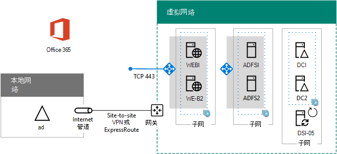

# 在 Azure 中为 Microsoft 365 部署高可用性联合身份验证

本文包含指向使用这些虚拟机在 Azure 基础结构服务中为 Microsoft Microsoft 365 部署高可用性联合身份验证的分步说明的链接：
  
- 两个 Web 应用程序代理服务器
    
- 两个 Active Directory 联合身份验证服务 (AD FS) 服务器
    
- 两个副本域控制器
    
- 一个运行 Azure AD Connect 的目录同步服务器
    
下面是包含每个服务器的占位符名称的配置。
  
**Azure 中用于 Microsoft 365 基础结构的高可用性联合身份验证**

  
所有虚拟机都位于一个跨界 Azure 虚拟网络 (VNet) 中。 
  
> [!NOTE]
> 各个用户的联合身份验证不依赖任何本地资源。不过，如果跨界连接变得不可用，VNet 中的域控制器将无法接收本地 Active Directory 域服务 (AD DS) 中执行的用户帐户和组更新。若要确保此问题不会发生，可以为跨界连接配置高可用性设置。有关详细信息，请参阅[高可用性跨界连接与 VNet 到 VNet 连接](/azure/vpn-gateway/vpn-gateway-highlyavailable)
  
用于特定角色的每对虚拟机都位于自己的子网和可用性集中。
  
> [!NOTE]
> 由于此 VNet 连接到本地网络，所以此配置不包括管理子网上的跳转框或监视虚拟机。有关详细信息，请参阅 [Running Windows VMs for an N-tier architecture](/azure/guidance/guidance-compute-n-tier-vm)（运行用于 N 层体系结构的 Windows VM）。 
  
此配置的结果是，您将对 Microsoft 365 用户进行联合身份验证，在此身份验证中，他们可以使用其 AD DS 凭据（而不是 Microsoft 365 帐户）登录。 联合身份验证基础结构使用冗余的一组服务器，它们更易于在 Azure 基础结构服务（而非本地边缘网络）中进行部署。
  
## 物料清单

此基线配置需要以下 Azure 服务和组件集：
  
- 七个虚拟机
    
- 一个具有四个子网的跨界虚拟网络
    
- 四个资源组
    
- 三个可用性集
    
- 一个 Azure 订阅
    
这里是针对此配置的虚拟机及其默认大小。
  
|**项**|**虚拟机说明**|**Azure 库图像**|**默认大小**|
|:-----|:-----|:-----|:-----|
|1.    |第一个域控制器    |Windows Server 2016 Datacenter    |D2    |
|2.    |第二个域控制器    |Windows Server 2016 Datacenter    |D2    |
|3.    |Azure AD Connect 服务器    |Windows Server 2016 Datacenter    |D2    |
|4.    |第一个 AD FS 服务器    |Windows Server 2016 Datacenter    |D2    |
|5.    |第二个 AD FS 服务器    |Windows Server 2016 Datacenter    |D2    |
|6.    |第一个 Web 应用程序代理服务器    |Windows Server 2016 Datacenter    |D2    |
|7.    |第二个 Web 应用程序代理服务器    |Windows Server 2016 Datacenter    |D2    |
   
若要计算此配置的估算成本，请参阅 [Azure 定价计算器](https://azure.microsoft.com/pricing/calculator/)
  
## 部署阶段

在以下阶段部署此工作负载：
  
- [阶段 1：配置 Azure](high-availability-federated-authentication-phase-1-configure-azure.md)。创建资源组、存储帐户、可用性集和跨界虚拟网络。
    
- [阶段 2：配置域控制器](high-availability-federated-authentication-phase-2-configure-domain-controllers.md)。 创建和配置副本 AD DS 域控制器和目录同步服务器。
    
- [阶段 3：配置 AD FS 服务器](high-availability-federated-authentication-phase-3-configure-ad-fs-servers.md)。创建和配置两个 AD FS 服务器。
    
- [阶段 4：配置 Web 应用程序代理](high-availability-federated-authentication-phase-4-configure-web-application-pro.md)。创建和配置两个 Web 应用程序代理服务器。
    
- [第 5 阶段：为](high-availability-federated-authentication-phase-5-configure-federated-authentic.md)Microsoft 365 配置联合身份验证。 为订阅配置Microsoft 365身份验证。
    
这些文章提供了预定义体系结构的规范性分阶段指南，以在 Azure 基础结构服务中为 Microsoft 365 创建功能、高可用性联合身份验证。 请注意下列事项：
  
- 如果你是有经验的 AD FS 实施者，则可以自由调整第 3 阶段和第 4 阶段的说明，构建最符合你需求的服务器集。
    
- 如果你已经拥有现有的 Azure 混合云部署以及现有的跨界虚拟网络，则可以随意调整或跳过第 1 阶段和第 2 阶段中的说明，并将 AD FS 和 Web 应用程序代理服务器置于相应的子网上。
    
若要构建开发/测试环境或此配置的概念证明，请参阅联合标识[Microsoft 365开发/测试环境](federated-identity-for-your-microsoft-365-dev-test-environment.md)。
  
## 后续步骤

使用[阶段 1：配置 Azure](high-availability-federated-authentication-phase-1-configure-azure.md) 开始配置此工作负载。 
