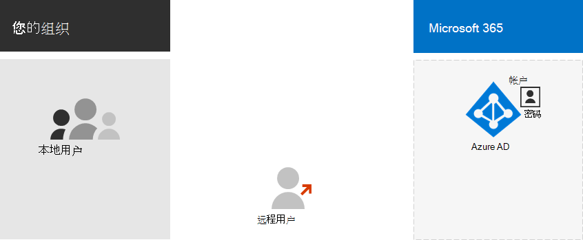
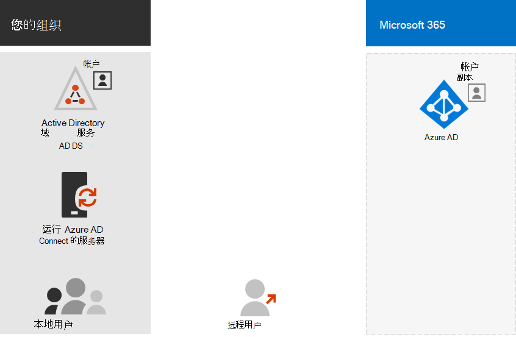
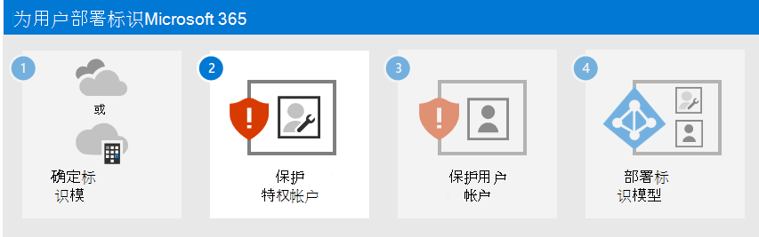

# 步骤 1. 确定云标识模型

Microsoft 365使用 Azure Active Directory (Azure AD) ，这是一种基于云的用户标识和身份验证服务，包含在 Microsoft 365 订阅中，用于管理 Microsoft 365 的标识和身份验证。 正确配置标识基础结构对于管理Microsoft 365用户访问权限和权限至关重要。

开始之前，请观看此视频，以获取 Microsoft 365 身份模型和身份验证的概述。

 

> [!VIDEO https://www.microsoft.com/videoplayer/embed/RE2Pjwu]

你的第一个规划选择是云标识模型。

## Microsoft 云标识模型

若要规划用户帐户，首先需要了解 Microsoft 365 中的两个标识Microsoft 365。 你可以仅在云中维护组织的标识，也可以维护本地 Active Directory 域服务 (AD DS) 标识，并使用它们在用户访问 Microsoft 365 云服务时进行身份验证。

下面是两种类型的标识及其最佳匹配和优势。

| 属性 | 仅限云标识 | 混合标识 |
|:-------|:-----|:-----|
| **定义** | 用户帐户仅存在于 Azure AD 订阅的 Microsoft 365 租户中。 | 用户帐户存在于 AD DS 中，并且副本也位于 Azure AD 订阅的 Microsoft 365 租户中。 用户中的用户帐户Azure AD已哈希 AD DS 用户帐户密码的哈希版本。 |
| **如何Microsoft 365用户凭据进行身份验证** | Azure AD订阅的 Microsoft 365 租户使用云标识帐户执行身份验证。 | Azure AD订阅的 Microsoft 365 租户处理身份验证过程或将用户重定向到其他标识提供程序。 |
| **最适用于** | 没有或不需要本地 AD DS 的组织。 | 使用 AD DS 或其他标识提供程序的组织。 |
| **最大优势** | 易于使用。 无需额外的目录工具或服务器。 | 在访问本地或基于云的资源时，用户可以使用相同的凭据。 |
||||

## 仅限云标识

仅限云标识使用仅存在于 Azure AD 中的用户帐户。 仅云标识通常由没有本地服务器或不使用 AD DS 管理本地标识的小组织使用。

以下是仅云标识的基本组件。

本地和远程 (联机) 用户使用其Azure AD用户帐户和密码访问 Microsoft 365 云服务。 Azure AD 根据其存储的用户帐户和密码对用户凭据进行身份验证。

### 管理
由于用户帐户仅存储在Azure AD中，因此您可以使用诸如 Microsoft 365 管理中心 和 Windows PowerShell 等工具管理[云标识](manage-user-accounts-and-licenses-with-microsoft-365-powershell.md)。

## 混合标识

混合标识使用源自本地 AD DS 的帐户，这些帐户在 Azure AD 订阅的 Microsoft 365 租户中具有副本。 大多数更改（特定 [帐户属性](/azure/active-directory/hybrid/reference-connect-sync-attributes-synchronized)除外）仅单向流动。 对 AD DS 用户帐户所做的更改将同步到其Azure AD。

Azure AD 连接提供正在进行的帐户同步。 它在本地服务器上运行，检查 AD DS 中的更改，将这些更改转发到Azure AD。 Azure AD 连接可以筛选哪些帐户已同步，以及是否同步哈希版本的用户密码（称为密码哈希同步 (PHS) 。

实现混合标识时，本地 AD DS 是指帐户信息权威源。 这意味着您主要在本地执行管理任务，这些任务随后会同步到Azure AD。

下面是混合标识的组件。

Azure AD租户具有 AD DS 帐户的副本。 在此配置中，访问云服务Microsoft 365本地和远程用户Azure AD。

> [!NOTE]
> 您始终需要使用 Azure AD 连接同步混合标识的用户帐户。 您需要同步用户帐户才能Azure AD许可证分配和组管理、配置权限以及涉及用户帐户的其他管理任务。

### 混合标识和目录同步Microsoft 365

混合标识模型和目录同步是采用混合标识的企业客户最常用的选择，具体取决于业务需求和技术Microsoft 365。 目录同步允许您管理 Active Directory 域服务 (AD DS) 中的标识，并且用户帐户、组和联系人的所有更新将同步到 Microsoft 365 订阅的 Azure Active Directory (Azure AD) 租户。

>[!Note]
>首次同步 AD DS 用户帐户时，不会自动为其分配 Microsoft 365 许可证，并且无法访问 Microsoft 365 服务，如电子邮件。 您必须先为其分配使用位置。 然后，通过组成员身份单独或动态地向这些用户帐户分配许可证。
>

#### 混合标识的身份验证

使用混合标识模型时有两种类型的身份验证：

- 托管身份验证

  Azure AD密码的本地存储哈希版本处理身份验证过程，或将凭据发送到本地软件代理以通过本地 AD DS 进行身份验证。

- 联合身份验证

  Azure AD请求身份验证的客户端计算机重定向到另一个标识提供程序。

#### 托管身份验证

有两种类型的托管身份验证：

- PHS (密码哈希) 

  Azure AD执行身份验证本身。

- 直通身份验证 (PTA)

  Azure AD AD DS 执行身份验证。

##### PHS (密码哈希) 

借助 PHS，你可以将 AD DS 用户帐户Microsoft 365并在本地管理用户。 用户密码哈希从 AD DS 同步到Azure AD以便用户在本地和云中具有相同的密码。 这是在客户端中为 AD DS 标识启用Azure AD。 

在本地更改或重置密码时，新的密码哈希将同步到 Azure AD 以便你的用户始终可以使用相同的密码来访问云资源和本地资源。 用户密码从不发送到以Azure AD或以Azure AD格式存储在用户密码中。 某些高级功能Azure AD（如 Identity Protection）需要 PHS，而不考虑选择哪种身份验证方法。
  
有关详细信息 [，请参阅选择正确的](/azure/active-directory/hybrid/choose-ad-authn) 身份验证方法。
  
##### 直通身份验证 (PTA)

PTA 通过使用在一个或多个本地服务器上运行的软件代理来直接使用 AD DS 验证用户，为 Azure AD 身份验证服务提供简单的密码验证。 借助 PTA，你可以将 AD DS 用户帐户Microsoft 365本地管理用户。 

PTA 允许用户使用本地帐户和密码登录到本地和 Microsoft 365 资源和应用程序。 此配置直接针对本地 AD DS 验证用户密码，而无需将密码哈希存储在 Azure AD。 

PTA 还适用于具有立即强制执行本地用户帐户状态、密码策略和登录时间的安全要求的组织。 
  
有关详细信息 [，请参阅选择正确的](/azure/active-directory/hybrid/choose-ad-authn) 身份验证方法。
  
##### 联合身份验证

联合身份验证主要用于身份验证要求更复杂的大型企业组织。 AD DS 标识与Microsoft 365同步，并且用户帐户在本地管理。 使用联合身份验证，用户在本地和云中具有相同的密码，他们不需要再次登录，Microsoft 365。 

联合身份验证可以支持其他身份验证要求，如基于智能卡的身份验证或第三方多重身份验证，并且通常当组织具有组织本机不支持的身份验证要求时Azure AD。
 
有关详细信息 [，请参阅选择正确的](/azure/active-directory/hybrid/choose-ad-authn) 身份验证方法。
  
对于第三方身份验证和标识提供程序，本地目录对象可以同步到 Microsoft 365 和云资源访问，这些访问主要由第三方标识提供程序 (IdP) 。 如果您的组织使用第三方联合解决方案，则您可以使用该解决方案为 Microsoft 365 配置登录，但第三方联合解决方案与 Azure AD。
  
有关详细信息[，Azure AD联合兼容性](/azure/active-directory/connect/active-directory-aadconnect-federation-compatibility)列表。
  
### 管理

因为原始和权威用户帐户存储在本地 AD DS 中，所以使用管理 AD DS 时相同的工具管理标识。

请勿使用 Microsoft 365 管理中心 PowerShell Microsoft 365管理 Azure AD 中的同步用户帐户。

## 后续步骤

继续执行步骤 [2](protect-your-global-administrator-accounts.md) 以确保全局管理员帐户的安全。
