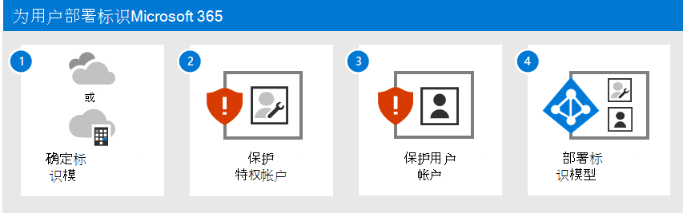
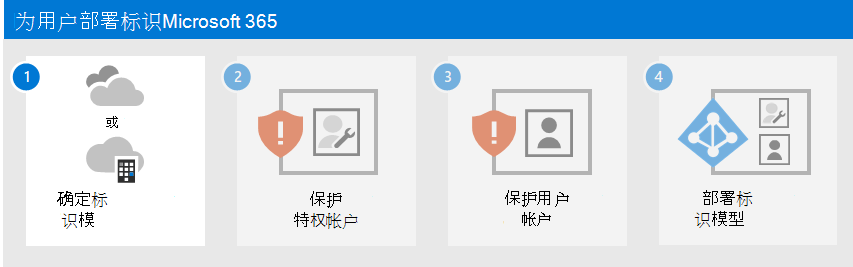

# 为用户部署标识Microsoft 365

在 Microsoft 365 企业版中，精心规划和执行的标识基础结构为增强安全性提供途径，包括将工作效率工作负载及其数据的访问权限限制为仅经过身份验证的用户和设备。 标识安全性是零信任部署的关键元素，在零信任部署中，所有尝试访问本地和云中的资源都经过身份验证和授权。

有关每个企业Microsoft 365标识功能、Azure Active Directory (Azure AD) 角色、本地和基于云的组件以及最常见的身份验证配置的信息，请参阅标识[基础结构海报](../downloads/m365e-identity-infra.pdf)。

查看此两页海报，以快速提升企业版标识概念Microsoft 365配置。

您可以下载 [此海报](https://github.com/MicrosoftDocs/microsoft-365-docs/raw/public/microsoft-365/downloads/m365e-identity-infra.pdf) ，并可以 11 x 17 (以信函、法律或文) 打印。

## 此解决方案中的内容

此解决方案将分步执行为 Microsoft 365 租户部署标识基础结构的步骤，以便为员工提供访问权限并防范基于标识的攻击。

此部署中的步骤如下所述：

1. [确定标识模型。](deploy-identity-solution-identity-model.md)
2. [保护你的Microsoft 365特权帐户。](protect-your-global-administrator-accounts.md)
3. [保护Microsoft 365用户帐户。](microsoft-365-secure-sign-in.md)
4. [部署标识模型。](cloud-only-identities.md)

此解决方案支持零信任 [的关键原则](https://www.microsoft.com/security/business/zero-trust/)：

- **显式验证**：始终根据所有可用数据点进行身份验证和授权。
- **使用最小特权访问**：使用即时和恰好足够的访问 (JIT/JEA)、基于风险的自适应策略和数据保护来限制用户访问权限。
- **假设安全漏洞**：尽量减少波及范围半径和线段访问。 验证端到端加密，并使用分析获取可见性、促进威胁检测和加强防范。

与信任受组织防火墙保护的所有内容的传统 Intranet 访问不同，零信任将每次登录和访问都视为源自不受控制的网络，无论网络受组织防火墙保护还是来自 Internet。 零信任需要保护网络、基础结构、标识、终结点、应用和数据。

## Microsoft 365 特性和功能

Azure AD为租户提供一整套标识管理和Microsoft 365功能。

|功能或特性|说明|许可|
|---|---|---|
|[多重身份验证 (MFA)](/azure/active-directory/authentication/concept-mfa-howitworks)|MFA 要求用户提供两种形式的验证，如用户密码以及来自 Microsoft Authenticator 或电话呼叫的通知。 MFA 大大减少了凭据被盗可用于访问环境的风险。 Microsoft 365使用 Azure AD 多重身份验证服务进行基于 MFA 的登录。|Microsoft 365 E3 或 E5|
|[条件访问](/azure/active-directory/conditional-access/overview)|Azure AD评估用户登录的条件，并使用条件访问策略来确定允许的访问。 例如，在本指南中，我们将向您展示如何创建条件访问策略，以要求设备合规性以访问敏感数据。 这大大降低了具有自己的设备和凭据被盗的黑客访问敏感数据的风险。 它还保护设备的敏感数据，因为设备必须满足运行状况和安全性的特定要求。|Microsoft 365 E3 或 E5|
|[Azure AD组](/azure/active-directory/fundamentals/active-directory-manage-groups)|条件访问策略、使用 Intune 的设备管理，甚至组织中文件和网站的权限都依赖于对用户帐户或组Azure AD分配。 我们建议你创建Azure AD保护级别对应的组。 例如，你的管理人员可能是黑客的更高价值目标。 因此，有必要将这些员工的用户帐户添加到 Azure AD 组，并将该组分配给条件访问策略和其他强制实施更高级别的访问保护的策略。|Microsoft 365 E3 或 E5|
|[Azure AD Identity Protection](/azure/active-directory/identity-protection/overview)|使您可以检测影响组织标识的潜在漏洞，将自动修正策略配置为低、中、高登录风险和用户风险。 本指南依赖于此风险评估，对多重身份验证应用条件访问策略。 本指南还包括条件访问策略，要求用户在检测到其帐户的高风险活动时更改其密码。|Microsoft 365 E5，Microsoft 365 E3 E5 安全加载项、EMS E5 或 Azure AD Premium P2 许可证|
|[SSPR (自助服务密码) ](/azure/active-directory/authentication/concept-sspr-howitworks)|通过提供对管理员可以控制的多种身份验证方法的验证，允许用户安全地重置其密码，而无需支持人员干预。|Microsoft 365 E3 或 E5|
|[Azure AD密码保护](/azure/active-directory/authentication/concept-password-ban-bad)|检测并阻止已知的弱密码及其变体以及特定于您的组织的其他弱术语。 默认全局禁止使用的密码列表将自动应用于 Azure AD 租户中的所有用户。 可在自定义禁止密码列表中定义额外条目。 用户更改或重置其密码时，将检查这些禁止的密码列表，强制使用强密码。|Microsoft 365 E3 或 E5|
|

## 后续步骤

使用以下步骤为租户部署标识模型和Microsoft 365基础结构：

1. [确定云标识模型。](deploy-identity-solution-identity-model.md)
2. [保护你的Microsoft 365特权帐户。](protect-your-global-administrator-accounts.md)
3. [保护Microsoft 365用户帐户。](microsoft-365-secure-sign-in.md)
4. 部署云标识模型：[仅云或](cloud-only-identities.md)[混合](prepare-for-directory-synchronization.md)。

  
## 其他 Microsoft 云标识资源

### 管理

若要管理 Microsoft 云标识部署，请参阅：

- [用户帐户](manage-microsoft-365-accounts.md)
- [许可证](assign-licenses-to-user-accounts.md)
- [密码](manage-microsoft-365-passwords.md)
- [组](manage-microsoft-365-groups.md)
- [管理](manage-microsoft-365-identity-governance.md)
- [目录同步](view-directory-synchronization-status.md)

### Microsoft 如何为用户Microsoft 365

了解 Microsoft 的 IT 专家如何[管理标识和安全访问](https://www.microsoft.com/en-us/itshowcase/managing-user-identities-and-secure-access-at-microsoft)。

>[!Note]
>此 IT 展示资源仅提供英文版。
>

### Contoso 如何标识Microsoft 365

有关虚构但具有代表性的跨国组织如何为云服务部署混合标识基础结构Microsoft 365，请参阅 [Contoso Corporation 的标识](contoso-identity.md)。

<!--

## Plan

To plan for your identity implementation:

- [Understand the different identity models](about-microsoft-365-identity.md)
- [Plan for hybrid identity and directory synchronization](plan-for-directory-synchronization.md)

## Deploy

To deploy your identity implementation:

- [Protect your global administrator accounts](protect-your-global-administrator-accounts.md)
- [Configure and use cloud-only identities](cloud-only-identities.md)
- [Configure and use hybrid identities](prepare-for-directory-synchronization.md)
- [Set up directory synchronization](set-up-directory-synchronization.md)
- If needed, deploy [hybrid identity scenarios](hybrid-solutions.md)

### Identity and device access recommendations

To help ensure a secure and productive workforce, Microsoft provides a set of recommendations for [identity and device access](../security/office-365-security/microsoft-365-policies-configurations.md). For identity, use the recommendations and settings in these articles:

- [Prerequisites](../security/office-365-security/identity-access-prerequisites.md)
- [Common identity and device access policies](../security/office-365-security/identity-access-policies.md)

--> 
