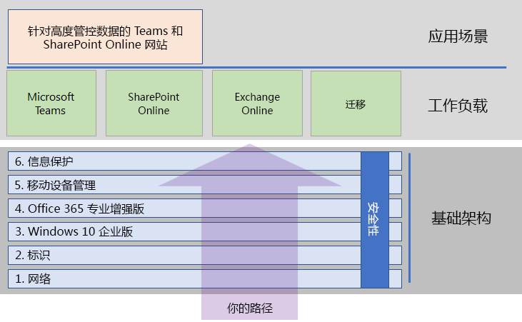

# 部署 Microsoft 365 企业版

Microsoft 365 企业版是本地和基于云的生产力应用和服务与 Windows 10 企业版的组合：  

- 具有智能安全性。
- 集成式，更简单。
- 激发创造力。
- 专用于团队合作。

可通过包含一流安全服务和功能的集成方式部署基础结构和生产力工作负载，将这些优势变成现实。

部署 Microsoft 365 企业版的三种主要方式如下：

- 使用 [FastTrack for Microsoft 365](#fasttrack-for-microsoft-365) 与 Microsoft 工程师一起部署。
- 在 Microsoft 咨询服务或 [Microsoft 合作伙伴](https://partner.microsoft.com/)的协助下部署。
- 使用 [Microsoft 365 企业版部署指南](#microsoft-365-enterprise-deployment-guide)自行部署。

## FastTrack for Microsoft 365

FastTrack 的优势在于持续且可重复（*可作为订阅的一部分免费提供*），由 Microsoft 工程师提供以帮助你按自己的节奏移动到云。 此外，FastTrack 还可使你根据需要访问合格的合作伙伴以获取其他服务。 目前为止，40,000 多个客户已启用此功能，FastTrack 可帮助最大化投资回报率、加快部署，提高整个组织的采用率。 请参阅 [FastTrack for Microsoft 365](https://fasttrack.microsoft.com/microsoft365)。

如果想要充分利用 FastTrack 来部署 Microsoft 365 企业版，可以使用 FastTrack [Microsoft 365 部署顾问](https://aka.ms/microsoft365setupguide)了解如何部署和设置底层基础结构。 必须以 Office 365 或 Microsoft 365 租户中的全局管理员身份登录才能访问此页面。

利用[此处](https://fasttrack.microsoft.com/microsoft365)的 FastTrack 开启你的端对端部署旅程吧。

## Microsoft 365 企业版部署指南

Microsoft 365 企业版部署指南可指导你完成 Microsoft 365 企业版产品和功能的适当和必需配置。

若要自行部署 Microsoft 365 企业版，请：

- 针对内置安全性和集成部署所需的[底层基础架构](deploy-foundation-infrastructure.md)，以简化管理，从而可更轻松地确保使用最新生产力和安全增强功能更新客户端软件。 
 
  底层基础架构将以一系列编号阶段的形式组织，它们建立在彼此的基础上，适合于支持 Microsoft 365 企业版工作负载和场景的环境。 

  **如果你是较小或较新的组织**，请按照各个阶段操作，以便有条不紊地构建基础架构。

  但是，你可以根据需要以任何顺序（[逐个部署或者并行部署](deployment-strategies-microsoft-365-enterprise.md)）部署所有或部分阶段，以便与当前的基础架构集成，适用于你的 IT 计划和资源并满足你的业务需求。 有关针对非企业的简化部署，请单击[此处](deploy-foundation-infrastructure-non-enterprises.md)。

  **如果你是企业组织**，请将阶段视作 IT 基础架构的层，而不是定义的路径，并确定如何更好地工作，以最终满足组织中每个层的要求。

- 在基础架构上面部署关键生产力[工作负载和应用场景](deploy-workloads.md)。 这些将会激发组织的创造力，有利于团队协作。

以下是底层基础架构与工作负载与应用场景之间的关系。

工作负载和应用场景在底层基础架构上面运行。 但是，无需构建所有底层基础架构即可开始使用工作负载，以提高生产力和协作。

从[此处](deploy-foundation-infrastructure.md)开始你的端对端部署旅程吧。

## 试用体验版

“*对于我们先学才能做的事，我们边做边学。*” - 亚里士多德

如果你不熟悉 Microsoft 365 企业版或某个特定产品或功能，了解它们的最好办法就是亲自构建并看看它是如何工作的。

我们已通过测试实验室指南 (TLG) 对此进行了简化，该指南可以指导你使用试用或付费订阅在简化但具有代表性的测试环境中完成基础架构或功能配置。

使用 TLG，可以自学、演示、自定义或构建复杂配置、工作负载或端到端方案的概念证明 (PoC)。

有关详细信息，请参阅 [Microsoft 365 企业版测试实验室指南](m365-enterprise-test-lab-guides.md)。

## 转换整个组织

要更好地了解如何将整个组织转移到 Microsoft 365 企业版中的产品和服务，请参阅[将你的组织转移到 Microsoft 365](media/deploy-microsoft-365-enterprise/transition-org-to-m365.pdf) 海报。

此海报包含两页内容，可借助它快速盘点现有基础结构并获取有关转移到 Microsoft 365 企业版中相应产品或服务的指南。 它包含 Windows 和 Office 产品，还涵盖了设备管理、标识及信息和威胁防护等其他基础结构和安全元素。

你还可以[下载转换海报](https://github.com/MicrosoftDocs/microsoft-365-docs/raw/public/microsoft-365/enterprise/media/deploy-microsoft-365-enterprise/transition-org-to-m365.pdf)并按 letter、legal 或 tabloid (11 x 17) 格式打印。

## 其他人是怎么做的呢？

使用这些资源了解其他人是如何部署和使用 Microsoft 365 企业版的。

### 客户如何使用 Microsoft 365 企业版

在客户案例网站上查看 Microsoft 客户正在如何使用 Microsoft 365 企业版。

1. 转到 [https://customers.microsoft.com/](https://customers.microsoft.com/) 并单击“**搜索**”。
2. 在左窗格的“**语言**”中选择你的语言。
3. 在“**行业**”中选择你的组织所在的行业。
4. 在“**产品**”中选择 **Microsoft 365**。
5. 单击卡片查看客户的案例研究。

### Microsoft 如何使用 Microsoft 365 企业版

对于每一个致力于培养现代工作场所的领导者来说，打造数字文化是他们的首要任务。 Microsoft 365 旨在支持实现这种文化转变，帮助领导者赋予公司的每个人权力，以释放创造力和促进协作。 正在 Microsoft 基础架构的建立才引发了数字文化的转变。 实施 Microsoft 365 企业版使我们能够部署协作技术，如 Microsoft Teams 和 Exchange Online，并在安全的 SharePoint Intranet 站点之间在线共享敏感数据。

同时，智能安全功能和产品集成有助于简化管理需求，并最大限度地降低整个 IT 生命周期的总体拥有成本。 

了解核心服务工程和运营（以前称为 Microsoft IT）如何[规划和部署基础](https://www.microsoft.com/itshowcase/deploying-and-managing-microsoft-365)，以支持在安全环境中释放创造力和促进团队合作的应用程序和服务。

> [!Note]
> 此网页仅提供英文版本。

### Contoso Corporation 如何部署 Microsoft 365 企业版

Contoso Corporation 是一家虚构但具代表性的全球大型制企业，总部设在法国巴黎。 了解 [Contoso 如何部署 Microsoft 365 企业版](contoso-case-study.md)并且完成了主要设计决策和针对以下方面的实施细节：网络、标识、Windows 10 企业版、Office 365 专业增强版、移动设备管理、信息保护和安全性。 

## 随时了解部署内容

有关内容的最新变化，请参阅[此文章](microsoft-365-deploment-guide-changes.md)。

## 后续步骤

若要通过直接的 Microsoft 协助完成部署，请使用 [FastTrack](https://fasttrack.microsoft.com/microsoft365)。

若要通过顾问完成部署，请与 Microsoft 咨询服务或 [Microsoft 合作伙伴](https://partner.microsoft.com/)联系。

若要自行开始部署，请参阅[底层基础架构](deploy-foundation-infrastructure.md)。
