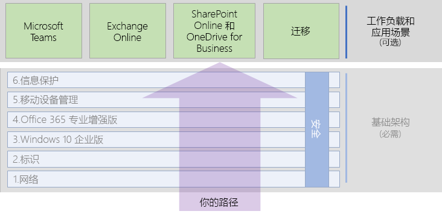

# Microsoft 365 企业版工作负载和方案Microsoft 365 Enterprise workloads and scenarios

为了实现 Microsoft 365 企业版在创造力和团队合作方面的优势，请在基础结构上部署这些工作负载：To realize the creativity and teamwork benefits of Microsoft 365 Enterprise, deploy these workloads and scenarios to operate on the top of your foundation infrastructure:

- [Microsoft TeamsMicrosoft Teams](teams-workload.md)
- [Exchange OnlineExchange Online](exchangeonline-workload.md)
- [SharePoint OnlineSharePoint Online](sharepoint-online-onedrive-workload.md)

有关将整个组织迁移到 Microsoft 365 企业版的常规路线图，请参阅[迁移](migration-microsoft-365-enterprise-workload.md)工作负载，其中包括 Microsoft Office 客户端产品、本地 Office Server 产品和基于 Microsoft Windows 的设备。See the [migration](migration-microsoft-365-enterprise-workload.md) workload for a general roadmap to migrate your entire organization to Microsoft 365 Enterprise, which includes Microsoft Office client products, on-premises Office Server products, and Microsoft Windows-based devices.

这些方案以集成的方式使用 Microsoft 365 企业版中的功能和服务来满足业务需求。Scenarios use features and services from across Microsoft 365 Enterprise in an integrated way to address a business need. 其中一项需求是保护存储在 Microsoft 365 中的高度管控数据。One such need is to protect highly regulated data stored in Microsoft 365. 高度管控数据包括的数字资产：Highly regulated data includes digital assets that are:

- 受地区法规约束。Subject to regional regulations.
- 组织最有价值的数据，例如商业机密、财务或人力资源信息以及组织策略。The most valuable data for your organization, such as trade secrets, financial or human resources information, and organization strategy.

要保护此数据免受内部和外部威胁的影响，请参阅[针对高度管控数据的 Microsoft Teams 和 SharePoint Online 网站](teams-sharepoint-online-sites-highly-regulated-data.md)。To protect this data from internal and external threats, see the instructions in [Microsoft Teams and SharePoint Online sites for highly regulated data](teams-sharepoint-online-sites-highly-regulated-data.md). 此方案将指导你配置 SharePoint Online 网站或 Microsoft Teams 团队，以便安全地存储最有价值的数据。This scenario steps you through configuring a SharePoint Online site or a Microsoft Teams team to securely store your most valuable data.

以下是 Microsoft 365 企业版部署指南中的工作负载和方案：Here are the workloads and scenarios in the overall Microsoft 365 Enterprise deployment guide:

## 基础结构先决条件Foundation infrastructure prerequisites

*理想情况下*，你应该在配置[基础结构](deploy-foundation-infrastructure.md)的所有阶段后部署工作负载和方案。*Ideally*, you should deploy workloads and scenarios after you have configured all of the phases of the [foundation infrastructure](deploy-foundation-infrastructure.md). 这可确保所有基础层设施都准备就绪，以便为用户及其设备提供集成、安全性和最佳体验。This ensures that all of the underlying layers are in place to provide integration, security, and the best experience for your users and their devices.

| 阶段Phase | 结果Result |
|:-------|:-----|
| 网络Network | 你的网络已更新，可以为 Microsoft 365 云服务提供最佳性能。Your network is updated for optimum performance to Microsoft 365 cloud services. |
| 标识Identity | 通过对用户帐户进行强身份验证和保护管理员帐户来同步和保护身份。Identity is synchronized and secured with strong authentication for user accounts and protection for admin accounts. |
| Windows 10 企业版Windows 10 Enterprise | 运行 Windows 7 或 Windows 8.1 的计算机可以升级至 Windows 10 企业版，并且新设备已安装了 Windows 10 企业版。Your computers running Windows 7 or Windows 8.1 can upgrade to Windows 10 Enterprise and new devices are installed with Windows 10 Enterprise. |
| Office 365 专业增强版Office 365 ProPlus | 现有 Microsoft Office 用户可以升级到 Office 365 专业增强版。Your existing users of Microsoft Office can upgrade to Office 365 ProPlus. |
| 移动设备管理Mobile device management | 可以注册和管理你的设备。Your devices can be enrolled and managed. |
| 信息保护Information protection | 已启用 Office 365 安全功能，并且你的敏感度标签或 Azure 信息保护标签已准备好保护文档。Office 365 security features are enabled and your sensitivity or Azure Information Protection labels are ready to protect documents. |

请记住，这是理想方案，可能需要一些时间来规划、配置、测试和试用，尤其是在具有现有基础架构和多个位置的大型组织中。Remember that this is ideal and can take some time to plan for, configure, test, and pilot, especially in large organizations with existing infrastructure and multiple locations. 不必在所有位置部署所有这些层也可快速从 Microsoft 365 企业版中获得业务价值。Putting all of these layers in place in all locations is not necessary for you to more quickly get business value from Microsoft 365 Enterprise. 

以下是一些可立即部署的常见工作负载：Here are some common workloads to deploy right away: 

- 向用户推出基础架构的**标识**层后，许多组织都会部署：After the **Identity** layer of the foundation infrastructure is rolled out to users, many organizations deploy:
  - 与 [OneDrive for Business](https://docs.microsoft.com/onedrive/plan-onedrive-enterprise) 结合使用的 [Office 365 专业增强版](office365proplus-infrastructure.md)。[Office 365 ProPlus](office365proplus-infrastructure.md) combined with [OneDrive for Business](https://docs.microsoft.com/onedrive/plan-onedrive-enterprise). Office 365 专业增强版提供了新式身份验证的安全性和最新 Microsoft Office 客户端的用户体验。Office 365 ProPlus provides the security of modern authentication and the user experience of the latest Microsoft Office client. 将用户的个人文件迁移到 OneDrive for Business 可以减少对基础架构以及为主文件夹和驱动器提供支持的需要。The migration of user's personal files to OneDrive for Business reduces infrastructure and the need to support home folders and drives.
  - [Exchange Online](exchangeonline-workload.md)，以便用户可以开始使用基于云的电子邮件。[Exchange Online](exchangeonline-workload.md) so that users can begin using cloud-based email.
- 如果你不需要在云中存储受到严格监管的数字资产，请在部署**信息保护**层之前为用户部署 [Microsoft Teams](teams-workload.md) 和 [SharePoint Online](sharepoint-online-onedrive-workload.md)。If you don't have an immediate need for storing highly regulated digital assets in the cloud, deploy [Microsoft Teams](teams-workload.md) and [SharePoint Online](sharepoint-online-onedrive-workload.md) for your users prior to the **Information protection** layer.

你必须确定采用何种最佳方式来排序和部署基础架构先决条件阶段的配置，以更好地满足你的业务需求。You must decide on how to best order and deploy the configuration of prerequisite phases of foundation infrastructure to best meet your business needs.

### 最佳做法Best practice

我们强烈建议你在将用户载入任何工作负载或方案之前部署并推出基础架构的**标识**阶段。We highly recommend that you deploy and roll out the **Identity** phase of the foundation infrastructure prior to onboarding your users to any workloads or scenarios.

**标识**阶段可确保基于云的标识（无论是仅限云还是与本地 Active Directory 域服务 (AD DS) 同步）包含用于管理身份验证和访问的用户和计算机帐户及组。The **Identity** phase ensures that your cloud-based identity, whether cloud-only or synchronized with your on-premises Active Directory Domain Services (AD DS), contains the user and computer accounts and groups to manage authentication and access. 将组织的数字资产置于 Microsoft 365 云中之前，需要对所有用户进行强身份验证并为管理员帐户提供强大的保护。Strong authentication for all your users along with strong protection of admin accounts is required before placing your organization's digital assets in the Microsoft 365 cloud.

虽然是基础性的并且对整体性能非常重要，在将用户载入工作负载的过程中，可以在网络上推出**网络**阶段，而你知道 Microsoft 365 应用程序和服务性能将随着时间的推移而提高。Although foundational and very important to overall performance, the rollout of the **Networking** phase on your network can be in progress while onboarding your users to workloads, with the understanding that Microsoft 365 application and service performance will improve over time.

对于具有多个位置、混合边缘设备和 Internet 连接的企业组织尤其如此。This is especially true for enterprise organizations with multiple locations and a mixture of edge devices and Internet connections.
