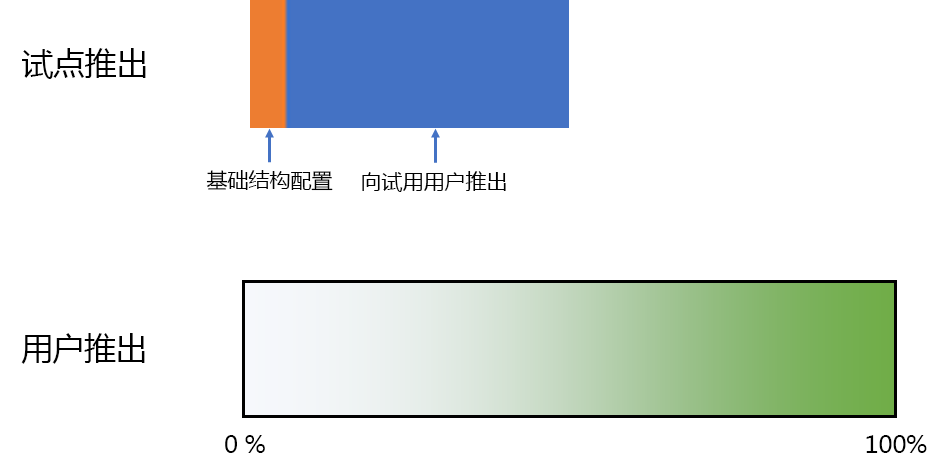
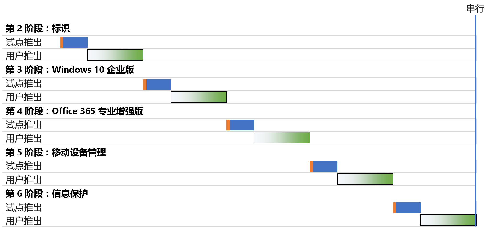
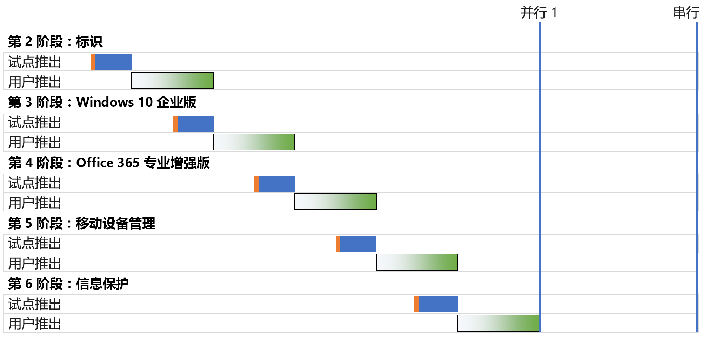
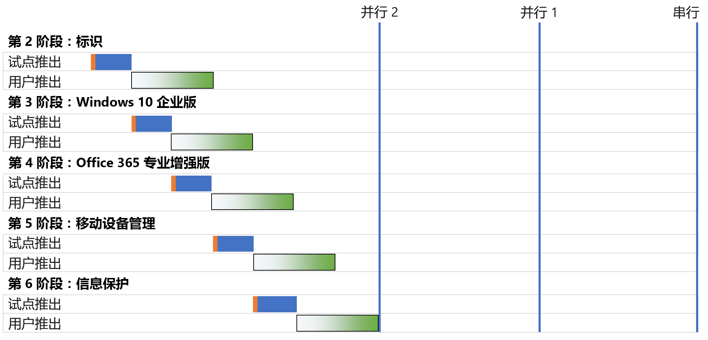
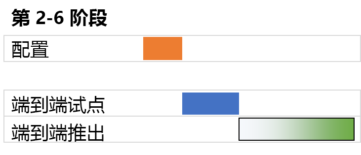

# Microsoft 365 企业版底层基础结构部署策略Microsoft 365 for enterprise foundation infrastructure deployment strategies

你可通过多种方式部署 Microsoft 365 企业版[底层基础结构](deploy-foundation-infrastructure.md)的各个阶段，并向用户推出其功能、软件和服务。为了帮助你快速开始这项工作的项目管理（根据你的组织规模和现有基础结构，此工作可能十分庞大而复杂），请考虑以下部署策略：There are many ways you can deploy the phases of the [foundation infrastructure](deploy-foundation-infrastructure.md) of Microsoft 365 for enterprise and roll out its capabilities, software, and services to your users. To get you started on the project management of this undertaking, which can be large and complex depending on the size of your organization and its existing infrastructure, consider the following deployment strategies:

- 串行部署Serial deployment
- 并行部署与非重叠用户推出Parallel deployment with non-overlapping user rollout
- 并行部署与重叠用户推出Parallel deployment with overlapping user rollout
- 前端基础结构和端到端配置推出Up-front infrastructure and rollout of the end-to-end configuration

使用这些策略可获得有关如何管理整个项目的思路，并更快实现 Microsoft 365 企业版带来的业务优势。Use these strategies for ideas on how to manage the overall project and more quickly realize the business benefits of Microsoft 365 for enterprise.

>[!Note]
>本文做了一些假设和简化，目的是使用一致的方式描述部署策略。这些部署策略是概括性的，并不暗示任何特定的时间范围，也不表示适用于所有组织和情况。This article contains assumptions and simplifications for a consistent way to describe the deployment strategies. These deployment strategies are generalized and are not meant to imply any specific timeframes, nor are they meant to apply to all organizations and situations.
>

## 典型企业组织的 IT 项目管理要素Elements of IT project management for typical enterprise organizations

IT基础结构包括后端服务以及向最终用户推出新功能或改进功能功能或者安装的软件。IT 部门通常采用一种有条理的方式部署 IT 基础结构的元素。成功部署 IT 基础结构元素的一种方法应包括：IT infrastructure includes both backend services and the rollout of new or improved capabilities or installed software to end users. IT departments typically deploy elements of an IT infrastructure in a methodical way. One approach to the successful deployment of an element of IT infrastructure consists of:

- 试点推出A pilot rollout 

  此过程包括初始基础结构配置、向一组试点用户推出、测试以及对基础结构配置进行后续修改。This includes initial infrastructure configuration and rollout to a pilot set of users, testing, and subsequent modifications to the infrastructure configuration.

- 用户推出A user rollout

  此过程包括根据区域、部门、组或其他类型的系统传播配置或软件向组织的其余人员推出。This includes the rollout to the rest of your organization based on regions, departments, groups, or other types of systematic propagation of configuration or software.

试点推出与用户推出中的用户集不同。The set of users in the pilot rollout are not the same as those in the user rollout.

本文使用以下图形来描述这些定义：This article uses the following graphics to depict these definitions: 

 

在用户推出图形中，阴影表示在整个组织内使用结构化或有条理的方法（如组、部门或区域）从 0% 到 100% 的百分比。The shading for the user rollout graphic indicates the percentage across your organization from 0% to 100% using a structured or methodical approach such as groups, departments, or regions.

## 部署策略Deployment strategies

请考虑以下部署策略：Consider the following deployment strategies:

- 串行部署Serial deployment
- 并行部署与非重叠用户推出Parallel deployment with non-overlapping user rollout
- 并行部署与重叠用户推出Parallel deployment with overlapping user rollout
- 前端基础结构和端到端配置推出Up-front infrastructure and rollout of the end-to-end configuration

### 串行部署Serial deployment

通过串行部署，你可以完全推出一个阶段，使该阶段达到面向所有用户的 100% 部署完成度，然后再进入下一个阶段。可采用这种部署方式的一些原因如下：With a serial deployment, you completely roll out a phase, allowing the phase to reach 100% completion of deployment to all of your users, before moving on to the next one. Here are some of the reasons why you might deploy this way:

- 风险缓解Risk mitigation
- 资源分配限制Resourcing constraints
- IT 部门资金周期IT department funding cycles
- IT 技术依赖IT technology dependencies
- 业务变更管理和最终用户阻力Business change management and end-user resistance

以下甘特图显示了 Microsoft 365 企业版基础结构第 2-6 阶段的简化串行部署情况。This Gantt chart shows a simplified serial deployment of phases 2-6 of the foundation infrastructure for Microsoft 365 for enterprise.

 
 
为了简化讨论和示意，假设每个阶段以及每个阶段中的部署细分段花费相同的时间量。To simplify the discussion and example, each phase and deployment segment within each phase are assumed to take the same amount of time.

>[!Note]
>第 1 阶段：Microsoft 365 企业版底层基础结构的网络是仅限于 IT 部门的阶段。用户可受益于与 Microsoft 云资源的优化连接，但不会强制用户实现此目标。Phase 1: Networking of the Microsoft 365 for enterprise Foundation Infrastructure is an IT department-only phase. Users reap the benefits of optimized connectivity to Microsoft’s cloud resources but are not imposed upon to achieve it.
>

下面的例子展示了简单的试点用户体验：Here’s a simplified pilot user experience as an example:

- 12 月，需要使用智能手机进行 MFA。（身份识别）In December, I need to use my smart phone for MFA. (Identity)
- 3 月，在 Windows 8.1 台式机上安装 Windows 10 企业版。（Windows 10 企业版）In March, I get Windows 10 Enterprise installed on my Windows 8.1 desktop. (Windows 10 Enterprise)
- 6 月，我安装了 Office 365 专业增强版，取代 Office 2013。（Office 365 专业增强版）In June, I get Office 365 ProPlus installed, replacing Office 2013. (Office 365 ProPlus)
- 9 月，我进行设备注册并实施应用和设备策略。In September, I get device enrollment and app and device policies applied. （移动设备管理）(Mobile device management)
- 12 月，我安装了 Azure 信息保护客户端，并接受关于如何将标签应用于文档的培训。（信息保护）In December, I get the Azure Information Protection client installed and get trained on how to apply labels to documents. (Information protection)

结果是在连续的试点推出之间保持 90 天节奏。The result is a 90-day cadence between successive pilot rollouts.

下面的例子展示了简单的最终用户体验：Here’s a simplified end-user experience as an example:

- 1 月，需要使用智能手机进行 MFA。（身份识别）In January, I need to use my smart phone for MFA. (Identity)
- 4 月，在 Windows 8.1 台式机上安装 Windows 10 企业版。（Windows 10 企业版）In April, I get Windows 10 Enterprise installed on my Windows 8.1 desktop. (Windows 10 Enterprise)
- 7 月，我安装了 Office 365 专业增强版，取代 Office 2013。（Office 365 专业增强版）In July, I get Office 365 ProPlus installed, replacing Office 2013. (Office 365 ProPlus)
- 10 月，我进行设备注册并实施应用和设备策略。In October, I get device enrollment and app and device policies applied. （移动设备管理）(Mobile device management)
- 明年 1 月，我安装了 Azure 信息保护客户端，并接受关于如何将标签应用于文档的培训。（信息保护）In January of the following year, I get the Azure Information Protection client installed and get trained on how to apply labels to documents. (Information protection)

结果是在连续的用户推出之间保持 90 天节奏。The result is a 90-day cadence between successive user rollouts.

此部署策略的缺点是完全部署 Microsoft 365 企业版底层基础结构可能需要很长时间。The disadvantage to this deployment strategy is that it can take a long time to fully deploy the Microsoft 365 for enterprise foundation infrastructure.

### 并行部署与非重叠用户推出（并行 1）Parallel deployment with non-overlapping user rollout (Parallel 1)

对于此部署策略，你将在当前阶段的用户推出的最后一部分期间开始下一阶段的试点推出。以下是前一阶段的用户推出即将结束期间执行试点推出时的第 2-6 阶段的部署。For this deployment strategy, you start the pilot rollout of the next phase during the last part of the user rollout of the current phase. Here is the deployment of phases 2-6 when the pilot rollout occurs as the user rollout of the previous phase is wrapping up.

 
 
最终结果是，当前阶段的用户推出将在整个组织中完成，然后启动下一个阶段。不在试点推出中的用户不会同时处理多个阶段的推出，但试点推出与用户推出并行完成。The end result is that user rollout for the current phase completes across your organization before the next one starts. Users that are not in pilot rollouts are not dealing with the rollouts of multiple phases at the same time, but pilot rollouts are done in parallel with user rollouts.

下面的例子展示了简单的试点用户体验：Here’s a simplified pilot user experience as an example:

- 12 月，我需要使用智能手机进行 MFA。（身份识别）In December, I need to use my smart phone for MFA. (Identity)
- 2 月，我在 Windows 8.1 台式机上安装了 Windows 10 企业版。（Windows 10 企业版）In February, I get Windows 10 Enterprise installed on my Windows 8.1 desktop. (Windows 10 Enterprise)
- 4 月，我安装了 Office 365 专业增强版，取代 Office 2013。（Office 365 专业增强版）In April, I get Office 365 ProPlus installed, replacing Office 2013. (Office 365 ProPlus)
- 6 月，我进行设备注册并实施应用和设备策略。In June, I get device enrollment and app and device policies applied. （移动设备管理）(Mobile device management)
- 8 月，我安装了 Azure 信息保护客户端，并接受关于如何将标签应用于文档的培训。（信息保护）In August, I get the Azure Information Protection client installed and get trained on how to apply labels to documents. (Information protection)

结果是在连续的试点推出之间保持 60 天节奏。The result is a 60-day cadence between successive pilot rollouts.

下面的例子展示了简单的最终用户体验：Here’s a simplified end-user experience as an example:

- 1 月，我需要使用智能手机进行 MFA。（身份识别）In January, I need to use my smart phone for MFA. (Identity)
- 3 月，我在 Windows 8.1 台式机上安装了 Windows 10 企业版。（Windows 10 企业版）In March, I get Windows 10 Enterprise installed on my Windows 8.1 desktop. (Windows 10 Enterprise)
- 5 月，我安装了 Office 365 专业增强版，取代 Office 2013。（Office 365 专业增强版）In May, I get Office 365 ProPlus installed, replacing Office 2013. (Office 365 ProPlus)
- 7 月，我进行设备注册并实施应用和设备策略。In July, I get device enrollment and app and device policies applied. （移动设备管理）(Mobile device management)
- 9 月，安装 Azure 信息保护客户端，并接受关于如何将标签应用于文档的培训。（信息保护）In September, I get the Azure Information Protection client installed and get trained on how to apply labels to documents. (Information protection)

结果是在连续的用户推出之间保持 60 天节奏。The result is a 60-day cadence between successive user rollouts.

此部署策略的优势在于，可以花费更少的时间来完全部署 Microsoft 365 企业版底层基础结构，无需 IT 部门和用户同时处理多个推出。The advantage to this deployment strategy is that it can take less time to fully deploy the Microsoft 365 for enterprise foundation infrastructure, without having your IT department and users deal with multiple rollouts the same time.

### 并行部署与重叠用户推出（并行 2）Parallel deployment with overlapping user rollout (Parallel 2)

对于此部署策略：For this deployment strategy, you start the:

- 在当前阶段的用户推出的最后一部分期间，你需要开始下一阶段的试点推出。Pilot rollout of the next phase during the last part of the user rollout of the current phase.
- 在当前阶段的用户推广期间，采用这样一种方式进行下一阶段的用户推广，即没有用户同时处理多个阶段的推广任务。User rollout of the next phase during the user rollout of the current phase in such a way that no user is dealing with the rollouts of multiple phases at the same time. 这假定你按区域、部门或其他分组采用相同的方式推广底层基础结构的每个阶段。This assumes that you are rolling out each phase of the foundation infrastructure in the same way, using regions, departments, or other groupings.

下面是不同部署策略之间的简化比较。Here is a simplified comparison between the different deployment strategies.

 

最终结果是：The end result is that:

- 试点推出从一个阶段进入到下一阶段，中间没有暂停。Pilot rollouts go from one phase to the next without a pause.
- 在前一阶段的用户推出完成之前开始后一阶段的用户推出，但是不会有任何单个用户一次推出多个阶段。The user rollout for a phase begins before the completion of the user rollout of the previous phase, but no individual user is rolling out more than one phase at a time.

下面的例子展示了简单的试点用户体验：Here’s a simplified pilot user experience as an example:

- 12 月，我需要使用智能手机进行 MFA。（身份识别）In December, I need to use my smart phone for MFA. (Identity)
- 1 月，在 Windows 8.1 台式机上安装 Windows 10 企业版。（Windows 10 企业版）In January, I get Windows 10 Enterprise installed on my Windows 8.1 desktop. (Windows 10 Enterprise)
- 2 月，安装 Office 365 专业增强版，取代 Office 2013。（Office 365 专业增强版）In February, I get Office 365 ProPlus installed, replacing Office 2013. (Office 365 ProPlus)
- 3 月，执行设备注册并实施应用和设备策略。In March, I get device enrollment and app and device policies applied. （移动设备管理）(Mobile device management)
- 4 月，安装 Azure 信息保护客户端，并接受关于如何将标签应用于文档的培训。（信息保护）In April, I get the Azure Information Protection client installed and get trained on how to apply labels to documents. (Information protection)

结果是在连续的试点推出之间保持 30 天节奏。The result is a 30-day cadence between successive pilot rollouts.

下面的例子展示了简单的最终用户体验：Here’s a simplified end-user experience as an example:

- 1 月，需要使用智能手机进行 MFA。（身份识别）In January, I need to use my smart phone for MFA. (Identity)
- 2 月，在 Windows 8.1 台式机上安装 Windows 10 企业版。（Windows 10 企业版）In February, I get Windows 10 Enterprise installed on my Windows 8.1 desktop. (Windows 10 Enterprise)
- 3 月，安装 Office 365 专业增强版，取代 Office 2013。（Office 365 专业增强版）In March, I get Office 365 ProPlus installed, replacing Office 2013. (Office 365 ProPlus)
- 4 月，执行设备注册并实施应用和设备策略。In April, I get device enrollment and app and device policies applied. （移动设备管理）(Mobile device management)
- 5 月，安装 Azure 信息保护客户端，并接受关于如何将标签应用于文档的培训。（信息保护）In May, I get the Azure Information Protection client installed and get trained on how to apply labels to documents. (Information protection)

结果是在连续的用户推出之间保持 30 天节奏。The result is a 30-day cadence between successive user rollouts.

此部署策略的优势在于，可以花费更少的时间来完全部署 Microsoft 365 企业版底层基础结构，且仍然无需最终用户同时进行多项推广。The advantage to this deployment strategy is that it can take even less time to fully deploy the Microsoft 365 for enterprise foundation infrastructure, still without having end-users deal with multiple rollouts the same time. 但是，用户在连续阶段之间没有休息。However, users don’t get a break between successive phases.

### 前端基础结构和端到端配置推出Up-front infrastructure and rollout of the end-to-end configuration

对于能够将第 2-6 阶段压缩到单个部署细分段的小型组织，部署结果如下所示：For smaller organizations with the ability to compress phases 2-6 into a single deployment segment, the resulting deployment looks like this:
 
 

IT 部门针对第 2-6 阶段配置基础结构，然后推出给试点用户以检查端到端功能。例如，试点用户同时获得所有以下功能：The IT department configures the infrastructure for phases 2-6, then rolls out to the pilot users to check for the end-to-end functionality. For example, pilot users get all of this functionality at the same time:

- MFA 和其他身份识别功能（身份识别）MFA and other identity features (Identity)
- Windows 设备上的 Windows 10 企业版（Windows 10 企业版）Windows 10 Enterprise on Windows devices (Windows 10 Enterprise)
- Office 套件的 Office 365 专业增强版（Office 365 专业增强版）Office 365 ProPlus for the Office suite (Office 365 ProPlus)
- 应用和设备策略（移动设备管理）App and device policies (Mobile device management)
- 安装 Azure 信息保护客户端并接受关于如何将标签应用于文档的培训（信息保护）Azure Information Protection client installed and training on how to apply labels to documents (Information protection)

一旦试点推出结束，用户推出便开始，在此过程中每个用户同时获得所有功能。Once the pilot rollout is concluded, the user rollout begins in which each user gets all the functionality the same time.

## 后续步骤Next step

开始部署 Microsoft 365 企业版和[底层基础结构](deploy-foundation-infrastructure.md)。Start your deployment of Microsoft 365 for enterprise with the [foundation infrastructure](deploy-foundation-infrastructure.md).
