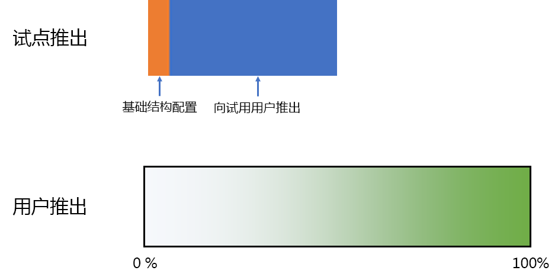
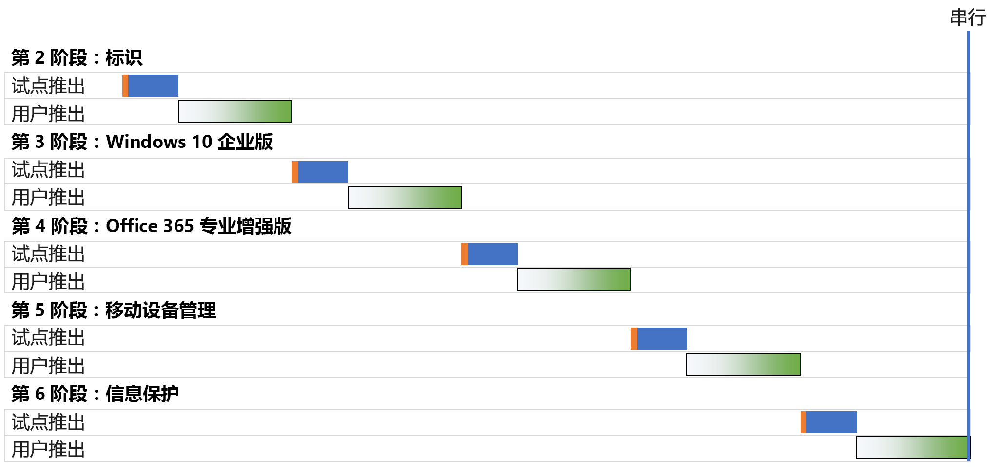
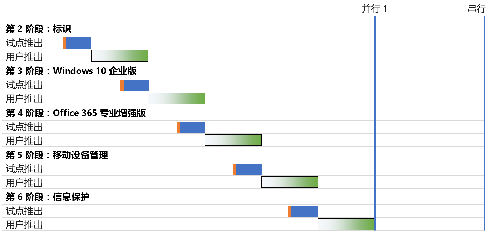
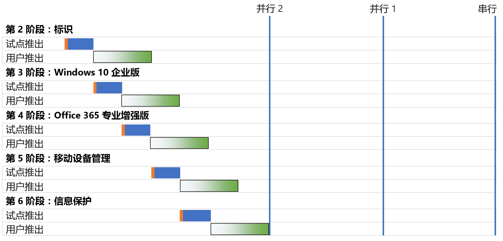
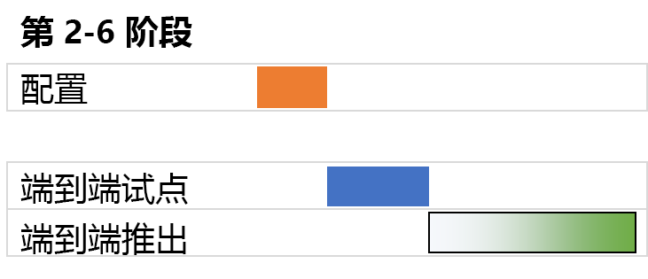

# Microsoft 365 企业版底层基础结构部署策略

你可以通过多种方式部署 Microsoft 365 企业版[底层基础结构](deploy-foundation-infrastructure.md)的各个阶段，并向用户推出其功能、软件和服务。为了帮助你快速开始这项工作的项目管理（根据你的组织规模和现有基础结构，此工作可能十分庞大而复杂），请考虑以下部署策略：

- 串行部署
- 并行部署与非重叠用户推出
- 并行部署与重叠用户推出
- 前端基础结构和端到端配置推出

使用这些策略可以获得有关如何管理整个项目的思路，并更快实现 Microsoft 365 企业版带来的业务优势。

>[!Note]
>本文做了一些假设和简化，目的是使用一致的方式描述部署策略。这些部署策略是概括性的，并不暗示任何特定的时间范围，也不表示适用于所有组织和情况。
>

## 典型企业组织的 IT 项目管理要素

IT基础结构包括后端服务以及向最终用户推出新功能或改进功能功能或者安装的软件。IT 部门通常采用一种有条理的方式部署 IT 基础结构的元素。成功部署 IT 基础结构元素的一种方法应包括：

- 试点推出 

  此过程包括初始基础结构配置、向一组试点用户推出、测试以及对基础结构配置进行后续修改。

- 用户推出

  此过程包括根据区域、部门、组或其他类型的系统传播配置或软件向组织的其余人员推出。

试点推出与用户推出中的用户集不同。

本文使用以下图形来描述这些定义： 

 

在用户推出图形中，阴影表示在整个组织内使用结构化或有条理的方法（如组、部门或区域）从 0% 到 100% 的百分比。

## 部署策略

请考虑以下部署策略：

- 串行部署
- 并行部署与非重叠用户推出
- 并行部署与重叠用户推出
- 前端基础结构和端到端配置推出

### 串行部署

通过串行部署，你可以完全推出一个阶段，使该阶段达到面向所有用户的 100% 部署完成度，然后再进入下一个阶段。可采用这种部署方式的一些原因如下：

- 风险缓解
- 资源分配限制
- IT 部门资金周期
- IT 技术依赖
- 业务变更管理和最终用户阻力

以下甘特图显示了 Microsoft 365 企业版基础结构第 2-6 阶段的简化串行部署情况。

 
 
为了简化讨论和示意，假设每个阶段以及每个阶段中的部署细分段花费相同的时间量。

>[!Note]
>第 1 阶段：Microsoft 365 企业版底层基础结构的网络是仅限于 IT 部门的阶段。用户可受益于与 Microsoft 云资源的优化连接，但不会强制用户实现此目标。
>

下面的例子展示了简单的试点用户体验：

- 12 月，需要使用智能手机进行 MFA。 （身份识别）
- 3 月，在 Windows 8.1 台式机上安装 Windows 10 企业版。（Windows 10 企业版）
- 6 月，安装 Office 365 专业增强版，取代 Office 2013。（Office 365 专业增强版）
- 9 月，执行设备注册并实施应用和设备策略。 （移动设备管理）
- 12 月，安装 Azure 信息保护客户端，并接受关于如何将标签应用于文档的培训。（信息保护）

结果是在连续的试点推出之间保持 90 天节奏。

下面的例子展示了简单的最终用户体验：

- 1 月，需要使用智能手机进行 MFA。 （身份识别）
- 4 月，在 Windows 8.1 台式机上安装 Windows 10 企业版。（Windows 10 企业版）
- 7 月，安装 Office 365 专业增强版，取代 Office 2013。（Office 365 专业增强版）
- 10 月，执行设备注册并实施应用和设备策略。 （移动设备管理）
- 下一年的 1 月，安装 Azure 信息保护客户端，并接受关于如何将标签应用于文档的培训。（信息保护）

结果是在连续的用户推出之间保持 90 天节奏。

此部署策略的缺点是完全部署 Microsoft 365 企业版底层基础结构可能需要很长时间。

### 并行部署与非重叠用户推出（并行 1）

对于此部署策略，你将在当前阶段的用户推出的最后一部分期间开始下一阶段的试点推出。以下是前一阶段的用户推出即将结束期间执行试点推出时的第 2-6 阶段的部署。

 
 
最终结果是，当前阶段的用户推出将在整个组织中完成，然后启动下一个阶段。不在试点推出中的用户不会同时处理多个阶段的推出，但试点推出与用户推出并行完成。

下面的例子展示了简单的试点用户体验：

- 12 月，需要使用智能手机进行 MFA。（身份识别）
- 2 月，在 Windows 8.1 台式机上安装 Windows 10 企业版。（Windows 10 企业版）
- 4 月，安装 Office 365 专业增强版，取代 Office 2013。（Office 365 专业增强版）
- 6 月，执行设备注册并实施应用和设备策略。 （移动设备管理）
- 8 月，安装 Azure 信息保护客户端，并接受关于如何将标签应用于文档的培训。（信息保护）

结果是在连续的试点推出之间保持 60 天节奏。

下面的例子展示了简单的最终用户体验：

- 1 月，需要使用智能手机进行 MFA。（身份识别）
- 3 月，在 Windows 8.1 台式机上安装 Windows 10 企业版。（Windows 10 企业版）
- 5 月，安装 Office 365 专业增强版，取代 Office 2013。（Office 365 专业增强版）
- 7 月，执行设备注册并实施应用和设备策略。 （移动设备管理）
- 9 月，安装 Azure 信息保护客户端，并接受关于如何将标签应用于文档的培训。（信息保护）

结果是在连续的用户推出之间保持 60 天节奏。

此部署策略的优势在于，可以花费更少的时间来完全部署 Microsoft 365 企业版底层基础结构，无需 IT 部门和用户同时处理多个推出。

### 并行部署与重叠用户推出（并行 2）

对于此部署策略：

- 在当前阶段的用户推出的最后一部分期间，你需要开始下一阶段的试点推出。
- 在当前阶段的用户推广期间，采用这样一种方式进行下一阶段的用户推广，即没有用户同时处理多个阶段的推广任务。 这假定你按区域、部门或其他分组采用相同的方式推广底层基础结构的每个阶段。

下面是不同部署策略之间的简化比较。

 

最终结果是：

- 试点推出从一个阶段进入到下一阶段，中间没有暂停。
- 在前一阶段的用户推出完成之前开始后一阶段的用户推出，但是不会有任何单个用户一次推出多个阶段。

下面的例子展示了简单的试点用户体验：

- 12 月，需要使用智能手机进行 MFA。（身份识别）
- 1 月，在 Windows 8.1 台式机上安装 Windows 10 企业版。（Windows 10 企业版）
- 2 月，安装 Office 365 专业增强版，取代 Office 2013。（Office 365 专业增强版）
- 3 月，执行设备注册并实施应用和设备策略。 （移动设备管理）
- 4 月，安装 Azure 信息保护客户端，并接受关于如何将标签应用于文档的培训。（信息保护）

结果是在连续的试点推出之间保持 30 天节奏。

下面的例子展示了简单的最终用户体验：

- 1 月，需要使用智能手机进行 MFA。（身份识别）
- 2 月，在 Windows 8.1 台式机上安装 Windows 10 企业版。（Windows 10 企业版）
- 3 月，安装 Office 365 专业增强版，取代 Office 2013。（Office 365 专业增强版）
- 4 月，执行设备注册并实施应用和设备策略。 （移动设备管理）
- 5 月，安装 Azure 信息保护客户端，并接受关于如何将标签应用于文档的培训。（信息保护）

结果是在连续的用户推出之间保持 30 天节奏。

此部署策略的优势在于，可以花费更少的时间来完全部署 Microsoft 365 企业版底层基础结构，且仍然无需最终用户同时进行多项推广。 但是，用户在连续阶段之间没有休息。

### 前端基础结构和端到端配置推出

对于能够将第 2-6 阶段压缩到单个部署细分段的小型组织，部署结果如下所示：
 
 

IT 部门针对第 2-6 阶段配置基础结构，然后推出给试点用户以检查端到端功能。例如，试点用户同时获得所有以下功能：

- MFA 和其他身份识别功能（身份识别）
- Windows 设备上的 Windows 10 企业版（Windows 10 企业版）
- Office 套件的 Office 365 专业增强版（Office 365 专业增强版）
- 应用和设备策略（移动设备管理）
- 安装 Azure 信息保护客户端并接受关于如何将标签应用于文档的培训（信息保护）

一旦试点推出结束，用户推出便开始，在此过程中每个用户同时获得所有功能。

## 后续步骤

开始部署 Microsoft 365 企业版和[底层基础结构](deploy-foundation-infrastructure.md)。
