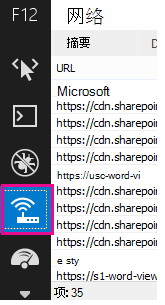
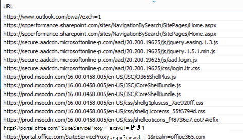
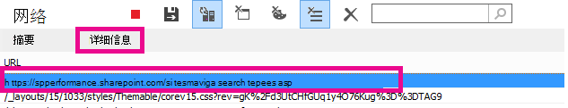
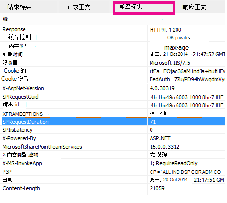

# 诊断 SharePoint Online 的性能问题

本文介绍了如何使用开发人员工具诊断 SharePoint Online Internet Explorer常见问题。
  
有三种不同的方法可以标识联机网站上SharePoint自定义项存在性能问题。
  
- F12 工具栏网络监视器

- 与非自定义基线的比较

- SharePoint联机响应头指标

本主题介绍如何使用其中每种方法诊断性能问题。 找到问题的原因后，可以使用有关提高性能SharePoint文章来寻求解决方案，您可以在 上找到 https://aka.ms/tune 。
  
## 使用 F12 工具栏诊断 SharePoint Online 中的性能

本文使用 Internet Explorer 11。 其他浏览器上的 F12 开发人员工具版本具有类似的功能，尽管它们看起来可能略有不同。 有关 F12 开发人员工具的信息，请参阅：
  
- [F12 工具的新增功能](/previous-versions/windows/internet-explorer/ie-developer/dev-guides/bg182632(v=vs.85))

- [使用 F12 开发人员工具](/previous-versions/windows/internet-explorer/ie-developer/samples/bg182326(v=vs.85))

若要显示开发人员工具，请按 **F12，** 然后单击"Wi-Fi图标：
  

  
在" **网络** "选项卡上，按绿色播放按钮加载页面。 该工具将返回浏览器请求获取请求的页面的所有文件。 以下屏幕截图显示了一个此类列表。
  

  
还可以在右侧查看文件的下载时间，如本屏幕截图中所示。
  

  
这可直观地表示文件加载所用时间。 绿色线条表示页面何时可供浏览器呈现。 这可以快速查看可能导致网站页面加载缓慢的不同文件。
  
## 为 SharePoint Online 设置非自定义基线

确定网站性能较弱点的最佳方法就是，在 SharePoint Online 中设置全新的网站集。 这样，就可以将网站的所有方面与页面上没有自定义的内容进行比较。 此OneDrive for Business主页是不可能具有任何自定义的单独网站集的一个很好的示例。
  
## 查看SharePoint头信息

在 SharePoint Online 中，可以访问在每个文件的响应标头中发送回浏览器的信息。 用于诊断性能问题的最有用值是 **SPRequestDuration，** 它显示服务器处理请求所花时间。 这可以帮助确定请求是否非常重且需要大量资源。 这是对服务器为页面提供服务所完成工作的最佳见解。

### 查看SharePoint头信息
  
1. 确保已安装 F12 工具。 有关下载和安装这些工具详细信息，请参阅 [F12 工具中的新增功能](/previous-versions/windows/internet-explorer/ie-developer/dev-guides/bg182632(v=vs.85))。

2. 在 F12 工具中的"网络 **"选项卡上** ，按绿色播放按钮加载页面。

3. 单击该工具返回的 .aspx 文件之一， **然后单击详细信息**。

    
  
4. 单击 **"响应标头"。**

    
  
## What's causing performance issues in SharePoint Online？

SharePoint [Online](navigation-options-for-sharepoint-online.md)的导航选项一文演示了一个使用 SPRequestDuration 值确定复杂的结构导航导致页面需要很长时间在服务器上处理的示例。 通过为没有自定义的 (网站集) ，可以确定加载任何给定文件是否需要很长时间。 SharePoint Online[的导航选项](navigation-options-for-sharepoint-online.md)中使用的示例是主 .aspx 文件。 该文件包含大多数用于 ASP.NET 加载的代码。 根据您使用的网站模板，如果自定义主页，这可以是 start.aspx、home.aspx、default.aspx 或其他名称。 如果此数字远高于基线网站，则说明您的页面中出现导致性能问题的复杂情况。
  
在确定了特定于网站的问题后，确定导致性能不佳的原因的推荐方法就是消除所有可能的原因，如页面自定义，然后将它们一个一个地添加回网站。 删除页面运行良好的足够自定义项后，可以一个一个地添加返回特定自定义项。
  
例如，如果有非常复杂的导航，请尝试将导航更改为显示子网站，然后检查开发人员工具，看看这是否有所不同。 或者，如果你有大量内容汇总，请尝试从页面中删除它们，看看这是否改进了操作。 如果您消除所有可能的原因，并一次添加一个，您可以轻松地确定哪些功能是最大的问题，然后努力找到解决方案。