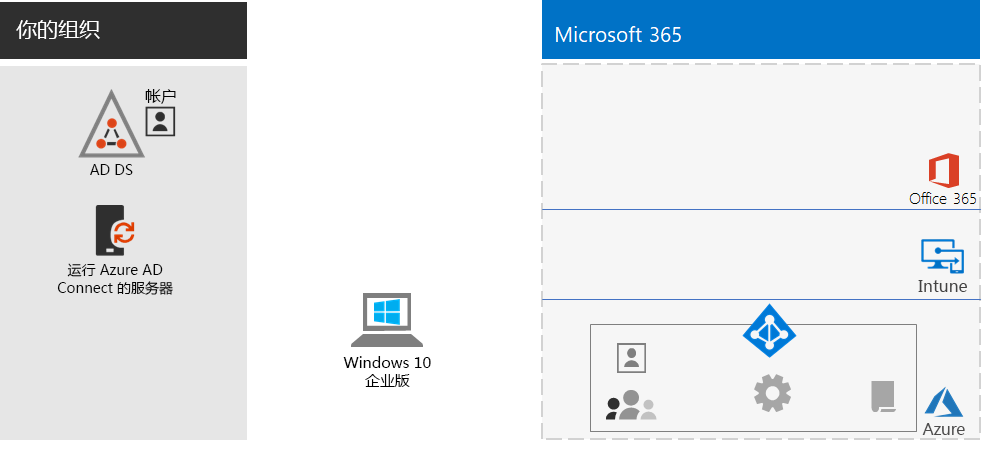
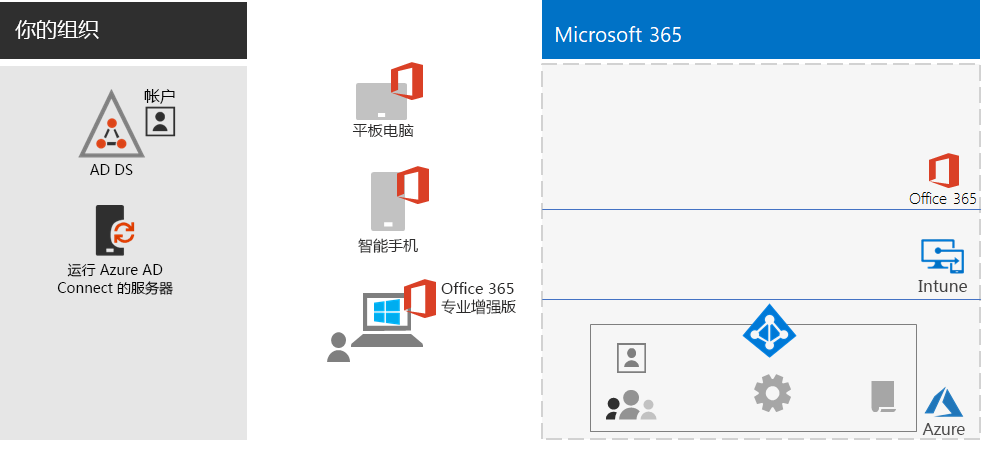
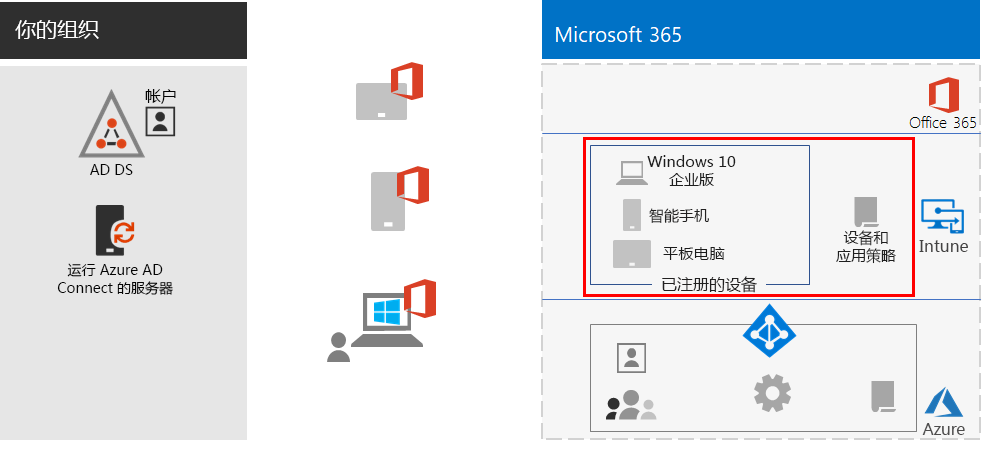
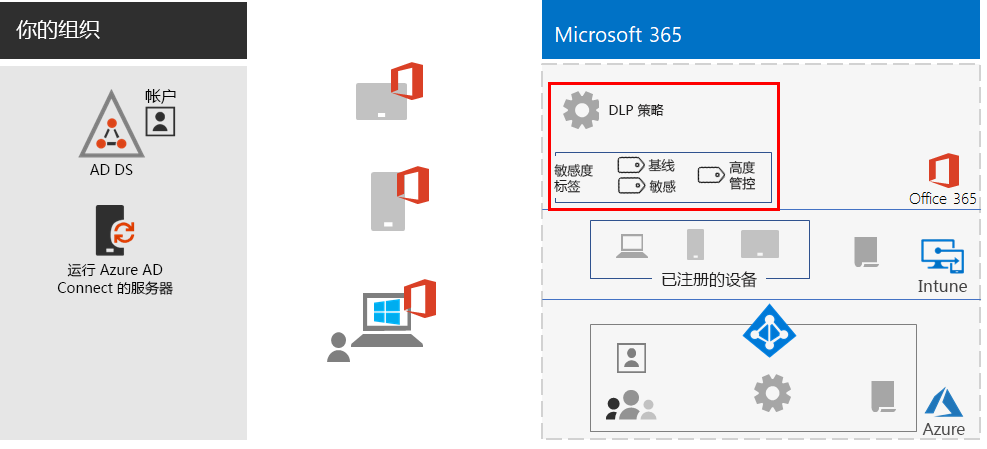
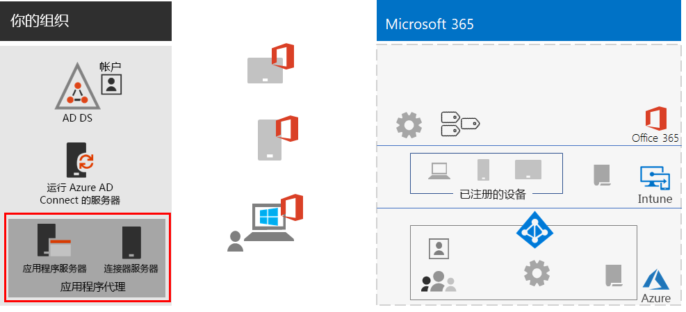
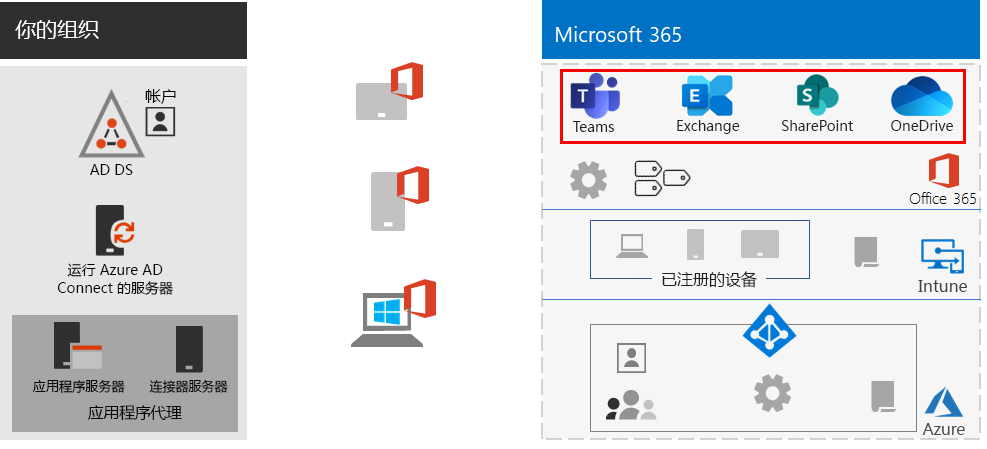
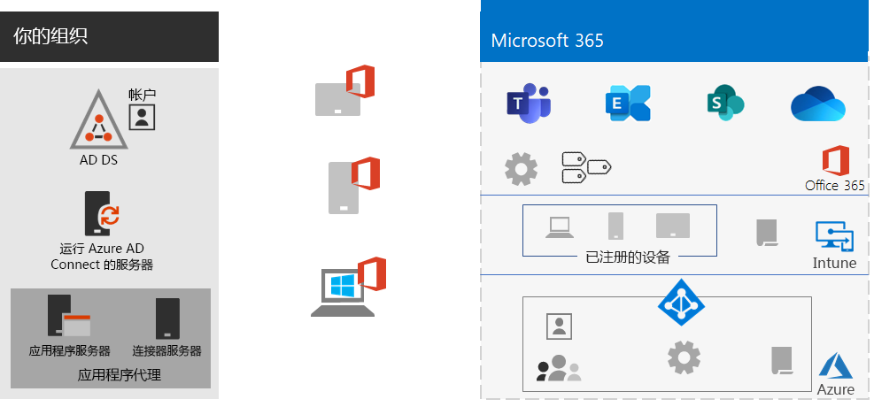
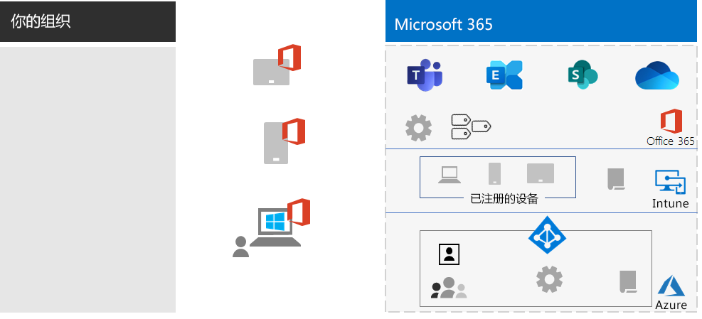

# 为远程工作者提供强大功能Empower remote workers

*此方案适用于 Microsoft 365 企业版的 E3 和 E5 版本**This scenario applies to both the E3 and E5 versions of Microsoft 365 Enterprise*

对于许多组织而言，让员工在远离办公室的地方无缝且安全地工作非常重要，这样做可以节省员工办公空间、雇用和留住不愿搬迁的员工、减少员工上下班的时间，从而让他们有更多时间来提高在外办公的工作效率并减轻压力。Allowing employees to work away from the office seamlessly and securely is important for many organizations to save on office space, hire and retain employees who are unwilling to relocate, and reduce employee commuting, leaving them with more time to be productive and for stress-reducing activities outside of work.

远程工作（也称为远程办公）可以涵盖以下对象：Remote working, also known as teleworking, can span a spectrum that includes:

- 偶尔离开办公室参加会议或客户会议的员工。Employees that are occasionally away from the office for conferences or client meetings.
- 一些远程工作的全职员工。Some employees that work remotely full-time.
- 没有办公室且所有员工均为远程员工的完全远程运作的组织。A fully remote organization in which there is no office and all employees are remote.

为了支持远程工作者，Microsoft 365 企业版中的功能组合可使远程工作者采用高度协作的方式开展工作，例如：To support remote workers, a combination of features in Microsoft 365 Enterprise enables your remote workers in a highly collaborative way, such as:

- 在线会议和聊天会话。Online meetings and chat sessions.
- 基于云的文件存储的共享工作区，可实现全球可访问性和实时协作。Shared workspaces for cloud-based file storage with global accessibility and real-time collaboration.
- 用于划分工作并完成任务的共享任务和工作流。Shared tasks and workflows to divide up the work and get things done.

为实现强大的安全性，Microsoft 365 企业版包括：For strong security, Microsoft 365 Enterprise includes:

- 强制实施的身份验证要求，用于检测和响应高风险的登录，以及阻止所选应用和不合规的设备。Enforced authentication requirements, detecting and responding to high-risk sign-ins, and blocking selected apps and non-compliant devices.
- 在云中加密的连接和数字资产。Encrypted connections and digital assets in the cloud.
- 用于定义谁可以对文件执行哪些操作的权限。Permissions to define who can do what with files.
- 数据丢失防护 (DLP)，用于防止高度管控数据泄露。Data loss prevention (DLP) to prevent leakage of highly regulated data.

若要满足针对远程工作者的这些条件，请使用以下 Microsoft 365 企业版功能：To meet these criteria for remote workers, use the following Microsoft 365 Enterprise features:

- 用户标识和登录安全性User identity and sign-in security
  - 使用多重身份验证 (MFA) 的 Azure Active Directory (Azure AD) 用户帐户Azure Active Directory (Azure AD) user accounts with multi-factor authentication (MFA)
  - 要求对有风险的登录进行 MFA 的条件访问策略Conditional Access policies to require MFA for risky sign-ins
- 协作平台Collaboration platforms
  - Microsoft Teams、SharePoint 和 OneDrive，远程工作者可以使用它们来安排和参加基于视频的在线会议，同时处理相同的文档Microsoft Teams, SharePoint, and OneDrive, with which remote workers can schedule and attend online video-based meetings and work on the same documents at the same time
- 对资源的安全访问Secure access to resources
  - Teams、SharePoint 网站和 OneDrive 的组和权限，只有经过身份验证和允许的用户才能访问Groups and permissions for Teams, SharePoint sites, and OneDrive so that only authenticated and permitted users have access
- 保护泄露的文件Protection for leaked files
  - Office 365 DLP 策略Office 365 DLP policies
  - 随文件传输的加密和权限的敏感度标签Sensitivity labels for encryption and permissions that travel with files
- 使用 Microsoft Intune 的设备管理和安全性Device management and security with Microsoft Intune
  - 托管设备的注册Enrollment for managed devices
  - 个人设备的应用设置App settings for personal devices
  - 设备和应用策略Device and app policies
- 设备的高效应用Productivity apps for devices
  - Office 365 专业增强版应用，可通过 Teams、SharePoint 和 OneDrive 带来协作体验Office 365 ProPlus apps for collaborative experiences with Teams, SharePoint, and OneDrive 
- Windows 10 企业版Windows 10 Enterprise
  - 全面的安全功能，可抵御网络攻击并防止数据泄露Comprehensive security features to protect against cyberattacks and prevent data leakage
- 对本地应用的访问权限Access to on-premises apps
  - 具有混合标识的组织可使用 Azure AD 应用程序代理，而不是虚拟专用网络 (VPN) 连接Organizations that have hybrid identity can use Azure AD Application Proxy instead of virtual private network (VPN) connections

以下阶段将指导你部署 Microsoft 365 企业版功能以实现远程访问并推动远程工作者的采用。The following phases step you through deploying the feature of Microsoft 365 Enterprise for remote access and driving adoption for remote workers. 如果你已部署这些阶段的元素，请确保在移到下一个元素之前满足规定的要求。If you have already deployed elements of these phases, ensure that they meet the stated requirements before moving on to the next element.

有关此方案的 1 页摘要，请参阅[“为远程工作者提供强大功能”海报](../media/empower-people-to-work-remotely/empower-remote-workers-scenario.pdf)。For a 1-page summary of this scenario, see the [Empower remote workers poster](../media/empower-people-to-work-remotely/empower-remote-workers-scenario.pdf).

还可以下载 [PDF](https://github.com/MicrosoftDocs/microsoft-365-docs/raw/public/microsoft-365/media/empower-people-to-work-remotely/empower-remote-workers-scenario.pdf) 或 [PowerPoint](https://github.com/MicrosoftDocs/microsoft-365-docs/raw/public/microsoft-365/media/empower-people-to-work-remotely/Empower-Remote-Workers-Poster.pptx) 格式的海报，并按 letter、legal 或 tabloid (11 x 17) 大小的纸张打印。You can also download this poster in [PDF](https://github.com/MicrosoftDocs/microsoft-365-docs/raw/public/microsoft-365/media/empower-people-to-work-remotely/empower-remote-workers-scenario.pdf) or [PowerPoint](https://github.com/MicrosoftDocs/microsoft-365-docs/raw/public/microsoft-365/media/empower-people-to-work-remotely/Empower-Remote-Workers-Poster.pptx) formats and print it on letter, legal, or tabloid (11 x 17)-sized paper.

## 阶段 1：为远程工作者部署 Microsoft 365 特性和功能Phase 1: Deploy Microsoft 365 features and capabilities for remote workers

鉴于此方案所需的特性和功能的广度和数量，我们将逐步指导你完成 [Microsoft 365 企业版部署指南](deploy-microsoft-365-enterprise.md)的底层基础结构和工作负载部分中的所需元素。Because of the breadth and number of features and capabilities required for this scenario, we’ll step you through the required elements of the foundation infrastructure and workloads sections of the [Microsoft 365 Enterprise Deployment Guide](deploy-microsoft-365-enterprise.md).

### 步骤 1：针对远程工作者的底层基础结构要求Step 1: Foundation infrastructure requirements for remote workers

在此步骤中，我们将访问[底层基础结构](deploy-foundation-infrastructure.md)的各个阶段，并列出远程工作者所需的元素。In this step, we’ll visit the phases of the [foundation infrastructure](deploy-foundation-infrastructure.md) and list the required elements to enable remote workers.

对于[阶段 2：标识](identity-infrastructure.md)，请为用户标识和登录安全性部署以下对象：For [Phase 2: Identity](identity-infrastructure.md), deploy the following for user identity and sign-in security:

- 用于混合标识的从本地 Active Directory 域服务 (AD DS) 同步的用户帐户和组。For hybrid identity, user accounts and groups synchronized from on-premises Active Directory Domain Services (AD DS).
- 用于分配权限的已同步组或包含相应成员的 Azure AD 组。For assigning permissions, synchronized or Azure AD groups with the appropriate members.
- 身份验证设置，例如要求 MFA。Authentication settings, such as requiring MFA.
- 条件访问策略，要求对高风险登录进行 MFA 并阻止不支持新式身份验证的客户端。Conditional Access policies to require MFA for risky sign-ins and block clients that don’t support modern authentication.

下面是最终配置，其中突出显示了标识元素。Here's the resulting configuration with the identity elements highlighted.

 
对于[阶段 3：Windows 10 企业版](windows10-infrastructure.md)，请部署：For [Phase 3: Windows 10 Enterprise](windows10-infrastructure.md), deploy:

- 用于使用 Windows 10 企业版部署新设备以及将 Windows 7 或 Windows 8.1 设备升级到 Windows 10 企业版的基础结构The infrastructure to deploy new devices with Windows 10 Enterprise and to upgrade of your Windows 7 or Windows 8.1 devices to Windows 10 Enterprise
- 用于实现标识、威胁和信息保护的全面安全功能Enabling comprehensive security features for identity, threat, and information protection

下面是 Windows 10 企业版设备的最终配置。Here's the resulting configuration with Windows 10 Enterprise devices.

 
对于[阶段 4：Office 365 专业增强版](office365proplus-infrastructure.md)，请部署基础结构以安装 Office 365 专业增强版，或者在组织设备上将当前安装的 Office 套件（如 Office 2010 或 Office 2013）升级到 Office 365 专业增强版。For [Phase 4: Office 365 ProPlus](office365proplus-infrastructure.md), deploy the infrastructure to install Office 365 ProPlus or upgrade your currently installed Office suite, such as Office 2010 or Office 2013, to Office 365 ProPlus on your organization devices. 这将为用户提供最佳的安全性和协作体验。This will give your users the best security and collaborative experiences.

下面是设备上安装的 Office 365 专业增强版的最终配置。Here's the resulting configuration with Office 365 ProPlus installed on devices.

 
对于[阶段 5：移动设备管理](mobility-infrastructure.md)，请部署 Intune 设备和应用管理以：For [Phase 5: Mobile device management](mobility-infrastructure.md), deploy Intune device and app management for:

- 注册 Windows 10 企业版、iOS、macOS、Android 和 Android 企业版设备，以便它们接收组织定义的功能和安全设置。Enrollment of your Windows 10 Enterprise, iOS, macOS, Android, and Android Enterprise devices so they receive features and security settings defined by your organization.
- 提供应用设置，即使在员工拥有的个人设备上也能提供额外的安全性并允许或阻止相关应用。App settings for extra security and to allow or block apps, even on employee-owned personal devices.
- 创建带条件访问的合规性策略，防止连接不合规的设备。Compliance policies with Conditional Access to prevent non-compliant devices from connecting.

下面是已注册 Intune 的设备的最终配置，其中突出显示了策略。Here's the resulting configuration with Intune enrolled devices and policies highlighted.

 
对于[阶段 6：信息保护](infoprotect-infrastructure.md)，通过以下方法为你的数字资产设计和配置保护：For [Phase 6: Information protection](infoprotect-infrastructure.md), design and configure protection for your digital assets with:

- Office 365 DLP 策略。Office 365 DLP policies.
- 随文件传输的加密和权限的 Office 365 敏感度标签。Office 365 sensitivity labels for encryption and permissions that travel with files.

以下是包含 DLP 策略并突出显示了敏感度标签的最终配置。Here's the resulting configuration with DLP policies and sensitivity labels highlighted.

 
若要访问本地应用，可以使用需要混合标识环境的 [Azure AD 应用程序代理](https://docs.microsoft.com/azure/active-directory/manage-apps/application-proxy)。For access to on-premises apps, you can use [Azure AD Application Proxy](https://docs.microsoft.com/azure/active-directory/manage-apps/application-proxy), which requires a hybrid identity environment.

下面是最终配置，其中突出显示了应用程序代理组件。Here's the resulting configuration with the application proxy components highlighted.

 
### 步骤 2：远程工作者的工作负载Step 2: Workloads for remote workers

对于 [Exchange Online](exchangeonline-workload.md)，请为每个用户部署 Exchange Online 邮箱。For [Exchange Online](exchangeonline-workload.md), deploy Exchange Online mailboxes to each of your users.

对于 [Teams](teams-workload.md)，请为用户和组部署 Teams。For [Teams](teams-workload.md), deploy Teams to your users and groups.

对于 [SharePoint 和 OneDrive](sharepoint-online-onedrive-workload.md)，请部署 SharePoint 团队或通信网站和 OneDrive 文件夹。For [SharePoint and OneDrive](sharepoint-online-onedrive-workload.md), deploy SharePoint team or communication sites and OneDrive folders.

下面是最终配置，其中突出显示了工作负载。Here's the resulting configuration with the workloads highlighted.

 
### 部署结果Deployment results

部署底层基础结构和工作负载并推广 Windows 10 企业版和 Office 365 专业增强版后，远程工作者将：After deploying the foundation infrastructure and workloads and rolling out Windows 10 Enterprise and Office 365 ProPlus, remote workers:

- 受强身份验证和身份保护的约束。Are subject to strong authentication and identity protection.
- 在其 Windows 设备上拥有最新、最安全的 Windows 版本。Have the latest and most secure version of Windows on their Windows devices.
- 在其设备上拥有最新、最高效的 Office 套件版本。Have the latest and most productive version of the Office suite on their devices.
- 受应用管理和设备合规性策略的约束。Are subject to app management and device compliance policies.
- 受 DLP 策略和限制条件的约束。Are subject to DLP policies and restrictions.
- 可以分配随文件和电子邮件传输的加密和权限的敏感度标签。Can assign sensitivity labels for encryption and permissions that travel with files and email.
- 无需 VPN 连接即可访问本地应用。Can access on-premises apps without a VPN connection.
- 可通过 Teams 中的聊天、会议和文件以及 SharePoint 和 OneDrive 中的文件，执行其自己的工作并与同事进行实时协作。Can perform their own work and participate in real-time collaboration with co-workers with chats, meetings, and files in Teams and files in SharePoint and OneDrive.

脱机（未连接到 Internet）时，远程工作者可以更改文件的本地副本。When offline (not connected to the Internet), your remote workers can change local copies of files. 当重新连接到 Internet 时，OneDrive 会将本地副本与 Microsoft 365 订阅中存储的文件进行同步。When they reconnect to the Internet, OneDrive synchronizes local copies with the files stored in your Microsoft 365 subscription. 

下面是使用混合标识时为组织的远程工作者生成的配置。Here's the resulting configuration for remote workers of your organization if you use hybrid identity.

 
 
下面是使用仅限云标识时为组织的远程工作者生成的配置。Here's the resulting configuration for remote workers your organization if you use cloud-only identity.

## 阶段 2：推动远程工作者的用户采用Phase 2: Drive user adoption for remote workers

现在，底层基础结构和工作负载已部署到位，是时候推动远程工作者采用这些功能了，以便他们能够随时随地保持高效。Now that the foundation infrastructure and workloads are in place, it’s time to drive the ongoing usage of these capabilities to your remote workers so they can be productive anywhere and at any time.

### 步骤 1：培训用户Step 1: Train your users

为远程工作者提供以下方面的培训：Train your remote workers on:

- 正确的登录过程（包括 MFA 注册）以及检测到风险时登录可能面临的挑战。Proper sign-in procedures, including MFA registration, and how sign ins can be challenged when risk is detected.
- 使用设备以及如何使用策略阻止不合规设备的访问。The use of devices and how policies can be used to block access for non-compliant devices.
- 使用允许的应用以及如何使用 Intune 应用策略阻止相关应用。The use of allowed apps and how Intune app polices can be used to block apps.
- Windows 10 企业版安全功能。Windows 10 Enterprise security features.
- 如何将 Outlook 用于电子邮件和日历。How to use Outlook for email and calendaring.
- 如何使用 [Teams](https://docs.microsoft.com/microsoftteams/training-microsoft-teams-landing-page) 进行聊天、基于视频的会议、文档共享和线程对话。How to use [Teams](https://docs.microsoft.com/microsoftteams/training-microsoft-teams-landing-page) for chat, video-based conferencing, document sharing, and threaded conversations.
- 如何使用 SharePoint 团队或通信网站和 OneDrive 文件夹浏览用户库中的文件以及组中包含的文件。How to use SharePoint team or communication sites and OneDrive folders to browse files in a user's library and those belonging to a group.
- 对于文件的本地和联机版本，如何为包含敏感或高度管控数据的文件使用和应用敏感度标签。How to use and apply sensitivity labels for files containing sensitive or highly regulated data, for both local and online versions of files.

此培训应包括实践练习，让学员户可以体验这些功能及其结果。This training should include hands-on exercises so that your students can experience these capabilities and their results.

### 步骤 2：定期审查使用情况并处理工作者的反馈意见Step 2: Conduct periodic reviews of usage and address worker feedback

在培训后的几周内：In the weeks after training:

- 快速处理远程工作者的反馈意见并微调相关策略和配置。Quickly address remote worker feedback and fine tune polices and configurations.
- 分析 Teams、SharePoint 网站和 OneDrive 文件夹的使用情况，并将其与使用预期进行比较。Analyze usage for teams, SharePoint sites, and OneDrive folders and compare it with usage expectations.
- 验证是否已使用适当的敏感度标签正确标记了敏感或高度管控文件。Verify that sensitive or highly regulated files have been properly labeled with the appropriate sensitivity label.

根据需要重新培训用户。Retrain your users as needed.

### 用户采用结果User adoption results

远程工作者可以使用 Windows 10 企业版或其他设备以及 Office 365 专业增强版在安全环境中访问和使用共享的 Microsoft 365 企业版云服务及资源，并且可以实时举行会议、创建和协作。Your remote workers can use their Windows 10 Enterprise or other devices and Office 365 ProPlus to access and work on shared Microsoft 365 Enterprise cloud services and resources in a secure environment, and they’re meeting, creating, and collaborating in real time.

## 另请参阅See also

[工作负载和应用场景Workloads and scenarios](deploy-workloads.md)

[Microsoft 365 工作效率库](https://aka.ms/productivitylibrary) https://aka.ms/productivitylibrary)[Microsoft 365 Productivity Library](https://aka.ms/productivitylibrary) (https://aka.ms/productivitylibrary)

[部署指南Deployment guide](deploy-microsoft-365-enterprise.md)
