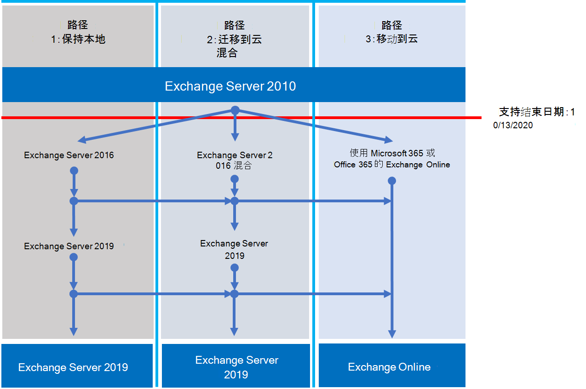

# Exchange 2010 支持终止路线图

*此文章适用于 Microsoft 365 企业版和 Office 365 企业版。* 

2010 Exchange Server于 **2020年10月13** 日结束支持。 如果尚未开始从 2010 Exchange迁移到 Microsoft 365、Office 365 或 2016 Exchange，现在是开始规划的时候了。

## *终止支持* 意味着什么？

大多数 Microsoft 产品都有一个支持生命周期，在此期间，它们会获得新功能、bug 修复、安全修复等。 此生命周期通常从产品的初始版本持续 10 年。 此生命周期的结束称为产品的终止支持。 由于 2010 Exchange于 2020 年 10 月 13 日结束支持，因此 Microsoft 不再提供：

- 对可能发生的问题的技术支持。
- 针对可能影响服务器稳定性和可用性的问题的 Bug 修复。
- 针对可能使服务器易受安全漏洞影响的漏洞的安全修复。
- 时区更新。

在此日期后 Exchange 2010 安装将继续运行。 但由于上面列出的更改，我们强烈建议你尽快从 2010 Exchange迁移。

有关即将终止支持的详细信息，请参阅[“资源”，帮助你从 Office 2010 服务器和客户端升级](upgrade-from-office-2010-servers-and-products.md)。

## 我的选项是什么？

现在是浏览选项和准备迁移计划的好时机。 可以执行下列操作：

- 完全迁移到Microsoft 365。 使用直接转换、最小混合或完全混合迁移迁移邮箱。 然后删除本地Exchange服务器和 Active Directory。
- 将Exchange 2010 服务器迁移到本地服务器上的 Exchange 2016。

> [!IMPORTANT]
> 如果你的组织选择将邮箱迁移到Microsoft 365但计划保留 DirSync 或Azure AD 连接，以继续从本地 Active Directory管理用户帐户，则需要在本地保留至少一个 Microsoft Exchange服务器。 如果删除所有Exchange服务器，则无法在Exchange Online中对Exchange收件人进行更改，因为权限源仍保留在本地 Active Directory中。 需要在其中进行更改。 在此方案中，有以下选项：
>
> - *推荐：* 如果在 2020 年 10 月 13 日之前将邮箱迁移到Microsoft 365并升级了服务器，请使用 Exchange 2010 连接到Microsoft 365并迁移邮箱。 接下来，将 2010 Exchange迁移到 2016 Exchange，并解除所有剩余Exchange 2010 服务器。
> - 如果在 2020 年 10 月 13 日之前未完成邮箱迁移和本地服务器升级，请先将本地Exchange 2010 服务器升级到 2016 Exchange。 然后使用 Exchange 2016 连接到Microsoft 365并迁移邮箱。

> [!NOTE]
> 这有点复杂，但也可以将邮箱迁移到Microsoft 365，同时将本地Exchange 2010 服务器迁移到 2016 Exchange。

以下是为避免终止对 Exchange Server 2010 的支持而可以采取的三种路径。

以下部分更详细地探讨了每个选项。

## 迁移到 Microsoft 365

将电子邮件迁移到Microsoft 365是帮助你停用 Exchange 2010 部署的最佳和最简单的选项。 迁移到Microsoft 365后，可以从旧技术到当前功能进行单跃点，包括：

- 合规性功能，如保留策略、In-Place和诉讼保留、就地电子数据展示等。
- Microsoft Teams。
- Power BI。
- 重点收件箱。
- MyAnalytics。

Microsoft 365还首先获取新功能和体验，以便组织可以立即开始使用它们。 此外，你不必担心：

- 购买和维护硬件。
- 支付加热和冷却你的服务器。
- 在安全性、产品和时区修复方面保持最新。
- 维护存储和软件以支持合规性要求。
- 升级到新版本的Exchange。 你始终在Microsoft 365中使用最新版本的Exchange。

### 如何迁移到Microsoft 365？

根据组织，你可以使用一些选项来Microsoft 365。 首先，需要考虑一些事项，例如：

- 需要移动的座位或邮箱数。
- 希望迁移持续多久。
- 迁移期间是否需要在本地安装与Microsoft 365之间无缝集成。

下表显示了迁移选项以及确定要使用哪种方法的最重要因素。

|迁移选项|组织大小|期限|
|---|---|---|
|直接转换迁移|少于 150 个座位|一周或更短的时间|
|最小混合迁移|少于 150 个座位|几周或更短的时间|
|完全混合迁移|超过 150 个座位|几周或更短的时间|

以下部分概述了这些方法。 有关详细信息，请参阅 [“确定迁移路径](https://support.office.com/article/Decide-on-a-migration-path-0d4f2396-9cef-43b8-9bd6-306d01df1e27)”。

### 直接转换迁移

在转换迁移中，迁移所有邮箱、通讯组、联系人等，以便在设置的日期和时间Office 365。 完成后，请关闭本地Exchange服务器，并开始专门使用Microsoft 365。

直接转换迁移非常适合没有多个邮箱、希望快速Microsoft 365且不想处理其他方法复杂性的小型组织。 但它应该在一周或更短的时间内完成。 它要求用户重新配置其Outlook配置文件。 直接迁移最多可以迁移 2，000 个邮箱，但我们建议最多使用 150 个邮箱。 如果尝试迁移更多内容，则在截止时间之前传输所有邮箱的时间可能会过多，而 IT 支持人员可能会因为请求帮助用户重新配置Outlook而不知所措。

下面是有关直接迁移需要考虑的事项：

- Microsoft 365需要通过 TCP 端口 443 使用Outlook任意位置连接到 Exchange 2010 服务器。
- 所有本地邮箱都将移至Microsoft 365。
- 需要具有对用户邮箱的读取访问权限的本地管理员帐户。
- 要在Microsoft 365中使用的 Exchange 2010 接受域需要添加为服务中的已验证域。
- 从开始迁移到开始完成阶段，Microsoft 365将定期同步Microsoft 365和本地邮箱。 这使你能够完成迁移，而无需担心在本地邮箱中留下电子邮件。
- 用户将收到其Microsoft 365帐户的新临时密码。 当他们第一次登录到邮箱时，他们需要更改这些邮箱。
- 需要一个Microsoft 365许可证，其中包括迁移的每个用户邮箱的Exchange Online。
- 用户需要在其每个设备上设置新的Outlook配置文件，然后再次下载其电子邮件。 Outlook下载的电子邮件量可能会有所不同。 有关详细信息，请参阅[Outlook中的脱机工作](https://support.microsoft.com/office/f3a1251c-6dd5-4208-aef9-7c8c9522d633)。

若要了解有关直接迁移的详细信息，请参阅：

- [有关直接转换电子邮件迁移需要了解的内容](/Exchange/mailbox-migration/what-to-know-about-a-cutover-migration)
- [执行电子邮件到Office 365的转换迁移](/Exchange/mailbox-migration/cutover-migration-to-office-365)

### 最小混合迁移

在最少的混合或快速迁移中，在几周内将几百个邮箱移动到Microsoft 365。 此方法不支持高级混合迁移功能，例如共享的闲/忙日历信息。

最少的混合迁移非常适合需要更多时间将邮箱迁移到Microsoft 365的组织，但仍计划在几周内完成迁移。 你可以从更高级的 *全混合迁移* 中获得一些好处，而不会带来太大的复杂性。 可以控制给定时间要迁移的邮箱数量和数量。 Microsoft 365将使用本地帐户的用户名和密码创建邮箱。 而且，与直接迁移不同，用户无需重新创建其Outlook配置文件。

下面是关于最小混合迁移需要考虑的事项：

- 需要在本地 Active Directory服务器和Microsoft 365之间执行一次性目录同步。
- 用户将能够使用与邮箱之前相同的用户名和密码登录到其Microsoft 365邮箱。
- 需要一个Microsoft 365许可证，其中包含迁移的每个用户邮箱的Exchange Online。
- 用户不需要在其大多数设备上设置新的Outlook配置文件，尽管一些较旧的 Android 手机可能需要一个新的配置文件。 用户无需重新卸载其电子邮件。

有关详细信息，请参阅[“使用最小混合”快速将Exchange邮箱迁移到Office 365](/Exchange/mailbox-migration/use-minimal-hybrid-to-quickly-migrate)。

### 完全混合

在完全混合迁移中，你拥有数百个（最多数万个）邮箱，并且你将一些或全部移动到Microsoft 365。 由于这些迁移通常是较长期的，因此混合迁移使以下操作成为可能：

- 向本地用户显示Microsoft 365用户的忙/忙日历信息，反之亦然。
- 请参阅统一的全局地址列表，其中包含本地和Microsoft 365中的收件人。
- 查看所有用户的完整Outlook收件人属性，无论他们是在本地还是在Microsoft 365。
- 使用 TLS 和证书保护本地Exchange服务器与Office 365之间的电子邮件通信。
- 将本地Exchange服务器和Microsoft 365之间发送的消息视为内部消息，使其能够：
  - 由针对内部消息的传输和合规性代理正确评估和处理。
  - 绕过反垃圾邮件筛选器。

完全混合迁移最适合希望在混合配置中保留数月或更久的组织。 你将获取本部分前面列出的功能，以及目录同步、更好的集成合规性功能，以及使用联机邮箱移动来Microsoft 365移动邮箱的能力。 Microsoft 365成为本地组织的扩展。

关于全混合迁移需要考虑的事项：

- 它们不适用于所有组织。 由于完全混合迁移的复杂性，邮箱少于几百个的组织通常看不到证明所涉及的努力和成本合理的好处。 在这种情况下，建议考虑进行直接转换或最小混合迁移。
- 需要使用本地 Active Directory服务器和Microsoft 365之间的Azure Active Directory (Azure AD) 连接设置目录同步。
- 用户将能够使用登录到本地网络时使用的相同用户名和密码登录到其Microsoft 365邮箱。  (此功能需要Azure AD 连接密码同步和/或Active Directory 联合身份验证服务) 。
- 你需要一个Microsoft 365许可证，其中包括迁移的每个用户邮箱的Exchange Online。
- 用户无需在其大多数设备上设置新的Outlook配置文件，尽管一些较旧的 Android 手机可能需要新的配置文件。 用户无需重新卸载其电子邮件。

> [!IMPORTANT]
> 如果你的组织选择将邮箱迁移到Microsoft 365但计划保留 DirSync 或Azure AD 连接，以便继续从本地 Active Directory管理用户帐户，则需要在本地保留至少一个Exchange服务器。 如果删除了所有Exchange服务器，则无法在Exchange Online中对Exchange收件人进行更改。 这是因为权限源仍保留在本地 Active Directory中，需要在其中进行更改。

如果完全混合迁移听起来适合你，请参阅以下有用的资源：

- [Exchange部署助手](/exchange/exchange-deployment-assistant)
- [Exchange Server 混合部署](/exchange/exchange-hybrid)
- [混合配置向导](/exchange/hybrid-configuration-wizard)
- [混合配置向导常见问题解答](/exchange/hybrid-configuration-wizard-faqs)
- [混合部署先决条件](/exchange/hybrid-deployment-prerequisites)

## 升级到本地Exchange Server的较新版本

我们坚信，通过完全迁移到Microsoft 365，可以获得最佳价值和用户体验。 但我们知道，某些组织需要将一些Exchange服务器保留在本地。 这可能是因为法规要求，为了保证数据不存储在外国数据中心，因为你具有在云中无法满足的唯一设置或要求，或者因为需要Exchange来管理云邮箱，因为你仍然在本地使用 Active Directory。 在任何情况下，如果在本地Exchange，应确保Exchange 2010 环境至少升级到 2013 Exchange或 2016 Exchange。

为了获得最佳体验，建议将剩余的本地环境升级到 2016 Exchange。 如果想要直接从 2010 Exchange Server到 2016 Exchange Server，则无需安装 Exchange Server 2013。

Exchange 2016 包括以前版本的Exchange的所有功能。 它与Microsoft 365提供的体验最为匹配，尽管某些功能仅在Microsoft 365中可用。 查看你缺少的一些内容：

|Exchange版本|功能|
|---|---|
|**Exchange 2013**|简化的体系结构将服务器角色数减少到三 (邮箱、客户端访问、边缘传输) |
||有助于防止敏感信息泄漏的 DLP)  (数据丢失防护策略|
||改进了Outlook Web App体验|
|**Exchange 2016**|*Exchange 2013 和...*|
||进一步简化了仅用于邮箱和边缘传输的服务器角色|
||改进了 DLP 以及与 SharePoint 的集成|
||改进了数据库复原能力|
||联机文档协作|

|注意事项|更多信息|
|---|---|
|支持日期结束|与 Exchange 2010 一样，每个版本的Exchange都有自己的终止支持日期：    Exchange 2013 - 2023 年 4 月    Exchange 2016 - 2025 年 10 月    支持结束日期越早，你越早需要执行另一个迁移。 2023 年 4 月比你想象的要近得多！|
|Exchange 2013 或 2016 的迁移路径|无论选择Exchange 2013 还是Exchange 2016，从 Exchange 2010 到更高版本的迁移路径都是相同的：    将 Exchange 2013 或 2016 安装到现有的 Exchange 2010 组织中。    将服务和其他基础结构移至 2013 或 2016 Exchange。    将邮箱和公用文件夹移动到 2013 或 2016 Exchange 2010 服务器的剩余Exchange。|
|版本共存|迁移到 Exchange 2013 或 Exchange 2016 时，可以将任一版本安装到现有的 Exchange 2010 组织中。 这使你能够安装一个或多个Exchange 2013 或 Exchange 2016 服务器并执行迁移。|
|服务器硬件|服务器硬件要求已从 2010 Exchange更改。 确保硬件兼容。 在此处详细了解每个版本的硬件要求：    [Exchange 2016 系统要求](/Exchange/plan-and-deploy/system-requirements?view=exchserver-2016&preserve-view=true)    [Exchange 2013 系统要求](/Exchange/exchange-2013-system-requirements-exchange-2013-help)    随着Exchange性能的重大改进以及较新服务器的计算能力和存储容量的增强，可能需要更少的服务器来支持相同数量的邮箱。|
|操作系统版本|每个版本支持的最低操作系统版本为：    Exchange 2016 - Windows Server 2012    Exchange 2013 - Windows服务器 2008 R2 SP1    可以在[Exchange可支持性矩阵](/exchange/plan-and-deploy/supportability-matrix)中找到有关操作系统支持的详细信息。|
|Active Directory 林功能级别|每个版本的最小受支持的 Active Directory 林功能级别为：    Exchange 2016 - Windows服务器 2008 R2 SP1    Exchange 2013 - Windows服务器 2003    可以在[Exchange可支持性矩阵](/exchange/plan-and-deploy/supportability-matrix)中找到有关林功能级别支持的详细信息。|
|Office客户端版本|每个版本的最小受支持的Office客户端版本为：    Exchange 2016 - Office 2010 年 (最新更新)     Exchange 2013 - Office 2007 SP3    在Exchange[可支持性矩阵](/exchange/plan-and-deploy/supportability-matrix)中查找有关Office客户端支持的详细信息。|

使用以下资源来帮助迁移：

- [Exchange部署助手](/exchange/exchange-deployment-assistant)
- [Exchange 2016、2013](/exchange/plan-and-deploy/active-directory/ad-schema-changes?view=exchserver-2016&preserve-view=true) 的 Active Directory 架构更改 
- [Exchange 2016](/exchange/plan-and-deploy/system-requirements?view=exchserver-2016&preserve-view=true)、[2013 的](/Exchange/exchange-2013-system-requirements-exchange-2013-help)系统要求
- [2016](/exchange/plan-and-deploy/prerequisites?view=exchserver-2016&preserve-view=true) 年Exchange [2013](/Exchange/exchange-2013-prerequisites-exchange-2013-help) 年必备组件

## Office 2010 客户端和服务器以及 Windows 7 的选项摘要

有关 Office 2010 客户端和服务器以及 Windows 7 的升级、迁移和移动到云选项的直观摘要，请参阅[终止支持海报](../downloads/Office2010Windows7EndOfSupport.pdf)。

此单页海报演示了响应 Office 2010 客户端和服务器产品以及Windows 7 终止支持时可以采取的各种路径，其中突出显示了首选路径和选项支持Microsoft 365 企业版。

还可以 [下载](https://github.com/MicrosoftDocs/microsoft-365-docs/raw/public/microsoft-365/downloads/Office2010Windows7EndOfSupport.pdf) 此海报，并将其打印为字母、法律或小报 (11 x 17) 格式。

## 如果我需要帮助怎么办？

如果要迁移到Microsoft 365，则可能有资格使用我们的Microsoft FastTrack服务。 FastTrack提供了最佳做法、工具和资源，使迁移到Microsoft 365尽可能无缝。 最重要的是，你将有一个支持工程师引导你从规划和设计到迁移最后一个邮箱。 有关FastTrack的详细信息，请[参阅Microsoft FastTrack](https://fasttrack.microsoft.com/)。

如果在迁移到Microsoft 365期间遇到问题，但未使用FastTrack，或者要迁移到较新版本的Exchange Server，可以使用以下一些资源：

- [技术社区](https://social.technet.microsoft.com/Forums/office/home?category=exchangeserver)
- [客户支持](https://support.microsoft.com/gp/support-options-for-business)

## 相关文章

[帮助从 Office 2010 服务器和客户端升级的相关资源](upgrade-from-office-2010-servers-and-products.md)
