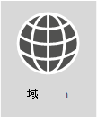

# <a name="external-domain-name-system-records-for-office-365"></a>Office 365 的外部域名系统记录



**想要查看 Office 365 组织的 DNS 记录的自定义列表？** 可以在 Office 365 中找到为你的域 [创建 Office 365 DNS 记录所需的信息](../admin/get-help-with-domains/information-for-dns-records.md)。

**需要在你的域的 DNS 主机（例如 GoDaddy 或 eNom）中添加这些记录的分步帮助？**[查找有关许多热门 DNS 主机的分步说明的链接](../admin/get-help-with-domains/create-dns-records-at-any-dns-hosting-provider.md)。 

**是否坚持使用自己自定义部署的引用列表？** 下方的列表应该用作你的自定义 Office 365 部署的引用。需要选择将哪些记录应用于你的组织并填写适当的值。 

**返回到** [Office 365 的网络规划和性能优化](./network-planning-and-performance.md)。

通常最难找出 SPF 和 MX 记录。我们已在本文末尾更新了 SPF 记录指南。请注意，_只能为你的域使用单个 SPF 记录_。可以使用多个 MX 记录；不过，这可能会造成邮件传递问题。使用将电子邮件定向到一个邮件系统的单个 MX 记录会减少很多潜在的问题。
  
以下部分是按 Office 365 中的服务来组织的。若要为你的域查看 Office 365 DNS 记录的自定义列表，请登录到 Office 365 并[收集创建 Office 365 DNS 记录所需的信息](https://support.office.com/article/77f90d4a-dc7f-4f09-8972-c1b03ea85a67)。
  
## <a name="external-dns-records-required-for-office-365-core-services"></a>Office 365（核心服务）所需的外部 DNS 记录
<a name="BKMK_ReqdCore"> </a>

所有 Office 365 客户需要向其外部 DNS 添加两个记录。第一个 CNAME 记录可确保 Office 365 能够指导工作站向适当的标识平台进行身份验证。所需的第二个记录可以证明你拥有你的域名。
  
|**DNS 记录** <br/> |**用途** <br/> |**要使用的值** <br/> |
|----------|-----------|------------|
|**CNAME** <br/> **（套件）** <br/> |由 Office 365 用来指导向正确的标识平台进行身份验证。[详细信息](../admin/services-in-china/purpose-of-cname.md?viewFallbackFrom=o365-worldwide) <br/> **注意：** 此 CNAME 仅适用于由世纪互联运营的 Office 365。[详细信息](/office365/servicedescriptions/office-365-platform-service-description/office-365-operated-by-21vianet)  |**别名：** msoid  <br/> **目标：** clientconfig.partner.microsoftonline-p.net.cn  <br/> |
|**TXT** <br/> **（域验证）** <br/> |由 Office 365 仅用来确你拥有你的域。它不影响其他任何内容。  <br/> |**主机：**@（或者，对于某些 DNS 托管提供程序，为你的域名）  <br/> **TXT 值：**_由 Office 365 提供的文本字符串_  <br/> Office 365 **域设置向导** 提供了用于创建此记录的值。  <br/> |


## <a name="external-dns-records-required-for-email-in-office-365-exchange-online"></a>Office 365 (Exchange Online) 中的电子邮件所需的外部 DNS 记录
<a name="BKMK_ReqdCore"> </a>

Office 365 中的电子邮件需要几个不同的记录。所有客户应该使用的三个主要记录为自动发现、MX 和 SPF 记录。
  
- **自动发现记录** 可允许客户端计算机自动查找 Exchange 并正确配置客户端。

- **MX 记录** 告知其他邮件系统向您的域发送电子邮件的位置。**注意：** 当通过更新域的 MX 记录将电子邮件更改为 Office 365 时，发送到该域的所有电子邮件都将开始传送到 Office 365。  
你是否只是想要将几个电子邮件地址切换到 Office 365？ 你可以[通过在自定义域中使用少量电子邮件地址试行 Office 365](https://support.office.com/article/39cee536-6a03-40cf-b9c1-f301bb6001d7)。

- 收件人电子邮件系统使用 **SPF 的 TXT 记录** 确认发送你的电子邮件的服务器是你批准的服务器。这有助于预防电子邮件欺骗和钓鱼等问题。请参阅本文中的 [SPF 所需的外部 DNS 记录](external-domain-name-system-records.md#BKMK_SPFrecords)，以帮助你了解记录中要包含的内容。

使用 Exchange Federation 的电子邮件客户也将需要使用其他 CNAME 和 TXT 记录（列于表格底部）。
  
|**DNS 记录** <br/> |**用途** <br/> |**要使用的值** <br/> |
|----------|-----------|------------|
|**CNAME** <br/> **(Exchange Online)** <br/> |帮助 Outlook 客户端轻松使用“自动发现”服务连接到 Exchange Online 服务。“自动发现”自动查找正确的 Exchange Server 主机并为用户配置 Outlook。  <br/> |**别名：** Autodiscover  <br/> **目标：** autodiscover.outlook.com  <br/> |
|**MX** <br/> **(Exchange Online)** <br/> |将域的传入邮件发送到 Office 365 中的 Exchange Online 服务。  <br/> [!NOTE] 电子邮件流向 Exchange Online 后，应该删除指向你的旧版系统的 MX 记录。   |**域：** 例如，contoso.com  <br/> **目标电子邮件服务器：**\<MX token\>.mail.protection.outlook.com  <br/> **首选项/优先级：** 低于其他任何 MX 记录（这会确保将邮件传递到 Exchange Online）- 例如，1 或“低”  <br/>  通过以下步骤找到 \<MX token\>：  <br/>  登录到 Office 365，转到“Office 365 管理员”\>“域”。  <br/>  在你的域的“操作”列中，选择修复问题。  <br/>   在“MX 记录”部分中，选择“修复什么?”  <br/>  按照此页面上的说明来更新你的 MX 记录。  <br/> [什么是 MX 优先级？](../admin/setup/domains-faq.yml) <br/> |
|**SPF (TXT)** <br/> **(Exchange Online)**  <br/> |有助于防止其他人使用您的域发送垃圾邮件或其他恶意电子邮件。发送方策略框架 (SPF) 通过标识有权从您的域发送电子邮件的服务器来记录工作。  <br/> |[SPF 所需的外部 DNS 记录](external-domain-name-system-records.md#BKMK_SPFrecords) <br/> |
|**TXT** <br/> **（Exchange 联合身份验证）** <br/> |用于混合部署的 Exchange 联合身份验证。  <br/> |**TXT 记录 1：** 例如，contoso.com 和相关自定义生成的域证明哈希文本（例如，Y96nu89138789315669824）  <br/> **TXT 记录 2：** 例如，exchangedelegation.contoso.com 和相关的自定义生成的域证明哈希文本（例如，Y3259071352452626169）  <br/> |
|**CNAME** <br/> **（Exchange 联合身份验证）** <br/> |当你的公司使用 Exchange 联合身份验证时，帮助 Outlook 客户端轻松使用“自动发现”服务连接到 Exchange Online 服务。“自动发现”自动查找正确的 Exchange Server 主机并为你的用户配置 Outlook。  <br/> |**别名：** 例如，Autodiscover.service.contoso.com  <br/> **目标：** autodiscover.outlook.com  <br/> |


## <a name="external-dns-records-required-for-skype-for-business-online"></a>Skype for Business Online 所需的外部 DNS 记录
<a name="BKMK_ReqdCore"> </a>

使用[Office 365 URL 和 IP 地址范围](https://support.office.com/article/8548a211-3fe7-47cb-abb1-355ea5aa88a2#BKMK_LYO)时，需要执行特定步骤，以确保正确配置你的网络。

> [!NOTE]
> 这些 DNS 记录也适用于 Teams，尤其是在 Teams 和 Skype for Business 混合方案中，其中可能出现某些联合问题。
  
|**DNS 记录** <br/> |**用途** <br/> |**要使用的值** <br/> |
|----------|-----------|------------|
|**SRV** <br/> **(Skype for Business Online)** <br/> |允许 Office 365 域通过启用 SIP 联合身份验证与外部客户端共享即时消息 (IM) 功能。阅读更多有关 [Office 365 URL 和 IP 地址范围](https://support.office.com/article/8548a211-3fe7-47cb-abb1-355ea5aa88a2#BKMK_LYO)的信息。<br/> |**服务**：sipfederationtls  <br/> **协议：** TCP  <br/> **优先级：** 100  <br/> **权重：** 1  <br/> **端口：** 5061  <br/> **目标：** sipfed.online.lync.com  <br/> **注意：** 如果防火墙或代理服务器阻止在外部 DNS 上进行 SRV 查找，应将此记录添加到内部 DNS 记录。   |
|**SRV** <br/> **(Skype for Business Online)** <br/> |由 Skype for Business 用来协调 Lync 客户端之间的信息流。  <br/> |**服务：** sip  <br/> **协议：** TLS  <br/> **优先级：** 100  <br/> **权重：** 1  <br/> **端口：** 443  <br/> **目标：** sipdir.online.lync.com  <br/> |
|**CNAME** <br/> **(Skype for Business Online)** <br/> |由 Lync 客户端用来帮助查找 Skype for Business Online 服务和登录。  <br/> |**别名：** sip  <br/> **目标：** sipdir.online.lync.com  <br/> 有关详细信息，请参阅 [Office 365 URL 和 IP 地址范围](https://support.office.com/article/8548a211-3fe7-47cb-abb1-355ea5aa88a2#BKMK_LYO)。  <br/> |
|**CNAME** <br/> **(Skype for Business Online)** <br/> |由 Lync 移动客户端用来帮助查找 Skype for Business Online 服务和登录。  <br/> |**别名：** lyncdiscover  <br/> **目标：** webdir.online.lync.com  <br/> |

## <a name="external-dns-records-required-for-office-365-single-sign-on"></a>Office 365 单一登录所需的外部 DNS 记录
<a name="BKMK_ReqdCore"> </a>

|**DNS 记录** <br/> |**用途** <br/> |**要使用的值** <br/> |
|----------|-----------|------------|
|**主机 (A)** <br/> |用于单一登录 (SSO)。它为你的外部用户（和本地用户，如果你需要）提供终结点，以连接到 Active Directory 联合身份验证服务 (AD FS) 联合服务器代理或负载平衡虚拟 IP (VIP)。  <br/> |**目标：** 例如，sts.contoso.com  <br/> |

## <a name="external-dns-records-required-for-spf"></a>SPF 所需的外部 DNS 记录
<a name="BKMK_SPFrecords"> </a>

> [!IMPORTANT]
>  SPF 旨在帮助防止欺骗，但还有 SPF 无法防止的欺骗技术。为了防止这些欺骗，在你设置 SPF 后，也应该为 Office 365 配置 DKIM 和 DMARC。请参阅[Use DKIM to validate outbound email sent from your domain in Office 365](../security/office-365-security/use-dkim-to-validate-outbound-email.md)，了解入门知识。之后，请参阅[Use DMARC to validate email in Office 365](../security/office-365-security/use-dmarc-to-validate-email.md)。
  
SPF 记录是有助于防止其他人使用你的域发送垃圾邮件或其他恶意电子邮件的 TXT 记录。发送方策略框架 (SPF) 通过标识有权从你的域发送电子邮件的服务器来记录工作。
  
只能对你的域使用一个 SPF 记录（即定义 SPF 的 TXT 记录）。这一单个记录可具有几个不同的包含项，但生成的总 DNS 查找项不能超过 10 个（这有助于防止拒绝服务攻击）。请参阅下面的表和其他示例，帮助你创建或更新适用于你的环境的正确 SPF 记录值。
  
### <a name="structure-of-an-spf-record"></a>SPF 记录的结构

所有 SPF 记录均包含三个部分：SPF 记录的声明、发送电子邮件的域和 IP 地址以及强制执行的规则。三部分俱全才能构成一个有效的 SPF 记录。以下是在你仅使用 Exchange Online 电子邮件时适用于 Office 365 的常见 SPF 记录的示例：
  
``` dns
TXT Name @
Values: v=spf1 include:spf.protection.outlook.com -all
```

接收来自域的电子邮件的电子邮件系统查看 SPF 记录，如果发送邮件的电子邮件服务器是 Office 365 服务器，则会接受该邮件。如果发送邮件的服务器是旧版邮件系统或是 Internet 上的恶意系统，例如，SPF 检查可能失败且邮件无法传递。此类检查有助于预防欺骗和钓鱼邮件的发生。
  
### <a name="choose-the-spf-record-structure-you-need"></a>选择所需的 SPF 记录结构

对于不只针对 Office 365 使用 Exchange Online 电子邮件的应用场景（例如，当你还使用源自 SharePoint Online 的电子邮件时），请使用下表来确定要在记录的值中包括的内容。
  
> [!NOTE]
> 如果你拥有一个复杂的应用场景（例如，包括跨防火墙管理电子邮件流量的边缘电子邮件服务器），则需设置一个更为详细的 SPF 记录。了解[如何：在 Office 365 中设置 SPF 记录以帮助预防欺骗](../security/office-365-security/set-up-spf-in-office-365-to-help-prevent-spoofing.md)。也可以阅读 [Office 365 如何使用发件人策略框架来帮助预防欺骗](../security/office-365-security/how-office-365-uses-spf-to-prevent-spoofing.md)，详细了解如何在 Office 365 中使用 SPF。
  
| 数字|如果你使用的是...  <br/> |用途  <br/> |添加以下包含项  <br/> |
|:-----|:-----|:-----|:-----|
|1  <br/> |所有电子邮件系统（必需）  <br/> |以此值开头的所有 SPF 记录  <br/> |v=spf1  <br/> |
|2  <br/> |Exchange Online（常见）  <br/> |仅使用 Exchange Online  <br/> |include:spf.protection.outlook.com  <br/> |
|3  <br/> |第三方电子邮件系统（不太常见）  <br/> ||包括：\<email system like mail.contoso.com\>  <br/> |
|4  <br/> |本地邮件系统（不太常见）  <br/> |在使用 Exchange Online Protection 或 Exchange Online 以及其他邮件系统的情况下使用  <br/> |ip4：\<0.0.0.0\>  <br/> ip6：\< : : \>  <br/> 包括：\<mail.contoso.com\>  <br/> 括号 (\<\>) 中的值应是为你的域发送电子邮件的其他邮件系统。  <br/> |
|5  <br/> |所有电子邮件系统（必需）  <br/> ||-all  <br/> |

### <a name="example-adding-to-an-existing-spf-record"></a>示例：添加到现有 SPF 记录
<a name="bkmk_addtospf"> </a>

如果已有 SPF 记录，将需要添加或更新 Office 365 的值。例如，contoso.com 的现有 SPF 记录如下所示：
  
``` dns
TXT Name @
Values: v=spf1 ip4:60.200.100.30 include:smtp.adatum.com -all
```

现在要为 Office 365 更新 SPF 记录。编辑当前的记录，以便拥有包括所需要值的 SPF 记录。对于 Office 365，“spf.protection.outlook.com”。
  
正确：
  
``` dns
TXT Name @
Values: v=spf1 ip4:60.200.100.30 include:spf.protection.outlook.com include:smtp.adatum.com -all
```

不正确：
  
``` dns
Record 1:
TXT Name @
Values: v=spf1 ip4:60.200.100.30 include:smtp.adatum.com -all
Record 2:
Values: v=spf1 include:spf.protection.outlook.com -all
```

### <a name="more-examples-of-common-spf-values"></a>常见 SPF 值的更多示例
<a name="bkmk_addtospf"> </a>

如果使用完整的 Office 365 套件，并且使用 MailChimp 代表你发送市场营销电子邮件，则 contoso.com 中的 SPF 记录可能如下所示，它使用上表中的第 1、3 和 5 行。请记住，第 1 和第 5 行是必须的。
  
``` dns
TXT Name @
Values: v=spf1 include:spf.protection.outlook.com include:servers.mcsv.net -all
```

另外，如果你具有 Exchange 混合配置，并且其中将发送来自 Office 365 和你的本地邮件系统的电子邮件，则 contoso.com 中的 SPF 记录可能看上去如下所示：
  
``` dns
TXT Name @
Values: v=spf1 include:spf.protection.outlook.com include:mail.contoso.com -all
```

这些是一些常见示例，在你针对电子邮件向 Office 365 添加域时，可以帮助你采用现有 SPF 记录。例如，如果你拥有一个复杂的应用场景，该场景包括跨防火墙管理电子邮件流量的边缘电子邮件服务器，则需设置一个更为详细的 SPF 记录。了解[如何：在 Office 365 中设置 SPF 记录以帮助预防欺骗](../security/office-365-security/set-up-spf-in-office-365-to-help-prevent-spoofing.md)。
  
以下是可以用于返回的简短链接：[https://aka.ms/o365edns]()
