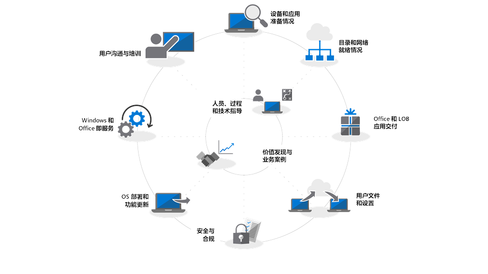

# 入门 - 新式桌面部署

云正在改变电脑的管理方式，Microsoft 智能云提供了动态见解，帮助 IT 专业人员转向新式桌面。本系列旨在帮助你计划并在 Windows 10 和 Office 365 专业增强版的基础上向新式桌面转移。

<table>
<thead>
<td></td>
<td>
<strong>入门：人员、流程和技术指导</strong>

了解新式桌面的好处、相比之前的部署的主要变化和注意事项以及最佳做法，以确保顺利过渡到 Windows 10 和 Office 365 专业增强版。
</td>
<td></td>
</thead>
</table>

>[!NOTE]
>在本系列中，我们将阐释使用现有工具的最佳方式，并向你介绍由云支持的新技术、服务和方法。要查看完整的桌面部署过程，请访问[新式桌面部署中心](https://aka.ms/HowToShift)。
>

欢迎来到新式桌面部署中心，这是我们学习如何帮助你计划向新式桌面转移的中心位置。这将允许你利用由最新生产力、团队合作和协作经验提供支持的安全工作区。

如果已经有一段时间没有部署新桌面环境，那么好消息是部署过程已经得到了改进。在过去，我们会遇到诸如应用程序兼容性之类的难题，但现在已经不再是问题，新工具以及云提供的见解，使你能够信心十足地以更快、更高效的方式向前迈进。

在此简介中，我们将概述更改的内容，并开始体验桌面部署轮。这将指导你完成向 Windows 10 和 Office 365 专业增强版转移的建议步骤，其中详细介绍了在采用新式管理技术和方法的同时，如何利用现有工具和流程。

## 为什么要升级？

Windows 10 和 Microsoft 智能云组合增强了你为用户提供最强大、丰富和安全工作区的能力，并使你能够简化支持基础结构。

新式管理实践的关键租户之一是始终保持最新的设备。通过这一系列，将看到正在交付的新功能，它们可以帮助你迁移到 Windows 10 和 Office 365 专业增强版，并了解如何在两者的半年度发布中保持最新状态。

[面向 IT 专业人员的 Windows 10](https://www.microsoft.com/zh-CN/itpro/windows-10)

## 更改的内容

我们首先看看自上次桌面部署以来发生的变更和改进。如果你还没有转变桌面环境，则很可能会使用 Windows 7 和 Office 2010 或 Office 2013。如果已转变，则会注意到自上次主要升级以来，有一些事项已随之演变。下面是一些核心变更：

**标识和访问管理** 新式桌面与云生产力、安全和管理服务相连接，其核心是一项新标识和访问管理服务：Azure Active Directory。这允许跨云服务进行单一登录和安全连接。意味着你将需要配备有 Azure AD。以此可以充分利用 Microsoft 365 服务的优势，比如 Office 365、Intune 或 Windows Autopilot。

[Microsoft 365](https://www.microsoft.com/zh-CN/microsoft-365/default.aspx)

**Secure 预启动环境** 64 位 UEFI 固件将替换 BIOS。这不仅可加快启动时间，还需要在 Windows 10 中启用许多新式安全功能。Windows 10 将在 BIOS 中运行，但强烈建议 UEFI。如果还没有从 BIOS 切换到 UEFI 和 64 位，那么现在可以开始了。有一些工具可以帮助你在 Windows 10 升级期间或升级完成后进行切换。

[使用 MBR2GPT 从 BIOS 转换为 UEFI](https://technet.microsoft.com/zh-CN/windows/mt782786.aspx)

**基于云的设备管理** 像 Microsoft Intune 这样的服务，你可以像管理其他移动设备一样，从一个位置管理 Windows 10 设备。Microsoft Intune 的独特之处是能够与 System Center Configuration Manager 共同管理 Windows 10 设备。可以使用 System Center Configuration Manager 来帮助切换到 Windows 10，然后添加 Microsoft Intune。通过协同工作，System Center Configuration Manager 将成为组织中的智能边缘，与 Microsoft 智能云相连。进而能够安全管理用户设备，无论它们在何处，也不管是连接到组织还是公有云。

[Windows 10 设备的共同管理](https://docs.microsoft.com/zh-CN/sccm/core/clients/manage/co-management-overview)

**基于云的部署服务** 当你购买新电脑时，我们已经引入了新的云服务来帮助你部署 Microsoft 365 设备。它被称为 Windows Autopilot 部署服务。AutoPilot 与你的硬件提供程序集成，且新电脑会在 Auto Pilot 中自动注册。这使得新电脑可以直接发送给最终用户。当电脑首次启动时，它会快速配置为组织所需的配置，并根据用户的特定需求进行自定义。

[Windows Autopilot](https://www.microsoft.com/zh-CN/windowsforbusiness/windows-autopilot)

**即点即用部署** 在预配 Office 桌面应用时，Office 365 专业增强版是首选项。这使你能够在开发过程中访问 Office 中的最新创新，因此你不需要等待数年就能获得新功能。还将使用名为“即点即用”的新安装。

即点即用与过去基于 MSI 的包有很大的区别。即点即用速度更快、更轻，并且它使用程序流来允许用户在几分钟内启动和运行，并在后台更新。不用担心，它仍然是 Office 的本地副本，你可以继续使用现有部署工具（比如 System Center Configuration Manager）来预配和配置应用程序。

[Office 365 专业增强版部署指南](https://docs.microsoft.com/zh-CN/DeployOffice/deployment-guide-for-office-365-proplus)

**半年度更新** 一旦移至 Windows 10 和 Office 365 专业增强版，将每半年更新一次，并提供新功能。但是，由于 Microsoft 能够从云提供见解来帮助你，你可以迅速而自信地将这些更新发布到成百上千台设备。与就地升级一样，该功能更新保留了前一个版本的应用、数据和配置。

## 部署过程轮

在开始之前，你会想要制定一个高级计划，并与必要的赞助商协作。我们的部署过程轮概述了关键步骤，帮助你确定核心团队成员和资源，以便在以下部署区域进行管理。

**[步骤 1：设备和应用就绪情况](https://aka.ms/mdd1)** 为实现成功部署，必须首先知道你所拥有的设备和应用。这意味着要对设备和应用进行盘点，并验证其兼容性。

为帮助完成此操作，可以在我们基于云的服务中找到可用工具，即 Windows Analytics。可通过 Windows Analytics 获得从数亿台电脑中收集的兼容性情报和遥测技术，进而评估设备上运行的应用和驱动程序，这样你就可以确定桌面程序的就绪情况。如果要使用，甚至可以从 Windows Analytics 将“准备部署的电脑”列表导出到 System Center Configuration Manager，这样你就可以在目标电脑准备就绪时为其构建数据驱动集合。

[开始使用升级就绪情况](https://docs.microsoft.com/zh-CN/windows/deployment/upgrade/upgrade-readiness-get-started)

**[步骤 2：目录和网络就绪情况](https://aka.ms/mdd2)** 如果尚未执行此操作，接下来你将需要实现 Azure Active Directory，以便进行标识和访问管理。还需要准备好网络以改进系统映像、应用程序包、用户文件和更新。这意味着大量的额外数据；你的网络必须有能力处理此额外负载，而不会影响组织的日常工作。我们有一系列的网络优化，从带宽限制和对等选项到动态带宽清理和差异更新。

[BranchCache 与对等缓存](https://blogs.technet.microsoft.com/swisspfe/2018/01/25/branch-cache-vs-peer-cache/)

**[步骤 3：Office 和业务线应用交付](https://aka.ms/mdd3)** 虽然 Windows 继续支持基于 MSI 的安装，但它现在也支持更新的安装机制，该机制针对自动化部署和持续更新进行了优化。Office 365 专业增强版和 Windows 2019 客户端使用即点即用，你可能想要提供一系列 UWP 应用，并且可能会逐渐发现你自己部署第三方应用和内部开发业务线应用，这些应用使用的是基于 MSIX 的新打包应用。这一步骤确保应用已准备好进行自动部署，并且你已为成功操作做好准备，而无论是使用即点即用、MSIX、基于 MSI 的传统方式部署的应用，还是从你建立业务的 Microsoft Store 部署的 UWP 应用。

[MSIX 简介](https://blogs.msdn.microsoft.com/sgern/2018/06/15/msix-intro/)

**[步骤 4：用户文件和设置迁移](https://aka.ms/mdd4)** 这是任何电脑替换或刷新周期中的关键步骤：必须确保用户文件、数据和设置成功迁移，并在迁移过程中保留。该步骤涵盖了支持手动或自动迁移的选项，其中包括已知选项和新选项。

与之前的升级过程一样，用户状态迁移工具依旧是自动化这一过程别具价值的工具，它仍然是使用 System Center Configuration Manager 或 Microsoft Deployment Toolkit 进行的迁移的组成部分。但在迁移过程中，移动所有这些数据可能会成为电脑替换的计时瓶颈，原因在于每台电脑有时传输数百 GB 两次所涉及到的物理过程 – 首先从现有桌面开始，然后再回到新桌面。OneDrive 支持的一个新选项是“已知文件夹移动”，用于在部署之前，在云中大规模同步用户文档、图片和桌面文件。

[将 Windows 已知文件夹重定向和移动到 OneDrive](https://docs.microsoft.com/zh-CN/onedrive/redirect-known-folders)

**[步骤 5：安全性和合规性](https://aka.ms/mdd5)** 在移动到 Windows 10 和 Office 365 专业增强版时，安全性和合规性是一个具备诸多优势的领域。重要的是，你要熟悉新的内置功能，并将其与已有功能进行比较。例如，Windows 10 中使用基于虚拟化的安全性的新功能可以通过将核心流程和机密从操作系统中分离出来，来防止凭证被盗，防御基于浏览器的漏洞和恶意代码执行。此外，像高级威胁防护这样的云服务提供了一个统一平台，用于安全强化、后期漏洞检测、调查和响应。高级威胁防护还可以保护你免受恶意电子邮件附件、不安全超链接等内容的侵害。

[Microsoft 安全](https://www.microsoft.com/zh-CN/security/default.aspx)

**[步骤 6：OS 部署和功能更新](https://aka.ms/mdd6)** 在一切准备就绪后，下一步是部署 OS 映像。可以使用 System Center Configuration Manage 任务序列和基础结构来完成大量的繁重工作。建议的方法是在组织中实施分阶段部署，使用一组具有代表性的硬件和应用，首先锁定目标并部署到“早期采用者组”。然后，你可以使用来自这些设备和用户的数据来逐步瞄准更多电脑。

[System Center Configuration Manager 中的操作系统部署简介](https://docs.microsoft.com/zh-CN/sccm/osd/understand/introduction-to-operating-system-deployment)

**[步骤 7：Windows 和 Office 即服务](https://aka.ms/mdd7)** 这标志着维护用户桌面资产的方式发生了重大转变。通过移动到 Windows 10（和 Office 365 专业增强版），可以将 Windows（和 Office）作为服务来管理。每隔几年，技术就会发生巨大的变化，你将不断为用户带来新功能、体验和保护。半年度功能更新在每年的秋季和春季提供新功能，而每月累积质量更新将包含安全性、可靠性和 bug 修复。虽然可以选择部署 Office 2019 客户端，但我们强烈建议你移至 Office 专业增强版。此做法遵循类似于 Windows 的服务计划，因此用户也会定期收到 Office 应用更新。

[Windows 即服务概述](https://docs.microsoft.com/zh-CN/windows/deployment/update/waas-overview)

**[步骤 8：用户通信和培训](https://aka.ms/mdd8)** 最后一步对于推动使用新功能来增强团队合作、通信、安全等至关重要。在针对早期采用者圈之外的用户进行广泛部署之前，建议推出用户通信和培训。这将有助于推动人们对 Office、Windows 或其他业务线应用和服务的新功能的使用方式的所需更改。为提供帮助，我们通过 Microsoft FastTrack 提供免费在线培训。此外，我们还发布了免费示例通信计划和时间线，以及电子邮件、社交和 Intranet 模板来帮助推出 Windows 10。作为 Microsoft 365 或 Office 365 组织，你的组织也可能符合资格并可直接支持。

## 后续步骤

现在你已了解新增功能和不同之处，而且我们已经演示了建议的部署过程轮。既然已初步了解有关切换到新式桌面的端到端指导和可用工具，那就开始行动吧。

## [步骤 1：设备和应用就绪情况](https://aka.ms/mdd1)

