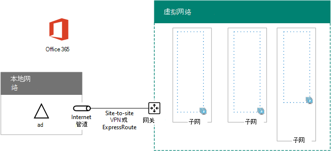

# <a name="high-availability-federated-authentication-phase-1-configure-azure"></a><span data-ttu-id="9f726-103">高可用性联合身份验证阶段 1：配置 Azure</span><span class="sxs-lookup"><span data-stu-id="9f726-103">High availability federated authentication Phase 1: Configure Azure</span></span>

<span data-ttu-id="9f726-104">在此阶段，你将在 Azure 中创建资源组、虚拟网络 (VNet) 和可用性集，这些组将在第 2、3 和 4 阶段托管虚拟机。</span><span class="sxs-lookup"><span data-stu-id="9f726-104">In this phase, you create the resource groups, virtual network (VNet), and availability sets in Azure that will host the virtual machines in phases 2, 3, and 4.</span></span> <span data-ttu-id="9f726-105">必须先完成此阶段，然后才能进入阶段 [2：配置域控制器](high-availability-federated-authentication-phase-2-configure-domain-controllers.md)。</span><span class="sxs-lookup"><span data-stu-id="9f726-105">You must complete this phase before moving on to [Phase 2: Configure domain controllers](high-availability-federated-authentication-phase-2-configure-domain-controllers.md).</span></span> <span data-ttu-id="9f726-106">有关 [所有阶段，请参阅在 Azure 中为 Microsoft 365](deploy-high-availability-federated-authentication-for-microsoft-365-in-azure.md) 部署高可用性联合身份验证。</span><span class="sxs-lookup"><span data-stu-id="9f726-106">See [Deploy high availability federated authentication for Microsoft 365 in Azure](deploy-high-availability-federated-authentication-for-microsoft-365-in-azure.md) for all of the phases.</span></span>
  
<span data-ttu-id="9f726-107">必须使用以下基本组件预配 Azure：</span><span class="sxs-lookup"><span data-stu-id="9f726-107">Azure must be provisioned with these basic components:</span></span>
  
- <span data-ttu-id="9f726-108">资源组</span><span class="sxs-lookup"><span data-stu-id="9f726-108">Resource groups</span></span>
    
- <span data-ttu-id="9f726-109">具有托管 Azure 虚拟机 (子网的 VNet) 跨界 Azure 虚拟网络</span><span class="sxs-lookup"><span data-stu-id="9f726-109">A cross-premises Azure virtual network (VNet) with subnets for hosting the Azure virtual machines</span></span>
    
- <span data-ttu-id="9f726-110">执行子网隔离的网络安全组</span><span class="sxs-lookup"><span data-stu-id="9f726-110">Network security groups for performing subnet isolation</span></span>
    
- <span data-ttu-id="9f726-111">可用性集</span><span class="sxs-lookup"><span data-stu-id="9f726-111">Availability sets</span></span>
    
## <a name="configure-azure-components"></a><span data-ttu-id="9f726-112">配置 Azure 组件</span><span class="sxs-lookup"><span data-stu-id="9f726-112">Configure Azure components</span></span>

<span data-ttu-id="9f726-113">开始配置 Azure 组件之前，请填写下表。</span><span class="sxs-lookup"><span data-stu-id="9f726-113">Before you begin configuring Azure components, fill in the following tables.</span></span> <span data-ttu-id="9f726-114">为了帮助你完成配置 Azure 的过程，请打印此部分并记下所需的信息，或将此部分复制到文档中进行填写。</span><span class="sxs-lookup"><span data-stu-id="9f726-114">To assist you in the procedures for configuring Azure, print this section and write down the needed information or copy this section to a document and fill it in.</span></span> <span data-ttu-id="9f726-115">有关 VNet 的设置，请填写表 V。</span><span class="sxs-lookup"><span data-stu-id="9f726-115">For the settings of the VNet, fill in Table V.</span></span>
  
|<span data-ttu-id="9f726-116">**项目**</span><span class="sxs-lookup"><span data-stu-id="9f726-116">**Item**</span></span>|<span data-ttu-id="9f726-117">**配置设置**</span><span class="sxs-lookup"><span data-stu-id="9f726-117">**Configuration setting**</span></span>|<span data-ttu-id="9f726-118">**说明**</span><span class="sxs-lookup"><span data-stu-id="9f726-118">**Description**</span></span>|<span data-ttu-id="9f726-119">**值**</span><span class="sxs-lookup"><span data-stu-id="9f726-119">**Value**</span></span>|
|:-----|:-----|:-----|:-----|
|<span data-ttu-id="9f726-120">1.</span><span class="sxs-lookup"><span data-stu-id="9f726-120">1.</span></span>  <br/> |<span data-ttu-id="9f726-121">VNet 名称</span><span class="sxs-lookup"><span data-stu-id="9f726-121">VNet name</span></span>  <br/> |<span data-ttu-id="9f726-122">要分配给 VNet 名称的名称 (FedAuthNet) 。</span><span class="sxs-lookup"><span data-stu-id="9f726-122">A name to assign to the VNet (example FedAuthNet).</span></span>  <br/> |  <br/> |
|<span data-ttu-id="9f726-124">2.</span><span class="sxs-lookup"><span data-stu-id="9f726-124">2.</span></span>  <br/> |<span data-ttu-id="9f726-125">VNet 位置</span><span class="sxs-lookup"><span data-stu-id="9f726-125">VNet location</span></span>  <br/> |<span data-ttu-id="9f726-126">将包含虚拟网络的区域 Azure 数据中心。</span><span class="sxs-lookup"><span data-stu-id="9f726-126">The regional Azure datacenter that will contain the virtual network.</span></span>  <br/> |  <br/> |
|<span data-ttu-id="9f726-128">3.</span><span class="sxs-lookup"><span data-stu-id="9f726-128">3.</span></span>  <br/> |<span data-ttu-id="9f726-129">VPN 设备 IP 地址</span><span class="sxs-lookup"><span data-stu-id="9f726-129">VPN device IP address</span></span>  <br/> |<span data-ttu-id="9f726-130">Internet 上 VPN 设备接口的公共 IPv4 地址。</span><span class="sxs-lookup"><span data-stu-id="9f726-130">The public IPv4 address of your VPN device's interface on the Internet.</span></span>  <br/> |  <br/> |
|<span data-ttu-id="9f726-132">4.</span><span class="sxs-lookup"><span data-stu-id="9f726-132">4.</span></span>  <br/> |<span data-ttu-id="9f726-133">VNet 地址空间</span><span class="sxs-lookup"><span data-stu-id="9f726-133">VNet address space</span></span>  <br/> |<span data-ttu-id="9f726-p103">虚拟网络的地址空间。与 IT 部门协作，以确定该地址空间。</span><span class="sxs-lookup"><span data-stu-id="9f726-p103">The address space for the virtual network. Work with your IT department to determine this address space.</span></span>  <br/> |  <br/> |
|<span data-ttu-id="9f726-137">5.</span><span class="sxs-lookup"><span data-stu-id="9f726-137">5.</span></span>  <br/> |<span data-ttu-id="9f726-138">IPsec 共享的密钥</span><span class="sxs-lookup"><span data-stu-id="9f726-138">IPsec shared key</span></span>  <br/> |<span data-ttu-id="9f726-p104">一组 32 位字符的随机字母数字字符串，用于对站点间 VPN 连接的两端进行身份验证。与 IT 或安全部门协作来确定此密钥值。或者，请参阅[创建 IPsec 预共享密钥的随机字符串](https://social.technet.microsoft.com/wiki/contents/articles/32330.create-a-random-string-for-an-ipsec-preshared-key.aspx)。  </span><span class="sxs-lookup"><span data-stu-id="9f726-p104">A 32-character random, alphanumeric string that will be used to authenticate both sides of the site-to-site VPN connection. Work with your IT or security department to determine this key value. Alternately, see [Create a random string for an IPsec preshared key](https://social.technet.microsoft.com/wiki/contents/articles/32330.create-a-random-string-for-an-ipsec-preshared-key.aspx).  </span></span><br/> |  <br/> |
   
 <span data-ttu-id="9f726-143">**表 V：跨部署虚拟网络配置**</span><span class="sxs-lookup"><span data-stu-id="9f726-143">**Table V: Cross-premises virtual network configuration**</span></span>
  
<span data-ttu-id="9f726-p105">接下来，填写针对此解决方案的子网的表 S。所有地址空间应为无类别域际路由选择 (CIDR) 格式，也称为网络前缀格式。例如，10.24.64.0/20。</span><span class="sxs-lookup"><span data-stu-id="9f726-p105">Next, fill in Table S for the subnets of this solution. All address spaces should be in Classless Interdomain Routing (CIDR) format, also known as network prefix format. An example is 10.24.64.0/20.</span></span>
  
<span data-ttu-id="9f726-147">对于前三个子网，根据虚拟网络地址空间指定名称和单个 IP 地址空间。</span><span class="sxs-lookup"><span data-stu-id="9f726-147">For the first three subnets, specify a name and a single IP address space based on the virtual network address space.</span></span> <span data-ttu-id="9f726-148">对于网关子网，请确定具有 /27 前缀 (的 27 位地址空间，) 为 Azure 网关子网配置以下前缀：</span><span class="sxs-lookup"><span data-stu-id="9f726-148">For the gateway subnet, determine the 27-bit address space (with a /27 prefix length) for the Azure gateway subnet with the following:</span></span>
  
1. <span data-ttu-id="9f726-149">将 VNet 地址空间的可变位设置为 1，直到用于网关子网的位，然后将剩余位设置为 0。</span><span class="sxs-lookup"><span data-stu-id="9f726-149">Set the variable bits in the address space of the VNet to 1, up to the bits being used by the gateway subnet, then set the remaining bits to 0.</span></span>
    
2. <span data-ttu-id="9f726-150">将生成位转换为十进制并表示为一个地址空间，其中将前缀长度设置为网关子网的大小。</span><span class="sxs-lookup"><span data-stu-id="9f726-150">Convert the resulting bits to decimal and express it as an address space with the prefix length set to the size of the gateway subnet.</span></span>
    
<span data-ttu-id="9f726-151">有关 [执行此计算的](address-space-calculator-for-azure-gateway-subnets.md) PowerShell 命令块和 C# 或 Python 控制台应用程序，请参阅 Azure 网关子网的地址空间计算器。</span><span class="sxs-lookup"><span data-stu-id="9f726-151">See [Address space calculator for Azure gateway subnets](address-space-calculator-for-azure-gateway-subnets.md) for a PowerShell command block and C# or Python console application that performs this calculation for you.</span></span>
  
<span data-ttu-id="9f726-152">与 IT 部门协作以确定这些虚拟网络地址空间中的地址空间。</span><span class="sxs-lookup"><span data-stu-id="9f726-152">Work with your IT department to determine these address spaces from the virtual network address space.</span></span>
  
|<span data-ttu-id="9f726-153">**项**</span><span class="sxs-lookup"><span data-stu-id="9f726-153">**Item**</span></span>|<span data-ttu-id="9f726-154">**子网名称**</span><span class="sxs-lookup"><span data-stu-id="9f726-154">**Subnet name**</span></span>|<span data-ttu-id="9f726-155">**子网地址空间**</span><span class="sxs-lookup"><span data-stu-id="9f726-155">**Subnet address space**</span></span>|<span data-ttu-id="9f726-156">**用途**</span><span class="sxs-lookup"><span data-stu-id="9f726-156">**Purpose**</span></span>|
|:-----|:-----|:-----|:-----|
|<span data-ttu-id="9f726-157">1.</span><span class="sxs-lookup"><span data-stu-id="9f726-157">1.</span></span>  <br/> |  <br/> |  <br/> |<span data-ttu-id="9f726-160">Active Directory 域服务 (AD DS) 域控制器和目录同步服务器虚拟机 (VM) 。</span><span class="sxs-lookup"><span data-stu-id="9f726-160">The subnet used by the Active Directory Domain Services (AD DS) domain controller and directory synchronization server virtual machines (VMs).</span></span>  <br/> |
|<span data-ttu-id="9f726-161">2.</span><span class="sxs-lookup"><span data-stu-id="9f726-161">2.</span></span>  <br/> |  <br/> |  <br/> |<span data-ttu-id="9f726-164">AD FS VM 使用的子网。</span><span class="sxs-lookup"><span data-stu-id="9f726-164">The subnet used by the AD FS VMs.</span></span>  <br/> |
|<span data-ttu-id="9f726-165">3.</span><span class="sxs-lookup"><span data-stu-id="9f726-165">3.</span></span>  <br/> |  <br/> |  <br/> |<span data-ttu-id="9f726-168">Web 应用程序代理 VM 使用的子网。</span><span class="sxs-lookup"><span data-stu-id="9f726-168">The subnet used by the web application proxy VMs.</span></span>  <br/> |
|<span data-ttu-id="9f726-169">4.</span><span class="sxs-lookup"><span data-stu-id="9f726-169">4.</span></span>  <br/> |<span data-ttu-id="9f726-170">GatewaySubnet</span><span class="sxs-lookup"><span data-stu-id="9f726-170">GatewaySubnet</span></span>  <br/> |  <br/> |<span data-ttu-id="9f726-172">Azure 网关 VM 使用的子网。</span><span class="sxs-lookup"><span data-stu-id="9f726-172">The subnet used by the Azure gateway VMs.</span></span>  <br/> |
   
 <span data-ttu-id="9f726-173">**表 S：虚拟网络中的子网**</span><span class="sxs-lookup"><span data-stu-id="9f726-173">**Table S: Subnets in the virtual network**</span></span>
  
<span data-ttu-id="9f726-174">下一步，针对分配给虚拟机和负载平衡器实例的静态 IP 地址填写表 I。</span><span class="sxs-lookup"><span data-stu-id="9f726-174">Next, fill in Table I for the static IP addresses assigned to virtual machines and load balancer instances.</span></span>
  
|<span data-ttu-id="9f726-175">**项目**</span><span class="sxs-lookup"><span data-stu-id="9f726-175">**Item**</span></span>|<span data-ttu-id="9f726-176">**用途**</span><span class="sxs-lookup"><span data-stu-id="9f726-176">**Purpose**</span></span>|<span data-ttu-id="9f726-177">**子网的 IP 地址**</span><span class="sxs-lookup"><span data-stu-id="9f726-177">**IP address on the subnet**</span></span>|<span data-ttu-id="9f726-178">**值**</span><span class="sxs-lookup"><span data-stu-id="9f726-178">**Value**</span></span>|
|:-----|:-----|:-----|:-----|
|<span data-ttu-id="9f726-179">1.</span><span class="sxs-lookup"><span data-stu-id="9f726-179">1.</span></span>  <br/> |<span data-ttu-id="9f726-180">第一个域控制器的静态 IP 地址</span><span class="sxs-lookup"><span data-stu-id="9f726-180">Static IP address of the first domain controller</span></span>  <br/> |<span data-ttu-id="9f726-181">在表 S 的项目 1 中定义的子网地址空间的第四个可能的 IP 地址。</span><span class="sxs-lookup"><span data-stu-id="9f726-181">The fourth possible IP address for the address space of the subnet defined in Item 1 of Table S.</span></span>  <br/> |  <br/> |
|<span data-ttu-id="9f726-183">2.</span><span class="sxs-lookup"><span data-stu-id="9f726-183">2.</span></span>  <br/> |<span data-ttu-id="9f726-184">第二个域控制器的静态 IP 地址</span><span class="sxs-lookup"><span data-stu-id="9f726-184">Static IP address of the second domain controller</span></span>  <br/> |<span data-ttu-id="9f726-185">在表 S 的项目 1 中定义的子网地址空间的第五个可能的 IP 地址。</span><span class="sxs-lookup"><span data-stu-id="9f726-185">The fifth possible IP address for the address space of the subnet defined in Item 1 of Table S.</span></span>  <br/> |  <br/> |
|<span data-ttu-id="9f726-187">3.</span><span class="sxs-lookup"><span data-stu-id="9f726-187">3.</span></span>  <br/> |<span data-ttu-id="9f726-188">目录同步服务器的静态 IP 地址</span><span class="sxs-lookup"><span data-stu-id="9f726-188">Static IP address of the directory synchronization server</span></span>  <br/> |<span data-ttu-id="9f726-189">表 S 的项目 1 中定义的子网地址空间的第六个可能的 IP 地址。</span><span class="sxs-lookup"><span data-stu-id="9f726-189">The sixth possible IP address for the address space of the subnet defined in Item 1 of Table S.</span></span>  <br/> |  <br/> |
|<span data-ttu-id="9f726-191">4.</span><span class="sxs-lookup"><span data-stu-id="9f726-191">4.</span></span>  <br/> |<span data-ttu-id="9f726-192">AD FS 服务器内部负载平衡器静态 IP 地址</span><span class="sxs-lookup"><span data-stu-id="9f726-192">Static IP address of the internal load balancer for the AD FS servers</span></span>  <br/> |<span data-ttu-id="9f726-193">在表 S 的项目 2 中定义的子网地址空间的第四个可能的 IP 地址。</span><span class="sxs-lookup"><span data-stu-id="9f726-193">The fourth possible IP address for the address space of the subnet defined in Item 2 of Table S.</span></span>  <br/> |  <br/> |
|<span data-ttu-id="9f726-195">5.</span><span class="sxs-lookup"><span data-stu-id="9f726-195">5.</span></span>  <br/> |<span data-ttu-id="9f726-196">第一个 AD FS 服务器的静态 IP 地址</span><span class="sxs-lookup"><span data-stu-id="9f726-196">Static IP address of the first AD FS server</span></span>  <br/> |<span data-ttu-id="9f726-197">在表 S 的项目 2 中定义的子网地址空间的第五个可能的 IP 地址。</span><span class="sxs-lookup"><span data-stu-id="9f726-197">The fifth possible IP address for the address space of the subnet defined in Item 2 of Table S.</span></span>  <br/> |  <br/> |
|<span data-ttu-id="9f726-199">6.</span><span class="sxs-lookup"><span data-stu-id="9f726-199">6.</span></span>  <br/> |<span data-ttu-id="9f726-200">第二个 AD FS 服务器的静态 IP 地址</span><span class="sxs-lookup"><span data-stu-id="9f726-200">Static IP address of the second AD FS server</span></span>  <br/> |<span data-ttu-id="9f726-201">在表 S 的项目 2 中定义的子网地址空间的第六个可能的 IP 地址。</span><span class="sxs-lookup"><span data-stu-id="9f726-201">The sixth possible IP address for the address space of the subnet defined in Item 2 of Table S.</span></span>  <br/> |  <br/> |
|<span data-ttu-id="9f726-203">7.</span><span class="sxs-lookup"><span data-stu-id="9f726-203">7.</span></span>  <br/> |<span data-ttu-id="9f726-204">第一个 Web 应用程序代理服务器的静态 IP 地址</span><span class="sxs-lookup"><span data-stu-id="9f726-204">Static IP address of the first web application proxy server</span></span>  <br/> |<span data-ttu-id="9f726-205">在表 S 的项目 3 中定义的子网地址空间的第四个可能的 IP 地址。</span><span class="sxs-lookup"><span data-stu-id="9f726-205">The fourth possible IP address for the address space of the subnet defined in Item 3 of Table S.</span></span>  <br/> |  <br/> |
|<span data-ttu-id="9f726-207">8.</span><span class="sxs-lookup"><span data-stu-id="9f726-207">8.</span></span>  <br/> |<span data-ttu-id="9f726-208">第二个 Web 应用程序代理服务器的静态 IP 地址</span><span class="sxs-lookup"><span data-stu-id="9f726-208">Static IP address of the second web application proxy server</span></span>  <br/> |<span data-ttu-id="9f726-209">在表 S 的项目 3 中定义的子网地址空间的第五个可能的 IP 地址。</span><span class="sxs-lookup"><span data-stu-id="9f726-209">The fifth possible IP address for the address space of the subnet defined in Item 3 of Table S.</span></span>  <br/> |  <br/> |
   
 <span data-ttu-id="9f726-211">**表 I：虚拟网络中的静态 IP 地址**</span><span class="sxs-lookup"><span data-stu-id="9f726-211">**Table I: Static IP addresses in the virtual network**</span></span>
  
<span data-ttu-id="9f726-212">对于本地网络中最初在虚拟网络中设置域控制器时想要使用的两个域名系统 (DNS) 服务器，请填写表 D。与 IT 部门合作以确定此列表。</span><span class="sxs-lookup"><span data-stu-id="9f726-212">For two Domain Name System (DNS) servers in your on-premises network that you want to use when initially setting up the domain controllers in your virtual network, fill in Table D. Work with your IT department to determine this list.</span></span>
  
|<span data-ttu-id="9f726-213">**项**</span><span class="sxs-lookup"><span data-stu-id="9f726-213">**Item**</span></span>|<span data-ttu-id="9f726-214">**DNS 服务器的友好名称**</span><span class="sxs-lookup"><span data-stu-id="9f726-214">**DNS server friendly name**</span></span>|<span data-ttu-id="9f726-215">**DNS 服务器的 IP 地址**</span><span class="sxs-lookup"><span data-stu-id="9f726-215">**DNS server IP address**</span></span>|
|:-----|:-----|:-----|
|<span data-ttu-id="9f726-216">1.</span><span class="sxs-lookup"><span data-stu-id="9f726-216">1.</span></span>  <br/> |  <br/> |  <br/> |
|<span data-ttu-id="9f726-219">2.</span><span class="sxs-lookup"><span data-stu-id="9f726-219">2.</span></span>  <br/> |  <br/> |  <br/> |
   
 <span data-ttu-id="9f726-222">**表 D：本地 DNS 服务器**</span><span class="sxs-lookup"><span data-stu-id="9f726-222">**Table D: On-premises DNS servers**</span></span>
  
<span data-ttu-id="9f726-223">若要通过站点到站点 VPN 连接将数据包从跨界网络路由到组织网络，必须使用本地网络配置虚拟网络，该本地网络具有 CIDR 表示法) 中所有可到达位置的地址空间 (的列表。</span><span class="sxs-lookup"><span data-stu-id="9f726-223">To route packets from the cross-premises network to your organization network across the site-to-site VPN connection, you must configure the virtual network with a local network that has a list of the address spaces (in CIDR notation) for all of the reachable locations on your organization's on-premises network.</span></span> <span data-ttu-id="9f726-224">定义本地网络的地址空间列表必须是唯一的，并且不能与其他虚拟网络或其他本地网络所使用的地址空间重叠。</span><span class="sxs-lookup"><span data-stu-id="9f726-224">The list of address spaces that define your local network must be unique and must not overlap with the address space used for other virtual networks or other local networks.</span></span>
  
<span data-ttu-id="9f726-p108">对于本地网络地址空间集，请填写表 L。请注意已列出三个空白条目，但通常需要更多。与 IT 部门协作，以确定该地址空间列表。</span><span class="sxs-lookup"><span data-stu-id="9f726-p108">For the set of local network address spaces, fill in Table L. Note that three blank entries are listed but you will typically need more. Work with your IT department to determine this list of address spaces.</span></span>
  
|<span data-ttu-id="9f726-227">**项**</span><span class="sxs-lookup"><span data-stu-id="9f726-227">**Item**</span></span>|<span data-ttu-id="9f726-228">**本地网络地址空间**</span><span class="sxs-lookup"><span data-stu-id="9f726-228">**Local network address space**</span></span>|
|:-----|:-----|
|<span data-ttu-id="9f726-229">1.</span><span class="sxs-lookup"><span data-stu-id="9f726-229">1.</span></span>  <br/> |  <br/> |
|<span data-ttu-id="9f726-231">2.</span><span class="sxs-lookup"><span data-stu-id="9f726-231">2.</span></span>  <br/> |  <br/> |
|<span data-ttu-id="9f726-233">3.</span><span class="sxs-lookup"><span data-stu-id="9f726-233">3.</span></span>  <br/> |  <br/> |
   
 <span data-ttu-id="9f726-235">**表 L：本地网络的地址前缀**</span><span class="sxs-lookup"><span data-stu-id="9f726-235">**Table L: Address prefixes for the local network**</span></span>
  
<span data-ttu-id="9f726-236">现在，让我们开始构建 Azure 基础结构，以托管 Microsoft 365 的联合身份验证。</span><span class="sxs-lookup"><span data-stu-id="9f726-236">Now let's begin building the Azure infrastructure to host your federated authentication for Microsoft 365.</span></span>
  
> [!NOTE]
> <span data-ttu-id="9f726-237">[!注意] 下面的命令集使用最新版 Azure PowerShell。</span><span class="sxs-lookup"><span data-stu-id="9f726-237">The following command sets use the latest version of Azure PowerShell.</span></span> <span data-ttu-id="9f726-238">请参阅 [Azure PowerShell 入门](/powershell/azure/get-started-azureps)。</span><span class="sxs-lookup"><span data-stu-id="9f726-238">See [Get started with Azure PowerShell](/powershell/azure/get-started-azureps).</span></span> 
  
<span data-ttu-id="9f726-239">首先，启动 Azure PowerShell 提示符并登录到你的帐户。</span><span class="sxs-lookup"><span data-stu-id="9f726-239">First, start an Azure PowerShell prompt and login to your account.</span></span>
  
```powershell
Connect-AzAccount
```

> [!TIP]
> <span data-ttu-id="9f726-240">若要根据自定义设置生成可运行的 PowerShell 命令块，请使用此 Microsoft [Excel 配置工作簿](https://github.com/MicrosoftDocs/OfficeDocs-Enterprise/raw/live/Enterprise/downloads/O365FedAuthInAzure_Config.xlsx)。</span><span class="sxs-lookup"><span data-stu-id="9f726-240">To generate ready-to-run PowerShell command blocks based on your custom settings, use this [Microsoft Excel configuration workbook](https://github.com/MicrosoftDocs/OfficeDocs-Enterprise/raw/live/Enterprise/downloads/O365FedAuthInAzure_Config.xlsx).</span></span> 

<span data-ttu-id="9f726-241">使用以下命令获得订阅名称。</span><span class="sxs-lookup"><span data-stu-id="9f726-241">Get your subscription name using the following command.</span></span>
  
```powershell
Get-AzSubscription | Sort Name | Select Name
```

<span data-ttu-id="9f726-242">对于较旧版本的 Azure PowerShell，请改为使用此命令。</span><span class="sxs-lookup"><span data-stu-id="9f726-242">For older versions of Azure PowerShell, use this command instead.</span></span>
  
```powershell
Get-AzSubscription | Sort Name | Select SubscriptionName
```

<span data-ttu-id="9f726-243">设置 Azure 订阅。</span><span class="sxs-lookup"><span data-stu-id="9f726-243">Set your Azure subscription.</span></span> <span data-ttu-id="9f726-244">用正确的名称替换引号内 \< and > 的所有内容（包括字符）。</span><span class="sxs-lookup"><span data-stu-id="9f726-244">Replace everything within the quotes, including the \< and > characters, with the correct name.</span></span>
  
```powershell
$subscrName="<subscription name>"
Select-AzSubscription -SubscriptionName $subscrName
```

<span data-ttu-id="9f726-245">接下来，创建新的资源组。</span><span class="sxs-lookup"><span data-stu-id="9f726-245">Next, create the new resource groups.</span></span> <span data-ttu-id="9f726-246">要确定唯一的一组资源组名称，请使用此命令列出现有的资源组。</span><span class="sxs-lookup"><span data-stu-id="9f726-246">To determine a unique set of resource group names, use this command to list your existing resource groups.</span></span>
  
```powershell
Get-AzResourceGroup | Sort ResourceGroupName | Select ResourceGroupName
```

<span data-ttu-id="9f726-247">为一组唯一资源组名称填写下表。</span><span class="sxs-lookup"><span data-stu-id="9f726-247">Fill in the following table for the set of unique resource group names.</span></span>
  
|<span data-ttu-id="9f726-248">**项目**</span><span class="sxs-lookup"><span data-stu-id="9f726-248">**Item**</span></span>|<span data-ttu-id="9f726-249">**资源组名称**</span><span class="sxs-lookup"><span data-stu-id="9f726-249">**Resource group name**</span></span>|<span data-ttu-id="9f726-250">**用途**</span><span class="sxs-lookup"><span data-stu-id="9f726-250">**Purpose**</span></span>|
|:-----|:-----|:-----|
|<span data-ttu-id="9f726-251">1.</span><span class="sxs-lookup"><span data-stu-id="9f726-251">1.</span></span>  <br/> |  <br/> |<span data-ttu-id="9f726-253">域控制器</span><span class="sxs-lookup"><span data-stu-id="9f726-253">Domain controllers</span></span>  <br/> |
|<span data-ttu-id="9f726-254">2.</span><span class="sxs-lookup"><span data-stu-id="9f726-254">2.</span></span>  <br/> |  <br/> |<span data-ttu-id="9f726-256">AD FS 服务器</span><span class="sxs-lookup"><span data-stu-id="9f726-256">AD FS servers</span></span>  <br/> |
|<span data-ttu-id="9f726-257">3.</span><span class="sxs-lookup"><span data-stu-id="9f726-257">3.</span></span>  <br/> |  <br/> |<span data-ttu-id="9f726-259">Web 应用程序代理服务器</span><span class="sxs-lookup"><span data-stu-id="9f726-259">Web application proxy servers</span></span>  <br/> |
|<span data-ttu-id="9f726-260">4.</span><span class="sxs-lookup"><span data-stu-id="9f726-260">4.</span></span>  <br/> |  <br/> |<span data-ttu-id="9f726-262">基础结构元素</span><span class="sxs-lookup"><span data-stu-id="9f726-262">Infrastructure elements</span></span>  <br/> |
   
 <span data-ttu-id="9f726-263">**表 R：资源组**</span><span class="sxs-lookup"><span data-stu-id="9f726-263">**Table R: Resource groups**</span></span>
  
<span data-ttu-id="9f726-264">使用这些命令创建新的资源组。</span><span class="sxs-lookup"><span data-stu-id="9f726-264">Create your new resource groups with these commands.</span></span>
  
```powershell
$locName="<an Azure location, such as West US>"
$rgName="<Table R - Item 1 - Name column>"
New-AzResourceGroup -Name $rgName -Location $locName
$rgName="<Table R - Item 2 - Name column>"
New-AzResourceGroup -Name $rgName -Location $locName
$rgName="<Table R - Item 3 - Name column>"
New-AzResourceGroup -Name $rgName -Location $locName
$rgName="<Table R - Item 4 - Name column>"
New-AzResourceGroup -Name $rgName -Location $locName
```

<span data-ttu-id="9f726-265">接下来，创建 Azure 虚拟网络及其子网。</span><span class="sxs-lookup"><span data-stu-id="9f726-265">Next, you create the Azure virtual network and its subnets.</span></span>
  
```powershell
$rgName="<Table R - Item 4 - Resource group name column>"
$locName="<your Azure location>"
$vnetName="<Table V - Item 1 - Value column>"
$vnetAddrPrefix="<Table V - Item 4 - Value column>"
$dnsServers=@( "<Table D - Item 1 - DNS server IP address column>", "<Table D - Item 2 - DNS server IP address column>" )
# Get the shortened version of the location
$locShortName=(Get-AzResourceGroup -Name $rgName).Location

# Create the subnets
$subnet1Name="<Table S - Item 1 - Subnet name column>"
$subnet1Prefix="<Table S - Item 1 - Subnet address space column>"
$subnet1=New-AzVirtualNetworkSubnetConfig -Name $subnet1Name -AddressPrefix $subnet1Prefix
$subnet2Name="<Table S - Item 2 - Subnet name column>"
$subnet2Prefix="<Table S - Item 2 - Subnet address space column>"
$subnet2=New-AzVirtualNetworkSubnetConfig -Name $subnet2Name -AddressPrefix $subnet2Prefix
$subnet3Name="<Table S - Item 3 - Subnet name column>"
$subnet3Prefix="<Table S - Item 3 - Subnet address space column>"
$subnet3=New-AzVirtualNetworkSubnetConfig -Name $subnet3Name -AddressPrefix $subnet3Prefix
$gwSubnet4Prefix="<Table S - Item 4 - Subnet address space column>"
$gwSubnet=New-AzVirtualNetworkSubnetConfig -Name "GatewaySubnet" -AddressPrefix $gwSubnet4Prefix

# Create the virtual network
New-AzVirtualNetwork -Name $vnetName -ResourceGroupName $rgName -Location $locName -AddressPrefix $vnetAddrPrefix -Subnet $gwSubnet,$subnet1,$subnet2,$subnet3 -DNSServer $dnsServers

```

<span data-ttu-id="9f726-266">接下来，为具有虚拟机的每个子网创建网络安全组。</span><span class="sxs-lookup"><span data-stu-id="9f726-266">Next, you create network security groups for each subnet that has virtual machines.</span></span> <span data-ttu-id="9f726-267">若要执行子网隔离，可以添加规则，指定允许或拒绝进入子网的网络安全组的特定类型流量。</span><span class="sxs-lookup"><span data-stu-id="9f726-267">To perform subnet isolation, you can add rules for the specific types of traffic allowed or denied to the network security group of a subnet.</span></span>
  
```powershell
# Create network security groups
$vnet=Get-AzVirtualNetwork -ResourceGroupName $rgName -Name $vnetName

New-AzNetworkSecurityGroup -Name $subnet1Name -ResourceGroupName $rgName -Location $locShortName
$nsg=Get-AzNetworkSecurityGroup -Name $subnet1Name -ResourceGroupName $rgName
Set-AzVirtualNetworkSubnetConfig -VirtualNetwork $vnet -Name $subnet1Name -AddressPrefix $subnet1Prefix -NetworkSecurityGroup $nsg

New-AzNetworkSecurityGroup -Name $subnet2Name -ResourceGroupName $rgName -Location $locShortName
$nsg=Get-AzNetworkSecurityGroup -Name $subnet2Name -ResourceGroupName $rgName
Set-AzVirtualNetworkSubnetConfig -VirtualNetwork $vnet -Name $subnet2Name -AddressPrefix $subnet2Prefix -NetworkSecurityGroup $nsg

New-AzNetworkSecurityGroup -Name $subnet3Name -ResourceGroupName $rgName -Location $locShortName
$nsg=Get-AzNetworkSecurityGroup -Name $subnet3Name -ResourceGroupName $rgName
Set-AzVirtualNetworkSubnetConfig -VirtualNetwork $vnet -Name $subnet3Name -AddressPrefix $subnet3Prefix -NetworkSecurityGroup $nsg
$vnet | Set-AzVirtualNetwork
```

<span data-ttu-id="9f726-268">下一步，请使用这些命令来创建站点间 VPN 连接的网关。</span><span class="sxs-lookup"><span data-stu-id="9f726-268">Next, use these commands to create the gateways for the site-to-site VPN connection.</span></span>
  
```powershell
$rgName="<Table R - Item 4 - Resource group name column>"
$locName="<Azure location>"
$vnetName="<Table V - Item 1 - Value column>"
$vnet=Get-AzVirtualNetwork -Name $vnetName -ResourceGroupName $rgName
$subnet=Get-AzVirtualNetworkSubnetConfig -VirtualNetwork $vnet -Name "GatewaySubnet"

# Attach a virtual network gateway to a public IP address and the gateway subnet
$publicGatewayVipName="PublicIPAddress"
$vnetGatewayIpConfigName="PublicIPConfig"
New-AzPublicIpAddress -Name $vnetGatewayIpConfigName -ResourceGroupName $rgName -Location $locName -AllocationMethod Dynamic
$publicGatewayVip=Get-AzPublicIpAddress -Name $vnetGatewayIpConfigName -ResourceGroupName $rgName
$vnetGatewayIpConfig=New-AzVirtualNetworkGatewayIpConfig -Name $vnetGatewayIpConfigName -PublicIpAddressId $publicGatewayVip.Id -Subnet $subnet

# Create the Azure gateway
$vnetGatewayName="AzureGateway"
$vnetGateway=New-AzVirtualNetworkGateway -Name $vnetGatewayName -ResourceGroupName $rgName -Location $locName -GatewayType Vpn -VpnType RouteBased -IpConfigurations $vnetGatewayIpConfig

# Create the gateway for the local network
$localGatewayName="LocalNetGateway"
$localGatewayIP="<Table V - Item 3 - Value column>"
$localNetworkPrefix=@( <comma-separated, double-quote enclosed list of the local network address prefixes from Table L, example: "10.1.0.0/24", "10.2.0.0/24"> )
$localGateway=New-AzLocalNetworkGateway -Name $localGatewayName -ResourceGroupName $rgName -Location $locName -GatewayIpAddress $localGatewayIP -AddressPrefix $localNetworkPrefix

# Define the Azure virtual network VPN connection
$vnetConnectionName="S2SConnection"
$vnetConnectionKey="<Table V - Item 5 - Value column>"
$vnetConnection=New-AzVirtualNetworkGatewayConnection -Name $vnetConnectionName -ResourceGroupName $rgName -Location $locName -ConnectionType IPsec -SharedKey $vnetConnectionKey -VirtualNetworkGateway1 $vnetGateway -LocalNetworkGateway2 $localGateway

```

> [!NOTE]
> <span data-ttu-id="9f726-269">各个用户的联合身份验证不依赖任何本地资源。</span><span class="sxs-lookup"><span data-stu-id="9f726-269">Federated authentication of individual users does not rely on any on-premises resources.</span></span> <span data-ttu-id="9f726-270">但是，如果此站点到站点 VPN 连接变得不可用，VNet 中的域控制器将不会接收在本地 Active Directory 域服务中对用户帐户和组的更新。</span><span class="sxs-lookup"><span data-stu-id="9f726-270">However, if this site-to-site VPN connection becomes unavailable, the domain controllers in the VNet will not receive updates to user accounts and groups made in the on-premises Active Directory Domain Services.</span></span> <span data-ttu-id="9f726-271">若要确保不会发生此情况，您可以为站点到站点 VPN 连接配置高可用性。</span><span class="sxs-lookup"><span data-stu-id="9f726-271">To ensure this does not happen, you can configure high availability for your site-to-site VPN connection.</span></span> <span data-ttu-id="9f726-272">有关详细信息，请参阅[高可用性跨界连接与 VNet 到 VNet 连接](/azure/vpn-gateway/vpn-gateway-highlyavailable)</span><span class="sxs-lookup"><span data-stu-id="9f726-272">For more information, see [Highly Available Cross-Premises and VNet-to-VNet Connectivity](/azure/vpn-gateway/vpn-gateway-highlyavailable)</span></span>
  
<span data-ttu-id="9f726-273">接下来，从此命令的显示内容中，记录用于虚拟网络的 Azure VPN 网关的公用 IPv4 地址。</span><span class="sxs-lookup"><span data-stu-id="9f726-273">Next, record the public IPv4 address of the Azure VPN gateway for your virtual network from the display of this command:</span></span>
  
```powershell
Get-AzPublicIpAddress -Name $publicGatewayVipName -ResourceGroupName $rgName
```

<span data-ttu-id="9f726-p114">接下来，请将本地 VPN 设备配置为连接到 Azure VPN 网关。有关详细信息，请参阅[配置 VPN 设备](/azure/vpn-gateway/vpn-gateway-about-vpn-devices)。</span><span class="sxs-lookup"><span data-stu-id="9f726-p114">Next, configure your on-premises VPN device to connect to the Azure VPN gateway. For more information, see [Configure your VPN device](/azure/vpn-gateway/vpn-gateway-about-vpn-devices).</span></span>
  
<span data-ttu-id="9f726-276">若要配置本地 VPN 设备，需要以下各项：</span><span class="sxs-lookup"><span data-stu-id="9f726-276">To configure your on-premises VPN device, you will need the following:</span></span>
  
- <span data-ttu-id="9f726-277">Azure VPN 网关的公用 IPv4 地址。</span><span class="sxs-lookup"><span data-stu-id="9f726-277">The public IPv4 address of the Azure VPN gateway.</span></span>
    
- <span data-ttu-id="9f726-278">站点到站点 VPN 连接的 IPsec 预共享密钥（表 V - 第 5 项 - 值列）。</span><span class="sxs-lookup"><span data-stu-id="9f726-278">The IPsec pre-shared key for the site-to-site VPN connection (Table V - Item 5 - Value column).</span></span>
    
<span data-ttu-id="9f726-p115">接下来，请确保虚拟网络的地址空间是可以从本地网络访问。这通常是通过以下操作完成：将对应于虚拟网络地址空间的路由添加到 VPN 设备中，然后将该路由公布到组织网络中其余的路由基础结构。与 IT 部门协作，以确定如何完成上述操作。</span><span class="sxs-lookup"><span data-stu-id="9f726-p115">Next, ensure that the address space of the virtual network is reachable from your on-premises network. This is usually done by adding a route corresponding to the virtual network address space to your VPN device and then advertising that route to the rest of the routing infrastructure of your organization network. Work with your IT department to determine how to do this.</span></span>
  
<span data-ttu-id="9f726-282">接下来，定义三个可用性集的名称。</span><span class="sxs-lookup"><span data-stu-id="9f726-282">Next, define the names of three availability sets.</span></span> <span data-ttu-id="9f726-283">填写表 A。</span><span class="sxs-lookup"><span data-stu-id="9f726-283">Fill out Table A.</span></span> 
  
|<span data-ttu-id="9f726-284">**项目**</span><span class="sxs-lookup"><span data-stu-id="9f726-284">**Item**</span></span>|<span data-ttu-id="9f726-285">**用途**</span><span class="sxs-lookup"><span data-stu-id="9f726-285">**Purpose**</span></span>|<span data-ttu-id="9f726-286">**可用性集的名称**</span><span class="sxs-lookup"><span data-stu-id="9f726-286">**Availability set name**</span></span>|
|:-----|:-----|:-----|
|<span data-ttu-id="9f726-287">1.</span><span class="sxs-lookup"><span data-stu-id="9f726-287">1.</span></span>  <br/> |<span data-ttu-id="9f726-288">域控制器</span><span class="sxs-lookup"><span data-stu-id="9f726-288">Domain controllers</span></span>  <br/> |  <br/> |
|<span data-ttu-id="9f726-290">2.</span><span class="sxs-lookup"><span data-stu-id="9f726-290">2.</span></span>  <br/> |<span data-ttu-id="9f726-291">AD FS 服务器</span><span class="sxs-lookup"><span data-stu-id="9f726-291">AD FS servers</span></span>  <br/> |  <br/> |
|<span data-ttu-id="9f726-293">3.</span><span class="sxs-lookup"><span data-stu-id="9f726-293">3.</span></span>  <br/> |<span data-ttu-id="9f726-294">Web 应用程序代理服务器</span><span class="sxs-lookup"><span data-stu-id="9f726-294">Web application proxy servers</span></span>  <br/> |  <br/> |
   
 <span data-ttu-id="9f726-296">**表 A：可用性集**</span><span class="sxs-lookup"><span data-stu-id="9f726-296">**Table A: Availability sets**</span></span>
  
<span data-ttu-id="9f726-297">在第 2、3 和 4 阶段中创建虚拟机时，将需要这些名称。</span><span class="sxs-lookup"><span data-stu-id="9f726-297">You will need these names when you create the virtual machines in phases 2, 3, and 4.</span></span>
  
<span data-ttu-id="9f726-298">使用这些 Azure PowerShell 命令创建新的可用性集。</span><span class="sxs-lookup"><span data-stu-id="9f726-298">Create the new availability sets with these Azure PowerShell commands.</span></span>
  
```powershell
$locName="<the Azure location for your new resource group>"
$rgName="<Table R - Item 1 - Resource group name column>"
$avName="<Table A - Item 1 - Availability set name column>"
New-AzAvailabilitySet -ResourceGroupName $rgName -Name $avName -Location $locName -Sku Aligned  -PlatformUpdateDomainCount 5 -PlatformFaultDomainCount 2
$rgName="<Table R - Item 2 - Resource group name column>"
$avName="<Table A - Item 2 - Availability set name column>"
New-AzAvailabilitySet -ResourceGroupName $rgName -Name $avName -Location $locName -Sku Aligned  -PlatformUpdateDomainCount 5 -PlatformFaultDomainCount 2
$rgName="<Table R - Item 3 - Resource group name column>"
$avName="<Table A - Item 3 - Availability set name column>"
New-AzAvailabilitySet -ResourceGroupName $rgName -Name $avName -Location $locName -Sku Aligned  -PlatformUpdateDomainCount 5 -PlatformFaultDomainCount 2
```

<span data-ttu-id="9f726-299">这是该阶段成功完成后生成的配置。</span><span class="sxs-lookup"><span data-stu-id="9f726-299">This is the configuration resulting from the successful completion of this phase.</span></span>
  
<span data-ttu-id="9f726-300">**第 1 阶段：Microsoft 365 高可用性联合身份验证的 Azure 基础结构**</span><span class="sxs-lookup"><span data-stu-id="9f726-300">**Phase 1: The Azure infrastructure for high availability federated authentication for Microsoft 365**</span></span>


  
## <a name="next-step"></a><span data-ttu-id="9f726-302">后续步骤</span><span class="sxs-lookup"><span data-stu-id="9f726-302">Next step</span></span>

<span data-ttu-id="9f726-303">使用 [阶段 2：配置域控制器](high-availability-federated-authentication-phase-2-configure-domain-controllers.md) 以继续配置此工作负载。</span><span class="sxs-lookup"><span data-stu-id="9f726-303">Use [Phase 2: Configure domain controllers](high-availability-federated-authentication-phase-2-configure-domain-controllers.md) to continue with the configuration of this workload.</span></span>
  
## <a name="see-also"></a><span data-ttu-id="9f726-304">另请参阅</span><span class="sxs-lookup"><span data-stu-id="9f726-304">See Also</span></span>

[<span data-ttu-id="9f726-305">在 Azure 中为 Microsoft 365 部署高可用性联合身份验证</span><span class="sxs-lookup"><span data-stu-id="9f726-305">Deploy high availability federated authentication for Microsoft 365 in Azure</span></span>](deploy-high-availability-federated-authentication-for-microsoft-365-in-azure.md)
  
[<span data-ttu-id="9f726-306">Microsoft 365 开发/测试环境的联合身份</span><span class="sxs-lookup"><span data-stu-id="9f726-306">Federated identity for your Microsoft 365 dev/test environment</span></span>](federated-identity-for-your-microsoft-365-dev-test-environment.md)
  
[<span data-ttu-id="9f726-307">Microsoft 365 解决方案和体系结构中心</span><span class="sxs-lookup"><span data-stu-id="9f726-307">Microsoft 365 solution and architecture center</span></span>](../solutions/index.yml)

[<span data-ttu-id="9f726-308">了解 Microsoft 365 标识和 Azure Active Directory</span><span class="sxs-lookup"><span data-stu-id="9f726-308">Understanding Microsoft 365 identity and Azure Active Directory</span></span>](about-microsoft-365-identity.md)