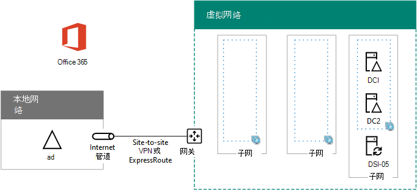

# <a name="high-availability-federated-authentication-phase-2-configure-domain-controllers"></a>高可用性联合身份验证阶段 2：配置域控制器

在部署 Azure 基础结构服务中Microsoft 365身份验证的这一阶段，在 Azure 虚拟网络中配置两个域控制器和目录同步服务器。 然后用于身份验证的客户端 Web 请求可以在 Azure 虚拟网络中进行身份验证，而不是将通过站点到站点 VPN 连接的该身份验证流量发送到本地网络。
  
> [!NOTE]
> Active Directory 联合身份验证服务 (AD FS) 无法使用 Azure Active Directory (Azure AD) 替代 Active Directory 域服务 (AD DS) 域控制器。 
  
必须先完成此阶段，然后才能进入阶段 [3：配置 AD FS 服务器](high-availability-federated-authentication-phase-3-configure-ad-fs-servers.md)。 请参阅[在 Azure 中为](deploy-high-availability-federated-authentication-for-microsoft-365-in-azure.md)Microsoft 365部署高可用性联合身份验证了解所有阶段。
  
## <a name="create-the-domain-controller-virtual-machines-in-azure"></a>在 Azure 中创建域控制器虚拟机

首先，需要填写表 M 的 **虚拟机名称** 列，并根据需要在 **最小大小** 列修改虚拟机大小。
  
|**项**|**虚拟机名称**|**库图像**|**存储类型**|**最小大小**|
|:-----|:-----|:-----|:-----|:-----|
|1.  <br/> | （第一个域控制器，例如 DC1）  <br/> |Windows Server 2016 Datacenter  <br/> |Standard_LRS  <br/> |Standard_D2  <br/> |
|2.  <br/> | （第二个域控制器，例如 DC2）  <br/> |Windows Server 2016 Datacenter  <br/> |Standard_LRS  <br/> |Standard_D2  <br/> |
|3.  <br/> |  (目录同步服务器，示例 DS1)   <br/> |Windows Server 2016 Datacenter  <br/> |Standard_LRS  <br/> |Standard_D2  <br/> |
|4.  <br/> |  (一个 AD FS 服务器，例如 ADFS1)   <br/> |Windows Server 2016 Datacenter  <br/> |Standard_LRS  <br/> |Standard_D2  <br/> |
|5.  <br/> |  (AD FS 服务器，例如 ADFS2)   <br/> |Windows Server 2016 Datacenter  <br/> |Standard_LRS  <br/> |Standard_D2  <br/> |
|6.  <br/> |  (Web 应用程序代理服务器，示例 WEB1)   <br/> |Windows Server 2016 Datacenter  <br/> |Standard_LRS  <br/> |Standard_D2  <br/> |
|7.  <br/> |  (第二个 Web 应用程序代理服务器，例如 WEB2)   <br/> |Windows Server 2016 Datacenter  <br/> |Standard_LRS  <br/> |Standard_D2  <br/> |
   
 **表 M - Azure 中用于高可用性联合身份验证的Microsoft 365虚拟机**
  
有关虚拟机大小的完整列表，请参阅[虚拟机的大小](/azure/virtual-machines/virtual-machines-windows-sizes)。
  
以下 Azure PowerShell 命令块可创建两个域控制器的虚拟机。 指定变量的值，删除 \< and > 字符。 请注意，此 Azure PowerShell 命令块使用下表中的值：
  
- 表 M，用于虚拟机
    
- 表 R，用于资源组
    
- 表 V，用于虚拟网络设置
    
- 表 S，用于子网
    
- 表 I，用于静态 IP 地址
    
- 表 A（针对可用性集）
    
回想一下，你在阶段 [1：](high-availability-federated-authentication-phase-1-configure-azure.md)配置 Azure 中定义了表 R、V、S、I 和 A。
  
> [!NOTE]
> [!注意] 下面的命令集使用最新版 Azure PowerShell。 请参阅[开始Azure PowerShell。](/powershell/azure/get-started-azureps) 
  
提供所有正确值后，在 Azure PowerShell 提示符处或本地计算机的 PowerShell 集成脚本环境 (ISE) 上运行生成块。
  
> [!TIP]
> 若要根据自定义设置生成可运行的 PowerShell 命令块，请使用此Microsoft Excel[工作簿](https://github.com/MicrosoftDocs/OfficeDocs-Enterprise/raw/live/Enterprise/downloads/O365FedAuthInAzure_Config.xlsx)。 

```powershell
# Set up variables common to both virtual machines
$locName="<your Azure location>"
$vnetName="<Table V - Item 1 - Value column>"
$subnetName="<Table S - Item 1 - Value column>"
$avName="<Table A - Item 1 - Availability set name column>"
$rgNameTier="<Table R - Item 1 - Resource group name column>"
$rgNameInfra="<Table R - Item 4 - Resource group name column>"

$rgName=$rgNameInfra
$vnet=Get-AzVirtualNetwork -Name $vnetName -ResourceGroupName $rgName
$subnet=Get-AzVirtualNetworkSubnetConfig -VirtualNetwork $vnet -Name $subnetName

$rgName=$rgNameTier
$avSet=Get-AzAvailabilitySet -Name $avName -ResourceGroupName $rgName 

# Create the first domain controller
$vmName="<Table M - Item 1 - Virtual machine name column>"
$vmSize="<Table M - Item 1 - Minimum size column>"
$staticIP="<Table I - Item 1 - Value column>"
$diskStorageType="<Table M - Item 1 - Storage type column>"
$diskSize=<size of the extra disk for Active Directory Domain Services (AD DS) data in GB>

$nic=New-AzNetworkInterface -Name ($vmName +"-NIC") -ResourceGroupName $rgName -Location $locName -Subnet $subnet -PrivateIpAddress $staticIP
$vm=New-AzVMConfig -VMName $vmName -VMSize $vmSize -AvailabilitySetId $avset.Id
$vm=Set-AzVMOSDisk -VM $vm -Name ($vmName +"-OS") -DiskSizeInGB 128 -CreateOption FromImage -StorageAccountType $diskStorageType
$diskConfig=New-AzDiskConfig -AccountType $diskStorageType -Location $locName -CreateOption Empty -DiskSizeGB $diskSize
$dataDisk1=New-AzDisk -DiskName ($vmName + "-DataDisk1") -Disk $diskConfig -ResourceGroupName $rgName
$vm=Add-AzVMDataDisk -VM $vm -Name ($vmName + "-DataDisk1") -CreateOption Attach -ManagedDiskId $dataDisk1.Id -Lun 1
$cred=Get-Credential -Message "Type the name and password of the local administrator account for the first domain controller." 
$vm=Set-AzVMOperatingSystem -VM $vm -Windows -ComputerName $vmName -Credential $cred -ProvisionVMAgent -EnableAutoUpdate
$vm=Set-AzVMSourceImage -VM $vm -PublisherName MicrosoftWindowsServer -Offer WindowsServer -Skus 2016-Datacenter -Version "latest"
$vm=Add-AzVMNetworkInterface -VM $vm -Id $nic.Id
New-AzVM -ResourceGroupName $rgName -Location $locName -VM $vm

# Create the second domain controller
$vmName="<Table M - Item 2 - Virtual machine name column>"
$vmSize="<Table M - Item 2 - Minimum size column>"
$staticIP="<Table I - Item 2 - Value column>"
$diskStorageType="<Table M - Item 2 - Storage type column>"
$diskSize=<size of the extra disk for AD DS data in GB>

$nic=New-AzNetworkInterface -Name ($vmName +"-NIC") -ResourceGroupName $rgName -Location $locName -Subnet $subnet -PrivateIpAddress $staticIP
$vm=New-AzVMConfig -VMName $vmName -VMSize $vmSize -AvailabilitySetId $avset.Id
$vm=Set-AzVMOSDisk -VM $vm -Name ($vmName +"-OS") -DiskSizeInGB 128 -CreateOption FromImage -StorageAccountType $diskStorageType
$diskConfig=New-AzDiskConfig -AccountType $diskStorageType -Location $locName -CreateOption Empty -DiskSizeGB $diskSize
$dataDisk1=New-AzDisk -DiskName ($vmName + "-DataDisk1") -Disk $diskConfig -ResourceGroupName $rgName
$vm=Add-AzVMDataDisk -VM $vm -Name ($vmName + "-DataDisk1") -CreateOption Attach -ManagedDiskId $dataDisk1.Id -Lun 1
$cred=Get-Credential -Message "Type the name and password of the local administrator account for the second domain controller." 
$vm=Set-AzVMOperatingSystem -VM $vm -Windows -ComputerName $vmName -Credential $cred -ProvisionVMAgent -EnableAutoUpdate
$vm=Set-AzVMSourceImage -VM $vm -PublisherName MicrosoftWindowsServer -Offer WindowsServer -Skus 2016-Datacenter -Version "latest"
$vm=Add-AzVMNetworkInterface -VM $vm -Id $nic.Id
New-AzVM -ResourceGroupName $rgName -Location $locName -VM $vm

# Create the directory synchronization server
$vmName="<Table M - Item 3 - Virtual machine name column>"
$vmSize="<Table M - Item 3 - Minimum size column>"
$staticIP="<Table I - Item 3 - Value column>"
$diskStorageType="<Table M - Item 3 - Storage type column>"

$nic=New-AzNetworkInterface -Name ($vmName +"-NIC") -ResourceGroupName $rgName -Location $locName -Subnet $subnet -PrivateIpAddress $staticIP
$vm=New-AzVMConfig -VMName $vmName -VMSize $vmSize

$cred=Get-Credential -Message "Type the name and password of the local administrator account for the directory synchronization server." 
$vm=Set-AzVMOperatingSystem -VM $vm -Windows -ComputerName $vmName -Credential $cred -ProvisionVMAgent -EnableAutoUpdate
$vm=Set-AzVMSourceImage -VM $vm -PublisherName MicrosoftWindowsServer -Offer WindowsServer -Skus 2016-Datacenter -Version "latest"
$vm=Add-AzVMNetworkInterface -VM $vm -Id $nic.Id
$vm=Set-AzVMOSDisk -VM $vm -Name ($vmName +"-OS") -DiskSizeInGB 128 -CreateOption FromImage -StorageAccountType $diskStorageType
New-AzVM -ResourceGroupName $rgName -Location $locName -VM $vm
```

> [!NOTE]
> 由于这些虚拟机用于 Intranet 应用程序，所以不会为它们分配公用 IP 地址或 DNS 域名称标签，也不会将它们公开到 Internet。但是，这也意味着你无法从 Azure 门户与它们进行连接。查看虚拟机的属性时“连接”选项不可用。使用远程桌面连接附件或另一个远程桌面工具连接使用其专用 IP 地址或 Intranet DNS 名称的虚拟机。
  
## <a name="configure-the-first-domain-controller"></a>配置第一个域控制器

使用你选择的远程桌面客户端并创建到第一个域控制器虚拟机的远程桌面连接。使用其 Intranet DNS 或计算机名称以及本地管理员帐户的凭据。
  
接下来，使用以下命令将额外的数据磁盘添加到第一个域控制器Windows PowerShell第一个域控制器虚拟机上的命令 **提示符中**：
  
```powershell
Get-Disk | Where PartitionStyle -eq "RAW" | Initialize-Disk -PartitionStyle MBR -PassThru | New-Partition -AssignDriveLetter -UseMaximumSize | Format-Volume -FileSystem NTFS -NewFileSystemLabel "WSAD Data"
```

接下来，使用 **ping** 命令对组织网络中的资源名称和 IP 地址执行 ping 操作，测试第一个域控制器到组织网络中的位置的连接。
  
此过程确保 DNS 名称解析正常进行（已为该虚拟机正确配置本地 DNS 服务器），并可以向/从跨本地虚拟网络发送数据。如果这个基本测试失败，请与你的 IT 部门联系，来解决 DNS 名称解析和数据包传递问题。
  
接下来，从第一个域控制器的 Windows PowerShell 命令提示符处运行以下命令：
  
```powershell
$domname="<DNS domain name of the domain for which this computer will be a domain controller, such as corp.contoso.com>"
$cred = Get-Credential -Message "Enter credentials of an account with permission to join a new domain controller to the domain"
Install-WindowsFeature AD-Domain-Services -IncludeManagementTools
Install-ADDSDomainController -InstallDns -DomainName $domname  -DatabasePath "F:\NTDS" -SysvolPath "F:\SYSVOL" -LogPath "F:\Logs" -Credential $cred
```

系统将提示你提供域管理员帐户的凭据。计算机将重新启动。
  
## <a name="configure-the-second-domain-controller"></a>配置第二个域控制器

使用你选择的远程桌面客户端并创建到第二个域控制器虚拟机的远程桌面连接。使用其 Intranet DNS 或计算机名称以及本地管理员帐户的凭据。
  
接下来，您需要使用此命令从第二个域控制器虚拟机上的 Windows PowerShell 命令提示符向第二个域控制器 **添加额外的数据磁盘**：
  
```powershell
Get-Disk | Where PartitionStyle -eq "RAW" | Initialize-Disk -PartitionStyle MBR -PassThru | New-Partition -AssignDriveLetter -UseMaximumSize | Format-Volume -FileSystem NTFS -NewFileSystemLabel "WSAD Data"
```

接下来，请运行以下命令：
  
```powershell
$domname="<DNS domain name of the domain for which this computer will be a domain controller, such as corp.contoso.com>"
$cred = Get-Credential -Message "Enter credentials of an account with permission to join a new domain controller to the domain"
Install-WindowsFeature AD-Domain-Services -IncludeManagementTools
Install-ADDSDomainController -InstallDns -DomainName $domname  -DatabasePath "F:\NTDS" -SysvolPath "F:\SYSVOL" -LogPath "F:\Logs" -Credential $cred

```

系统将提示你提供域管理员帐户的凭据。计算机将重新启动。
  
接下来，需要为虚拟网络更新 DNS 服务器，以便 Azure 为虚拟机分配两个新域控制器的 IP 地址，将它们用作其 DNS 服务器。 填写变量，然后在本地计算机上从Windows PowerShell命令提示符运行以下命令：
  
```powershell
$rgName="<Table R - Item 4 - Resource group name column>"
$adrgName="<Table R - Item 1 - Resource group name column>"
$locName="<your Azure location>"
$vnetName="<Table V - Item 1 - Value column>"
$onpremDNSIP1="<Table D - Item 1 - DNS server IP address column>"
$onpremDNSIP2="<Table D - Item 2 - DNS server IP address column>"
$staticIP1="<Table I - Item 1 - Value column>"
$staticIP2="<Table I - Item 2 - Value column>"
$firstDCName="<Table M - Item 1 - Virtual machine name column>"
$secondDCName="<Table M - Item 2 - Virtual machine name column>"

$vnet=Get-AzVirtualNetwork -ResourceGroupName $rgName -Name $vnetName
$vnet.DhcpOptions.DnsServers.Add($staticIP1)
$vnet.DhcpOptions.DnsServers.Add($staticIP2) 
$vnet.DhcpOptions.DnsServers.Remove($onpremDNSIP1)
$vnet.DhcpOptions.DnsServers.Remove($onpremDNSIP2) 
Set-AzVirtualNetwork -VirtualNetwork $vnet
Restart-AzVM -ResourceGroupName $adrgName -Name $firstDCName
Restart-AzVM -ResourceGroupName $adrgName -Name $secondDCName
```

请注意，我们重新启动两个域控制器，这样不会为它们配置本地 DNS 服务器作为 DNS 服务器。因为这两个控制器本身就是 DNS 服务器，因此在升级为域控制器后会自动为它们配置本地 DNS 服务器作为 DNS 转发器。
  
接下来，我们需要创建一个 Active Directory 复制站点以确保 Azure 虚拟网络中的服务器使用本地域控制器。使用域管理员帐户连接到任一域控制器，从管理员级 Windows PowerShell 提示符处运行以下命令：
  
```powershell
$vnet="<Table V - Item 1 - Value column>"
$vnetSpace="<Table V - Item 4 - Value column>"
New-ADReplicationSite -Name $vnet 
New-ADReplicationSubnet -Name $vnetSpace -Site $vnet
```

## <a name="configure-the-directory-synchronization-server"></a>配置目录同步服务器

使用你选择的远程桌面客户端，并创建到目录同步服务器虚拟机的远程桌面连接。 使用其 Intranet DNS 或计算机名称以及本地管理员帐户的凭据。
  
接下来，在命令提示符下使用这些命令，Windows PowerShell AD DS 域。
  
```powershell
$domName="<AD DS domain name to join, such as corp.contoso.com>"
$cred=Get-Credential -Message "Type the name and password of a domain acccount."
Add-Computer -DomainName $domName -Credential $cred
Restart-Computer
```

以下是因成功完成这一阶段后生成的配置，包含占位符计算机名称。
  
**阶段 2：Azure 中高可用性联合身份验证基础结构的域控制器和目录同步服务器**


  
## <a name="next-step"></a>后续步骤

使用 [阶段 3：配置 AD FS 服务器](high-availability-federated-authentication-phase-3-configure-ad-fs-servers.md) 以继续配置此工作负载。
  
## <a name="see-also"></a>另请参阅

[在 Azure 中为 Microsoft 365 部署高可用性联合身份验证](deploy-high-availability-federated-authentication-for-microsoft-365-in-azure.md)
  
[开发/测试Microsoft 365联合标识](federated-identity-for-your-microsoft-365-dev-test-environment.md)
  
[Microsoft 365 解决方案和体系结构中心](../solutions/index.yml)