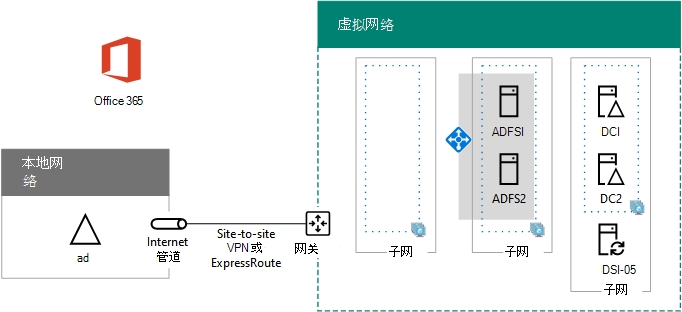

# <a name="high-availability-federated-authentication-phase-3-configure-ad-fs-servers"></a>高可用性联合身份验证阶段 3：配置 AD FS 服务器

在部署 Azure 基础结构服务中Microsoft 365身份验证的这一阶段，将创建一个内部负载平衡器以及两个 AD FS 服务器。
  
必须先完成此阶段，然后才能进入阶段 [4：配置 Web 应用程序代理](high-availability-federated-authentication-phase-4-configure-web-application-pro.md)。 请参阅[在 Azure 中为](deploy-high-availability-federated-authentication-for-microsoft-365-in-azure.md)Microsoft 365部署高可用性联合身份验证了解所有阶段。
  
## <a name="create-the-ad-fs-server-virtual-machines-in-azure"></a>在 Azure 中创建 AD FS 服务器虚拟机

使用以下 PowerShell 命令块创建两个 AD FS 服务器的虚拟机。此 PowerShell 命令集使用下表中的值：
  
- 表 M，用于虚拟机
    
- 表 R，用于资源组
    
- 表 V，用于虚拟网络设置
    
- 表 S，用于子网
    
- 表 I，用于静态 IP 地址
    
- 表 A（针对可用性集）
    
回想一下，你在阶段[2：](high-availability-federated-authentication-phase-2-configure-domain-controllers.md)配置域控制器中定义了表 M，在第 1 阶段：配置 Azure 中定义了表 R、V、S、I 和[A。](high-availability-federated-authentication-phase-1-configure-azure.md)
  
> [!NOTE]
> [!注意] 下面的命令集使用最新版 Azure PowerShell。 请参阅[开始Azure PowerShell。](/powershell/azure/get-started-azureps) 
  
首先，为两个 AD FS 服务器创建 Azure 内部负载均衡器。 指定变量的值，删除 \< and > 字符。 提供所有正确值后，在 Azure PowerShell 命令提示符处或 PowerShell ISE 上运行生成块。
  
> [!TIP]
> 若要根据自定义设置生成可运行的 PowerShell 命令块，请使用此Microsoft Excel[工作簿](https://github.com/MicrosoftDocs/OfficeDocs-Enterprise/raw/live/Enterprise/downloads/O365FedAuthInAzure_Config.xlsx)。 

```powershell
# Set up key variables
$locName="<your Azure location>"
$vnetName="<Table V - Item 1 - Value column>"
$subnetName="<Table R - Item 2 - Subnet name column>"
$privIP="<Table I - Item 4 - Value column>"
$rgName=<Table R - Item 4 - Resource group name column>"

$vnet=Get-AzVirtualNetwork -Name $vnetName -ResourceGroupName $rgName
$subnet=Get-AzVirtualNetworkSubnetConfig -VirtualNetwork $vnet -Name $subnetName

$frontendIP=New-AzLoadBalancerFrontendIpConfig -Name "ADFSServers-LBFE" -PrivateIPAddress $privIP -Subnet $subnet
$beAddressPool=New-AzLoadBalancerBackendAddressPoolConfig -Name "ADFSServers-LBBE"

$healthProbe=New-AzLoadBalancerProbeConfig -Name WebServersProbe -Protocol "TCP" -Port 443 -IntervalInSeconds 15 -ProbeCount 2
$lbrule=New-AzLoadBalancerRuleConfig -Name "HTTPSTraffic" -FrontendIpConfiguration $frontendIP -BackendAddressPool $beAddressPool -Probe $healthProbe -Protocol "TCP" -FrontendPort 443 -BackendPort 443
New-AzLoadBalancer -ResourceGroupName $rgName -Name "ADFSServers" -Location $locName -LoadBalancingRule $lbrule -BackendAddressPool $beAddressPool -Probe $healthProbe -FrontendIpConfiguration $frontendIP
```

接下来，创建 AD FS 服务器虚拟机。
  
提供所有正确值后，在 Azure PowerShell 命令提示符处或 PowerShell ISE 上运行生成块。
  
```powershell
# Set up variables common to both virtual machines
$locName="<your Azure location>"
$vnetName="<Table V - Item 1 - Value column>"
$subnetName="<Table R - Item 2 - Subnet name column>"
$avName="<Table A - Item 2 - Availability set name column>"
$rgNameTier="<Table R - Item 2 - Resource group name column>"
$rgNameInfra="<Table R - Item 4 - Resource group name column>"

$rgName=$rgNameInfra
$vnet=Get-AzVirtualNetwork -Name $vnetName -ResourceGroupName $rgName
$subnet=Get-AzVirtualNetworkSubnetConfig -VirtualNetwork $vnet -Name $subnetName
$backendSubnet=Get-AzVirtualNetworkSubnetConfig -Name $subnetName -VirtualNetwork $vnet
$webLB=Get-AzLoadBalancer -ResourceGroupName $rgName -Name "ADFSServers"

$rgName=$rgNameTier
$avSet=Get-AzAvailabilitySet -Name $avName -ResourceGroupName $rgName

# Create the first ADFS server virtual machine
$vmName="<Table M - Item 4 - Virtual machine name column>"
$vmSize="<Table M - Item 4 - Minimum size column>"
$staticIP="<Table I - Item 5 - Value column>"
$diskStorageType="<Table M - Item 4 - Storage type column>"

$nic=New-AzNetworkInterface -Name ($vmName +"-NIC") -ResourceGroupName $rgName -Location $locName -Subnet $backendSubnet -LoadBalancerBackendAddressPool $webLB.BackendAddressPools[0] -PrivateIpAddress $staticIP
$vm=New-AzVMConfig -VMName $vmName -VMSize $vmSize -AvailabilitySetId $avset.Id

$cred=Get-Credential -Message "Type the name and password of the local administrator account for the first AD FS server." 
$vm=Set-AzVMOperatingSystem -VM $vm -Windows -ComputerName $vmName -Credential $cred -ProvisionVMAgent -EnableAutoUpdate
$vm=Set-AzVMSourceImage -VM $vm -PublisherName MicrosoftWindowsServer -Offer WindowsServer -Skus 2016-Datacenter -Version "latest"
$vm=Add-AzVMNetworkInterface -VM $vm -Id $nic.Id
$vm=Set-AzVMOSDisk -VM $vm -Name ($vmName +"-OS") -DiskSizeInGB 128 -CreateOption FromImage -StorageAccountType $diskStorageType
New-AzVM -ResourceGroupName $rgName -Location $locName -VM $vm

# Create the second AD FS virtual machine
$vmName="<Table M - Item 5 - Virtual machine name column>"
$vmSize="<Table M - Item 5 - Minimum size column>"
$staticIP="<Table I - Item 6 - Value column>"
$diskStorageType="<Table M - Item 5 - Storage type column>"

$nic=New-AzNetworkInterface -Name ($vmName +"-NIC") -ResourceGroupName $rgName -Location $locName  -Subnet $backendSubnet -LoadBalancerBackendAddressPool $webLB.BackendAddressPools[0] -PrivateIpAddress $staticIP
$vm=New-AzVMConfig -VMName $vmName -VMSize $vmSize -AvailabilitySetId $avset.Id

$cred=Get-Credential -Message "Type the name and password of the local administrator account for the second AD FS server." 
$vm=Set-AzVMOperatingSystem -VM $vm -Windows -ComputerName $vmName -Credential $cred -ProvisionVMAgent -EnableAutoUpdate
$vm=Set-AzVMSourceImage -VM $vm -PublisherName MicrosoftWindowsServer -Offer WindowsServer -Skus 2016-Datacenter -Version "latest"
$vm=Add-AzVMNetworkInterface -VM $vm -Id $nic.Id
$vm=Set-AzVMOSDisk -VM $vm -Name ($vmName +"-OS") -DiskSizeInGB 128 -CreateOption FromImage -StorageAccountType $diskStorageType
New-AzVM -ResourceGroupName $rgName -Location $locName -VM $vm

```

> [!NOTE]
> 由于这些虚拟机用于 Intranet 应用程序，所以不会为它们分配公用 IP 地址或 DNS 域名称标签，也不会将它们公开到 Internet。但是，这也意味着你无法从 Azure 门户与它们进行连接。查看虚拟机的属性时“连接”选项不可用。使用远程桌面连接附件或另一个远程桌面工具连接使用其专用 IP 地址或 Intranet DNS 名称的虚拟机。
  
对于每个虚拟机，请使用所选择的远程桌面客户端并创建远程桌面连接。使用其 Intranet DNS 或计算机名称以及本地管理员帐户的凭据。
  
对于每个虚拟机，在命令提示符下 (这些命令) AD DS Windows PowerShell域。
  
```powershell
$domName="<AD DS domain name to join, such as corp.contoso.com>"
$cred=Get-Credential -Message "Type the name and password of a domain acccount."
Add-Computer -DomainName $domName -Credential $cred
Restart-Computer
```

以下是因成功完成这一阶段后生成的配置，包含占位符计算机名称。
  
**阶段 3：Azure 中用于高可用性联合身份验证基础结构的 AD FS 服务器和内部负载均衡器**


  
## <a name="next-step"></a>后续步骤

使用 [阶段 4：配置 Web](high-availability-federated-authentication-phase-4-configure-web-application-pro.md) 应用程序代理以继续配置此工作负载。
  
## <a name="see-also"></a>另请参阅

[在 Azure 中为 Microsoft 365 部署高可用性联合身份验证](deploy-high-availability-federated-authentication-for-microsoft-365-in-azure.md)
  
[开发/测试Microsoft 365联合标识](federated-identity-for-your-microsoft-365-dev-test-environment.md)