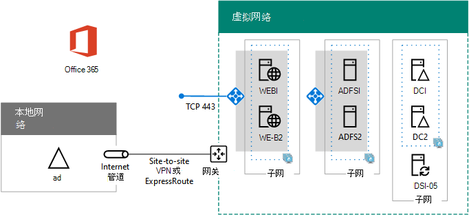

# <a name="high-availability-federated-authentication-phase-4-configure-web-application-proxies"></a><span data-ttu-id="6a5e0-103">高可用性联合身份验证阶段 4：配置 Web 应用程序代理</span><span class="sxs-lookup"><span data-stu-id="6a5e0-103">High availability federated authentication Phase 4: Configure web application proxies</span></span>

<span data-ttu-id="6a5e0-104">在部署 Azure 基础结构服务中 Microsoft 365 联合身份验证的高可用性的这一阶段，将创建一个内部负载平衡器以及两个 AD FS 服务器。</span><span class="sxs-lookup"><span data-stu-id="6a5e0-104">In this phase of deploying high availability for Microsoft 365 federated authentication in Azure infrastructure services, you create an internal load balancer and two AD FS servers.</span></span>
  
<span data-ttu-id="6a5e0-105">必须先完成此阶段，然后才能进入阶段 [5：为 Microsoft 365 配置联合身份验证](high-availability-federated-authentication-phase-5-configure-federated-authentic.md)。</span><span class="sxs-lookup"><span data-stu-id="6a5e0-105">You must complete this phase before moving on to [Phase 5: Configure federated authentication for Microsoft 365](high-availability-federated-authentication-phase-5-configure-federated-authentic.md).</span></span> <span data-ttu-id="6a5e0-106">有关 [所有阶段，请参阅在 Azure 中为 Microsoft 365](deploy-high-availability-federated-authentication-for-microsoft-365-in-azure.md) 部署高可用性联合身份验证。</span><span class="sxs-lookup"><span data-stu-id="6a5e0-106">See [Deploy high availability federated authentication for Microsoft 365 in Azure](deploy-high-availability-federated-authentication-for-microsoft-365-in-azure.md) for all of the phases.</span></span>
  
## <a name="create-the-internet-facing-load-balancer-in-azure"></a><span data-ttu-id="6a5e0-107">在 Azure 中创建面向 Internet 的负载均衡器</span><span class="sxs-lookup"><span data-stu-id="6a5e0-107">Create the Internet-facing load balancer in Azure</span></span>

<span data-ttu-id="6a5e0-108">必须创建面向 Internet 的负载均衡器，以便 Azure 在两个 Web 应用程序代理服务器之间平均分发来自 Internet 的传入客户端身份验证通信。</span><span class="sxs-lookup"><span data-stu-id="6a5e0-108">You must create an Internet-facing load balancer so that Azure distributes the incoming client authentication traffic from the Internet evenly among the two web application proxy servers.</span></span>
  
> [!NOTE]
> <span data-ttu-id="6a5e0-109">[!注意] 下面的命令集使用最新版 Azure PowerShell。</span><span class="sxs-lookup"><span data-stu-id="6a5e0-109">The following command sets use the latest version of Azure PowerShell.</span></span> <span data-ttu-id="6a5e0-110">请参阅 [Azure PowerShell 入门](/powershell/azure/get-started-azureps)。</span><span class="sxs-lookup"><span data-stu-id="6a5e0-110">See [Get started with Azure PowerShell](/powershell/azure/get-started-azureps).</span></span> 
  
<span data-ttu-id="6a5e0-111">提供位置和资源组值后，在 Azure PowerShell 命令提示符处或 PowerShell ISE 中运行生成块。</span><span class="sxs-lookup"><span data-stu-id="6a5e0-111">When you have supplied location and resource group values, run the resulting block at the Azure PowerShell command prompt or in the PowerShell ISE.</span></span>
  
> [!TIP]
> <span data-ttu-id="6a5e0-112">若要根据自定义设置生成可运行的 PowerShell 命令块，请使用此 Microsoft [Excel 配置工作簿](https://github.com/MicrosoftDocs/OfficeDocs-Enterprise/raw/live/Enterprise/downloads/O365FedAuthInAzure_Config.xlsx)。</span><span class="sxs-lookup"><span data-stu-id="6a5e0-112">To generate ready-to-run PowerShell command blocks based on your custom settings, use this [Microsoft Excel configuration workbook](https://github.com/MicrosoftDocs/OfficeDocs-Enterprise/raw/live/Enterprise/downloads/O365FedAuthInAzure_Config.xlsx).</span></span> 

```powershell
# Set up key variables
$locName="<your Azure location>"
$rgName="<Table R - Item 4 - Resource group name column>"

$publicIP=New-AzPublicIpAddress -ResourceGroupName $rgName -Name "WebProxyPublicIP" -Location $LocName -AllocationMethod "Static"
$frontendIP=New-AzLoadBalancerFrontendIpConfig -Name "WebAppProxyServers-LBFE" -PublicIpAddress $publicIP
$beAddressPool=New-AzLoadBalancerBackendAddressPoolConfig -Name "WebAppProxyServers-LBBE"
$healthProbe=New-AzLoadBalancerProbeConfig -Name "WebServersProbe" -Protocol "TCP" -Port 443 -IntervalInSeconds 15 -ProbeCount 2
$lbrule=New-AzLoadBalancerRuleConfig -Name "WebTraffic" -FrontendIpConfiguration $frontendIP -BackendAddressPool $beAddressPool -Probe $healthProbe -Protocol "TCP" -FrontendPort 443 -BackendPort 443
New-AzLoadBalancer -ResourceGroupName $rgName -Name "WebAppProxyServers" -Location $locName -LoadBalancingRule $lbrule -BackendAddressPool $beAddressPool -Probe $healthProbe -FrontendIpConfiguration $frontendIP
```

<span data-ttu-id="6a5e0-113">若要显示分配给面向 Internet 的负载均衡器的公用 IP 地址，请在本地计算机上的 Azure PowerShell 命令提示符处运行以下命令：</span><span class="sxs-lookup"><span data-stu-id="6a5e0-113">To display the public IP address assigned to your Internet-facing load balancer, run these commands at the Azure PowerShell command prompt on your local computer:</span></span>
  
```powershell
Write-Host (Get-AzPublicIpaddress -Name "WebProxyPublicIP" -ResourceGroup $rgName).IPAddress
```

## <a name="determine-your-federation-service-fqdn-and-create-dns-records"></a><span data-ttu-id="6a5e0-114">确定联合身份验证服务 FQDN 并创建 DNS 记录</span><span class="sxs-lookup"><span data-stu-id="6a5e0-114">Determine your federation service FQDN and create DNS records</span></span>

<span data-ttu-id="6a5e0-115">需要确定 DNS 名称以在 Internet 上标识联合身份验证服务名称。</span><span class="sxs-lookup"><span data-stu-id="6a5e0-115">You need to determine the DNS name to identify your federation service name on the Internet.</span></span> <span data-ttu-id="6a5e0-116">Azure AD Connect 将在阶段 5 中用此名称配置 Microsoft 365，该名称将成为 Microsoft 365 发送到连接客户端以获取安全令牌的 URL 的一部分。</span><span class="sxs-lookup"><span data-stu-id="6a5e0-116">Azure AD Connect will configure Microsoft 365 with this name in Phase 5, which will become part of the URL that Microsoft 365 sends to connecting clients to get a security token.</span></span> <span data-ttu-id="6a5e0-117">例如，fs.contoso.com（fs 代表联合身份验证服务）。</span><span class="sxs-lookup"><span data-stu-id="6a5e0-117">An example is fs.contoso.com (fs stands for federation service).</span></span>
  
<span data-ttu-id="6a5e0-118">在拥有联合身份验证服务 FDQN 之后，创建联合身份验证服务 FDQN 的公用 DNS 域 A 记录，该完全限定的域名可解析为面向 Internet 的 Azure 负载均衡器的公用 IP 地址。</span><span class="sxs-lookup"><span data-stu-id="6a5e0-118">Once you have your federation service FDQN, create a public DNS domain A record for the federation service FDQN that resolves to the public IP address of the Azure Internet-facing load balancer.</span></span>
  
|<span data-ttu-id="6a5e0-119">**名称**</span><span class="sxs-lookup"><span data-stu-id="6a5e0-119">**Name**</span></span>|<span data-ttu-id="6a5e0-120">**类型**</span><span class="sxs-lookup"><span data-stu-id="6a5e0-120">**Type**</span></span>|<span data-ttu-id="6a5e0-121">**TTL**</span><span class="sxs-lookup"><span data-stu-id="6a5e0-121">**TTL**</span></span>|<span data-ttu-id="6a5e0-122">**值**</span><span class="sxs-lookup"><span data-stu-id="6a5e0-122">**Value**</span></span>|
|:-----|:-----|:-----|:-----|
|<span data-ttu-id="6a5e0-123">联合身份验证服务 FDQN</span><span class="sxs-lookup"><span data-stu-id="6a5e0-123">federation service FDQN</span></span>  <br/> |<span data-ttu-id="6a5e0-124">A</span><span class="sxs-lookup"><span data-stu-id="6a5e0-124">A</span></span>  <br/> |<span data-ttu-id="6a5e0-125">3600</span><span class="sxs-lookup"><span data-stu-id="6a5e0-125">3600</span></span>  <br/> |<span data-ttu-id="6a5e0-126">面向 Internet 的 Azure 负载均衡器的公用 IP 地址（通过上一节中的 **Write-Host** 命令显示)</span><span class="sxs-lookup"><span data-stu-id="6a5e0-126">public IP address of the Azure Internet-facing load balancer (displayed by the **Write-Host** command in the previous section)</span></span> <br/> |
   
<span data-ttu-id="6a5e0-127">下面是一个示例：</span><span class="sxs-lookup"><span data-stu-id="6a5e0-127">Here is an example:</span></span>
  
|<span data-ttu-id="6a5e0-128">**名称**</span><span class="sxs-lookup"><span data-stu-id="6a5e0-128">**Name**</span></span>|<span data-ttu-id="6a5e0-129">**类型**</span><span class="sxs-lookup"><span data-stu-id="6a5e0-129">**Type**</span></span>|<span data-ttu-id="6a5e0-130">**TTL**</span><span class="sxs-lookup"><span data-stu-id="6a5e0-130">**TTL**</span></span>|<span data-ttu-id="6a5e0-131">**值**</span><span class="sxs-lookup"><span data-stu-id="6a5e0-131">**Value**</span></span>|
|:-----|:-----|:-----|:-----|
|<span data-ttu-id="6a5e0-132">fs.contoso.com</span><span class="sxs-lookup"><span data-stu-id="6a5e0-132">fs.contoso.com</span></span>  <br/> |<span data-ttu-id="6a5e0-133">A</span><span class="sxs-lookup"><span data-stu-id="6a5e0-133">A</span></span>  <br/> |<span data-ttu-id="6a5e0-134">3600</span><span class="sxs-lookup"><span data-stu-id="6a5e0-134">3600</span></span>  <br/> |<span data-ttu-id="6a5e0-135">131.107.249.117</span><span class="sxs-lookup"><span data-stu-id="6a5e0-135">131.107.249.117</span></span>  <br/> |
   
<span data-ttu-id="6a5e0-136">接下来，将一个 DNS 地址记录添加到组织的专用 DNS 命名空间，以将联合身份验证服务 FQDN 解析为分配给 AD FS 服务器（表 I，第 4 项，值列）的内部负载均衡器的专用 IP 地址。</span><span class="sxs-lookup"><span data-stu-id="6a5e0-136">Next, add a DNS address record to your organization's private DNS namespace that resolves your federation service FQDN to the private IP address assigned to the internal load balancer for the AD FS servers (Table I, item 4, Value column).</span></span>
  
## <a name="create-the-web-application-proxy-server-virtual-machines-in-azure"></a><span data-ttu-id="6a5e0-137">在 Azure 中创建 Web 应用程序代理服务器虚拟机</span><span class="sxs-lookup"><span data-stu-id="6a5e0-137">Create the web application proxy server virtual machines in Azure</span></span>

<span data-ttu-id="6a5e0-138">使用下面的 Azure PowerShell 命令块为两个 Web 应用程序代理服务器创建虚拟机。 </span><span class="sxs-lookup"><span data-stu-id="6a5e0-138">Use the following block of Azure PowerShell commands to create the virtual machines for the two web application proxy servers.</span></span> 
  
<span data-ttu-id="6a5e0-139">请注意，以下 Azure PowerShell 命令集使用下表中的值：</span><span class="sxs-lookup"><span data-stu-id="6a5e0-139">Note that the following Azure PowerShell command sets use values from the following tables:</span></span>
  
- <span data-ttu-id="6a5e0-140">表 M，用于虚拟机</span><span class="sxs-lookup"><span data-stu-id="6a5e0-140">Table M, for your virtual machines</span></span>
    
- <span data-ttu-id="6a5e0-141">表 R，用于资源组</span><span class="sxs-lookup"><span data-stu-id="6a5e0-141">Table R, for your resource groups</span></span>
    
- <span data-ttu-id="6a5e0-142">表 V，用于虚拟网络设置</span><span class="sxs-lookup"><span data-stu-id="6a5e0-142">Table V, for your virtual network settings</span></span>
    
- <span data-ttu-id="6a5e0-143">表 S，用于子网</span><span class="sxs-lookup"><span data-stu-id="6a5e0-143">Table S, for your subnets</span></span>
    
- <span data-ttu-id="6a5e0-144">表 I，用于静态 IP 地址</span><span class="sxs-lookup"><span data-stu-id="6a5e0-144">Table I, for your static IP addresses</span></span>
    
- <span data-ttu-id="6a5e0-145">表 A（针对可用性集）</span><span class="sxs-lookup"><span data-stu-id="6a5e0-145">Table A, for your availability sets</span></span>
    
<span data-ttu-id="6a5e0-146">回想一下，你在阶段[2：](high-availability-federated-authentication-phase-2-configure-domain-controllers.md)配置域控制器中定义了表 M，在第 1 阶段：配置 Azure 中定义了表 R、V、S、I 和[A。](high-availability-federated-authentication-phase-1-configure-azure.md)</span><span class="sxs-lookup"><span data-stu-id="6a5e0-146">Recall that you defined Table M in [Phase 2: Configure domain controllers](high-availability-federated-authentication-phase-2-configure-domain-controllers.md) and Tables R, V, S, I, and A in [Phase 1: Configure Azure](high-availability-federated-authentication-phase-1-configure-azure.md).</span></span>
  
<span data-ttu-id="6a5e0-147">提供所有正确值后，在 Azure PowerShell 命令提示符处或 PowerShell ISE 上运行生成块。</span><span class="sxs-lookup"><span data-stu-id="6a5e0-147">When you have supplied all the proper values, run the resulting block at the Azure PowerShell command prompt or in the PowerShell ISE.</span></span>
  
```powershell
# Set up variables common to both virtual machines
$locName="<your Azure location>"
$vnetName="<Table V - Item 1 - Value column>"
$subnetName="<Table R - Item 3 - Subnet name column>"
$avName="<Table A - Item 3 - Availability set name column>"
$rgNameTier="<Table R - Item 3 - Resource group name column>"
$rgNameInfra="<Table R - Item 4 - Resource group name column>"

$rgName=$rgNameInfra
$vnet=Get-AzVirtualNetwork -Name $vnetName -ResourceGroupName $rgName
$subnet=Get-AzVirtualNetworkSubnetConfig -VirtualNetwork $vnet -Name $subnetName
$backendSubnet=Get-AzVirtualNetworkSubnetConfig -Name $subnetName -VirtualNetwork $vnet
$webLB=Get-AzLoadBalancer -ResourceGroupName $rgName -Name "WebAppProxyServers"

$rgName=$rgNameTier
$avSet=Get-AzAvailabilitySet -Name $avName -ResourceGroupName $rgName

# Create the first web application proxy server virtual machine
$vmName="<Table M - Item 6 - Virtual machine name column>"
$vmSize="<Table M - Item 6 - Minimum size column>"
$staticIP="<Table I - Item 7 - Value column>"
$diskStorageType="<Table M - Item 6 - Storage type column>"

$nic=New-AzNetworkInterface -Name ($vmName +"-NIC") -ResourceGroupName $rgName -Location $locName -Subnet $backendSubnet -LoadBalancerBackendAddressPool $webLB.BackendAddressPools[0] -PrivateIpAddress $staticIP
$vm=New-AzVMConfig -VMName $vmName -VMSize $vmSize -AvailabilitySetId $avset.Id

$cred=Get-Credential -Message "Type the name and password of the local administrator account for the first web application proxy server." 
$vm=Set-AzVMOperatingSystem -VM $vm -Windows -ComputerName $vmName -Credential $cred -ProvisionVMAgent -EnableAutoUpdate
$vm=Set-AzVMSourceImage -VM $vm -PublisherName MicrosoftWindowsServer -Offer WindowsServer -Skus 2016-Datacenter -Version "latest"
$vm=Add-AzVMNetworkInterface -VM $vm -Id $nic.Id
$vm=Set-AzVMOSDisk -VM $vm -Name ($vmName +"-OS") -DiskSizeInGB 128 -CreateOption FromImage -StorageAccountType $diskStorageType
New-AzVM -ResourceGroupName $rgName -Location $locName -VM $vm

# Create the second web application proxy virtual machine
$vmName="<Table M - Item 7 - Virtual machine name column>"
$vmSize="<Table M - Item 7 - Minimum size column>"
$staticIP="<Table I - Item 8 - Value column>"
$diskStorageType="<Table M - Item 7 - Storage type column>"

$nic=New-AzNetworkInterface -Name ($vmName +"-NIC") -ResourceGroupName $rgName -Location $locName  -Subnet $backendSubnet -LoadBalancerBackendAddressPool $webLB.BackendAddressPools[0] -PrivateIpAddress $staticIP
$vm=New-AzVMConfig -VMName $vmName -VMSize $vmSize -AvailabilitySetId $avset.Id

$cred=Get-Credential -Message "Type the name and password of the local administrator account for the second web application proxy server." 
$vm=Set-AzVMOperatingSystem -VM $vm -Windows -ComputerName $vmName -Credential $cred -ProvisionVMAgent -EnableAutoUpdate
$vm=Set-AzVMSourceImage -VM $vm -PublisherName MicrosoftWindowsServer -Offer WindowsServer -Skus 2016-Datacenter -Version "latest"
$vm=Add-AzVMNetworkInterface -VM $vm -Id $nic.Id
$vm=Set-AzVMOSDisk -VM $vm -Name ($vmName +"-OS") -DiskSizeInGB 128 -CreateOption FromImage -StorageAccountType $diskStorageType
New-AzVM -ResourceGroupName $rgName -Location $locName -VM $vm
```

> [!NOTE]
> <span data-ttu-id="6a5e0-p104">由于这些虚拟机用于 Intranet 应用程序，所以不会为它们分配公用 IP 地址或 DNS 域名称标签，也不会将它们公开到 Internet。但是，这也意味着你无法从 Azure 门户与它们进行连接。查看虚拟机的属性时“连接”选项不可用。使用远程桌面连接附件或其他远程桌面工具连接使用其专用 IP 地址或 Intranet DNS 名称及本地 Administrator 帐户凭据的虚拟机。</span><span class="sxs-lookup"><span data-stu-id="6a5e0-p104">Because these virtual machines are for an intranet application, they are not assigned a public IP address or a DNS domain name label and exposed to the Internet. However, this also means that you cannot connect to them from the Azure portal. The **Connect** option is unavailable when you view the properties of the virtual machine. Use the Remote Desktop Connection accessory or another Remote Desktop tool to connect to the virtual machine using its private IP address or intranet DNS name and the credentials of the local administrator account.</span></span>
  
<span data-ttu-id="6a5e0-152">以下是因成功完成这一阶段后生成的配置，包含占位符计算机名称。</span><span class="sxs-lookup"><span data-stu-id="6a5e0-152">Here is the configuration resulting from the successful completion of this phase, with placeholder computer names.</span></span>
  
<span data-ttu-id="6a5e0-153">**阶段 4：Azure 中用于高可用性联合身份验证基础结构的面向 Internet 的负载均衡器和 Web 应用程序代理服务器**</span><span class="sxs-lookup"><span data-stu-id="6a5e0-153">**Phase 4: The Internet-facing load balancer and web application proxy servers for your high availability federated authentication infrastructure in Azure**</span></span>


  
## <a name="next-step"></a><span data-ttu-id="6a5e0-155">后续步骤</span><span class="sxs-lookup"><span data-stu-id="6a5e0-155">Next step</span></span>

<span data-ttu-id="6a5e0-156">使用 [阶段 5：为 Microsoft 365](high-availability-federated-authentication-phase-5-configure-federated-authentic.md) 配置联合身份验证以继续配置此工作负载。</span><span class="sxs-lookup"><span data-stu-id="6a5e0-156">Use [Phase 5: Configure federated authentication for Microsoft 365](high-availability-federated-authentication-phase-5-configure-federated-authentic.md) to continue configuring this workload.</span></span>
  
## <a name="see-also"></a><span data-ttu-id="6a5e0-157">另请参阅</span><span class="sxs-lookup"><span data-stu-id="6a5e0-157">See Also</span></span>

[<span data-ttu-id="6a5e0-158">在 Azure 中为 Microsoft 365 部署高可用性联合身份验证</span><span class="sxs-lookup"><span data-stu-id="6a5e0-158">Deploy high availability federated authentication for Microsoft 365 in Azure</span></span>](deploy-high-availability-federated-authentication-for-microsoft-365-in-azure.md)
  
[<span data-ttu-id="6a5e0-159">Microsoft 365 开发/测试环境的联合身份</span><span class="sxs-lookup"><span data-stu-id="6a5e0-159">Federated identity for your Microsoft 365 dev/test environment</span></span>](federated-identity-for-your-microsoft-365-dev-test-environment.md)
  
[<span data-ttu-id="6a5e0-160">Microsoft 365 解决方案和体系结构中心</span><span class="sxs-lookup"><span data-stu-id="6a5e0-160">Microsoft 365 solution and architecture center</span></span>](../solutions/index.yml)