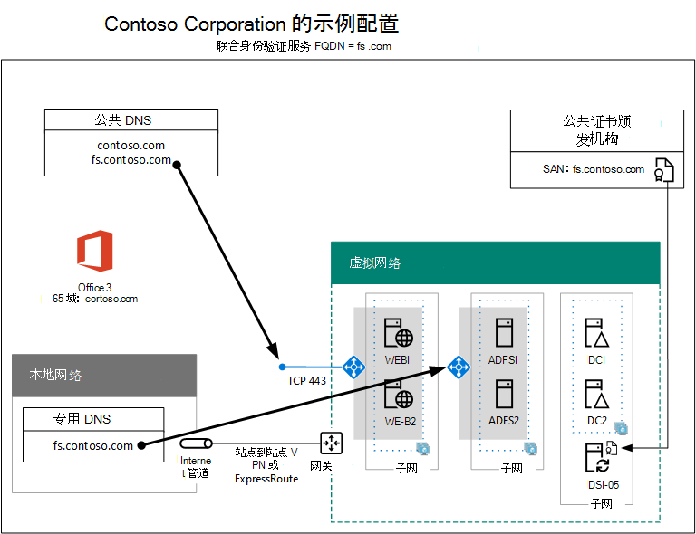

# 高可用性联合身份验证阶段 5：为用户配置Microsoft 365High availability federated authentication Phase 5: Configure federated authentication for Microsoft 365

在 Azure 基础结构服务中为 Microsoft 365 部署高可用性联合身份验证的最后阶段，获取并安装公共证书颁发机构颁发的证书，验证配置，然后在目录同步服务器上安装和运行 Azure AD 连接。In this final phase of deploying high availability federated authentication for Microsoft 365 in Azure infrastructure services, you get and install a certificate issued by a public certification authority, verify your configuration, and then install and run Azure AD Connect on the directory synchronization server. Azure AD 连接配置 Microsoft 365 订阅和 Active Directory 联合身份验证服务 (AD FS) 和 Web 应用程序代理服务器进行联合身份验证。Azure AD Connect configures your Microsoft 365 subscription and your Active Directory Federation Services (AD FS) and web application proxy servers for federated authentication.
  
请参阅[在 Azure 中为](deploy-high-availability-federated-authentication-for-microsoft-365-in-azure.md)Microsoft 365部署高可用性联合身份验证了解所有阶段。See [Deploy high availability federated authentication for Microsoft 365 in Azure](deploy-high-availability-federated-authentication-for-microsoft-365-in-azure.md) for all of the phases.
  
## 获取公共证书并复制到目录同步服务器Get a public certificate and copy it to the directory synchronization server

从具有以下属性的公共证书颁发机构获取数字证书：Get a digital certificate from a public certification authority with the following properties:
  
- 适合于创建 SSL 连接的 X.509 证书。An X.509 certificate suitable for creating SSL connections.
    
- 将使用者可选名称 (SAN) 扩展属性设置为联合身份验证服务 FQDN（示例：fs.contoso.com）。The Subject Alternative Name (SAN) extended property is set to your federation service FQDN (example: fs.contoso.com).
    
- 证书必须具有私钥并以 PFX 格式存储。The certificate must have the private key and be stored in PFX format.
    
此外，组织计算机和设备必须信任颁发数字证书的公共证书颁发机构。通过将公共证书颁发机构的一个根证书安装在计算机和设备上的受信任根证书颁发机构存储中来建立这种信任。运行 Microsoft Windows 的计算机通常会安装常用证书颁发机构颁发的这些类型的一系列证书。如果尚未安装公共证书颁发机构提供的根证书，则必须将该证书部署到组织的计算机和设备。Additionally, your organization computers and devices must trust the public certification authority that is issuing the digital certificate. This trust is established by having a root certificate from the public certification authority installed in the trusted root certification authorities store on your computers and devices. Computers running Microsoft Windows typically have a set of these types of certificates installed from commonly-used certification authorities. If the root certificate from your public certification authority is not already installed, you must deploy this to the computers and devices of your organization.
  
有关联合身份验证的证书要求的详细信息，请参阅[联合身份验证安装和配置的先决条件](/azure/active-directory/connect/active-directory-aadconnect-prerequisites#prerequisites-for-federation-installation-and-configuration)。For more information about certificate requirements for federated authentication, see [Prerequisites for federation installation and configuration](/azure/active-directory/connect/active-directory-aadconnect-prerequisites#prerequisites-for-federation-installation-and-configuration).
  
收到证书后，将其复制到目录同步服务器的 C： 驱动器上的文件夹。When you receive the certificate, copy it to a folder on the C: drive of the directory synchronization server. 例如，将文件命名为 SSL.pfx，并存储到目录同步服务器上 C： \\ Certs 文件夹中。For example, name the file SSL.pfx and store it in the C:\\Certs folder on the directory synchronization server.
  
## 验证配置Verify your configuration

现在，你应准备好配置 Azure AD 连接和联合身份验证，Microsoft 365。You should now be ready to configure Azure AD Connect and federated authentication for Microsoft 365. 为确保已就绪，请检查以下清单：To ensure that you are, here is a checklist:
  
- 你的组织的公共域将添加到你的Microsoft 365订阅。Your organization's public domain is added to your Microsoft 365 subscription.
    
- 组织的 Microsoft 365用户帐户配置为组织的公共域名，可以成功登录。Your organization's Microsoft 365 user accounts are configured to your organization's public domain name and can successfully sign in.
    
- 已基于公共域名确定联合身份验证服务 FQDN。You have determined a federation service FQDN based your public domain name.
    
- 联合身份验证服务 FQDN 的公用 DNS A 记录指向用于 Web 应用程序代理服务器的面向 Internet 的 Azure 负载均衡器的公用 IP 地址。A public DNS A record for your federation service FQDN points to the public IP address of the Internet-facing Azure load balancer for the web application proxy servers.
    
- 联合身份验证服务 FQDN 的专用 DNS A 记录指向用于 AD FS 服务器的内部 Azure 负载均衡器的专用 IP 地址。A private DNS A record for your federation service FQDN points to the private IP address of the internal Azure load balancer for the AD FS servers.
    
- 公共证书颁发机构颁发的数字证书适用于将 SAN 设置为联合身份验证服务 FQDN 的 SSL 连接，它是存储在目录同步服务器的 PFX 文件。A public certification authority-isssued digital certificate suitable for SSL connections with the SAN set to your federation service FQDN is a PFX file stored on your directory synchronization server.
    
- 公共证书颁发机构的根证书安装在计算机和设备上受信任根证书颁发机构存储中。The root certificate for the public certification authority is installed in the Trusted Root Certification Authorities store on your computers and devices.
    
下面是 Contoso 组织的一个示例：Here is an example for the Contoso organization:
  
**Azure 中高可用性联合身份验证基础结构的示例配置****An example configuration for a high availability federated authentication infrastructure in Azure**

  
## 运行 Azure AD Connect 以配置联合身份验证Run Azure AD Connect to configure federated authentication

Azure AD 连接工具通过以下步骤配置 AD FS 服务器、Web 应用程序代理服务器Microsoft 365联合身份验证：The Azure AD Connect tool configures the AD FS servers, the web application proxy servers, and Microsoft 365 for federated authentication with these steps:
  
1. 使用具有本地管理员权限的域帐户创建到目录同步服务器的远程桌面连接。Create a remote desktop connection to your directory synchronization server with a domain account that has local administrator privileges.
    
2. 在目录同步服务器的桌面上，打开Internet Explorer转到 [https://aka.ms/aadconnect](https://aka.ms/aadconnect) 。From the desktop of the directory synchronization server, open Internet Explorer and go to [https://aka.ms/aadconnect](https://aka.ms/aadconnect).
    
3. 在"Microsoft Azure Active Directory Connect"页上，单击"下载"，然后单击"运行"。On the **Microsoft Azure Active Directory Connect** page, click **Download**, and then click **Run**.
    
4. 在"欢迎使用 Azure AD Connect"页上，请依次单击"我同意"、"继续"。On the **Welcome to Azure AD Connect** page, click **I agree**, and then click **Continue.**
    
5. 在"快速设置"页上，单击"自定义"。On the **Express Settings** page, click **Customize**.
    
6. 在"安装所需的组件"页上，单击"安装"。On the **Install required components** page, click **Install**.
    
7. 在"用户登录"页上，依次单击"使用 AD FS 进行联合身份验证"和"下一步"。On the **User sign-in** page, click **Federation with AD FS**, and then click **Next**.
    
8. 在 **"连接 Azure AD"** 页上，键入你的 Microsoft 365 订阅的全局管理员帐户的名称和密码，然后单击"下一 **步"。**On the **Connect to Azure AD** page, type the name and password of a global administrator account for your Microsoft 365 subscription, and then click **Next**.
    
9. 在 **"连接** 目录"页上，确保在"林"中选择了本地 Active Directory 域服务 (AD DS) 林，键入域管理员帐户的名称和密码，单击"添加 **目录**"，然后单击"下一步 **"。**On the **Connect your directories** page, ensure that your on-premises Active Directory Domain Services (AD DS) forest is selected in **Forest**, type the name and password of a domain administrator account, click **Add Directory**, and then click **Next**.
    
10. 在"Azure AD 登录配置"页上，单击"下一步"。On the **Azure AD sign-in configuration** page, click **Next**.
    
11. 在"域和 OU 筛选"页上，单击"下一步"。On the **Domain and OU filtering** page, click **Next**.
    
12. 在"唯一标识用户"页上，单击"下一步"。On the **Uniquely identifying your users** page, click **Next**.
    
13. 在"筛选用户和设备"页上，单击"下一步"。On the **Filter users and devices** page, click **Next**.
    
14. 在"可选功能"页上，单击"下一步"。On the **Optional features** page, click **Next**.
    
15. 在"AD FS 场"页上，单击"配置新的 AD FS 场"。On the **AD FS farm** page, click **Configure a new AD FS farm**.
    
16. 单击"浏览"并指定公共证书颁发机构的 SSL 证书的位置和名称。Click **Browse** and specify the location and name of the SSL certificate from the public certification authority.
    
17. 出现提示时，键入证书密码，然后单击"确定"。When prompted, type the certificate password, and then click **OK**.
    
18. 确认"使用者名称"和"联合身份验证服务名称"已设置为联合身份验证服务 FQDN，然后单击"下一步"。Verify that the **Subject Name** and **Federation Service Name** are set to your federation service FQDN, and then click **Next**.
    
19. 在"AD FS 服务器"页上，键入第一个 AD FS 服务器的名称（表 M - 第 4 项 - 虚拟机名称列），然后单击"添加"。On the **AD FS servers** page, type your first AD FS server's name (Table M - Item 4 - Virtual machine name column), and then click **Add**.
    
20. 键入第二个 AD FS 服务器的名称（表 M - 第 5 项 - 虚拟机名称列），依次单击"添加"、"下一步"。Type your second AD FS server's name (Table M - Item 5 - Virtual machine name column), click **Add**, and then click **Next**.
    
21. 在"Web 应用程序代理服务器"页上，键入第一个 Web 应用程序代理服务器的名称（表 M - 第 6 项 - 虚拟机名称列），然后单击"添加"。On the **Web Application Proxy servers** page, type your first web application proxy server's name (Table M - Item 6 - Virtual machine name column), and then click **Add**.
    
22. 键入第二个 Web 应用程序代理服务器的名称（表 M - 第 7 项 - 虚拟机名称列），依次单击"添加"、"下一步"。Type your second web application proxy server's name (Table M - Item 7 - Virtual machine name column), click **Add**, and then click **Next**.
    
23. 在"域管理员凭据"页上，键入域管理员帐户的用户名和密码，然后单击"下一步"。On the **Domain Administrator credentials** page, type the user name and password of a domain administrator account, and then click **Next**.
    
24. 在"AD FS 服务帐户"页上，键入企业管理员帐户的用户名和密码，然后单击"下一步"。On the **AD FS service account** page, type the user name and password of an enterprise administrator account, and then click **Next**.
    
25. 在"Azure AD 域"页的"域"中，选择组织的 DNS 域名，然后单击"下一步"。On the **Azure AD Domain** page, in **Domain**, select your organization's DNS domain name, and then click **Next**.
    
26. 在"准备配置"页上，单击"安装"。On the **Ready to configure** page, click **Install**.
    
27. 在"安装完成"页上，单击"验证"。应该可以看到两条指明 Intranet 和 Internet 配置均已成功验证的消息。On the **Installation complete** page, click **Verify**. You should see two messages indicating that both the intranet and Internet configuration was successfully verified.
    
  - Intranet 消息应为 AD FS 服务器列出 Azure 内部负载均衡器的专用 IP 地址。The intranet message should list the private IP address of your Azure internal load balancer for your AD FS servers.
    
  - Internet 消息应为 Web 应用程序代理服务器列出面向 Internet 的 Azure 负载均衡器的公用 IP 地址。The Internet message should list the public IP address of your Azure Internet-facing load balancer for your web application proxy servers.
    
28. 在"安装完成"页上，单击"退出"。On the **Installation complete** page, click **Exit**.
    
下面是服务器具有占位符名称的最终配置。Here is the final configuration, with placeholder names for the servers.
  
**阶段 5：Azure 中高可用性联合身份验证基础结构的最终配置****Phase 5: The final configuration of a high availability federated authentication infrastructure in Azure**

  
Azure 中适用于 azure Microsoft 365的高可用性联合身份验证基础结构已完成。Your high availability federated authentication infrastructure for Microsoft 365 in Azure is complete.
  
## 另请参阅See Also

[在 Azure 中为 Microsoft 365 部署高可用性联合身份验证Deploy high availability federated authentication for Microsoft 365 in Azure](deploy-high-availability-federated-authentication-for-microsoft-365-in-azure.md)
  
[用于开发/测试Microsoft 365联合标识Federated identity for your Microsoft 365 dev/test environment](federated-identity-for-your-microsoft-365-dev-test-environment.md)
  
[Microsoft 365 解决方案和体系结构中心Microsoft 365 solution and architecture center](../solutions/index.yml)

[联合身份验证Microsoft 365Federated identity for Microsoft 365](https://support.office.com/article/Understanding-Office-365-identity-and-Azure-Active-Directory-06a189e7-5ec6-4af2-94bf-a22ea225a7a9#bk_federated)