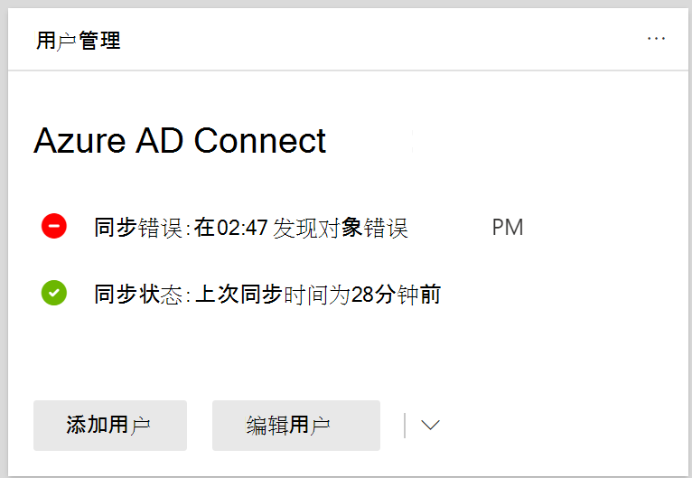

# 查看目录中的目录Microsoft 365

可以在"管理"中查看<a href="https://go.microsoft.com/fwlink/p/?linkid=2024339" target="_blank">目录Microsoft 365 管理中心。</a> 只显示 User 对象错误。 若要查看 PowerShell 错误，请参阅 [使用 DirSyncProvisioningErrors](/azure/active-directory/hybrid/how-to-connect-syncservice-duplicate-attribute-resiliency)标识对象。

## 查看目录中的目录Microsoft 365 管理中心

若要查看以下过程中的任何Microsoft 365 管理中心：
  
1. 使用全局管理员[Microsoft 365 管理中心](https://admin.microsoft.com)登录到网站。 
    
2. 在 **主页** 上，你将看到用户 **管理** 卡。 
    
    
  
3. On the card， choose **Sync errors** under **Azure AD 连接** to see the errors on the **Directory sync errors** page.   
    
    

4. 选择任何错误以显示详细信息窗格，其中包含有关错误的信息以及如何修复错误的提示。

   
  
查看后，[请参阅修复目录同步问题Microsoft 365](fix-problems-with-directory-synchronization.md)修复任何已识别的问题。