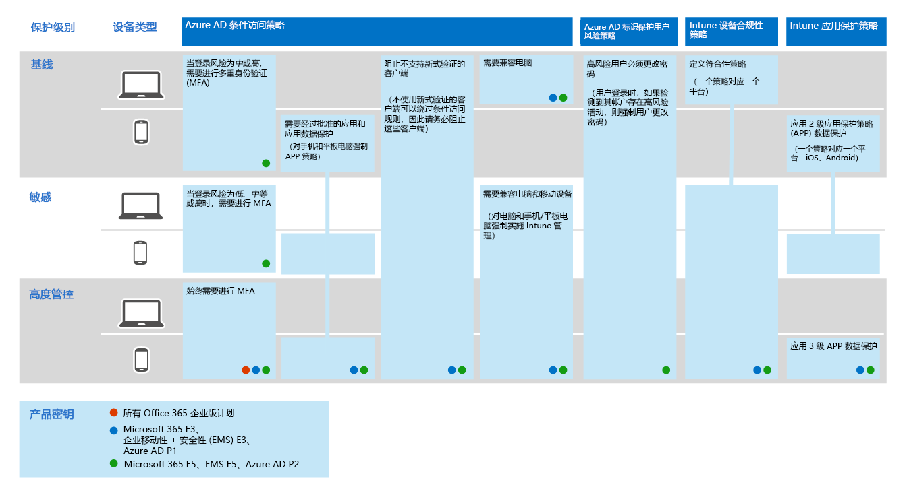
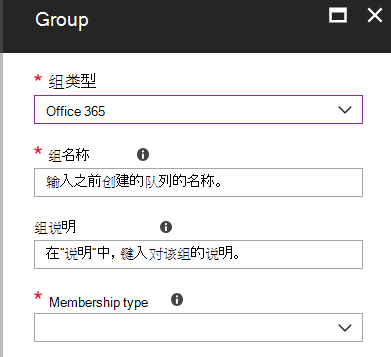

# 常见标识和设备访问策略Common identity and device access policies
本文介绍了用于保护云服务访问的常见建议策略，其中包括使用 Azure AD 应用程序代理发布的本地应用程序。This article describes the common recommended policies for securing access to cloud services, including on-premises applications published with Azure AD Application Proxy. 

本指南讨论如何在新预配的环境中部署建议的策略。This guidance discusses how to deploy the recommended policies in a newly-provisioned environment. 在单独的实验室环境中设置这些策略，可以在将首展转移到预生产和生产环境之前，了解和评估建议的策略。Setting up these policies in a separate lab environment allows you to understand and evaluate the recommended policies before staging the rollout to your preproduction and production environments. 您的新设置的环境可能是仅云或混合的。Your newly provisioned environment may be cloud-only or hybrid.  

## 策略集Policy set 

下图说明了建议的一组策略。The following diagram illustrates the recommended set of policies. 它显示了每个策略应用于哪一层的保护，以及这些策略是应用于 Pc、电话和平板电脑，还是适用于这两种类别的设备。It shows which tier of protections each policy applies to and whether the policies apply to PCs or phones and tablets, or both categories of devices. 它还指示这些策略的配置位置。It also indicates where these policies are configured.

本文的其余部分介绍了如何配置这些策略。The rest of this article describes how to configure these policies. 

建议在将设备注册到 Intune 中之前使用多重身份验证，以确保设备已占有目标用户。Using multi-factor authentication is recommended before enrolling devices into Intune for assurance that the device is in the possession of the intended user. 在强制实施设备合规性策略之前，还必须将设备注册到 Intune。You must also enroll devices into Intune before enforcing device compliance policies.

为了让你有时间完成这些任务，我们建议你按照此表中所列的顺序实施基准策略。To give you time to accomplish these tasks, we recommend implementing the baseline policies in the order listed in this table. 但是，敏感和高度管控保护的 MFA 策略可在任何时候实施。However, the MFA policies for sensitive and highly regulated protection can be implemented at any time.

|保护级别Protection level|策略Policies|更多信息More information|
|:---------------|:-------|:----------------|
|**Baseline****Baseline**|[当登录风险为 "*中*" 或 "*高*" 时，需要进行 MFARequire MFA when sign-in risk is *medium* or *high*](#require-mfa-based-on-sign-in-risk)| |
|        |[阻止不支持新式身份验证的客户端Block clients that don't support modern authentication](#block-clients-that-dont-support-modern-authentication)|不使用新式身份验证的客户端可以绕过条件访问规则，因此，请务必阻止这些Clients that do not use modern authentication can bypass conditional access rules, so it's important to block these|
|        |[高风险用户必须更改密码High risk users must change password](#high-risk-users-must-change-password)|如果为帐户检测到高风险活动，则强制用户在登录时更改其密码Forces users to change their password when signing in if high-risk activity is detected for their account|
|        |[定义应用保护策略Define app protection policies](#define-app-protection-policies)|每个平台（iOS、Android、Windows）一个策略。One policy per platform (iOS, Android, Windows).|
|        |[需要批准的应用程序Require approved apps](#require-approved-apps)|为电话和平板电脑强制实施移动应用保护Enforces mobile app protection for phones and tablets|
|        |[定义设备合规性策略Define device compliance policies](#define-device-compliance-policies)|每个平台一个策略One policy for each platform|
|        |[需要兼容电脑Require compliant PCs](#require-compliant-pcs-but-not-compliant-phones-and-tablets)|强制对电脑进行 Intune 管理Enforces Intune management of PCs|
|**敏感****Sensitive**|[当登录风险为*低*、*中*或*高*时，需要进行 MFARequire MFA when sign-in risk is *low*, *medium* or *high*](#require-mfa-based-on-sign-in-risk)| |
|         |[需要符合要求*的 pc 和*移动设备Require compliant PCs *and* mobile devices](#require-compliant-pcs-and-mobile-devices)|对电脑和电话/平板电脑强制 Intune 管理Enforces Intune management for PCs and phone/tablets|
|**高度管控****Highly regulated**|[*始终*要求进行 MFA*Always* require MFA](#require-mfa-based-on-sign-in-risk)|
| | |

## 向用户分配策略Assigning policies to users
在配置策略之前，请确定您对每个保护层使用的 Azure AD 组。Before configuring policies, identify the Azure AD groups you are using for each tier of protection. 通常情况下，基准保护适用于组织中的每个人。Typically, baseline protection applies to everybody in the organization. 同时包含在基线和敏感保护中的用户将应用所有基准策略加上敏感策略。A user who is included for both baseline and sensitive protection will have all the baseline policies applied plus the sensitive policies. 保护是累积的，并且强制实施最严格的策略。Protection is cumulative and the most restrictive policy is enforced. 

建议的做法是为条件访问排除创建 Azure AD 组。A recommended practice is to create an Azure AD group for conditional access exclusion. 将此组添加到 "Exclude" 下的所有条件访问规则。Add this group to all of your conditional access rules under "Exclude". 这为您提供了在对访问问题进行故障排除时提供对用户的访问权限的方法。This gives you a method to provide access to a user while you troubleshoot access issues. 建议仅将其作为临时解决方案。This is recommended as a temporary solution only. 监视此组的更改，并确保仅按预期使用排除组。Monitor this group for changes and be sure the exclusion group is being used only as intended. 

下图提供了用户分配和排除的示例。The following diagram provides an example of user assignment and exclusions.

在图中，"Top secret project X team" 分配了一个需要*始终*进行 MFA 的条件访问策略。In the illustration the "Top secret project X team" is assigned a conditional access policy that requires MFA *always*. 对用户应用更高级别的保护时要合理。Be judicious when applying higher levels of protection to users. 此项目团队的成员将需要在每次登录时提供两种形式的身份验证，即使他们没有查看高度管控的内容也是如此。Members of this project team will be required to provide two forms of authentication every time they log on, even if they are not viewing highly-regulated content.  

作为这些建议的一部分创建的所有 Azure AD 组都必须创建为 Office 365 组。All Azure AD groups created as part of these recommendations must be created as Office 365 groups. 在 SharePoint Online 中保护文档时，这一点对于部署 Azure 信息保护 (AIP) 尤为重要。This is specifically important for the deployment of Azure Information Protection (AIP) when securing documents in SharePoint Online.

## 需要基于登录风险进行 MFARequire MFA based on sign-in risk
在要求进行 MFA 之前，首先使用标识保护 MFA 注册策略为用户注册 MFA。Before requiring MFA, first use an Identity Protection MFA registration policy to register users for MFA. 注册用户后，可以强制进行 MFA 以进行登录。After users are registered you can enforce MFA for sign-in. [先决条件工作](identity-access-prerequisites.md)包括向具有 MFA 的所有用户注册。The [prerequisite work](identity-access-prerequisites.md) includes registering all users with MFA.

创建新的条件访问策略：To create a new conditional access policy: 

1. 转到 [Azure 门户](https://portal.azure.com)，然后使用你的凭据登录。Go to the [Azure portal](https://portal.azure.com), and sign in with your credentials. 成功登录后，您将看到 "Azure 仪表板"。After you've successfully signed in, you see the Azure dashboard.

2. 从左侧菜单中选择“Azure Active Directory”。Choose **Azure Active Directory** from the left menu.

3. 在“安全”部分之下，选择“条件访问”。Under the **Security** section, choose **Conditional access**.

4. 选择“新策略”。Choose **New policy**.

 下表介绍了要为此策略实现的条件访问策略设置。The following tables describes the conditional access policy settings to implement for this policy.

**作业****Assignments**

|类型Type|属性Properties|值Values|注意Notes|
|:---|:---------|:-----|:----|
|用户和组Users and groups|包括Include|选择用户和组 - 选择包含目标用户的特定安全组Select users and groups – Select specific security group containing targeted users|从包含试点用户的安全组开始Start with security group including pilot users|
||排除Exclude|例外安全组；服务帐户(应用标识)Exception security group; service accounts (app identities)|根据需要在临时基础上修改的成员身份Membership modified on an as-needed temporary basis|
|云应用Cloud apps|包括Include|选择要应用此规则的应用程序。Select the apps you want this rule to apply to. 例如，选择 "Office 365 Exchange Online"For example, select Office 365 Exchange Online||
|条件Conditions|已配置Configured|是Yes|根据自身环境和需求进行配置Configure specific to your environment and needs|
|登录风险Sign-in risk|风险级别Risk level||请参阅下表中的指南See the guidance in the following table|

**登录风险****Sign-in risk**

根据目标的保护级别应用设置。Apply the settings based on the protection level you are targeting.

|属性Property|保护级别Level of protection|值Values|注意Notes|
|:---|:---------|:-----|:----|
|风险级别Risk level|基线Baseline|高、中High, medium|两项全选Check both|
| |敏感Sensitive|高、中、低High, medium, low|三项全选Check all three|
| |高度管控Highly regulated| |将所有选项保留为未选中状态以始终强制执行 MFALeave all options unchecked to always enforce MFA|

访问控制**Access controls**

|类型Type|属性Properties|值Values|注意Notes|
|:---|:---------|:-----|:----|
|授予Grant|授予访问权限Grant access|TrueTrue|已选定Selected|
||需要进行 MFARequire MFA|TrueTrue|CheckCheck|
||要求将设备标记为合规Require device to be marked as compliant|FalseFalse||
||要求混合 Azure AD 加入设备Require hybrid Azure AD-joined device|FalseFalse||
||需要经批准的客户端应用程序Require approved client app|FalseFalse||
||需要所有已选控件Require all the selected controls|TrueTrue|已选定Selected|

> [!NOTE]
> 请务必启用此策略，方法是选择 **"打开"**。Be sure to enable this policy, by choosing **On**. 此外，请考虑使用[if](https://docs.microsoft.com/azure/active-directory/active-directory-conditional-access-whatif)工具来测试策略。Also consider using the [What if](https://docs.microsoft.com/azure/active-directory/active-directory-conditional-access-whatif) tool to test the policy.

## 阻止不支持新式身份验证的客户端Block clients that don't support modern authentication
1. 转到 [Azure 门户](https://portal.azure.com)，然后使用你的凭据登录。Go to the [Azure portal](https://portal.azure.com), and sign in with your credentials. 成功登录后，您将看到 "Azure 仪表板"。After you've successfully signed in, you see the Azure dashboard.

2. 从左侧菜单中选择“Azure Active Directory”。Choose **Azure Active Directory** from the left menu.

3. 在“安全”部分之下，选择“条件访问”。Under the **Security** section, choose **Conditional access**.

4. 选择“新策略”。Choose **New policy**.

下表介绍了要为此策略实现的条件访问策略设置。The following tables describes the conditional access policy settings to implement for this policy.

**作业****Assignments**

|类型Type|属性Properties|值Values|注意Notes|
|:---|:---------|:-----|:----|
|用户和组Users and groups|包括Include|选择用户和组 - 选择包含目标用户的特定安全组Select users and groups – Select specific security group containing targeted users|从包含试点用户的安全组开始Start with security group including pilot users|
||排除Exclude|例外安全组；服务帐户(应用标识)Exception security group; service accounts (app identities)|按需临时修改的成员身份Membership modified on an as needed temporary basis|
|云应用Cloud apps|包括Include|选择要应用此规则的应用程序。Select the apps you want this rule to apply to. 例如，选择 "Office 365 Exchange Online"For example, select Office 365 Exchange Online||
|条件Conditions|已配置Configured|是Yes|配置客户端应用程序Configure Client apps|
|客户端应用Client apps|已配置Configured|是Yes|移动应用和桌面客户端，其他客户端（选择两者）Mobile apps and desktop clients, Other clients (select both)|

访问控制**Access controls**

|类型Type|属性Properties|值Values|注意Notes|
|:---|:---------|:-----|:----|
|授予Grant|阻止访问Block access|TrueTrue|已选定Selected|
||需要进行 MFARequire MFA|FalseFalse||
||要求将设备标记为合规Require device to be marked as compliant|FalseFalse||
||要求混合 Azure AD 加入设备Require hybrid Azure AD-joined device|FalseFalse||
||需要经批准的客户端应用程序Require approved client app|FalseFalse||
||需要所有已选控件Require all the selected controls|TrueTrue|已选定Selected|

> [!NOTE]
> 请务必启用此策略，方法是选择 **"打开"**。Be sure to enable this policy, by choosing **On**. 此外，请考虑使用[if](https://docs.microsoft.com/azure/active-directory/active-directory-conditional-access-whatif)工具来测试策略。Also consider using the [What if](https://docs.microsoft.com/azure/active-directory/active-directory-conditional-access-whatif) tool to test the policy.

## 高风险用户必须更改密码High risk users must change password
若要确保所有高风险用户的受损帐户强制在登录时执行密码更改，必须应用以下策略。To ensure that all high-risk users' compromised accounts are forced to perform a password change when signing-in, you must apply the following policy.

Log in to the [Microsoft Azure portal (https://portal.azure.com)](https://portal.azure.com/) with your administrator credentials, and then navigate to **Azure AD Identity Protection > User Risk Policy**.Log in to the [Microsoft Azure portal (https://portal.azure.com)](https://portal.azure.com/) with your administrator credentials, and then navigate to **Azure AD Identity Protection > User Risk Policy**.

**作业****Assignments**

|类型Type|属性Properties|值Values|注意Notes|
|:---|:---------|:-----|:----|
|UsersUsers|包括Include|所有用户All users|已选择Selected|
||排除Exclude|无None||
|条件Conditions|用户风险User risk|高High|已选择Selected|

控制**Controls**

| 类型Type | 属性Properties | 值Values                  | 注意Notes |
|:-----|:-----------|:------------------------|:------|
|      | AccessAccess     | 允许访问Allow access            | TrueTrue  |
|      | AccessAccess     | 需要更改密码Require password change | TrueTrue  |

**审阅：** 不适用**Review:** not applicable

> [!NOTE]
> 请务必启用此策略，方法是选择 **"打开"**。Be sure to enable this policy, by choosing **On**. 此外，请考虑使用[if](https://docs.microsoft.com/azure/active-directory/active-directory-conditional-access-whatif)工具来测试策略Also consider using the [What if](https://docs.microsoft.com/azure/active-directory/active-directory-conditional-access-whatif) tool to test the policy

## 定义应用保护策略Define app protection policies
应用保护策略定义哪些应用程序是允许的，以及可以对组织的数据执行的操作。App protection policies define which apps are allowed and the actions they can take with your organization's data. 从 Azure 门户中创建 Intune 应用保护策略。Create Intune app protection policies from within the Azure portal. 

为每个平台创建一个策略：Create a policy for each platform:
- iOSiOS
- AndroidAndroid
- Windows 10Windows 10

若要创建新的应用保护策略，请使用管理员凭据登录到 Microsoft Azure 门户，然后导航到**客户端应用** > **应用程序保护策略**。To create a new app protection policy, sign in to the Microsoft Azure portal with your administrator credentials, and then navigate to **Client apps** > **App protection policies**. 选择 "**创建策略**"。Choose **Create policy**.

iOS 和 Android 的应用保护策略选项略有不同。There are slight differences in the app protection policy options between iOS and Android. 以下策略专用于 Android。The below policy is specifically for Android. 将本指南用作其他策略的指南。Use this as a guide for your other policies.

推荐的应用程序列表包括以下内容：The recommended list of apps includes the following:
- PowerPointPowerPoint
- ExcelExcel
- WordWord
- Microsoft TeamsMicrosoft Teams
- Microsoft SharePointMicrosoft SharePoint
- Microsoft Visio ViewerMicrosoft Visio Viewer
- OneDriveOneDrive
- OneNoteOneNote
- OutlookOutlook

下表介绍了推荐的设置：The following tables describe the recommended settings:

|类型Type|属性Properties|值Values|注意Notes|
|:---|:---------|:-----|:----|
|数据重定位Data relocation|阻止 Android 备份Prevent Android backup|是Yes|在 iOS 上，这会专门调用 iTunes 和 iCloudOn iOS this will specifically call out iTunes and iCloud|
||允许应用向其他应用传送数据Allow app to transfer data to other apps|策略托管应用Policy managed apps||
||允许应用从其他应用接收数据Allow app to receive data from other apps|策略托管应用Policy managed apps||
||防止“另存为”Prevent "Save As"|是Yes||
||选择企业数据可保存到其中的存储服务Select which storage services corporate data can be saved to|OneDrive for Business、SharePointOneDrive for Business, SharePoint||
||限制使用其他应用剪切、复制和粘贴Restrict cut, copy, and paste with other apps|使用 "粘贴到" 的策略托管应用Policy managed apps with paste in||
||限制显示在托管浏览器内的 Web 内容Restrict web content to display in the managed browser|否No||
||加密应用数据Encrypt app data|是Yes|在 iOS 上，选择选项：“锁定设备时”On iOS select option: When device is locked|
||启用设备时禁用应用程序加密Disable app encryption when device is enabled|是Yes|禁用此设置可避免双重加密Disable this setting to avoid double encryption|
||禁用联系人同步Disable contacts sync|否No||
||禁用打印Disable printing|否No||
|访问Access|访问需要 PINRequire PIN for access|是Yes||
||选择类型Select Type|数值Numeric||
||允许使用简单 PINAllow simple PIN|否No||
||PIN 长度PIN length|6 6||
||允许使用指纹而不是 PINAllow fingerprint instead of PIN|是Yes||
||在管理设备 PIN 时禁用应用 PINDisable app PIN when device PIN is managed|是Yes||
||需要公司凭据才能访问Require corporate credentials for access|否No||
||在一定时间后重新检查访问要求(分钟)Recheck the access requirement after (minutes)|3030||
||阻止屏幕捕获和 Android 助手Block screen capture and Android assistant|否No|在 iOS 上，此选项不可用On iOS this is not an available option|
|登录安全要求Sign-in security requirements|最大 PIN 尝试次数Max PIN attempts|5 5|重置 PinReset Pin|
||离线宽限期Offline grace period|720720|阻止访问Block access|
||擦除应用数据之前的脱机间隔时间（天）Offline interval (days) before app data is wiped|9090|擦除数据Wipe data|
||已越狱/取得根的设备Jailbroken/rooted devices| |擦除数据Wipe data|

完成后，请记住选择 "创建"。When complete, remember to select "Create". 重复上述步骤，并将所选平台（下拉列表）替换为 iOS。Repeat the above steps and replace the selected platform (dropdown) with iOS. 这可创建两个应用策略，因此请在创建策略后将组分配到策略，并进行部署。This creates two app policies, so once you create the policy, then assign groups to the policy and deploy it.

若要编辑策略并将这些策略分配给用户，请参阅[如何创建和分配应用保护策略](https://docs.microsoft.com/intune/app-protection-policies)。To edit the policies and assign these policies to users, see [How to create and assign app protection policies](https://docs.microsoft.com/intune/app-protection-policies). 

## 需要批准的应用程序Require approved apps
若要要求获得批准的应用：To require approved apps:

1. 转到 [Azure 门户](https://portal.azure.com)，然后使用你的凭据登录。Go to the [Azure portal](https://portal.azure.com), and sign in with your credentials. 成功登录后，您将看到 "Azure 仪表板"。After you've successfully signed in, you see the Azure dashboard.

2. 从左侧菜单中选择“Azure Active Directory”。Choose **Azure Active Directory** from the left menu.

3. 在“安全”部分之下，选择“条件访问”。Under the **Security** section, choose **Conditional access**.

4. 选择“新策略”。Choose **New policy**.

5. 输入策略名称，然后选择要应用策略的“用户和组”。Enter a policy name, then choose the **Users and groups** you want to apply the policy for.

6. 选择“云应用”。Choose **Cloud apps**.

7. 选择 "**选择应用**"，从 "**云应用**" 列表中选择所需的应用。Choose **Select apps**, select the desired apps from the **Cloud apps** list. 例如，选择 "Office 365 Exchange Online"。For example, select Office 365 Exchange Online. 选择 "**选择**并**完成**"。Choose **Select** and **Done**.

8. 选择 "**条件**"，选择 "**设备平台**"，然后选择 "**配置**"Choose **Conditions**, select **Device platforms**, then choose **Configure**

9. 在 "**包含**" 下，选择 "**选择设备平台**"，选择 " **Android**和**iOS**"。Under **Include**, choose **Select device platforms**, select **Android** and **iOS**. 单击 "**完成**" 并再次**执行**Click **Done** and **Done** again

10. 从“访问控制”部分选择“授予”。Choose **Grant** from the **Access controls** section.

11. 选择 "**授予访问权限**"，选择 "**需要批准的客户端应用**"。Choose **Grant access**, select **Require approved client app**. 对于多个控件，选择 "**需要选定的控件**"，然后选择 "**选择**"。For multiple controls, select **Require the selected controls**, then choose **Select**. 

12. 选择“**创建**”。Choose **Create**.

## 定义设备合规性策略Define device-compliance policies

设备合规性策略定义设备必须遵循的要求才能标记为合规。Device-compliance policies define the requirements that devices must adhere to in order to be marked as compliant. 从 Azure 门户中创建 Intune 设备合规性策略。Create Intune device compliance policies from within the Azure portal. 

为每个平台创建一个策略：Create a policy for each platform:
- AndroidAndroid
- Android 企业版Android enterprise
- iOSiOS
- macOSmacOS
- 此设置在以下类型的设备上可用：Windows Phone 8.1
- Windows 8.1 及更高版本Windows 8.1 and later
- Windows 10 及更高版本Windows 10 and later

若要创建设备合规性策略，请使用你的管理凭据登录到 Microsoft Azure 门户，然后导航到**Intune > 设备合规性**。To create device compliance policies, log in to the Microsoft Azure portal with your administer credentials, and then navigate to **Intune > Device compliance**. 选择“**创建策略**”。Select **Create policy**.

建议将以下设置用于 Windows 10。The following settings are recommended for Windows 10.

**设备运行状况： Windows 运行状况证明服务评估规则****Device health: Windows Health Attestation Service evaluation rules**

|属性Properties|值Values|注意Notes|
|:---------|:-----|:----|
|需要 BitLockerRequire BitLocker|需要Require||
|要求在设备上启用安全启动Require Secure Boot to be enabled on the device|需要Require||
|需要代码完整性Require code integrity|需要Require||

设备属性**Device properties**

|类型Type|属性Properties|值Values|注意Notes|
|:---|:---------|:-----|:----|
|操作系统版本Operating system version|全部All|未配置Not configured||

要将上述所有策略视为已部署，这些策略必须面向用户组。For all the above policies to be considered deployed, they must be targeted at user groups. 为此，可以通过在 "**策略**" 部分中选择 "**管理部署**" （与 "添加" 相同级别）来创建策略（在保存时）或更高版本。You can do this by creating the policy (on Save) or later by selecting **Manage Deployment** in the **Policy** section (same level as Add).

系统安全**System security**

|类型Type|属性Properties|值Values|注意Notes|
|:---|:---------|:-----|:----|
|密码Password|需要密码才能解锁移动设备Require a password to unlock mobile devices|需要Require||
||简单密码Simple passwords|阻止Block||
||密码类型Password type|设备默认值Device default||
||最短密码长度Minimum password length|6 6||
||在需要密码之前不活动的最长分钟数Maximum minutes of inactivity before password is required|15 15|Android 版本4.0 及更高版本或 KNOX 4.0 及更高版本支持此设置。This setting is supported for Android versions 4.0 and above or KNOX 4.0 and above. 对于 iOS 设备，支持 iOS 8.0 和更高版本For iOS devices, it’s supported for iOS 8.0 and above|
||密码过期（天）Password expiration (days)|4141||
||用于防止重复使用的以前密码的数目Number of previous passwords to prevent reuse|5 5||
||当设备从空闲状态（移动和全息）返回时需要密码Require password when device returns from idle state (Mobile and Holographic)|需要Require|适用于 Windows 10 及更高版本Available for Windows 10 and later|
|加密Encryption|设备上的数据存储加密Encryption of data storage on device|需要Require||
|设备安全性Device Security|FirewallFirewall|需要Require||
||防病毒Antivirus|需要Require||
||间谍Antispyware|需要Require|此设置需要在 Windows 安全中心中注册的反间谍软件解决方案This setting requires an Anti-Spyware solution registered with Windows Security Center|
|DefenderDefender|Windows Defender 反恶意软件Windows Defender Antimalware|需要Require||
||Windows Defender 反恶意软件最低版本Windows Defender Antimalware minimum version||仅支持 Windows 10 桌面版。Only supported for Windows 10 desktop. Microsoft 建议版本的背后不超过最新版本五个Microsoft recommends versions no more than five behind from the most recent version|
||最新的 Windows Defender 反恶意软件签名Windows Defender Antimalware signature up to date|需要Require||
||实时保护Real-time protection|需要Require|仅支持 Windows 10 桌面版Only supported for Windows 10 desktop|

**Microsoft Defender ATP****Microsoft Defender ATP**

|类型Type|属性Properties|值Values|注意Notes|
|:---|:---------|:-----|:----|
|Microsoft Defender 高级威胁防护规则Microsoft Defender Advanced Threat Protection rules|要求设备在计算机风险得分Require the device to be at or under the machine-risk score|中等Medium||

## 需要符合要求的电脑（但不符合兼容电话和平板电脑）Require compliant PCs (but not compliant phones and tablets)
在将策略添加到需要兼容的电脑之前，请务必在 Intune 中注册设备进行管理。Before adding a policy to require compliant PCs, be sure to enroll devices for management into Intune. 建议在将设备注册到 Intune 中之前使用多重身份验证，以确保设备已占有目标用户。Using multi-factor authentication is recommended before enrolling devices into Intune for assurance that the device is in the possession of the intended user. 

若要要求合规的电脑：To require compliant PCs:

1. 转到 [Azure 门户](https://portal.azure.com)，然后使用你的凭据登录。Go to the [Azure portal](https://portal.azure.com), and sign in with your credentials. 成功登录后，您将看到 "Azure 仪表板"。After you've successfully signed in, you see the Azure dashboard.

2. 从左侧菜单中选择“Azure Active Directory”。Choose **Azure Active Directory** from the left menu.

3. 在“安全”部分之下，选择“条件访问”。Under the **Security** section, choose **Conditional access**.

4. 选择“新策略”。Choose **New policy**.

5. 输入策略名称，然后选择要应用策略的“用户和组”。Enter a policy name, then choose the **Users and groups** you want to apply the policy for.

6. 选择“云应用”。Choose **Cloud apps**.

7. 选择 "**选择应用**"，从 "**云应用**" 列表中选择所需的应用。Choose **Select apps**, select the desired apps from the **Cloud apps** list. 例如，选择 "Office 365 Exchange Online"。For example, select Office 365 Exchange Online. 选择 "**选择**并**完成**"。Choose **Select** and **Done**.

8. 若要要求兼容的电脑，但不符合兼容电话和平板电脑，请选择 "**条件**" 和 "**设备平台**"。To require compliant PCs, but not compliant phones and tablets, choose **Conditions** and **Device platforms**. 选择 "**选择设备平台**" 并选择 " **Windows**和**macOS**"。Choose **Select device platforms** and select **Windows** and **macOS**.

9. 从“访问控制”部分选择“授予”。Choose **Grant** from the **Access controls** section.

10. 选择 "**授予访问权限**"，选择 "**要求设备被标记为合规**"。Choose **Grant access**, select **Require device to be marked as compliant**. 对于多个控件，选择 **"要求所有选定控件**"，然后选择 "**选择**"。For multiple controls, select **Require all the selected controls**, then choose **Select**. 

11. 选择“**创建**”。Choose **Create**.

如果您的目标是要求符合合规性的 Pc*和*移动设备，请不要选择 "平台"。If your objective is to require compliant PCs *and* mobile devices, do not select platforms. 这将强制实施所有设备的符合性。This enforces compliance for all devices. 

## 需要符合要求*的 pc 和*移动设备Require compliant PCs *and* mobile devices

若要要求所有设备符合性，请执行以下操作：To require compliance for all devices:

1. 转到 [Azure 门户](https://portal.azure.com)，然后使用你的凭据登录。Go to the [Azure portal](https://portal.azure.com), and sign in with your credentials. 成功登录后，您将看到 "Azure 仪表板"。After you've successfully signed in, you see the Azure dashboard.

2. 从左侧菜单中选择“Azure Active Directory”。Choose **Azure Active Directory** from the left menu.

3. 在“安全”部分之下，选择“条件访问”。Under the **Security** section, choose **Conditional access**.

4. 选择“新策略”。Choose **New policy**.

5. 输入策略名称，然后选择要应用策略的“用户和组”。Enter a policy name, then choose the **Users and groups** you want to apply the policy for.

6. 选择“云应用”。Choose **Cloud apps**.

7. 选择 "**选择应用**"，从 "**云应用**" 列表中选择所需的应用。Choose **Select apps**, select the desired apps from the **Cloud apps** list. 例如，选择 "Office 365 Exchange Online"。For example, select Office 365 Exchange Online. 选择 "**选择**并**完成**"。Choose **Select** and **Done**.

8. 从“访问控制”部分选择“授予”。Choose **Grant** from the **Access controls** section.

9. 选择 "**授予访问权限**"，选择 "**要求设备被标记为合规**"。Choose **Grant access**, select **Require device to be marked as compliant**. 对于多个控件，选择 **"要求所有选定控件**"，然后选择 "**选择**"。For multiple controls, select **Require all the selected controls**, then choose **Select**. 

10. 选择“**创建**”。Choose **Create**.

创建此策略时，请不要选择平台。When creating this policy, do not select platforms. 这将强制实施符合性的设备。This enforces compliant devices.

## 后续步骤Next steps

[了解有关用于保护电子邮件的策略建议Learn about policy recommendations for securing email](secure-email-recommended-policies.md)
