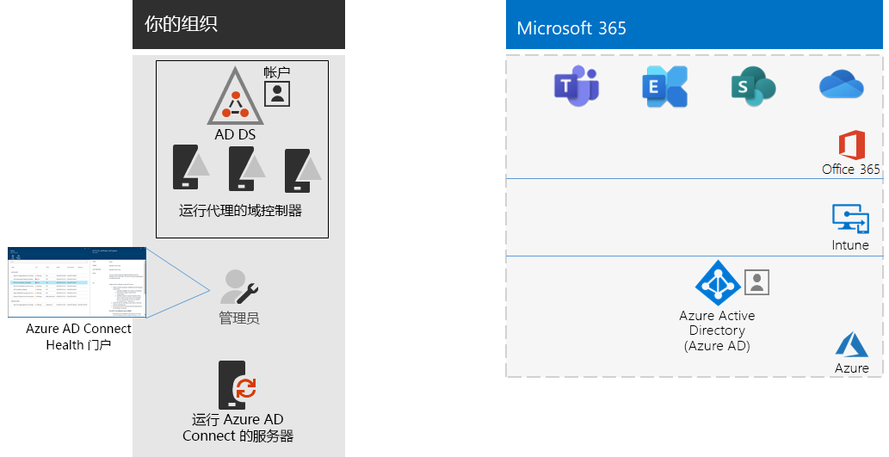

# 步骤 4：添加用户帐户

## 为仅限云的标识创建用户帐户

对于仅限云的标识，在 Azure Active Directory (Azure AD) 中创建用户和组。 您可以使用：

- Microsoft 365 管理员中心
- Azure 门户
- Azure PowerShell

## 为混合标识同步标识

*此部分对于混合环境来说是必需的，适用于 Microsoft 365 企业版的 E3 和 E5 版本*

在此部分中，将本地 Active Directory 域服务 (AD DS) 与 Microsoft 365 企业版包含的 Office 365、Microsoft Intune 和其他基于云的服务所使用的 Azure AD 租户同步。

Azure AD Connect 是受支持的 Microsoft 工具，可引导你只将真正需要的身份从单林或多林 AD DS 环境同步到 Azure AD 租户。 下图显示了 Azure AD Connect 同步的基本流程。

1. 服务器上运行的 Azure AD Connect 将轮询 AD DS，以了解帐户、组和联系人是否发生了更改。
2. Azure AD Connect 将更改发送至 Microsoft 365 订阅的 Azure AD 租户。

在混合身份解决方案中首先要决定的是身份验证要求。以下是可供选择的选项：

- 使用“托管身份验证”****，Azure AD 将处理用户登录的身份验证过程。有两种托管身份验证的方法： 
    - **密码哈希同步 (PHS)** [推荐使用，对某些高级功能来说是必需的]。 这是对 Azure AD 中的本地目录对象进行身份验证的最简单方式。 Azure AD Connect 将从 AD DS 提取哈希密码，对密码进行额外的安全处理并将其同步到 Azure AD 中。 有关详细信息，请参阅[使用 Azure AD Connect 同步实现密码哈希同步](https://docs.microsoft.com/azure/active-directory/hybrid/how-to-connect-password-hash-synchronization)。
    - **传递身份验证 (PTA)** 为基于 Azure AD 的服务提供简单的密码验证解决方案。 PTA 使用在一个或多个本地服务器上运行的代理直接在本地 AD DS 中验证用户身份验证。 有关详细信息，请参阅[使用 Azure Active Directory 传递身份验证的用户登录](https://docs.microsoft.com/azure/active-directory/connect/active-directory-aadconnect-pass-through-authentication)。
- 通过**联合身份验证**，身份验证过程会通过身份联合服务器被重定向到其他标识提供者（例如，Active Directory 联合身份验证服务 (AD FS)），以用于用户登录。该标识提供者可提供其他身份验证方法（例如，基于智能卡的身份验证）。有关详细信息，请参阅[为你的 Azure Active Directory 混合身份解决方案提供正确的身份验证方法](https://docs.microsoft.com/azure/security/azure-ad-choose-authn)。

观看此视频，以获取 Microsoft 365 企业版身份模型和身份验证的概述。

 

> [!VIDEO https://www.microsoft.com/videoplayer/embed/RE2Pjwu]

确定混合身份解决方案后，下载并运行 [IdFix 目录同步错误修正工具](https://www.microsoft.com/download/details.aspx?id=36832)，以分析 AD DS 中存在的问题。

解决了由 IdFix 工具标识的所有问题后，请参阅[实施密码哈希同步](https://docs.microsoft.com/azure/active-directory/connect/active-directory-aadconnectsync-implement-password-hash-synchronization)，了解如何为 Microsoft 365 订阅安装 Azure AD Connect 工具，以及在本地 AD DS 和 Azure AD 租户之间配置目录同步。 同步启动后，你将使用本地标识提供程序（如 AD DS）维护用户帐户和组。

Microsoft 提供了一组有关[身份和设备访问](microsoft-365-policies-configurations.md)的建议，以确保全体员工安全且高效地工作。 

- 有关混合环境的推荐要求，请参阅[先决条件](identity-access-prerequisites.md#prerequisites)中的**支持密码哈希同步的 Active Directory**列。 

- 有关仅限云环境的推荐要求，请参阅[先决条件](identity-access-prerequisites.md#prerequisites)中的**仅限云**列。

在本地用户和组出现在 Azure AD 中后，便可以开始分配许可证和使用 OneDrive for Business 和 Exchange Online 等生产力工作负载。

|||
|:-------|:-----|
|| [测试实验室指南：密码哈希同步](password-hash-sync-m365-ent-test-environment.md)  [测试实验室指南：传递身份验证](pass-through-auth-m365-ent-test-environment.md) |
|||

作为临时检查点，请查看对应于此部分的[退出条件](identity-exit-criteria.md#crit-identity-sync)。

## 监控同步运行状况

*这是可选的，适用于 Microsoft 365 的 E3 和 E5 版本*

在此部分中，将在每个本地 AD DS 域控制器上安装 Azure AD Connect Health 代理，以监控由 Azure AD Connect 提供的标识基础架构和同步服务。 Azure AD Connect Health 门户提供了监控信息，可以从中查看警报、性能监控、使用情况分析和其他信息。

如何使用 Azure AD Connect Health 的关键设计决策是基于使用 Azure AD Connect 的方式：

- 如果你使用的是****“托管身份验证”选项，请从[使用用于同步的 Azure AD Connect Health](https://docs.microsoft.com/azure/active-directory/connect-health/active-directory-aadconnect-health-sync) 开始，以理解并配置 Azure AD Connect Health。
- 如果仅使用****“联合身份验证”将帐户和组的名称与 Active Directory 联合身份验证服务 (AD FS) 同步，请从[在 AD FS 中使用 Azure AD Connect Health](https://docs.microsoft.com/azure/active-directory/connect-health/active-directory-aadconnect-health-adfs) 开始，以理解并配置 Azure AD Connect Health。

完成这一部分后，将具有：

- 在本地标识提供者服务器上安装的 Azure AD Connect Health 代理。
- 显示本地基础结构的当前状态，以及与 Microsoft 365 订阅的 Azure AD 租户同步活动的 Azure AD Connect Health 门户。

作为临时检查点，可查看这部分的[退出条件](identity-exit-criteria.md#crit-identity-sync-health)。

## 简化密码更新

*这对于混合环境来说是可选的，适用于 Microsoft 365 企业版的 E3 和 E5 版本*

在此部分中，将允许用户通过 Azure Active Directory (AD) 重置其密码，然后复制到本地 Active Directory 域服务 (AD DS)。 此过程称为密码写回。 通过密码写回，用户不需要通过本地 AD DS（用户帐户及其属性的存储位置）更新其密码。 这非常适用于对本地网络没有远程访问连接的漫游或远程用户。

需要密码写回才可充分利用 Azure AD 标识保护功能，例如，当检测到高风险的帐户泄露时要求用户更改其本地密码。

有关其他信息和配置说明，请参阅 [Azure AD SSPR 密码写回](https://docs.microsoft.com/azure/active-directory/active-directory-passwords-writeback)。

>[!Note]
>升级到最新版本的 Azure AD Connect，以确保即时获取最佳体验和新功能。有关详细信息，请参阅 [Azure AD Connect 自定义安装](https://docs.microsoft.com/azure/active-directory/connect/active-directory-aadconnect-get-started-custom)。
>

|||
|:-------|:-----|
|| [测试实验室指南：密码写回](password-writeback-m365-ent-test-environment.md) |
|||

作为临时检查点，可查看这部分的[退出条件](identity-exit-criteria.md#crit-identity-pw-writeback)。

|||
|:-------|:-----|
|| [使用组进行管理](identity-use-group-management.md) |
