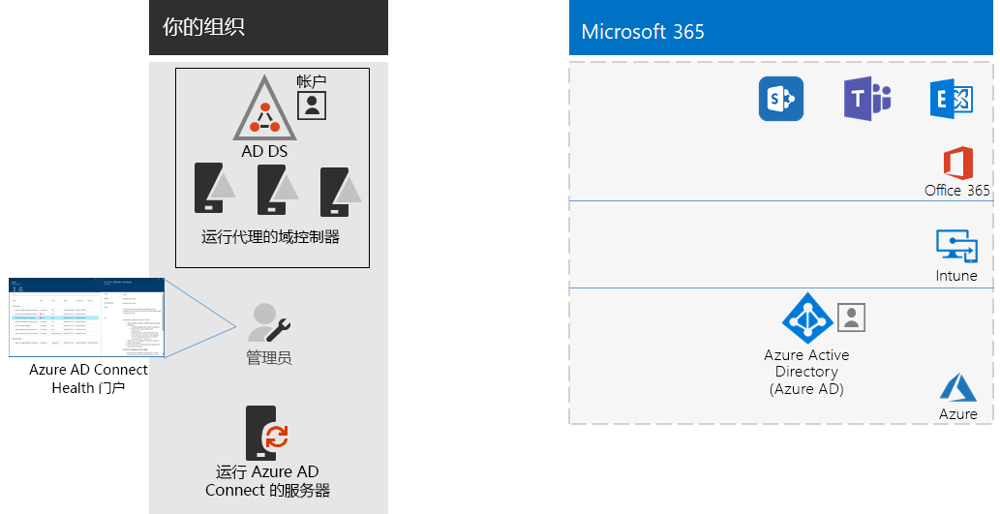

# 第 8 步：监视同步运行状况

** 此步骤是可选的，适用于 Microsoft 365 企业版的 E3 和 E5 版本

在此步骤中，将在每个本地标识服务器上安装 Azure AD Connect Health 代理，以监控由 Azure AD Connect 提供的身份基础结构和同步服务。Azure AD Connect Health 门户提供了监控信息，可以从中查看警报、性能监控、使用情况分析和其他信息。

如何使用 Azure AD Connect Health 的关键设计决策是基于使用 Azure AD Connect 的方式：

- 如果你使用的是****“托管身份验证”选项，请从[使用用于同步的 Azure AD Connect Health](https://docs.microsoft.com/azure/active-directory/connect-health/active-directory-aadconnect-health-sync) 开始，以理解并配置 Azure AD Connect Health。
- 如果仅使用****“联合身份验证”将帐户和组的名称与 Active Directory 联合身份验证服务 (AD FS) 同步，请从[在 AD FS 中使用 Azure AD Connect Health](https://docs.microsoft.com/azure/active-directory/connect-health/active-directory-aadconnect-health-adfs) 开始，以理解并配置 Azure AD Connect Health。

完成这一步后，将具有：

- 在本地标识提供者服务器上安装的 Azure AD Connect Health 代理。
- 显示本地基础结构的当前状态，以及与 Office 365 和 EMS 订阅的 Azure AD 租户同步活动的 Azure AD Connect Health 门户。

作为临时检查点，请查看对应于此步骤的[退出条件](identity-exit-criteria.md#crit-identity-sync-health)。

## 后续步骤

|||
|:-------|:-----|
|| [简化密码更新](identity-password-writeback.md) |

