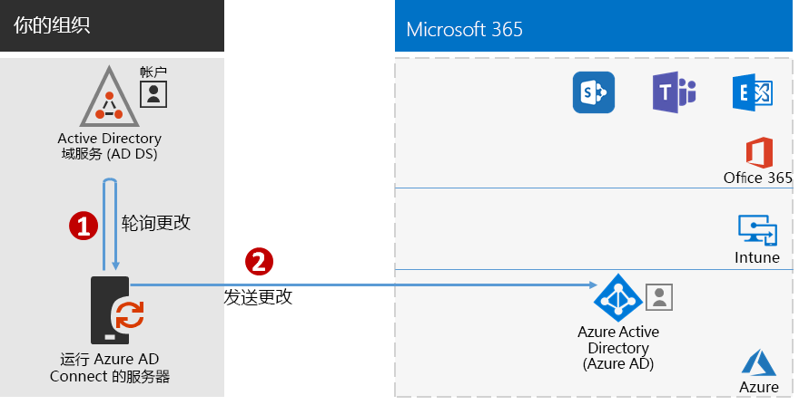

# 步骤 7：同步身份Step 7: Synchronize identities

\*\* 此步骤对于混合环境来说是必需的，适用于 Microsoft 365 企业版的 E3 和 E5 版本*This step is required for hybrid environments and applies to both the E3 and E5 versions of Microsoft 365 Enterprise*

在此步骤中，将本地 Windows Server Active Directory (AD) 与 Office 365 和企业移动性 + 安全性 (EMS) 订阅所使用的 Azure Active Directory (AD) 租户同步。In this step, you'll synchronize your on-premises Windows Server Active Directory (AD) with the Azure Active Directory (AD) tenant used by your Office 365 and Enterprise Mobility + Security (EMS) subscriptions.

Azure AD Connect 是受支持的 Microsoft 工具，可引导你只将真正需要的身份从单林或多林 Windows Server AD 环境同步到 Azure AD 租户。Azure AD Connect is the supported Microsoft tool that guides you through synchronizing only the identities you really need from single or multi-forest Windows Server AD environments to your Azure AD tenant.

*Azure AD Connect 如何将本地目录同步到 Azure AD**How Azure AD Connect synchronizes your on-premises directory with Azure AD*

在混合身份解决方案中首先要决定的是身份验证要求。以下是可供选择的选项：The first decision in your hybrid identity solution is your authentication requirement. The following options are options:

- 使用“托管身份验证”\*\*\*\*，Azure AD 将处理用户登录的身份验证过程。有两种托管身份验证的方法：With **managed authentication**, Azure AD handles the authentication process for user sign-in. There are two methods for managed authentication: 
    - **密码哈希同步 (PHS)** [推荐使用，且对于某些高级功能是必选方法]。这是针对 Azure AD 中的本地目录对象启用身份验证的最简单方法。Azure AD Connect 从 Windows Server AD 中提取哈希密码，对密码执行额外的安全处理，然后将其保存在 Azure AD 中。有关详细信息，请参阅[通过 Azure AD Connect 同步实现密码哈希同步](https://docs.microsoft.com/azure/active-directory/connect/active-directory-aadconnectsync-implement-password-synchronization)。**Password Hash Sync (PHS)** [Recommended and required for some premium features]. This is the simplest way to enable authentication for on-premises directory objects in Azure AD. Azure AD Connect extracts the hashed password from Windows Server AD, does extra security processing on the password, and saves it in Azure AD. For more information, see [Implement password hash synchronization with Azure AD Connect sync](https://docs.microsoft.com/azure/active-directory/connect/active-directory-aadconnectsync-implement-password-synchronization).
    - **传递身份验证 (PTA)** 为基于 Azure AD 的服务提供简单的密码验证解决方案。PTA 使用在一个或多个本地服务器上运行的代理直接在本地 Windows Server AD 中验证用户身份验证。有关详细信息，请参阅[使用 Azure Active Directory 传递身份验证的用户登录](https://docs.microsoft.com/azure/active-directory/connect/active-directory-aadconnect-pass-through-authentication)。**Pass-through Authentication (PTA)** provides a simple password validation solution for Azure AD-based services. PTA uses an agent running on one or more on-premises servers to validate the user authentications directly with your on-premises Windows Server AD. For more information, see [User sign-in with Azure Active Directory Pass-through Authentication](https://docs.microsoft.com/azure/active-directory/connect/active-directory-aadconnect-pass-through-authentication).
- 通过**联合身份验证**，身份验证过程会通过身份联合服务器被重定向到其他标识提供者（例如，Active Directory 联合身份验证服务 (AD FS)），以用于用户登录。该标识提供者可提供其他身份验证方法（例如，基于智能卡的身份验证）。有关详细信息，请参阅[为你的 Azure Active Directory 混合身份解决方案提供正确的身份验证方法](https://docs.microsoft.com/azure/security/azure-ad-choose-authn)。With **federated authentication**, the authentication process is redirected to another identity provider through an identity federation server, such as Active Directory Federation Services (AD FS), for a user’s sign-in. The identity provider can provide additional authentication methods, such as smartcard-based authentication. For more information, see [Choosing the right authentication method for your Azure Active Directory hybrid identity solution](https://docs.microsoft.com/azure/security/azure-ad-choose-authn).

确定混合身份解决方案后，下载并运行 [IdFix 目录同步错误修正工具](https://www.microsoft.com/download/details.aspx?id=36832)，以分析 Windows Server AD 中存在的问题。After you've determined your hybrid identity solution, download and run the [IdFix Directory Synchronization Error Remediation Tool](https://www.microsoft.com/download/details.aspx?id=36832) to analyze your Windows Server AD for issues.

解决了由 IdFix 工具标识的所有问题后，请参阅[实施密码哈希同步](https://docs.microsoft.com/azure/active-directory/connect/active-directory-aadconnectsync-implement-password-hash-synchronization)，了解如何为 Office 365 和 EMS 订阅安装 Azure AD Connect 工具，以及在本地 Windows Server AD 和 Azure AD 租户之间配置目录同步。同步启动后，你将使用本地标识提供者（如 Windows Server AD）维护用户帐户和组。After resolving all of the issues identified by the IdFix tool, see [Implement password hash synchronization](https://docs.microsoft.com/azure/active-directory/connect/active-directory-aadconnectsync-implement-password-hash-synchronization) for guidance on installing the Azure AD Connect tool and configuring directory synchronization between your on-premises Windows Server AD and the Azure AD tenant for your Office 365 and EMS subscriptions. After synchronization starts, you'll maintain your user accounts and groups with your on-premises identity provider, such as Windows Server AD.

Microsoft 提供了一组有关[身份和设备访问](microsoft-365-policies-configurations.md)的建议，以确保全体员工安全且高效地工作。Microsoft provides a set of recommendations for [identity and device access](microsoft-365-policies-configurations.md) to ensure a secure and productive workforce. 
- 有关混合环境的推荐要求，请参阅[先决条件](identity-access-prerequisites.md#prerequisites)中的**支持密码哈希同步的 Active Directory**列。For recommended requirements for hybrid environments, see the **Active Directory with password hash sync** column in [prerequisites](identity-access-prerequisites.md#prerequisites). 

- 有关仅限云环境的推荐要求，请参阅[先决条件](identity-access-prerequisites.md#prerequisites)中的**仅限云**列。For recommended requirements for cloud only environments, see the **Cloud only** column in [prerequisites](identity-access-prerequisites.md#prerequisites).

|||
|:-------|:-----|
|| [测试实验室指南：密码哈希同步Test Lab Guide: Password hash synchronization](password-hash-sync-m365-ent-test-environment.md)  [测试实验室指南：传递身份验证Test Lab Guide: Pass-through authentication](pass-through-auth-m365-ent-test-environment.md) |
|||

作为临时检查点，请查看对应于此步骤的[退出条件](identity-exit-criteria.md#crit-identity-sync)。As an interim checkpoint, you can see the [exit criteria](identity-exit-criteria.md#crit-identity-sync) corresponding to this step.

## 后续步骤Next step

|||
|:-------|:-----|
|| [监控同步运行状况Monitor synchronization health](identity-azure-ad-connect-health.md) |

