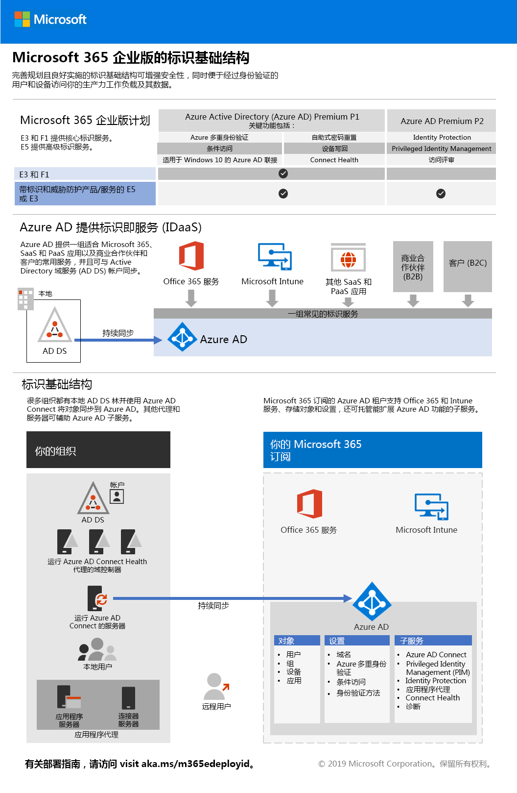

# 阶段 2：标识Phase 2: Identity

在 Microsoft 365 企业版中，精心计划和执行的身份基础结构将有助于实现更强的安全性，并仅允许通过身份验证的用户和设备访问生产力工作负载和数据。In Microsoft 365 Enterprise, a well-planned and executed identity infrastructure paves the way for stronger security and access to your productivity workloads and their data only by authenticated users and devices.

观看此视频，以获取 Microsoft 365 企业版身份模型和身份验证的概述。Watch this video for an overview of identity models and authentication for Microsoft 365 Enterprise.

 

 

> [!VIDEO https://www.microsoft.com/videoplayer/embed/RE2Pjwu]

>[!Note]
>如果已部署身份基础结构，请参阅[身份退出条件](identity-exit-criteria.md)，以确保满足 Microsoft 365 企业版的必需条件和可选条件。If you’ve already deployed an identity infrastructure, please see the [identity exit criteria](identity-exit-criteria.md) to make sure that you meet the required and optional conditions for Microsoft 365 Enterprise.
>

有关每个 Microsoft 365 企业版计划的身份功能、Azure Active Directory (Azure AD) 的角色、本地和基于云的组件，以及最常见的身份验证配置，请参阅[身份基础结构海报](../media/identity-infrastructure/M365E-ID-Infra.pdf)。For the identity features of each Microsoft 365 Enterprise plan, the role of Azure Active Directory (Azure AD), on-premises and cloud-based components, and the most common authentication configurations, see the [Identity Infrastructure poster](../media/identity-infrastructure/M365E-ID-Infra.pdf).

此海报包含两页内容，可借助它快速实施 Microsoft 365 企业版的身份概念和配置。This two-page poster is a quick way to ramp up on identity concepts and configurations for Microsoft 365 Enterprise.

还可以[下载此海报](https://github.com/MicrosoftDocs/microsoft-365-docs/raw/public/microsoft-365/media/identity-infrastructure/M365E-ID-Infra.pdf)并按 letter、legal 或 tabloid (11 x 17) 格式打印。You can also [download this poster](https://github.com/MicrosoftDocs/microsoft-365-docs/raw/public/microsoft-365/media/identity-infrastructure/M365E-ID-Infra.pdf) and print it in letter, legal, or tabloid (11 x 17) formats.

## 计划和部署 Microsoft 365 企业版身份基础结构Plan and deploy your Microsoft 365 Enterprise identity infrastructure 

使用以下步骤在云中计划和部署新身份基础结构。此外，还可用这些步骤调整现有本地或混合身份基础结构，以与 Microsoft 365 企业版一起使用。Use the following steps to plan and deploy your new identity infrastructure in the cloud. You can also use these steps to adapt your existing on-premises or hybrid identity infrastructure to work with Microsoft 365 Enterprise. 

|||
|:-------|:-----|
|| [创建和保护全局管理员帐户Create and protect your global admin accounts](identity-create-protect-global-admins.md) |
|| [保护密码安全Secure your passwords](identity-secure-your-passwords.md) |
|| [保护和管理用户登录Secure and manage your user sign-ins](identity-secure-user-sign-ins.md) |
|| [添加用户帐户Add your user accounts](identity-add-user-accounts.md) |
|| [使用组进行管理Use groups for management](identity-use-group-management.md) |
|| [配置标识治理Configure identity governance](identity-configure-identity-governance.md) |

在完成这些步骤后，请转到这一阶段的[退出条件](identity-exit-criteria.md)，以确保满足 Microsoft 365 企业版标识的必备条件和可选条件。When you've completed these steps, go to the [exit criteria](identity-exit-criteria.md) for this phase to ensure that you meet the required and optional conditions for Microsoft 365 Enterprise identity.

## 标识和设备访问建议Identity and device access recommendations

Microsoft 提供了一组有关[标识和设备访问](microsoft-365-policies-configurations.md)的建议，以确保全体员工安全且高效地工作。对于标识，请使用下列文章中的建议和设置以及此阶段中的步骤：Microsoft provides a set of recommendations for [identity and device access](microsoft-365-policies-configurations.md) to ensure a secure and productive workforce. For identity, use the recommendations and settings in the following articles along with the steps in this phase:

- [先决条件Prerequisites](identity-access-prerequisites.md)
- [常见标识和设备访问策略Common identity and device access policies](identity-access-policies.md)

## Microsoft 如何对 Microsoft 365 企业版执行操作How Microsoft does Microsoft 365 Enterprise

了解 Microsoft 的 IT 专家如何[管理标识和安全访问](https://www.microsoft.com/itshowcase/deploying-and-managing-microsoft-365#primaryR5)。Learn how IT experts at Microsoft [manage identities and secure access](https://www.microsoft.com/itshowcase/deploying-and-managing-microsoft-365#primaryR5).

## Contoso 是如何使用 Microsoft 365 企业版的How Contoso did Microsoft 365 Enterprise

了解 Contoso Corporation（虚构但具代表性的跨国企业）如何为 Microsoft 365 云服务[部署混合身份基础结构](contoso-identity.md)。See how the Contoso Corporation, a fictional but representative multi-national business, [deployed a hybrid identity infrastructure](contoso-identity.md) for Microsoft 365 cloud services.

## 后续步骤Next step

|||
|:-------|:-----|
|| [创建和保护全局管理员帐户Create and protect your global admin accounts](identity-create-protect-global-admins.md) |
