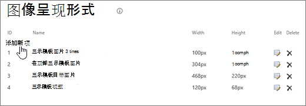

# SharePoint经典发布网站的图像优化

网页的加载速度取决于呈现页面所需的所有组件的组合大小，包括图像、HTML、JavaScript 和 CSS。 图像是使网站更具吸引力的一种很好的方法，但其大小可能会影响性能。 通过压缩和调整大小以及使用子画面来优化图像，可以偏移非常大的图像的效果。 通过使用SharePoint形式，可以上载单个大图像，并显示图像的各个部分，以允许重复使用而不是重新加载。

>[!NOTE]
>本主题适用于联机SharePoint发布网站，而不是新式门户网站。 有关 SharePoint Online 新式门户网站中的图像优化的信息，请参阅优化[SharePoint Online 新式门户页面中的图像](modern-image-optimization.md)。
  
## 使用子画面加快图像加载速度

图像子画面包含许多较小的图像。 使用 CSS，可以选择要显示在页面特定部分（具有绝对定位）的复合图像的一部分。 基本上，你可以将单个图像围绕页面移动，而不是加载多个图像，并通过一个小窗口使该图像的一小部分可见，其中向最终用户显示子画面图像必需的部分。 SharePointOnline 使用子画面在子画面文件spcommon.png图标。

此处涵盖的内容：
- 图像压缩
- 图像优化
- SharePoint图像再现
   
这可提高性能，因为只下载一个映像而不是多个映像，然后缓存并重复使用该映像。 即使图像未保持缓存状态，通过具有单个图像而不是多个图像，此方法也会减少对服务器的 HTTP 请求总数，这将减少页面加载时间。 这确实是一种图像绑定形式。 如果图像未频繁更改（例如图标）（如上述示例所示SharePoint非常有用。 您可以使用 Web [Essentials（](https://vswebessentials.com/)一个基于社区的第三方开放源代码项目）轻松地在 Microsoft Visual Studio。 有关详细信息，请参阅[Minification and bundling in SharePoint Online](./minification-and-bundling-in-sharepoint-online.md)。
  
## 使用图像压缩和优化来加快页面加载速度

图像压缩和优化与减少网站上使用的图像的文件大小有关。 通常，减小图像大小的最佳技术是，将图像大小调整为网站中将查看图像的最大尺寸。 将图像放大到将能查看到的大小没有任何意义。 使用图像编辑器确保图像的尺寸正确无误是减小页面大小的一种快速而简便的方法。
  
图像大小合适后，下一步是优化这些图像的压缩。 有各种工具可用于压缩和优化，包括照片库和第三方工具。 压缩的关键是尽可能减小文件大小，而不会为最终用户丢失任何可辨别的质量。 请确保在高清晰度显示器上测试压缩文件，以确保它们看起来仍然良好。
  
## 使用图像SharePoint加快页面下载速度

图像再现是 SharePoint Online 中的一项功能，允许你根据预定义的图像尺寸提供不同版本的图像。 当存在用户生成的图像内容或网站中的 CSS 修复图像尺寸（如宽度和高度）时，这一点尤其重要。 即使图像由 CSS 修复，仍然会加载全分辨率图像。 在这种情况下，可以使用图像再现来减小文件大小。
  
> [!NOTE]
> 当启用发布时，SharePoint才可用。 可以在"管理网站 \> \> 设置"设置"服务器发布"下SharePoint \> 发布。 此选项不会以其他方式显示。
  
图像重设大小的工作原理是采用你定义最小的尺寸（宽度或高度）然后调整图像大小，以便根据锁定的纵横比自动调整其他尺寸的大小。 默认情况下，它将按其余尺寸从中心裁剪图像。 例如，如果定义 100px 宽、高 50px 的再现，并且原始图像宽 1000px、高 800px，将调整大小，使 800px 尺寸现在为 50px，1000px 尺寸 (现在为 62.5px) 从图像中心裁剪。
  
这些步骤相对简单，但图像要使用再现，在添加图像之前，SharePoint位于网站中。 此外，您还需要启用 SharePoint Server Publishing Infrastructure (Site Collection Level) 和 SharePoint Server Publishing (Site Level) 功能。
  
### 添加图像再现以加快页面加载速度
  
1. 确认执行此过程的用户帐户至少具有对网站集首要网站的"设计"权限，并且该网站正在发布到网页。

2. 在 Web 浏览器中，转到发布网站集的顶级网站。

3. 选择"设置"图标。

4. 在 **"设置"** 页上的"外观"部分，你将看到内置图像再现。

    可以使用开箱即用格式副本，或选择"图像 **再现** "新建一个。

    
  
5. 在“图像呈现形式”页上，选择“添加新项”。

    
  
6. 在"新建图像呈现形式"页上的"名称"框中，为呈现形式输入名称。

7. 在"宽度"和"高度"文本框中，输入呈现形式的宽度和高度（以像素为单位），然后选择"保存"。

    
  
## 使用图像再现的自定义裁剪

默认情况下，图像呈现形式在图像中心生成。 您可以调整单个图像的图像呈现形式，具体方法是裁剪要使用的图像部分。 可以基于每个再现单独裁剪图像。 裁剪图像通过使用 blob 缓存为每个SharePoint创建图像版本来加快页面加载速度。 这样一来，服务器负载将减少，因为图像仅调整一次大小，然后就可以为最终用户多次提供服务。 若要详细了解如何裁剪图像再现，请参阅裁剪[图像再现。](/sharepoint/dev/general-development/sharepoint-design-manager-device-channels)
