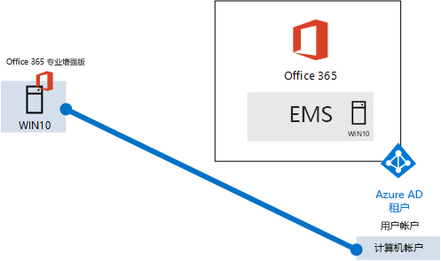
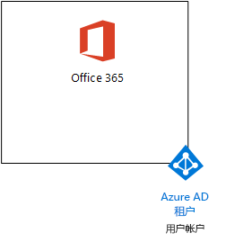
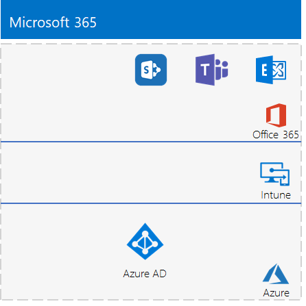

# <a name="the-lightweight-base-configuration"></a><span data-ttu-id="1ac24-103">轻型基本配置</span><span class="sxs-lookup"><span data-stu-id="1ac24-103">The lightweight base configuration</span></span>

<span data-ttu-id="1ac24-104">本文为你提供了创建包含 Office 365 E5、企业移动性+安全性 (EMS) E5 和运行 Windows 10 企业版的计算机的简化的环境的分步操作说明。</span><span class="sxs-lookup"><span data-stu-id="1ac24-104">This article provides you with step-by-step instructions to create a simplified environment that includes Office 365 E5, Enterprise Mobility + Security (EMS) E5, and a computer running Windows 10 Enterprise.</span></span> 



<span data-ttu-id="1ac24-106">使用生成的环境来测试 [Microsoft 365 企业版](https://www.microsoft.com/microsoft-365/enterprise)的特性和功能。</span><span class="sxs-lookup"><span data-stu-id="1ac24-106">Use the resulting environment to test the features and functionality of [Microsoft 365 Enterprise](https://www.microsoft.com/microsoft-365/enterprise).</span></span>


  
> [!TIP]
> <span data-ttu-id="1ac24-108">单击[此处](https://aka.ms/m365etlgstack)，即可获得 Microsoft 365 企业版测试实验室指南堆栈中所有文章的直观目录图。</span><span class="sxs-lookup"><span data-stu-id="1ac24-108">Click [here](https://aka.ms/m365etlgstack) for a visual map to all the articles in the Microsoft 365 Enterprise Test Lab Guide stack.</span></span>

## <a name="phase-1-create-your-office-365-e5-subscription"></a><span data-ttu-id="1ac24-109">第 1 阶段：创建 Office 365 E5 订阅</span><span class="sxs-lookup"><span data-stu-id="1ac24-109">Phase 1: Create your Office 365 E5 subscription</span></span>

<span data-ttu-id="1ac24-110">按照 [Office 365 开发/测试环境](https://docs.microsoft.com/office365/enterprise/office-365-dev-test-environment)的第 2 和 第 3 阶段的步骤，创建轻型 Office 365 开发/测试环境，如图 1 中所示。</span><span class="sxs-lookup"><span data-stu-id="1ac24-110">Follow the steps in Phase 2 and Phase 3 of the [Office 365 dev/test environment](https://docs.microsoft.com/office365/enterprise/office-365-dev-test-environment) to create a lightweight Office 365 dev/test environment, as shown in Figure 1.</span></span>
  
<span data-ttu-id="1ac24-111">**图 1：带 Azure Active Directory (Azure AD) 租户和用户帐户的 Office 365 E5 订阅**</span><span class="sxs-lookup"><span data-stu-id="1ac24-111">**Figure 1: Your Office 365 E5 subscription with its Azure Active Directory (AD) tenant and user accounts**</span></span>



> [!NOTE]
> <span data-ttu-id="1ac24-p101">Office 365 E5 订阅试用期是 30 天，可以轻松地将该订阅的试用期扩展为 60 天。对于永久性测试环境，请使用少量许可证创建新的付费订阅。</span><span class="sxs-lookup"><span data-stu-id="1ac24-p101">The Office 365 E5 trial subscription is 30 days, which can be easily extended to 60 days. For a permanent test environment, create a new paid subscription with a small number of licenses.</span></span> 
  
## <a name="phase-2-add-ems"></a><span data-ttu-id="1ac24-115">第 2 阶段：添加 EMS</span><span class="sxs-lookup"><span data-stu-id="1ac24-115">Phase 2: Add EMS</span></span>

<span data-ttu-id="1ac24-116">在此阶段，注册 EMS E5 试用订阅，并将其作为 Office 365 E5 试用订阅添加到同一组织。</span><span class="sxs-lookup"><span data-stu-id="1ac24-116">In this phase, you sign up for the EMS E5 trial subscription and add it to the same organization as your Office 365 E5 trial subscription.</span></span>
  
<span data-ttu-id="1ac24-117">首先，添加 EMS E5 试用版订阅，并向全局管理员帐户分配 EMS 许可证。</span><span class="sxs-lookup"><span data-stu-id="1ac24-117">First, add the EMS E5 trial subscription and assign an EMS license to your global administrator account.</span></span>
  
1. <span data-ttu-id="1ac24-118">通过 Internet 浏览器的专用实例，使用全局管理员帐户凭据登录到 Office 门户。</span><span class="sxs-lookup"><span data-stu-id="1ac24-118">With a private instance of an Internet browser, sign in to the Office 365 portal with your global administrator account credentials. For help, see Where to sign in to Office 365.</span></span> <span data-ttu-id="1ac24-119">如需帮助，请参阅[如何登录到 Office 365](https://support.office.com/Article/Where-to-sign-in-to-Office-365-e9eb7d51-5430-4929-91ab-6157c5a050b4)。</span><span class="sxs-lookup"><span data-stu-id="1ac24-119">For help, see [Where to sign in to Office 365](https://support.office.com/Article/Where-to-sign-in-to-Office-365-e9eb7d51-5430-4929-91ab-6157c5a050b4).</span></span>
    
2. <span data-ttu-id="1ac24-120">单击“管理员”磁贴\*\*\*\*。</span><span class="sxs-lookup"><span data-stu-id="1ac24-120">Click the **Admin** tile.</span></span>
    
3. <span data-ttu-id="1ac24-121">在浏览器的“Microsoft 365 管理中心”标签页的左侧导航中，单击“帐单”>“购买服务”\*\*\*\*\*\*\*\*。</span><span class="sxs-lookup"><span data-stu-id="1ac24-121">On the **Microsoft 365 admin center** tab, in the left navigation, click **Billing > Purchase services**.</span></span>
    
4. <span data-ttu-id="1ac24-p103">在“购买服务”页上，找到“企业移动性 + 安全性 E5”项。将鼠标指针悬停在此项之上，然后单击“开始免费试用”\*\*\*\*\*\*\*\*\*\*\*\*。</span><span class="sxs-lookup"><span data-stu-id="1ac24-p103">On the **Purchase services** page, find the **Enterprise Mobility + Security E5** item. Hover your mouse pointer over it and click **Start free trial**.</span></span>
    
5. <span data-ttu-id="1ac24-124">在“确认订单”页上，单击“立即试用”\*\*\*\*\*\*\*\*。</span><span class="sxs-lookup"><span data-stu-id="1ac24-124">On the **Confirm your order** page, click **Try now**.</span></span>
    
6. <span data-ttu-id="1ac24-125">在“订单签收”页上，单击“继续”\*\*\*\*\*\*\*\*。</span><span class="sxs-lookup"><span data-stu-id="1ac24-125">On the **Order receipt** page, click **Continue**.</span></span>
    
7. <span data-ttu-id="1ac24-126">在浏览器的“Office 365 管理中心”标签页的左侧导航中，单击“用户”>“活动用户”\*\*\*\*\*\*\*\*。</span><span class="sxs-lookup"><span data-stu-id="1ac24-126">On the **Office 365 Admin center** tab in your browser, in the left navigation, click **Users > Active users**.</span></span>
    
8. <span data-ttu-id="1ac24-127">单击全局管理员帐户，然后针对“产品许可证”单击“编辑”\*\*\*\*\*\*\*\*。</span><span class="sxs-lookup"><span data-stu-id="1ac24-127">Click your global administrator account, and then click **Edit** for **Product licenses**.</span></span>
    
9. <span data-ttu-id="1ac24-128">在“产品许可证”窗格上，将“企业移动性 + 安全性 E5”的产品许可证设置为“打开”，单击“保存”，然后单击“关闭”两次\*\*\*\*\*\*\*\*\*\*\*\*\*\*\*\*\*\*\*\*。</span><span class="sxs-lookup"><span data-stu-id="1ac24-128">On the **Product licenses** pane, turn the product license for **Enterprise Mobility + Security E5** to **On**, click **Save,** and then click **Close** twice.</span></span>
    
> [!NOTE]
> <span data-ttu-id="1ac24-p104">企业移动性 + 安全性 E5 的试订阅期为 90 天。对于永久性测试环境，请使用少量许可证新建付费订阅。</span><span class="sxs-lookup"><span data-stu-id="1ac24-p104">The Enterprise Mobility + Security E5 trial subscription is 90 days. For a permanent test environment, create a new paid subscription with a small number of licenses.</span></span> 
  
 <span data-ttu-id="1ac24-131">\*\*\*\*\*\* 如果完成了 [Office 365 开发/测试环境](https://docs.microsoft.com/office365/enterprise/office-365-dev-test-environment)的第 3 阶段，请为所有其他帐户（用户 2、用户 3、用户 4 和用户 5）重复前述过程的步骤 8 和 9。</span><span class="sxs-lookup"><span data-stu-id="1ac24-131">***If you completed Phase 3 of the*** [Office 365 dev/test environment](https://docs.microsoft.com/office365/enterprise/office-365-dev-test-environment), repeat steps 8 and 9 of the previous procedure for all of your other accounts (User 2, User 3, User 4, and User 5).</span></span>
  
<span data-ttu-id="1ac24-132">测试环境目前包含：</span><span class="sxs-lookup"><span data-stu-id="1ac24-132">Your test environment now has:</span></span>
  
- <span data-ttu-id="1ac24-133">与你列表中的用户帐户共享同一 Azure AD 租户的 Office 365 E5 企业版和 EMS E5 试用订阅。</span><span class="sxs-lookup"><span data-stu-id="1ac24-133">Office 365 E5 Enterprise and EMS E5 trial subscriptions sharing the same Azure AD tenant with your list of user accounts.</span></span>
- <span data-ttu-id="1ac24-134">所有适当的用户帐户（无论是全局管理员帐户还是全部五个用户帐户）都可以使用 Office 365 E5 和 EMS E5。</span><span class="sxs-lookup"><span data-stu-id="1ac24-134">All your appropriate user accounts (either just the global administrator or all five user accounts) are enabled to use Office 365 E5 and EMS E5.</span></span>
    
<span data-ttu-id="1ac24-135">图 2 显示添加 EMS 的生成配置。</span><span class="sxs-lookup"><span data-stu-id="1ac24-135">Figure 2 shows your resulting configuration, which adds EMS.</span></span>
  
<span data-ttu-id="1ac24-136">**图 2：添加 EMS 试用订阅**</span><span class="sxs-lookup"><span data-stu-id="1ac24-136">**Figure 2: Adding the EMS trial subscription**</span></span>


  
## <a name="phase-3-create-a-windows-10-enterprise-computer"></a><span data-ttu-id="1ac24-138">第 3 阶段：创建 Windows 10 企业版计算机</span><span class="sxs-lookup"><span data-stu-id="1ac24-138">Phase 3: Create a Windows 10 Enterprise computer</span></span>

<span data-ttu-id="1ac24-139">在这一阶段，将运行 Windows 10 企业版的独立计算机创建为物理计算机、虚拟机或 Azure 虚拟机。</span><span class="sxs-lookup"><span data-stu-id="1ac24-139">In this phase, you create a standalone computer running Windows 10 Enterprise as either a physical computer, a virtual machine, or an Azure virtual machine.</span></span>
  
### <a name="physical-computer"></a><span data-ttu-id="1ac24-140">物理计算机</span><span class="sxs-lookup"><span data-stu-id="1ac24-140">Physical computer</span></span>

<span data-ttu-id="1ac24-p105">获取个人计算机并在其上安装 Windows 10 企业版。你可在[此处](https://www.microsoft.com/evalcenter/evaluate-windows-10-enterprise)下载 Windows 10 企业版试用。</span><span class="sxs-lookup"><span data-stu-id="1ac24-p105">Obtain a personal computer and install Windows 10 Enterprise on it. You can download the Windows 10 Enterprise trial [here](https://www.microsoft.com/evalcenter/evaluate-windows-10-enterprise).</span></span>
  
### <a name="virtual-machine"></a><span data-ttu-id="1ac24-143">虚拟机</span><span class="sxs-lookup"><span data-stu-id="1ac24-143">Virtual machine</span></span>

<span data-ttu-id="1ac24-p106">使用你选择的虚拟机监控程序创建一个虚拟机并在其上安装 Windows 10 企业版。你可在[此处](https://www.microsoft.com/evalcenter/evaluate-windows-10-enterprise)下载 Windows 10 企业版试用。</span><span class="sxs-lookup"><span data-stu-id="1ac24-p106">Create a virtual machine using the hypervisor of your choice and install Windows 10 Enterprise on it. You can download the Windows 10 Enterprise trial [here](https://www.microsoft.com/evalcenter/evaluate-windows-10-enterprise).</span></span>
  
### <a name="virtual-machine-in-azure"></a><span data-ttu-id="1ac24-146">Azure 中的虚拟机</span><span class="sxs-lookup"><span data-stu-id="1ac24-146">Virtual machine in Azure</span></span>

<span data-ttu-id="1ac24-p107">要在 Microsoft Azure 中创建 Windows 10 虚拟机，***你必须拥有基于 Visual Studio 的订阅***，以便有权访问 Windows 10 企业版的映像。其他类型的 Azure 订阅（如试用版和付费订阅）均无权访问此映像。有关最新信息，请参阅[在 Azure 中使用 Windows 客户端实现开发/测试方案](https://docs.microsoft.com/azure/virtual-machines/windows/client-images)。</span><span class="sxs-lookup"><span data-stu-id="1ac24-p107">To create a Windows 10 virtual machine in Microsoft Azure, ***you must have a Visual Studio-based subscription***, which has access to the image for Windows 10 Enterprise. Other types of Azure subscriptions, such as trial and paid subscriptions, do not have access to this image. For the latest information, see [Use Windows client in Azure for dev/test scenarios](https://docs.microsoft.com/azure/virtual-machines/windows/client-images).</span></span>
  
> [!NOTE]
> <span data-ttu-id="1ac24-p108">下面的命令集使用最新版 Azure PowerShell。请参阅 [Azure PowerShell cmdlet 入门](https://docs.microsoft.com/powershell/azureps-cmdlets-docs/)。这些命令集构建了名为 WIN10 的 Windows 10 企业版虚拟机及其所需的全部基础架构，其中包括资源组、存储帐户和虚拟网络。如果你已熟悉 Azure 基础架构服务，请修改这些说明以适应当前部署的基础架构。</span><span class="sxs-lookup"><span data-stu-id="1ac24-p108">The following command sets use the latest version of Azure PowerShell. See [Get started with Azure PowerShell cmdlets](https://docs.microsoft.com/powershell/azureps-cmdlets-docs/). These command sets build a Windows 10 Enterprise virtual machine named WIN10 and all of its required infrastructure, including a resource group, a storage account, and a virtual network. If you are already familiar with Azure infrastructure services, please adapt these instructions to suit your currently deployed infrastructure.</span></span> 
  
<span data-ttu-id="1ac24-154">首先，启动 Microsoft PowerShell 提示符。</span><span class="sxs-lookup"><span data-stu-id="1ac24-154">First, start a Microsoft PowerShell prompt.</span></span>
  
<span data-ttu-id="1ac24-155">使用以下命令登录 Azure 帐户。</span><span class="sxs-lookup"><span data-stu-id="1ac24-155">Sign in to your Azure account with the following command.</span></span>
  
```
Connect-AzAccount
```

<span data-ttu-id="1ac24-156">使用以下命令获得订阅名称。</span><span class="sxs-lookup"><span data-stu-id="1ac24-156">Get your subscription name using the following command.</span></span>
  
```
Get-AzSubscription | Sort Name | Select Name
```

<span data-ttu-id="1ac24-p109">设置 Azure 订阅。使用正确的名称替换引号内的所有内容（包括 \< 和 > 字符）。</span><span class="sxs-lookup"><span data-stu-id="1ac24-p109">Set your Azure subscription. Replace everything within the quotes, including the \< and > characters, with the correct name.</span></span>
  
```
$subscr="<subscription name>"
Get-AzSubscription -SubscriptionName $subscr | Select-AzSubscription
```

<span data-ttu-id="1ac24-p110">接下来，创建一个新的资源组。要确定一个唯一的资源组名称，请使用此命令列出你现有的资源组。</span><span class="sxs-lookup"><span data-stu-id="1ac24-p110">Next, create a new resource group. To determine a unique resource group name, use this command to list your existing resource groups.</span></span>
  
```
Get-AzResourceGroup | Sort ResourceGroupName | Select ResourceGroupName
```

<span data-ttu-id="1ac24-p111">使用这些命令创建新的资源组。使用正确的名称替换引号内的所有内容（包括 \< 和 > 字符）。</span><span class="sxs-lookup"><span data-stu-id="1ac24-p111">Create your new resource group with these commands. Replace everything within the quotes, including the \< and > characters, with the correct names.</span></span>
  
```
$rgName="<resource group name>"
$locName="<location name, such as West US>"
New-AzResourceGroup -Name $rgName -Location $locName
```

<span data-ttu-id="1ac24-p112">接下来，使用这些命令创建新的虚拟网络和 WIN10 虚拟机。出现提示时，为 WIN10 提供本地管理员帐户的名称和密码，并将这些名称和密码存储在安全位置。</span><span class="sxs-lookup"><span data-stu-id="1ac24-p112">Next, you create a new virtual network and the WIN10 virtual machine with these commands. When prompted, provide the name and password of the local administrator account for WIN10 and store these in a secure location.</span></span>
  
```
$corpnetSubnet=New-AzVirtualNetworkSubnetConfig -Name Corpnet -AddressPrefix 10.0.0.0/24
New-AzVirtualNetwork -Name "M365Ent-TestLab" -ResourceGroupName $rgName -Location $locName -AddressPrefix 10.0.0.0/8 -Subnet $corpnetSubnet
$rule1=New-AzNetworkSecurityRuleConfig -Name "RDPTraffic" -Description "Allow RDP to all VMs on the subnet" -Access Allow -Protocol Tcp -Direction Inbound -Priority 100 -SourceAddressPrefix Internet -SourcePortRange * -DestinationAddressPrefix * -DestinationPortRange 3389
New-AzNetworkSecurityGroup -Name Corpnet -ResourceGroupName $rgName -Location $locName -SecurityRules $rule1
$vnet=Get-AzVirtualNetwork -ResourceGroupName $rgName -Name "M365Ent-TestLab"
$nsg=Get-AzNetworkSecurityGroup -Name Corpnet -ResourceGroupName $rgName
Set-AzVirtualNetworkSubnetConfig -VirtualNetwork $vnet -Name Corpnet -AddressPrefix "10.0.0.0/24" -NetworkSecurityGroup $nsg
$pip=New-AzPublicIpAddress -Name WIN10-PIP -ResourceGroupName $rgName -Location $locName -AllocationMethod Dynamic
$nic=New-AzNetworkInterface -Name WIN10-NIC -ResourceGroupName $rgName -Location $locName -SubnetId $vnet.Subnets[0].Id -PublicIpAddressId $pip.Id
$vm=New-AzVMConfig -VMName WIN10 -VMSize Standard_D1_V2
$cred=Get-Credential -Message "Type the name and password of the local administrator account for WIN10."
$vm=Set-AzVMOperatingSystem -VM $vm -Windows -ComputerName WIN10 -Credential $cred -ProvisionVMAgent -EnableAutoUpdate
$vm=Set-AzVMSourceImage -VM $vm -PublisherName MicrosoftWindowsDesktop -Offer Windows-10 -Skus RS3-Pro -Version "latest"
$vm=Add-AzVMNetworkInterface -VM $vm -Id $nic.Id
$vm=Set-AzVMOSDisk -VM $vm -Name WIN10-TestLab-OSDisk -DiskSizeInGB 128 -CreateOption FromImage
New-AzVM -ResourceGroupName $rgName -Location $locName -VM $vm
```

## <a name="phase-4-join-your-windows-10-computer-to-azure-ad"></a><span data-ttu-id="1ac24-165">第 4 阶段：将 Windows 10 计算机加入到 Azure AD</span><span class="sxs-lookup"><span data-stu-id="1ac24-165">Phase 4: Join your Windows 10 computer to Azure AD</span></span>

<span data-ttu-id="1ac24-166">在创建具有 Windows 10 企业版的物理计算机或虚拟机之后，使用本地管理员帐户登录。</span><span class="sxs-lookup"><span data-stu-id="1ac24-166">After the physical or virtual machine with Windows 10 Enterprise is created, sign in with a local administrator account.</span></span>
  
> [!NOTE]
> <span data-ttu-id="1ac24-167">对于 Azure 中的虚拟机，使用[这些说明](https://docs.microsoft.com/azure/virtual-machines/windows/connect-logon)进行连接。</span><span class="sxs-lookup"><span data-stu-id="1ac24-167">For a virtual machine in Azure, connect to it using [these instructions](https://docs.microsoft.com/azure/virtual-machines/windows/connect-logon).</span></span>
  
<span data-ttu-id="1ac24-168">接下来，将 WIN10 计算机加入到 Office 365 和 EMS 订阅的 Azure AD 租户。</span><span class="sxs-lookup"><span data-stu-id="1ac24-168">Next, join the WIN10 computer to the Azure AD tenant of your Office 365 and EMS subscriptions.</span></span>
  
1. <span data-ttu-id="1ac24-169">在 WIN10 计算机的桌面上，依次单击“开始”>“设置”>“帐户”>“访问单位或学校”>“连接”\*\*\*\*。</span><span class="sxs-lookup"><span data-stu-id="1ac24-169">At the desktop of the WIN10 computer, click **Start > Settings > Accounts > Access work or school > Connect**.</span></span>
    
2. <span data-ttu-id="1ac24-170">在“设置工作或学校帐户”\*\*\*\* 对话框中，单击“将此设备加入到 Azure Active Directory”\*\*\*\*。</span><span class="sxs-lookup"><span data-stu-id="1ac24-170">In the **Set up a work or school account** dialog box, click **Join this device to Azure Active Directory**.</span></span>
    
3. <span data-ttu-id="1ac24-171">在“工作或学校帐户”\*\*\*\* 中，键入 Office 365 订阅的全局管理员帐户名称，然后单击“下一步”\*\*\*\*。</span><span class="sxs-lookup"><span data-stu-id="1ac24-171">In **Work or school account**, type the global administrator account name of your Office 365 subscription, and then click **Next**.</span></span>
    
4. <span data-ttu-id="1ac24-172">在“输入密码”\*\*\*\* 中，键入全局管理员帐户的密码，然后单击“登录”\*\*\*\*。</span><span class="sxs-lookup"><span data-stu-id="1ac24-172">In **Enter password**, type the password for your global administrator account, and then click **Sign in**.</span></span>
    
5. <span data-ttu-id="1ac24-173">当提示你确定这是你的组织时，单击“加入”\*\*\*\*，然后单击“完成”\*\*\*\*。</span><span class="sxs-lookup"><span data-stu-id="1ac24-173">When prompted to make sure this is your organization, click **Join**, and then click **Done**.</span></span>
    
6. <span data-ttu-id="1ac24-174">关闭“设置”窗口。</span><span class="sxs-lookup"><span data-stu-id="1ac24-174">Close the settings window.</span></span>
    
<span data-ttu-id="1ac24-175">接下来，在 WIN10 计算机上安装 Office 365 专业增强版。</span><span class="sxs-lookup"><span data-stu-id="1ac24-175">Next, install Office 365 ProPlus on the WIN10 computer.</span></span>
  
1. <span data-ttu-id="1ac24-176">打开 Microsoft Edge 浏览器，使用全局管理员帐户凭据登录到 Office 门户。</span><span class="sxs-lookup"><span data-stu-id="1ac24-176">Open the Microsoft Edge browser and sign in to the Office 365 portal with your global administrator account credentials. For help, see Where to sign in to Office 365.</span></span> <span data-ttu-id="1ac24-177">如需帮助，请参阅[如何登录到 Office 365](https://support.office.com/Article/Where-to-sign-in-to-Office-365-e9eb7d51-5430-4929-91ab-6157c5a050b4)。</span><span class="sxs-lookup"><span data-stu-id="1ac24-177">For help, see [Where to sign in to Office 365](https://support.office.com/Article/Where-to-sign-in-to-Office-365-e9eb7d51-5430-4929-91ab-6157c5a050b4).</span></span>
    
2. <span data-ttu-id="1ac24-178">在“Microsoft Office 主页”\*\*\*\* 标签页上，单击“安装 Office 2016”\*\*\*\*。</span><span class="sxs-lookup"><span data-stu-id="1ac24-178">On the **Microsoft Office Home** tab, click **Install Office 2016**.</span></span>
    
3. <span data-ttu-id="1ac24-179">出现应执行的操作提示时，单击“运行”\*\*\*\*，然后针对“用户帐户控制”单击“是”\*\*\*\*\*\*\*\*。</span><span class="sxs-lookup"><span data-stu-id="1ac24-179">When prompted with what to do, click **Run**, and then click **Yes** for **User Account Control**.</span></span>
    
4. <span data-ttu-id="1ac24-p114">等待 Office 完成安装。当看到“**你已设置完毕!**”时，单击“**关闭**”两次。</span><span class="sxs-lookup"><span data-stu-id="1ac24-p114">Wait for Office to complete its installation. When you see **You're all set!**, click **Close** twice.</span></span>
    
<span data-ttu-id="1ac24-182">图 3 显示生成的环境，其中包括具有以下内容的 WIN10 计算机：</span><span class="sxs-lookup"><span data-stu-id="1ac24-182">Figure 3 shows your resulting environment, which includes the WIN10 computer that has:</span></span>

- <span data-ttu-id="1ac24-183">已联接到 Office 365 和 EMS 订阅的 Azure AD 租户。</span><span class="sxs-lookup"><span data-stu-id="1ac24-183">Joined the Azure AD tenant of your Office 365 and EMS subscriptions.</span></span>
- <span data-ttu-id="1ac24-184">已注册为 Intune 中的 Azure AD 设备 (EMS)。</span><span class="sxs-lookup"><span data-stu-id="1ac24-184">Enrolled as an Azure AD device in Intune (EMS).</span></span>
- <span data-ttu-id="1ac24-185">已安装 Office 365 专业增强版。</span><span class="sxs-lookup"><span data-stu-id="1ac24-185">Has Office 365 ProPlus installed.</span></span>
  
<span data-ttu-id="1ac24-186">**图 3：Microsoft 365 测试环境最终配置**</span><span class="sxs-lookup"><span data-stu-id="1ac24-186">**Figure 3: The final configuration of the Microsoft 365 test environment**</span></span>


  
<span data-ttu-id="1ac24-188">现在可以试验 [Microsoft 365 企业版](https://www.microsoft.com/microsoft-365/enterprise)的其他功能。</span><span class="sxs-lookup"><span data-stu-id="1ac24-188">You are now ready to experiment with additional features of [Microsoft 365 Enterprise](https://www.microsoft.com/microsoft-365/enterprise).</span></span>
  
## <a name="next-steps"></a><span data-ttu-id="1ac24-189">后续步骤</span><span class="sxs-lookup"><span data-stu-id="1ac24-189">Next steps</span></span>

<span data-ttu-id="1ac24-190">浏览下面这些附加的一系列测试实验室指南：</span><span class="sxs-lookup"><span data-stu-id="1ac24-190">Explore these additional sets of Test Lab Guides:</span></span>
  
- [<span data-ttu-id="1ac24-191">标识</span><span class="sxs-lookup"><span data-stu-id="1ac24-191">Identity</span></span>](m365-enterprise-test-lab-guides.md#identity)
- [<span data-ttu-id="1ac24-192">移动设备管理</span><span class="sxs-lookup"><span data-stu-id="1ac24-192">Mobile device management</span></span>](m365-enterprise-test-lab-guides.md#mobile-device-management)
- [<span data-ttu-id="1ac24-193">信息保护</span><span class="sxs-lookup"><span data-stu-id="1ac24-193">Information protection</span></span>](m365-enterprise-test-lab-guides.md#information-protection)
   

## <a name="see-also"></a><span data-ttu-id="1ac24-194">另请参阅</span><span class="sxs-lookup"><span data-stu-id="1ac24-194">See also</span></span>

[<span data-ttu-id="1ac24-195">Microsoft 365 企业版测试实验室指南</span><span class="sxs-lookup"><span data-stu-id="1ac24-195">Microsoft 365 Enterprise Test Lab Guides</span></span>](m365-enterprise-test-lab-guides.md)

[<span data-ttu-id="1ac24-196">部署 Microsoft 365 企业版</span><span class="sxs-lookup"><span data-stu-id="1ac24-196">Deploy Microsoft 365 Enterprise</span></span>](deploy-microsoft-365-enterprise.md)

[<span data-ttu-id="1ac24-197">Microsoft 365 企业版文档</span><span class="sxs-lookup"><span data-stu-id="1ac24-197">Microsoft 365 Enterprise documentation</span></span>](https://docs.microsoft.com/microsoft-365-enterprise/)
