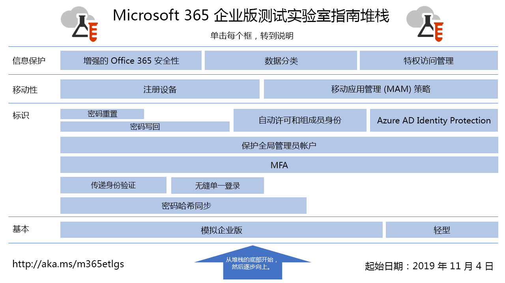

# Microsoft 365 企业版测试实验室指南Microsoft 365 Enterprise Test Lab Guides

*这同时适用于 Microsoft 365 企业版和 Office 365 企业版。**This applies to both Microsoft 365 Enterprise and Office 365 Enterprise.*

测试实验室指南 (TLG) 可帮助你快速了解 Microsoft 产品。它们提供了用于配置已简化但具有代表性的测试环境的说明性指南。可以在试用版或付费订阅期间使用这些环境进行演示、自定义或创建概念的复杂论证。Test Lab Guides (TLGs) help you quickly learn about Microsoft products. They provide prescriptive instructions to configure simplified but representative test environments. You can use these environments for demonstration, customization, or creation of complex proofs of concept for the duration of a trial or paid subscription. 

TLG 采用了模块化设计。它们基于彼此构建，以便创建能够与你的知识背景或测试配置需求更为匹配的多个配置。“我自己构建模块，且模块能够正常工作”这一实际操作体验可帮助你了解新产品或方案的部署要求，使你能够更好地计划在生产中托管它。TLGs are designed to be modular. They build upon each other to create multiple configurations that more closely match your learning or test configuration needs. The "I built it out myself and it works" hands-on experience helps you understand the deployment requirements of a new product or scenario so you can better plan for hosting it in production.

还可以使用 TLG 创建用于开发和测试应用程序的代表性环境，也称为开发/测试环境。You can also use TLGs to create representative environments for development and testing of applications, also known as dev/test environments.
  

单击[此处](media/m365-enterprise-test-lab-guides/Microsoft365EnterpriseTLGStack.pdf)，即可获得 Microsoft 365 企业版测试实验室指南堆栈中所有文章的直观目录图。Click [here](media/m365-enterprise-test-lab-guides/Microsoft365EnterpriseTLGStack.pdf) for a visual map to all the articles in the Microsoft 365 Enterprise Test Lab Guide stack.

## 基本配置Base configuration

首先，为包含 Office 365 E5、企业移动性+安全性 (EMS) E5 和 Windows 10 企业版的 [Microsoft 365 企业版](https://docs.microsoft.com/microsoft-365-enterprise/)创建测试环境。你可以创建两种不同类型的基本配置：First, you create a test environment for [Microsoft 365 Enterprise](https://docs.microsoft.com/microsoft-365-enterprise/) that includes Office 365 E5, Enterprise Mobility + Security (EMS) E5, and Windows 10 Enterprise. You can create two different types of base configurations:

- 当你想要在仅限云环境（其中不包含任何本地组件）中配置并演示 Microsoft 365 企业版特性和功能时，请使用[轻型基础配置](lightweight-base-configuration-microsoft-365-enterprise.md)。Use the [lightweight base configuration](lightweight-base-configuration-microsoft-365-enterprise.md) when you want to configure and demonstrate Microsoft 365 Enterprise features and capabilities in a cloud-only environment, which does not include any on-premises components.

- 当你想要在混合云环境（其中会使用 Active Directory 域服务 (AD DS) 域等本地组件）中配置并演示 Microsoft 365 企业版特性和功能时，请使用[模拟企业基础配置](simulated-ent-base-configuration-microsoft-365-enterprise.md)。Use the [simulated enterprise base configuration](simulated-ent-base-configuration-microsoft-365-enterprise.md) when you want to configure and demonstrate Microsoft 365 Enterprise features and capabilities in a hybrid cloud environment, which uses on-premises components such as an Active Directory Domain Services (AD DS) domain.

此外，还可通过不将 Microsoft 365 E5 许可证添加到试用版或产品测试环境中，来创建 Office 365 E5 的测试环境。You can also create test environments for Office 365 E5 by not adding the Microsoft 365 E5 license to your trial or production test environment.
    
## 标识Identity

若要演示与标识相关的特性和功能，请参阅：To demonstrate identity-related features and capabilities, see:

- [密码哈希同步Password hash synchronization](password-hash-sync-m365-ent-test-environment.md)
  
   启用和测试来自 AD DS 域控制器的基于密码哈希的目录同步。Enable and test password hash-based directory synchronization from an AD DS domain controller.

- [传递身份验证Pass-through authentication](pass-through-auth-m365-ent-test-environment.md)
  
   启用和测试到 AD DS 域控制器的传递身份验证。Enable and test pass-through authentication to an AD DS domain controller.

- [Azure AD 无缝单一登录Azure AD Seamless Single Sign-on](single-sign-on-m365-ent-test-environment.md)
  
   使用 AD DS 域控制器启用和测试 Azure AD 无缝单一登录 (SSO)。Enable and test Azure AD Seamless Single Sign-on (SSO) with an AD DS domain controller.

- [多重身份验证Multi-factor authentication](multi-factor-authentication-microsoft-365-test-environment.md)
  
   为特定用户帐户启用并测试基于智能手机的多重身份验证。Enable and test smart phone-based multi-factor authentication for a specific user account.

- [保护全局管理员帐户Protect global administrator accounts](protect-global-administrator-accounts-microsoft-365-test-environment.md)
 
   通过条件访问策略锁定全局管理员帐户。Lock down your global administrator accounts with conditional access policies.

- [密码写回Password writeback](password-writeback-m365-ent-test-environment.md)

   使用密码写回来从 Azure AD 更改 AD DS 用户帐户上的密码。Use password writeback to change the password on your AD DS user account from Azure AD.

- [密码重置Password reset](password-reset-m365-ent-test-environment.md)

   使用自助服务密码重置 (SSPR) 重置你的密码。Use self-service password reset (SSPR) to reset your password.

- [自动许可和组成员身份Automatic licensing and group membership](automate-licenses-group-membership-microsoft-365-test-environment.md)

   借助自动许可和动态组成员身份，使新帐户管理变得前所未有的容易。Make administering new accounts easier than ever with automatic licensing and dynamic group membership.

- [Azure AD Identity ProtectionAzure AD Identity Protection](azure-ad-identity-protection-microsoft-365-test-environment.md)

   扫描当前用户帐户以发现漏洞。Scan your current user accounts for vulnerabilities.

- [标识和设备访问Identity and device access](identity-device-access-m365-test-environment.md)

   创建用于测试推荐的标识和设备访问配置以及条件访问策略的环境。Create an environment to test recommended identity and device access configurations and conditional access policies.

## 移动设备管理Mobile device management

若要演示与移动设备管理相关的特性和功能，请参阅：To demonstrate mobile device management-related features and capabilities, see:

- [设备符合性策略Device compliance policies](mam-policies-for-your-microsoft-365-enterprise-dev-test-environment.md)
    
   为 Windows 10 设备创建用户组和设备合规性策略。Create a user group and a device compliance policy for Windows 10 devices.
    
- [注册 iOS 和 Android 设备Enroll iOS and Android devices](enroll-ios-and-android-devices-in-your-microsoft-enterprise-365-dev-test-environ.md)
   
   注册 iOS 或 Android 设备，并对其进行远程管理。Enroll iOS or Android devices and manage them remotely.

## 信息保护Information protection

若要演示与信息保护相关的特性和功能，请参阅：To demonstrate information protection-related features and capabilities, see:

- [增强的 Office 365 安全性Increased Office 365 security](increased-o365-security-microsoft-365-enterprise-dev-test-environment.md)
    
   配置可提高 Office 365 安全性的设置并调查内置安全工具。Configure settings for increased Office 365 security and investigate built-in security tools.
  
- [数据分类Data classification](data-classification-microsoft-365-enterprise-dev-test-environment.md)
    
   配置 Office 365 标签，并将标签应用于 SharePoint Online 团队网站中的文档。Configure and apply Office 365 labels to a document in a SharePoint Online team site.
    
- [Privileged Access ManagementPrivileged access management](privileged-access-microsoft-365-enterprise-dev-test-environment.md)
    
   配置 Privileged Access Management，以便实时访问 Office 365 组织中的提升和特权任务。Configure privileged access management for just-in-time access to elevated and privileged tasks in your Office 365 organization.

