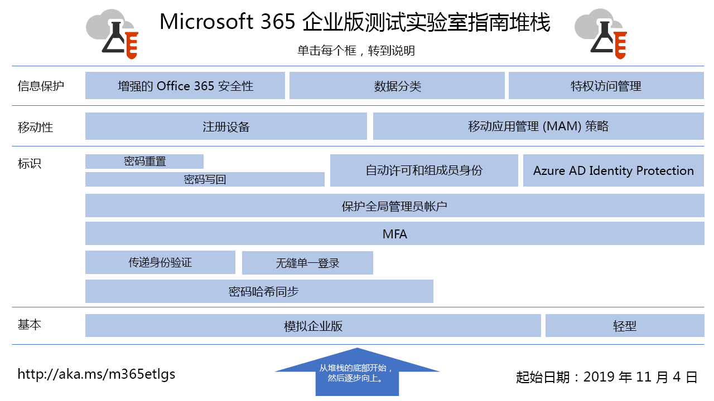

# Microsoft 365 企业版测试实验室指南

*这同时适用于 Microsoft 365 企业版和 Office 365 企业版。*

测试实验室指南 (TLG) 可帮助你快速了解 Microsoft 产品。它们提供了用于配置已简化但具有代表性的测试环境的说明性指南。可以在试用版或付费订阅期间使用这些环境进行演示、自定义或创建概念的复杂论证。

TTL 设计为模块化。 它们基于彼此构建，以创建更符合你的学习或测试配置需求的多个配置。 "我亲自构建，它可运行"的动手体验可帮助你了解新产品或方案的部署要求，以便你可以更好地规划在生产中托管它。

您还可以使用 TTL 创建具有代表性的环境来开发和测试应用程序，也称为开发/测试环境。
  

若要直观地映射到 Microsoft 365 for enterprise Test Lab Guide 堆栈中所有文章，请展开下图或转到 Microsoft 365 [for enterprise Test Lab Guide Stack](../downloads/Microsoft365EnterpriseTLGStack.pdf)。

## 基本配置

首先，为企业版Microsoft 365[环境](/microsoft-365-enterprise/)。 可以创建两种不同类型的基本配置：

- [轻型基本](lightweight-base-configuration-microsoft-365-enterprise.md)配置 - 当你要配置和演示Microsoft 365云环境中企业特性和功能（不包括任何本地组件）时，可使用此配置。

- 模拟企业[基础](simulated-ent-base-configuration-microsoft-365-enterprise.md)配置 - 当你希望为混合云环境中的企业特性和功能配置和演示 Microsoft 365 时，请使用此配置，该环境使用本地组件，如 Active Directory 域服务 (AD DS) 域。

此外，还可通过不将 Microsoft 365 E5 许可证添加到试用版或产品测试环境中，来创建 Office 365 E5 的测试环境。
    
## 标识

若要演示与标识相关的特性和功能，请参阅：

- [密码哈希同步](password-hash-sync-m365-ent-test-environment.md)
  
   启用和测试来自 AD DS 域控制器的基于密码哈希的目录同步。

- [传递身份验证](pass-through-auth-m365-ent-test-environment.md)
  
   启用和测试到 AD DS 域控制器的传递身份验证。

- [联合身份验证](federated-identity-for-your-microsoft-365-dev-test-environment.md)
  
   启用和测试到 AD DS 域控制器的联合身份验证。

- [Azure AD 无缝单一登录](single-sign-on-m365-ent-test-environment.md)
  
   使用 AD DS Azure AD启用和测试 (SSO) 无缝单一登录。

- [多重身份验证](multi-factor-authentication-microsoft-365-test-environment.md)
  
   为特定用户帐户启用并测试基于智能手机的多重身份验证。

- [保护全局管理员帐户](protect-global-administrator-accounts-microsoft-365-test-environment.md)

   通过条件访问策略锁定全局管理员帐户。

- [密码写回](password-writeback-m365-ent-test-environment.md)

   使用密码写回来从 Azure AD 更改 AD DS 用户帐户上的密码。

- [密码重置](password-reset-m365-ent-test-environment.md)

   使用自助服务密码重置重置密码。

- [自动许可和组成员身份](automate-licenses-group-membership-microsoft-365-test-environment.md)

   借助自动许可和动态组成员身份，使新帐户管理变得前所未有的容易。

- [Azure AD Identity Protection](azure-ad-identity-protection-microsoft-365-test-environment.md)

   扫描当前用户帐户以发现漏洞。

- [标识和设备访问](identity-device-access-m365-test-environment.md)

   创建用于测试推荐的标识和设备访问配置以及条件访问策略的环境。

## 移动设备管理

若要演示与移动设备管理相关的特性和功能，请参阅：

- [设备符合性策略](mam-policies-for-your-microsoft-365-enterprise-dev-test-environment.md)
    
   为 Windows 10 设备创建用户组和设备合规性策略。
    
- [注册 iOS 和 Android 设备](enroll-ios-and-android-devices-in-your-microsoft-enterprise-365-dev-test-environ.md)
   
   注册 iOS 或 Android 设备，并对其进行远程管理。

## 信息保护

若要演示与信息保护相关的特性和功能，请参阅：

- [增强的 Microsoft 365 安全性](increased-o365-security-microsoft-365-enterprise-dev-test-environment.md)
    
   配置可提高 Microsoft 365 安全性的设置，并调查内置安全工具。
  
- [数据分类](data-classification-microsoft-365-enterprise-dev-test-environment.md)
    
   配置标签，并将标签应用于 SharePoint Online 团队网站中的文档。
    
- [Privileged Access Management](privileged-access-microsoft-365-enterprise-dev-test-environment.md)
    
   配置 Privileged Access Management，以便实时访问组织中提升的特权任务。