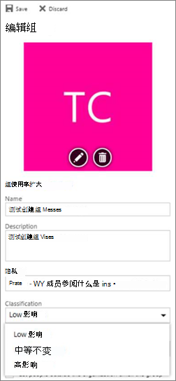

# <a name="manage-microsoft-365-groups-with-powershell"></a>使用 PowerShell Microsoft 365组

*此文章适用于 Microsoft 365 企业版和 Office 365 企业版。* 

本文提供了在 Microsoft PowerShell 中为组执行常见管理任务的步骤。 它还列出了组的 PowerShell cmdlet。 有关管理网站SharePoint，请参阅[使用 PowerShell SharePoint Online 网站](/sharepoint/manage-team-and-communication-sites-in-powershell)。

## <a name="link-to-your-microsoft-365-groups-usage-guidelines"></a>链接到你的Microsoft 365组使用准则

当用户[在组织中创建或编辑Outlook](https://support.office.com/article/04d0c9cf-6864-423c-a380-4fa858f27102.aspx)，您可以向用户显示指向组织使用准则的链接。 例如，如果需要将特定前缀或后缀添加到组名称中。

使用 Azure Active Directory (Azure AD) PowerShell 将用户指向组织针对组Microsoft 365准则。 请查看[Azure Active Directory组设置的 cmdlet](/azure/active-directory/enterprise-users/groups-settings-cmdlets)，并按照在目录级别创建设置中的步骤定义使用指南超链接。 运行此 cmdlet AAD后，当用户在 Outlook 中创建或编辑组时，将看到指向你的Outlook。


## <a name="allow-users-to-send-as-the-microsoft-365-group"></a>允许用户作为组Microsoft 365发送

如果要将组组Microsoft 365"发送方式"，请使用 [Add-RecipientPermission](/powershell/module/exchange/add-recipientpermission) 和 [Get-RecipientPermission](/powershell/module/exchange/get-recipientpermission) cmdlet 进行配置。 启用此设置后，Microsoft 365组用户可以使用 Outlook 或 Outlook 网页版 以组用户Microsoft 365和回复电子邮件。 用户可以转到组、创建新电子邮件，并将"发送为"字段更改为组的电子邮件地址。

 ([还可以在管理中心Exchange](/office365/admin/create-groups/allow-members-to-send-as-or-send-on-behalf-of-group)此操作) 

使用以下脚本， *\<GroupAlias\>* 将 替换为 *\<UserAlias\>* 要更新的组的别名以及要授予权限的用户的别名。 [连接 Exchange Online PowerShell](/powershell/exchange/connect-to-exchange-online-powershell) 运行此脚本。

```PowerShell
$groupAlias = "<GroupAlias>"
$userAlias = "<UserAlias>"
$groupsRecipientDetails = Get-Recipient -RecipientTypeDetails groupmailbox -Identity $groupAlias

Add-RecipientPermission -Identity $groupsRecipientDetails.Name -Trustee $userAlias -AccessRights SendAs
```

执行 cmdlet 后，用户可以通过向"Outlook"字段Outlook 网页版组电子邮件地址，转到"组"或"Outlook 网页版以组 **发送"。**

## <a name="create-classifications-for-microsoft-365-groups-in-your-organization"></a>为贵Microsoft 365组创建分类

可以创建组织中用户在创建组时设置的敏感度Microsoft 365标签。 如果要对组进行分类，我们建议使用敏感度标签，而不是以前的组分类功能。 有关使用敏感度标签的信息，请参阅使用敏感度标签保护网站Microsoft Teams、Microsoft 365[组SharePoint内容](../compliance/sensitivity-labels-teams-groups-sites.md)。

> [!IMPORTANT]
> 如果当前正在使用分类标签，则启用敏感度标签后，创建组的用户将不再可以使用分类标签。

您仍可以使用以前的组分类功能。 您可以创建组织中用户在创建组组时可设置的Microsoft 365分类。 例如，可以允许用户在创建的组上设置"标准"、"机密"和"顶级密码"。 默认情况下不会设置组分类，你需要创建它，以便用户进行设置。 使用 Azure Active Directory PowerShell 将用户指向组织的组使用Microsoft 365准则。

请查看[Azure Active Directory组设置的 cmdlet](/azure/active-directory/users-groups-roles/groups-settings-cmdlets)，并按照在目录级别创建设置中的步骤定义组Microsoft 365分类。

```powershell
$setting["ClassificationList"] = "Low Impact, Medium Impact, High Impact"
```

若要将说明与每个分类关联，可以使用 settings 属性  *ClassificationDescriptions* 进行定义。

```powershell
$setting["ClassificationDescriptions"] ="Classification:Description,Classification:Description"
```

其中 Classification 与 ClassificationList 中的字符串匹配。

示例：

```powershell
$setting["ClassificationDescriptions"] = "Low Impact: General communication, Medium Impact: Company internal data , High Impact: Data that has regulatory requirements"
```

在运行上述 Azure Active Directory cmdlet 设置分类后，如果要为特定组设置分类，请运行 [Set-UnifiedGroup](/powershell/module/exchange/Set-UnifiedGroup) cmdlet。

```powershell
Set-UnifiedGroup <LowImpactGroup@constoso.com> -Classification <LowImpact>
```

或者创建一个分类的新组。

```powershell
New-UnifiedGroup <HighImpactGroup@constoso.com> -Classification <HighImpact> -AccessType <Public>
```

请参阅将 [PowerShell](/powershell/exchange/exchange-online-powershell) 与 Exchange Online 一连接 Exchange Online [PowerShell](/powershell/exchange/connect-to-exchange-online-powershell)，详细了解如何Exchange Online PowerShell。

启用这些设置后，组所有者将能够从 Outlook 网页版和 Outlook 中的下拉菜单中选择分类，然后从"编辑组 **"页保存** 它。



## <a name="hide-microsoft-365-groups-from-the-global-address-list"></a>从Microsoft 365地址列表中隐藏组。

您可以指定一个Microsoft 365组是否显示在全局地址列表中， (GAL) 组织的其他列表中。 例如，如果您具有不希望在地址列表中显示的法律部门组，您可以阻止该组显示在 GAL 中。 运行 Set-Unified Group cmdlet，将组从地址列表中隐藏，如下所示：

```powershell
Set-UnifiedGroup -Identity "Legal Department" -HiddenFromAddressListsEnabled $true
```

## <a name="allow-only-internal-users-to-send-message-to-microsoft-365-groups"></a>仅允许内部用户向组Microsoft 365邮件

如果您不希望其他组织的用户向 Microsoft 365 组发送电子邮件，您可以更改该组的设置。 它将仅允许内部用户向你的组发送电子邮件。 如果外部用户尝试向该组发送邮件，邮件将被拒绝。

运行 Set-UnifiedGroup cmdlet 以更新此设置，如下所示：

```powershell
Set-UnifiedGroup -Identity "Internal senders only" -RequireSenderAuthenticationEnabled $true
```

## <a name="add-mailtips-to-microsoft-365-groups"></a>将邮件提示添加到Microsoft 365组

每当发件人尝试向 Microsoft 365 发送电子邮件时，都会向用户显示邮件提示。

运行 Set-Unified 组 cmdlet 将邮件提示添加到组：

```powershell
Set-UnifiedGroup -Identity "MailTip Group" -MailTip "This group has a MailTip"
```

除了邮件提示，还可以设置 MailTipTranslations，这将为邮件提示指定其他语言。 假设你想要使用西班牙语翻译，然后运行以下命令：

```powershell
Set-UnifiedGroup -Identity "MailaTip Group" -MailTip "This group has a MailTip" -MailTipTranslations "@{Add="ES:Esta caja no se supervisa."
```

## <a name="change-the-display-name-of-the-microsoft-365-group"></a>更改显示名称组Microsoft 365

the 显示名称 specifies the name of the Microsoft 365 Group. 可以在管理中心<a href="https://go.microsoft.com/fwlink/p/?linkid=2059104" target="_blank">或管理中心</a>Exchange此<a href="https://go.microsoft.com/fwlink/p/?linkid=2024339" target="_blank">Microsoft 365 管理中心</a>。 通过运行 显示名称 命令，显示名称组Microsoft 365组或Set-UnifiedGroup组：

```powershell
Set-UnifiedGroup -Identity "mygroup@contoso.com" -DisplayName "My new group"
```

## <a name="change-the-default-setting-of-microsoft-365-groups-for-outlook-to-public-or-private"></a>将组的默认Microsoft 365组Outlook公用或专用

Microsoft 365组Outlook创建为专用。 如果组织希望Microsoft 365组默认创建为公用组或 (私有) ，请使用以下 PowerShell cmdlet 语法：

 `Set-OrganizationConfig -DefaultGroupAccessType Public`

若要设置为专用：

 `Set-OrganizationConfig -DefaultGroupAccessType Private`

验证设置：

 `Get-OrganizationConfig | ft DefaultGroupAccessType`

若要了解更多信息，请参阅 [Set-OrganizationConfig](/powershell/module/exchange/set-organizationconfig) 和 [Get-OrganizationConfig](/powershell/module/exchange/get-organizationconfig)。

## <a name="microsoft-365-groups-cmdlets"></a>Microsoft 365 Groups cmdlet

以下 cmdlet 可用于Microsoft 365组。

|**Cmdlet 名称**|**说明**|
|:-----|:-----|
|[Get-UnifiedGroup](/powershell/module/exchange/get-unifiedgroup) <br/> |使用此 cmdlet 查找现有Microsoft 365组，并查看 group 对象的属性  <br/> |
|[Set-UnifiedGroup](/powershell/module/exchange/set-unifiedgroup) <br/> |更新特定组Microsoft 365属性  <br/> |
|[New-UnifiedGroup](/powershell/module/exchange/new-unifiedgroup) <br/> |创建新的组Microsoft 365组。 此 cmdlet 提供最少的一组参数。 若要设置扩展属性的值，请使用Set-UnifiedGroup组后使用  <br/> |
|[Remove-UnifiedGroup](/powershell/module/exchange/remove-unifiedgroup) <br/> |删除现有Microsoft 365组  <br/> |
|[Get-UnifiedGroupLinks](/powershell/module/exchange/get-unifiedgrouplinks) <br/> |检索组成员身份和所有者Microsoft 365信息  <br/> |
|[Add-UnifiedGroupLinks](/powershell/module/exchange/add-unifiedgrouplinks) <br/> |将成员、所有者和订阅者添加到现有 Microsoft 365 组 <br/> |
|[Remove-UnifiedGroupLinks](/powershell/module/exchange/remove-unifiedgrouplinks) <br/> |从现有组中删除所有者Microsoft 365成员  <br/> |
|[Get-UserPhoto](/powershell/module/exchange/get-userphoto) <br/> |用于查看有关与帐户关联的用户照片的信息。 用户照片存储在 Active Directory 中  <br/> |
|[Set-UserPhoto](/powershell/module/exchange/set-userphoto) <br/> |用于将用户照片与帐户关联。 用户照片存储在 Active Directory 中  <br/> |
|[Remove-UserPhoto](/powershell/module/exchange/remove-userphoto) <br/> |删除组Microsoft 365照片  <br/> |

## <a name="related-topics"></a>相关主题

[将通讯组列表升级到Microsoft 365组](/office365/admin/manage/upgrade-distribution-lists)

[管理可创建 Microsoft 365 组的人员](/office365/admin/create-groups/manage-creation-of-groups)

[管理对组Microsoft 365访问](https://support.office.com/article/bfc7a840-868f-4fd6-a390-f347bf51aff6)

[将静态组成员身份更改为 dynamic in](/azure/active-directory/users-groups-roles/groups-change-type)
