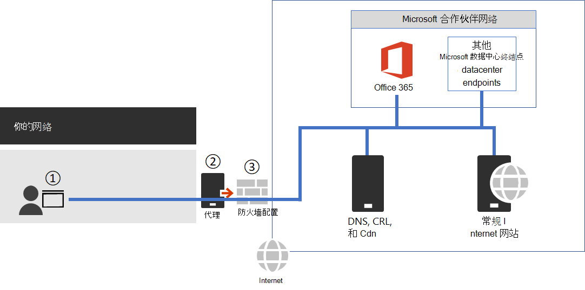

# <a name="managing-office-365-endpoints"></a>管理 Office 365 终结点

具有多个办公室位置和连接的 WAN 的大多数企业组织将需要配置 Office 365 网络连接。 绕过所有其他包级别检查或处理过程，直接通过防火墙发送所有 Office 365 可信网络请求可优化网络。 这样可减少延迟和外围容量要求。 识别 Office 365 网络流量是为用户提供最佳性能的第一步。 有关详细信息，请参阅Office 365[网络连接原则。](microsoft-365-network-connectivity-principles.md)

Microsoft 建议你使用 Office 365 IP 地址和 URL Web 服务访问 Office 365 网络终结点和正在进行的[更改](microsoft-365-ip-web-service.md)。

无论如何管理重要的 Office 365 网络流量，Office 365 都需要 Internet 连接。 [Office 365 IP 地址和 URL Web 服务中未包括的其他终结点](additional-office365-ip-addresses-and-urls.md)列出了需要连接的其他网络终结点。

如何使用 Office 365 网络终结点将取决于你的企业组织网络体系结构。 本文概述了企业网络体系结构可以与 Office 365 IP 地址和 URL 集成的几种方式。 选择要信任的网络请求的最简单方法是在每个办公室位置使用支持自动Office 365配置的 SD-WAN 设备。

## <a name="sd-wan-for-local-branch-egress-of-vital-office-365-network-traffic"></a>用于重要网络通信的本地分支出口Office 365 SD-WAN

在每个分支机构位置，您可以提供配置为将终结点的 Office 365 Optimize 类别或"优化"和"允许"类别的流量直接路由到 Microsoft 网络的 SD-WAN 设备。 其他网络流量（包括本地数据中心流量、常规 Internet 网站流量以及到 Office 365 默认类别终结点的流量）将发送到你具有更大网络外围的位置。

Microsoft 正在与 SD-WAN 提供程序合作以启用自动配置。 有关详细信息，请参阅 [Office 365 网络合作伙伴计划](microsoft-365-networking-partner-program.md)。

<a name="pacfiles"> </a>
## <a name="use-a-pac-file-for-direct-routing-of-vital-office-365-traffic"></a>使用 PAC 文件直接路由重要的 Office 365 流量

使用 PAC 或 WPAD 文件管理与 Office 365 关联但没有 IP 地址的网络请求。 通过代理或外围设备发送的网络请求通常会增加延迟。 虽然 SSL 中断和检查会带来最大的延迟，但是其他服务（例如代理身份验证和信誉查找）可能会导致性能下降和用户体验不佳。 此外，这些外围网络设备需要有足够的容量，才能处理所有网络连接请求。 建议绕过代理或检查设备直接发送 Office 365 网络请求。
  
[PowerShell Gallery Get-PacFile](https://www.powershellgallery.com/packages/Get-PacFile) 是 PowerShell 脚本，它从 Office 365 IP 地址和 URL Web 服务读取最新网络终结点，并创建示例 PAC 文件。 可以修改脚本，使其与现有的 PAC 文件管理集成。



**图 1 - 简单的企业网络外围**

该 PAC 文件部署到了图 1 中点 1 处的 Web 浏览器。 当使用 PAC 文件直接发送重要的 Office 365 网络流量时，还需要允许连接到网络外围防火墙上这些 URL 后面的 IP 地址。 通过获取 PAC 文件中指定的相同 Office 365 终结点类别的 IP 地址，并基于这些地址创建防火墙 ACL 来完成此操作。 防火墙是图 1 中的点 3。

另外，如果你选择仅对“优化”类别的终结点直接路由，则需要在代理服务器中列出你发送到代理服务器的所有必需的“允许”类别终结点，以绕过进一步处理。 例如，SSL 中断和检查以及代理身份验证与“优化和允许“类别终结点不兼容。 代理服务器是图 1 中的点 2。

常见配置是允许，而无需针对到达代理服务器的 Office 365 网络流量的目标 IP 地址处理来自代理服务器的所有出站流量。 有关 SSL 中断和检查的问题的详细信息，请参阅[使用有关 Office 365 流量的第三方网络设备或解决方案](https://support.microsoft.com/help/2690045/using-third-party-network-devices-or-solutions-with-office-365)。

PAC 文件脚本会生成两种类型的 PAC 文件。

| 类型 | 描述 |
|:-----|:-----|
|**1** <br/> |直接将“优化”终结点流量和其他流量发送到代理服务器。 <br/> |
|**2** <br/> |直接将“优化和允许”终结点流量和其他流量发送到代理服务器。 此类型还可以用于所有受支持的适用于 Office 365 的 ExpressRoute 流量发送到 ExpressRoute 网段，并将其他所有流量发送到代理服务器。 <br/> |

下面是调用 PowerShell 脚本的一个简单示例：

```powershell
Get-PacFile -ClientRequestId b10c5ed1-bad1-445f-b386-b919946339a7
```

可以传递给脚本的参数有很多：

| 参数 | 描述 |
|:-----|:-----|
|**ClientRequestId** <br/> |这是必需的，并且是传递给 Web 服务的 GUID，它代表进行呼叫的客户端计算机。 <br/> |
|**实例** <br/> |The Office 365 service instance， which defaults to Worldwide. 这也会传递到 Web 服务。 <br/> |
|**TenantName** <br/> |你的 Office 365 租户名称。 传递到 Web 服务并用作某些 Office 365 URL 中的可替换参数。 <br/> |
|**类型** <br/> |要生成的代理 PAC 文件的类型。 <br/> |

这是使用附加参数调用 PowerShell 脚本的另一个示例：

```powershell
Get-PacFile -Type 2 -Instance Worldwide -TenantName Contoso -ClientRequestId b10c5ed1-bad1-445f-b386-b919946339a7
```

## <a name="proxy-server-bypass-processing-of-office-365-network-traffic"></a>代理服务器绕过 Office 365 网络流量的处理

在 PAC 文件不用于直接出站通信的情况下，你仍然希望通过配置代理服务器来绕过网络外围上的处理。 如 [Office 365 网络合作伙伴计划](microsoft-365-networking-partner-program.md)中所述，某些代理服务器供应商已启用此功能的自动配置。

如果手动执行此操作，则需要从 Office 365 IP 地址和 URL Web 服务获取优化和允许终结点类别数据，并配置代理服务器以绕过对这些数据的处理。 对于“优化和允许”类别的终结点，避免 SSL 中断以及检查和代理身份验证很重要。
  
<a name="bkmk_changes"> </a>
## <a name="change-management-for-office-365-ip-addresses-and-urls"></a>Office 365 IP 地址和 URL 的变更管理

除了为网络外围选择适当的配置外，对 Office 365 终结点采用变更管理流程也很重要。 这些终结点会定期更改，如果你不管理变更，则在添加新的 IP 地址或 URL 后，最终用户可能会被阻止或性能不佳。

对 Office 365 IP 地址和 URL 的更改通常在每个月最后一天前后发布。 有时，由于运营、支持或安全要求，可能会在时间表之外发布更改。

如果发布的更改由于添加了 IP 地址或 URL 而要求你采取行动，你将在我们发布更改之日起 30 天内收到通知，直到该终结点上有 Office 365 服务。 这反映为"生效日期"。 尽管我们的目标是实现此通知期，但由于操作、支持或安全性要求，可能并非总是如此。 不需要立即采取措施来保持连接性的更改（例如，删除的 IP 地址或 URL 或不太重要的更改）不包括提前通知。 在这些情况下，不会提供生效日期。 无论提供什么通知，我们都会列出每次更改的预期服务启用日期。

### <a name="change-notification-using-the-web-service"></a>使用 Web 服务的更改通知

可使用 Office 365 IP 地址和 URL Web 服务获取更改通知。 我们建议你每小时调用一次 **/version** Web 方法，以查看用于连接到 Office 365 的终结点的版本。 如果与使用的版本相比，该版本发生了变化，则应该从 **/endpoints** Web 方法获取最新的终结点数据，并可以选择从 **/changes** Web 方法获取差异。 如果找到的版本没有任何更改，则不必调用 **/endpoints** 或 **/changes** Web 方法。

有关详细信息，请参阅 [Office 365 IP 地址和 URL Web 服务](microsoft-365-ip-web-service.md)。

### <a name="change-notification-using-rss-feeds"></a>使用 RSS 源的更改通知

Office 365 IP 地址和 URL Web 服务提供了一个 RSS 源，你可以在 Outlook 中进行订阅。 IP 地址和 URL 的每个特定于 Office 365 实例的页面上都有指向 RSS URL 的链接。 有关详细信息，请参阅 [Office 365 IP 地址和 URL Web 服务](microsoft-365-ip-web-service.md)。

### <a name="change-notification-and-approval-review-using-power-automate"></a>使用"更改通知"和"审批Power Automate

我们理解，你可能仍需要手动处理每个月进行的网络终结点更改。 您可以使用Power Automate创建通过电子邮件通知您的流，并可以选择在网络终结点发生更改时Office 365审批流程。 审核完成后，可以通过流程自动将更改通过电子邮件发送给防火墙和代理服务器管理团队。

有关示例和Power Automate的信息，请参阅 Use [Power Automate to receive an email for changes to Office 365 IP addresses and URLs](https://techcommunity.microsoft.com/t5/Office-365-Networking/Use-Microsoft-Flow-to-receive-an-email-for-changes-to-Office-365/td-p/240651)。
  
<a name="FAQ"> </a>
## <a name="office-365-network-endpoints-faq"></a>Office 365 网络终结点常见问题

请参阅以下有关网络连接Office 365常见问题。
  
### <a name="how-do-i-submit-a-question"></a>如何提交问题？

请单击底部的链接，指出文章是否有帮助，也可以提交任何其他问题。 我们会检查反馈，并更新最常见的问题。
  
### <a name="how-do-i-determine-the-location-of-my-tenant"></a>如何确定租户的位置？

 使用 [数据中心地图](./o365-data-locations.md)是确定 **租户位置** 的最佳方式。
  
### <a name="am-i-peering-appropriately-with-microsoft"></a>我与 Microsoft 间的对等互连是否正确？

 在 [与 Microsoft 对等互连](https://www.microsoft.com/peering)中详细描述了 **对等位置**。
  
我们在全球拥有 2500 多个 ISP 对等关系和 70 个接入点，因此你的网络可无缝连接到我们的网络。 花几分钟时间确保你的 ISP 对等关系为最佳对等关系，这不会有什么坏处，[此处的几个示例](/archive/blogs/onthewire/__guidance)展示了对等转接我们的网络时较顺利的情况和不太顺利的情况。
  
<a name="bkmk_MissingIP"> </a>
### <a name="i-see-network-requests-to-ip-addresses-not-on-the-published-list-do-i-need-to-provide-access-to-them"></a>我发现发布列表中没有列出对 IP 地址的网络请求，我是否需要提供访问它们的权限？

我们只提供直接路由到 Office 365 服务器的 IP 地址。 这不是所有会出现网络请求的 IP 地址的完整列表。 你将看到发送给 Microsoft 和第三方自有的未发布 IP 地址的网络请求。 这些 IP 地址是动态生成的或管理的，发生更改时不会及时通知。 如果防火墙不允许基于 FQDN 访问这些网络请求，请使用 PAC 或 WPAD 文件来管理请求。
  
需要了解与 Office 365 关联的 IP 的详细信息？
  
1. 使用 CIDR 计算器检查该 IP 地址是否包含在较大的已发布范围内，如 [IPv4](https://www.ipaddressguide.com/cidr) 或 [IPv6](https://www.ipaddressguide.com/ipv6-cidr) 的 IP 地址。 例如，40.96.0.0/13 包括 IP 地址40.103.0.1，尽管40.96 与 40.103 不匹配。
2. 查看合作伙伴是否拥有含 [whois 查询](https://dnsquery.org/)的 IP。 如果该 IP 为 Microsoft 所有，则它可能是内部合作伙伴。 许多伙伴网络终结点被列为属于 _默认_ 类别，其 IP 地址未发布。
3. 该 IP 地址可能不是 Office 365 的一部分或与其无从属关系。 Office 365 网络终结点发布不包括所有 Microsoft 网络终结点。
4. 检查证书。 通过浏览器，使用 HTTPS:// 连接到 IP *\<IP_ADDRESS\>* 地址，并检查证书中列出的域，了解哪些域与 IP 地址相关联。 如果它是 Microsoft 拥有的 IP 地址，而不是 Office 365 IP 地址的列表，则 IP 地址可能是与 Microsoft CDN（如 *MSOCDN.NET）* 或另一个没有已发布 IP 信息的 Microsoft 域相关联。 如果发现证书上的域确实是我们宣称列出 IP 地址的域，请告知我们。

<a name="bkmk_cname"> </a>
### <a name="some-office-365-urls-point-to-cname-records-instead-of-a-records-in-the-dns-what-do-i-have-to-do-with-the-cname-records"></a>某些 Office 365 URL 指向 CNAME 记录，而不是 DNS 中的 A 记录。 我与 CNAME 记录有什么关系？

客户端计算机需要 DNS A 或 AAAA 记录) 包括一个或多个 IP 地址 () 连接到云服务。 Office 365 中包含的某些 URL 显示 CNAME 记录，而不是 A 或 AAAA 记录。 这些 CNAME 记录是中间记录，记录链中可能有多个此类记录。 它们最终将始终解析为 IP 地址的 A 或 AAAA 记录。 例如，考虑以下 DNS 记录系列，这些记录最终将解析为 IP 地址 _IP_1_：

```console
serviceA.office.com -> CNAME: serviceA.domainA.com -> CNAME: serviceA.domainB.com -> A: IP_1
```

这些 CNAME 重定向是 DNS 的常规部分，对客户端计算机和代理服务器都是透明的。 它们用于负载平衡、内容交付网络、高可用性和服务事件缓解。 Microsoft 不会发布中间 CNAME 记录，它们随时可能更改，因此无需按照代理服务器中允许的内容对其进行配置。

代理服务器验证初始 URL，如上例 serviceA.office.com，此 URL 将包含在Office 365中。 代理服务器请求将该 URL 的 DNS 解析为 IP 地址，并将收到 IP_1。 它不会验证中间的 CNAME 重定向记录。

不建议使用硬编码配置或基于间接 FQN Office 365允许列表，Microsoft 不支持，并且已知会导致客户连接问题。 阻止 CNAME 重定向或错误地解析 Office 365 DNS 条目的 DNS 解决方案可以通过启用了 DNS 递归的 DNS 转发器或通过使用 DNS 根提示来解决。 许多第三方网络外围产品本机集成了推荐的 Office 365 终结点，以使用 Office 365 IP 地址和[URL Web 服务](microsoft-365-ip-web-service.md)在配置中包括允许列表。

<a name="bkmk_akamai"> </a>
### <a name="why-do-i-see-names-such-as-nsatcnet-or-akadnsnet-in-the-microsoft-domain-names"></a>为什么会在 Microsoft 域名中看到 nsatc.net 或 akadns.net 等名称？

Office 365 和其他 Microsoft 服务使用几项第三方服务（如 Akamai 和 MarkMonitor）来改进 Office 365 体验。 为了尽可能提供最佳体验，我们以后可能会更改这些服务。 第三方域可以承载内容（如 CDN）或承载服务，如地理流量管理服务。 目前正在使用的一些服务包括：
  
[当你看到](https://www.markmonitor.com/)包含 .nsatc.net 的请求时 *\* ，MarkMonitor nsatc.net。* 此服务提供域名称保护和监控功能，抵御恶意行为。
  
[ExactTarget](https://www.marketingcloud.com/) is in use when you see requests to *\* .exacttarget.com*. 此服务提供电子邮件链接管理和监控功能，抵御恶意行为。
  
如果看到请求包括以下一种 FQDN，则表示正在使用 [Akamai](https://www.akamai.com/)。 此服务提供地理 DNS 和内容交付网络服务。
  
```console
*.akadns.net
*.akam.net
*.akamai.com
*.akamai.net
*.akamaiedge.net
*.akamaihd.net
*.akamaized.net
*.edgekey.net
*.edgesuite.net
```

<a name="bkmk_thirdparty"> </a>
### <a name="i-have-to-have-the-minimum-connectivity-possible-for-office-365"></a>我必须具有尽可能低的 Office 365 连接性

由于 Office 365 是一套构建以通过 Internet 运作的服务，其所承诺的可靠性和可用性以当前可用的许多标准 Internet 服务为基础。 例如，必须能访问 DNS、CRL 和 CDN 等标准 Internet 服务才能使用 Office 365，正如使用大多数现代 Internet 服务时也必须访问这些服务一样。

Office 365 套件分为几个主要服务区域。 可以选择性地为连接启用这些连接，并且有一个公共区域，它是所有区域的依赖关系，并且始终是必需的。

| 服务区域 | 描述 |
|:-----|:-----|
|**Exchange** <br/> |Exchange Online 和 Exchange Online Protection <br/> |
|**SharePoint** <br/> |SharePoint Online 和 OneDrive for Business <br/> |
|**Skype for Business Online 和 Microsoft Teams** <br/> |Skype for Business 和 Microsoft Teams <br/> |
|**常见** <br/> |Office 365 专业增强版、浏览器中的 Office、Azure AD 和其他常见网络终结点 <br/> |

除了基本的 Internet 服务外，还有一些仅用于集成功能的第三方服务。 尽管集成需要这些组件，但是它们在 Office 365 终结点文章中标记为可选，这意味着如果终结点无法访问，服务的核心功能将继续运行。 所需的任何网络终结点都将必需的属性设置为 true。 任何可选网络终结点都将必需的属性设置为 false，并且 notes 属性将详细说明在连接被阻止时预期缺少的功能。
  
如果你尝试使用 Office 365并且发现第三方服务不可访问，你会希望确保允许通过代理和防火墙访问本文中标记为必需或可选的所有[FQN。](urls-and-ip-address-ranges.md)
  
<a name="bkmk_consumer"> </a>
### <a name="how-do-i-block-access-to-microsofts-consumer-services"></a>如何阻止对 Microsoft 消费者服务的访问？

租户限制功能现在支持阻止使用 MSA 应用 (应用程序) 如 OneDrive、Hotmail 和 Xbox.com。 这会将单独的标头用于 login.live.com 终结点。 有关详细信息，请参阅使用 [租户限制管理对 SaaS 云应用程序的访问权限](/azure/active-directory/manage-apps/tenant-restrictions#blocking-consumer-applications)。

<a name="bkmk_IPOnlyFirewall"> </a>
### <a name="my-firewall-requires-ip-addresses-and-cannot-process-urls-how-do-i-configure-it-for-office-365"></a>我的防火墙需要 IP 地址，并且无法处理 URL。 如何针对 Office 365 进行配置？

Office 365 不提供所有必需的网络终结点的 IP 地址。 有些仅作为 URL 提供，并且被归类为“默认”。 应允许通过代理服务器使用默认类别中的 URL。 如果您没有代理服务器，请了解如何配置用户键入 Web 浏览器地址栏中的 URL 的 Web 请求;用户也不提供 IP 地址。 应Office 365 IP 地址的默认类别 URL 配置方式相同。

## <a name="related-topics"></a>相关主题

[Office 365 IP 地址和 URL Web 服务](microsoft-365-ip-web-service.md)

[Microsoft Azure 数据中心 IP 范围](https://www.microsoft.com/download/details.aspx?id=41653)
  
[Microsoft 公共 IP 空间](https://www.microsoft.com/download/details.aspx?id=53602)
  
[Microsoft Intune 的网络基础架构要求](/intune/get-started/network-infrastructure-requirements-for-microsoft-intune)
  
[ExpressRoute 和 Power BI](https://powerbi.microsoft.com/documentation/powerbi-admin-power-bi-expressroute/)
  
[Office 365 URL 和 IP 地址范围](urls-and-ip-address-ranges.md)
  
[管理 ExpressRoute for Office 365 连接](managing-expressroute-for-connectivity.md)
  
[Office 365 网络连接原则](microsoft-365-network-connectivity-principles.md)
