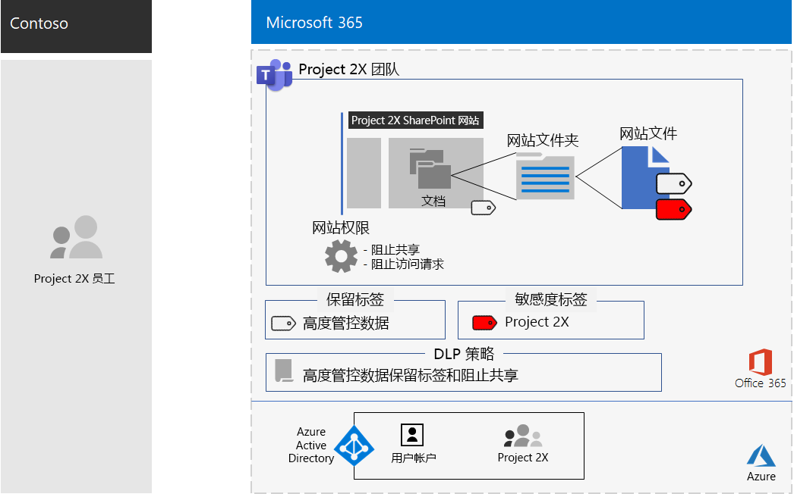
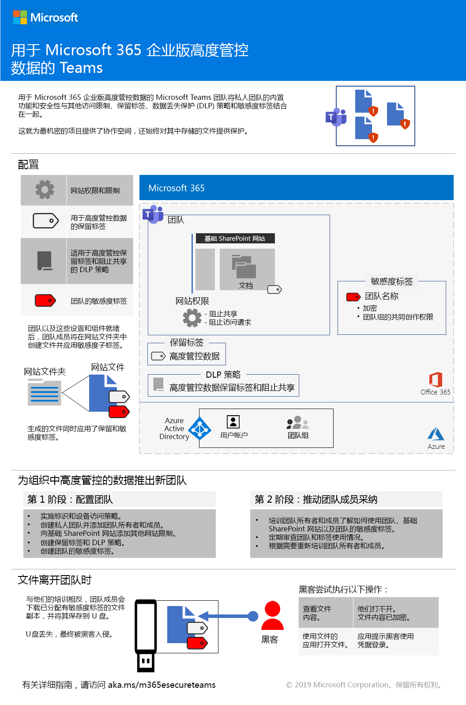
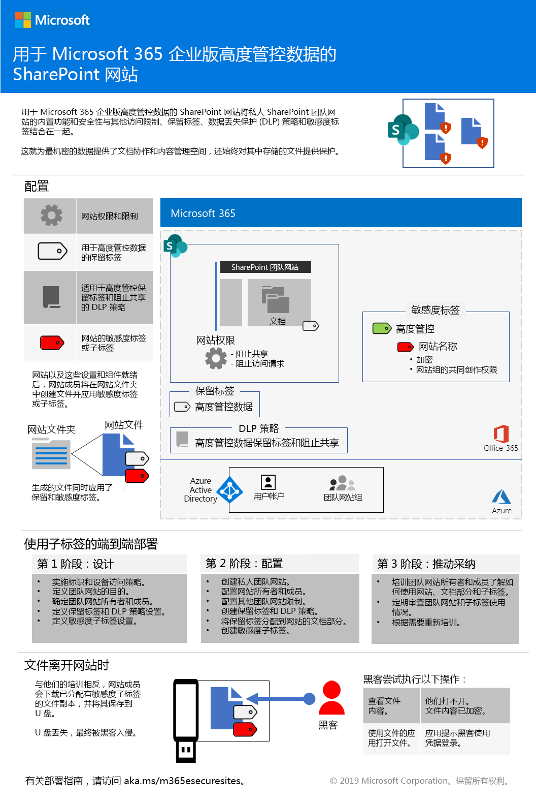
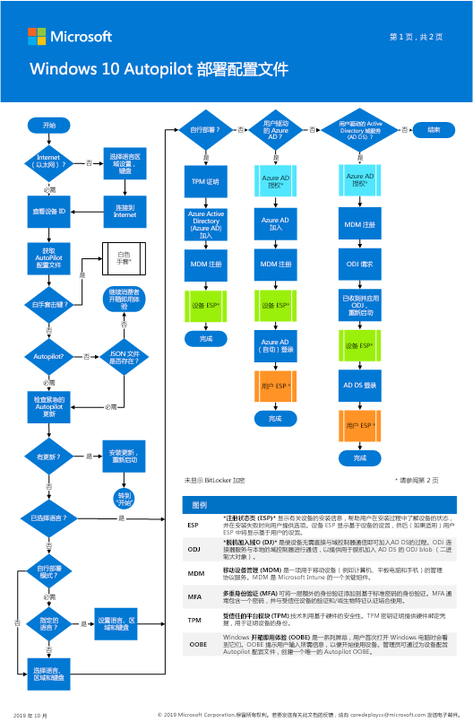
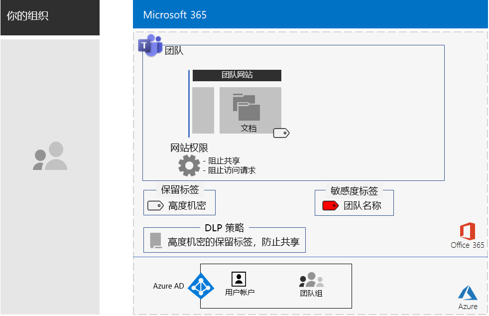
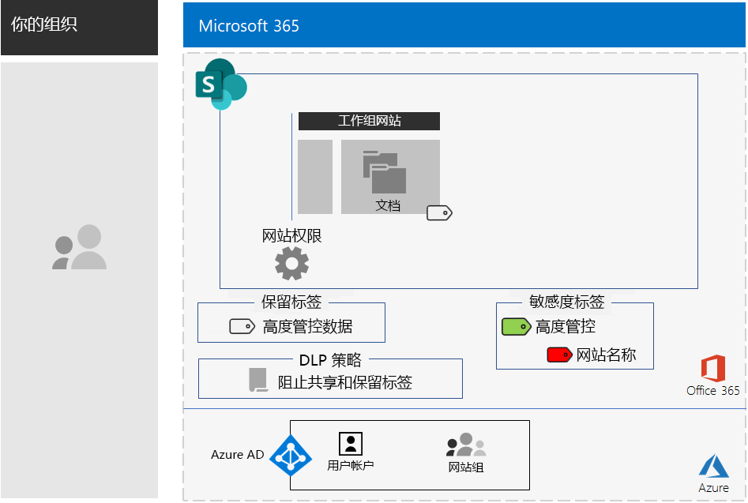

# Microsoft 365 企业版部署内容的更改Changes to Microsoft 365 for enterprise deployment content

## 2019 年 12 月December 2019

### 新内容New content 

- [面向安全团队的文件测试实验室指南Test Lab Guide for Secure Teams for files](https://docs.microsoft.com/microsoft-365/security/office-365-security/secure-team-for-files-in-a-dev-test-environment)

### 更新和增强功能Updates and enhancements

-  对一组[测试实验室指南](m365-enterprise-test-lab-guides.md)的刷新Refresh of the set of [Test Lab Guides](m365-enterprise-test-lab-guides.md) 

## 2019 年 11 月November 2019

### 新内容New content 

- [从 Microsoft 365 商业版迁移到 Microsoft 365 E3Migrate from Microsoft 365 Business to Microsoft 365 E3](https://docs.microsoft.com/microsoft-365/business/migrate-from-microsoft-365-business-to-microsoft-365-enterprise)

- [Contoso Corporation 的最高机密项目团队Team for a top-secret project of the Contoso Corporation](contoso-team-for-top-secret-project.md)

  

## 2019 年 10 月October 2019

### 新内容New content 

- [针对高度管控数据海报的 TeamsTeams for highly regulated data poster](secure-teams-highly-regulated-data-scenario.md#poster)

  

  还可以下载 [PDF](https://github.com/MicrosoftDocs/microsoft-365-docs/raw/public/microsoft-365/media/secure-teams-highly-regulated-data-scenario/TeamsHighlyRegulatedData.pdf) 或 [PowerPoint](https://github.com/MicrosoftDocs/microsoft-365-docs/raw/public/microsoft-365/media/secure-teams-highly-regulated-data-scenario/Teams-Highly-Regulated-Data-Poster.pptx) 格式的海报，并按 letter、legal 或 tabloid (11 x 17) 大小的纸张打印。You can also download this poster in [PDF](https://github.com/MicrosoftDocs/microsoft-365-docs/raw/public/microsoft-365/media/secure-teams-highly-regulated-data-scenario/TeamsHighlyRegulatedData.pdf) or [PowerPoint](https://github.com/MicrosoftDocs/microsoft-365-docs/raw/public/microsoft-365/media/secure-teams-highly-regulated-data-scenario/Teams-Highly-Regulated-Data-Poster.pptx) formats and print it on letter, legal, or tabloid (11 x 17)-sized paper.

- [针于高度管控数据海报的 SharePoint 网站SharePoint sites for highly regulated data poster](teams-sharepoint-online-sites-highly-regulated-data.md#poster)

  

  还可以下载 [PDF](https://github.com/MicrosoftDocs/microsoft-365-docs/raw/public/microsoft-365/media/teams-sharepoint-online-sites-highly-regulated-data/SharePointSitesHighlyRegulatedData.pdf) 或 [PowerPoint](https://github.com/MicrosoftDocs/microsoft-365-docs/raw/public/microsoft-365/media/teams-sharepoint-online-sites-highly-regulated-data/SharePoint-Sites-Highly-Regulated-Data.pptx) 格式的海报，并按 letter、legal 或 tabloid (11 x 17) 大小的纸张打印。You can also download this poster in [PDF](https://github.com/MicrosoftDocs/microsoft-365-docs/raw/public/microsoft-365/media/teams-sharepoint-online-sites-highly-regulated-data/SharePointSitesHighlyRegulatedData.pdf) or [PowerPoint](https://github.com/MicrosoftDocs/microsoft-365-docs/raw/public/microsoft-365/media/teams-sharepoint-online-sites-highly-regulated-data/SharePoint-Sites-Highly-Regulated-Data.pptx) formats and print it on letter, legal, or tabloid (11 x 17)-sized paper.

- [使用 Autopilot 海报部署 Windows 10The Deploy Windows 10 with Autopilot poster](windows10-deploy-autopilot.md) 

  

  也可以下载 [PDF](https://github.com/MicrosoftDocs/windows-itpro-docs/raw/public/windows/deployment/media/Windows10AutopilotFlowchart.pdf) 或 [Visio](https://github.com/MicrosoftDocs/windows-itpro-docs/raw/public/windows/deployment/media/Windows10Autopilotflowchart.vsdx) 格式的海报。You can also download this poster in [PDF](https://github.com/MicrosoftDocs/windows-itpro-docs/raw/public/windows/deployment/media/Windows10AutopilotFlowchart.pdf) or [Visio](https://github.com/MicrosoftDocs/windows-itpro-docs/raw/public/windows/deployment/media/Windows10Autopilotflowchart.vsdx) format.

- [使用 Configuration Manager 海报部署 Windows 10The Windows 10 deployment with Configuration Manager poster](windows10-deploy-inplaceupgrade.md)

  

  也可以下载 [PDF](https://github.com/MicrosoftDocs/windows-itpro-docs/raw/public/windows/deployment/media/Windows10DeploymentConfigManager.pdf) 或 [Visio](https://github.com/MicrosoftDocs/windows-itpro-docs/raw/public/windows/deployment/media/Windows10DeploymentConfigManager.vsdx) 格式的海报。You can also download this poster in [PDF](https://github.com/MicrosoftDocs/windows-itpro-docs/raw/public/windows/deployment/media/Windows10DeploymentConfigManager.pdf) or [Visio](https://github.com/MicrosoftDocs/windows-itpro-docs/raw/public/windows/deployment/media/Windows10DeploymentConfigManager.vsdx) format.

- [用于高度管控数据的 Teams 方案Teams for highly regulated data scenario](secure-teams-highly-regulated-data-scenario.md)

  

  公告：[Microsoft 365 技术社区博客 ](https://techcommunity.microsoft.com/t5/Microsoft-365-Blog/Protect-your-highly-regulated-files-in-Teams-with-Microsoft-365/ba-p/962985)  |  [LinkedIn](https://www.linkedin.com/pulse/how-can-i-lock-down-team-sensitive-top-secret-joe-davies/?published=t)Announcements: [Microsoft 365 Technical Community blog](https://techcommunity.microsoft.com/t5/Microsoft-365-Blog/Protect-your-highly-regulated-files-in-Teams-with-Microsoft-365/ba-p/962985)  |  [LinkedIn](https://www.linkedin.com/pulse/how-can-i-lock-down-team-sensitive-top-secret-joe-davies/?published=t)

- [“为远程工作者提供强大功能”海报Empower remote workers poster](empower-people-to-work-remotely.md#poster)

   

  还可以下载 [PDF](https://github.com/MicrosoftDocs/microsoft-365-docs/raw/public/microsoft-365/media/empower-people-to-work-remotely/empower-remote-workers-scenario.pdf) 或 [PowerPoint](https://github.com/MicrosoftDocs/microsoft-365-docs/raw/public/microsoft-365/media/empower-people-to-work-remotely/Empower-Remote-Workers-Poster.pptx) 格式的海报，并按 letter、legal 或 tabloid (11 x 17) 大小的纸张打印。You can also download this poster in [PDF](https://github.com/MicrosoftDocs/microsoft-365-docs/raw/public/microsoft-365/media/empower-people-to-work-remotely/empower-remote-workers-scenario.pdf) or [PowerPoint](https://github.com/MicrosoftDocs/microsoft-365-docs/raw/public/microsoft-365/media/empower-people-to-work-remotely/Empower-Remote-Workers-Poster.pptx) formats and print it on letter, legal, or tabloid (11 x 17)-sized paper.

### 更新和增强功能Updates and enhancements

- [阶段 4 的刷新：Office 365 专业增强版](office365proplus-infrastructure.md)Refresh of [Phase 4: Office 365 ProPlus](office365proplus-infrastructure.md)
- 更新[Contoso 案例研究](contoso-case-study.md)Refresh of the [Contoso case study](contoso-case-study.md)
- 更新 [Microsoft Teams](teams-workload.md)、[Exchange Online](exchangeonline-workload.md) 和 [SharePoint Online](sharepoint-online-onedrive-workload.md) 工作负载Refresh of the [Microsoft Teams](teams-workload.md), [Exchange Online](exchangeonline-workload.md), and [SharePoint Online](sharepoint-online-onedrive-workload.md) workloads
- 更新[用于高度管控数据的 SharePoint 网站](teams-sharepoint-online-sites-highly-regulated-data.md)场景Refresh of the [SharePoint sites for highly regulated data](teams-sharepoint-online-sites-highly-regulated-data.md) scenario
 
  

- 适用于新方案的 [Microsoft 365 企业版海报](microsoft-365-overview.md#get-the-big-picture)[Microsoft 365 for enterprise poster](microsoft-365-overview.md#get-the-big-picture) for new scenarios 

  

## 2019 年 9 月September 2019

### 新内容New content 

- [远程工作者方案Remote workers scenario](empower-people-to-work-remotely.md)

   
 
  公告：[Microsoft 365 技术社区博客](https://techcommunity.microsoft.com/t5/Microsoft-365-Blog/Empower-your-remote-workers-with-Microsoft-365-Enterprise/ba-p/935196#M236)  |  [LinkedIn](https://www.linkedin.com/pulse/how-do-i-configure-microsoft-365-enterprise-empower-my-joe-davies/)Announcements: [Microsoft 365 Technical Community blog](https://techcommunity.microsoft.com/t5/Microsoft-365-Blog/Empower-your-remote-workers-with-Microsoft-365-Enterprise/ba-p/935196#M236)  |  [LinkedIn](https://www.linkedin.com/pulse/how-do-i-configure-microsoft-365-enterprise-empower-my-joe-davies/)

- [第 6 阶段：信息保护](infoprotect-infrastructure.md)的[电子邮件加密步骤](infoprotect-email-encryption.md)[Email encryption step](infoprotect-email-encryption.md) for [Phase 6: Information Protection](infoprotect-infrastructure.md)

### 更新和增强功能Updates and enhancements

- 重组和更新[第 2 阶段：标识](identity-infrastructure.md)Reorganization and refresh of [Phase 2: Identity](identity-infrastructure.md)
- 更新[第 1 阶段：网络](networking-infrastructure.md)和[第 6 阶段：信息保护](infoprotect-infrastructure.md)Refresh of [Phase 1: Networking](networking-infrastructure.md) and [Phase 6: Information Protection](infoprotect-infrastructure.md)

## 2019 年 8 月August 2019

### 新内容New content 

- [将你的组织转移到 Microsoft 365 企业版海报Transition Your Organization to Microsoft 365 for enterprise poster](migration-microsoft-365-enterprise-workload.md#transition-your-entire-organization)

   
 
- [Microsoft 365 企业版的标识基础结构海报Identity infrastructure for Microsoft 365 for enterprise poster](identity-infrastructure.md)

  

  公告：[Microsoft 365 技术社区博客](https://techcommunity.microsoft.com/t5/Microsoft-365-Blog/Get-the-new-Identity-infrastructure-for-Microsoft-365-Enterprise/ba-p/874941)  |  [LinkedIn](https://www.linkedin.com/pulse/how-can-i-quickly-ramp-up-key-concepts-features-identity-joe-davies/?published=t)Announcements: [Microsoft 365 Technical Community blog](https://techcommunity.microsoft.com/t5/Microsoft-365-Blog/Get-the-new-Identity-infrastructure-for-Microsoft-365-Enterprise/ba-p/874941)  |  [LinkedIn](https://www.linkedin.com/pulse/how-can-i-quickly-ramp-up-key-concepts-features-identity-joe-davies/?published=t)

- [Windows 7 和 Office 10 终止支持海报Windows 7 and Office 10 End-of-Support poster](migration-microsoft-365-enterprise-workload.md#summary-of-options-for-office-2010-clients-and-servers-and-windows-7)
  
  

  公告：[Microsoft 365 技术社区博客](https://techcommunity.microsoft.com/t5/Microsoft-365-Blog/Move-from-Office-2010-clients-and-servers-and-Windows-7-to/ba-p/846994)  |  [LinkedIn](https://www.linkedin.com/pulse/how-can-microsoft-365-enterprise-help-me-end-support-products-davies/)Announcements: [Microsoft 365 Technical Community blog](https://techcommunity.microsoft.com/t5/Microsoft-365-Blog/Move-from-Office-2010-clients-and-servers-and-Windows-7-to/ba-p/846994)  |  [LinkedIn](https://www.linkedin.com/pulse/how-can-microsoft-365-enterprise-help-me-end-support-products-davies/)

### 更新和增强功能Updates and enhancements

- 适用于新生产力方案的 [Microsoft 365 企业版海报](microsoft-365-overview.md#get-the-big-picture)[Microsoft 365 for enterprise poster](microsoft-365-overview.md#get-the-big-picture) for new productivity scenarios

   

## 2019 年 7 月July 2019

### 新内容New content

- [适用于非企业组织的 Microsoft 365 企业版文章](deploy-foundation-infrastructure-non-enterprises.md#onboarding) Excel 工作簿Excel workbook for [Microsoft 365 for enterprise for non-enterprise organizations article](deploy-foundation-infrastructure-non-enterprises.md#onboarding)

## 2019 年 5 月May 2019

### 新内容New content

- [基础结构海报Foundation Infrastructure poster](deploy-foundation-infrastructure.md#at-a-glance)

  

  公告：[LinkedIn](https://www.linkedin.com/pulse/how-can-i-get-big-picture-microsoft-365-enterprise-joe-davies/)Announcements: [LinkedIn](https://www.linkedin.com/pulse/how-can-i-get-big-picture-microsoft-365-enterprise-joe-davies/)

 
- [适用于非企业组织的 Microsoft 365 企业版文章Microsoft 365 for enterprise for non-enterprise organizations article](deploy-foundation-infrastructure-non-enterprises.md)

  

  公告：[Microsoft 365 技术社区博客](https://techcommunity.microsoft.com/t5/Microsoft-365-Blog/Deploy-Microsoft-365-Enterprise-infrastructure-even-if-you-re/ba-p/900012)  |  [LinkedIn](https://www.linkedin.com/pulse/how-do-i-deploy-microsoft-365-enterprise-without-joe-davies/)Announcements: [Microsoft 365 Technical Community blog](https://techcommunity.microsoft.com/t5/Microsoft-365-Blog/Deploy-Microsoft-365-Enterprise-infrastructure-even-if-you-re/ba-p/900012)  |  [LinkedIn](https://www.linkedin.com/pulse/how-do-i-deploy-microsoft-365-enterprise-without-joe-davies/)

## 2019 年 4 月April 2019

### 新内容New content 

- [标识和设备访问](identity-device-access-m365-test-environment.md)先决条件测试实验室指南[Identity and device access](identity-device-access-m365-test-environment.md) prerequisite Test Lab Guides
- [第 6 阶段：信息保护](infoprotect-infrastructure.md)的 [Windows 信息保护](infoprotect-deploy-windows-information-protection.md)和 [Office 365 数据丢失防护](infoprotect-data-loss-prevention.md)步骤[Windows Information Protection](infoprotect-deploy-windows-information-protection.md) and [Office 365 Data Loss Prevention](infoprotect-data-loss-prevention.md) steps for [Phase 6: Information Protection](infoprotect-infrastructure.md)

## 另请参阅See also

[部署指南Deployment guide](deploy-microsoft-365-enterprise.md)
