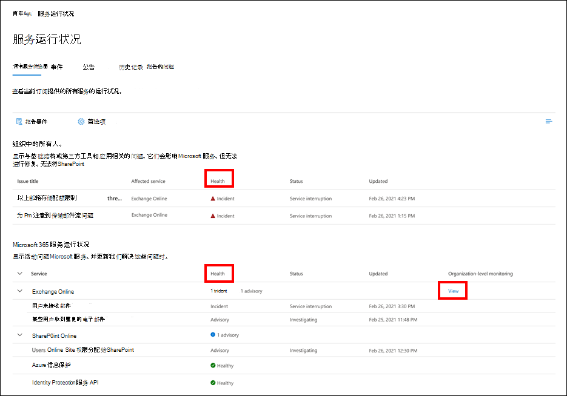
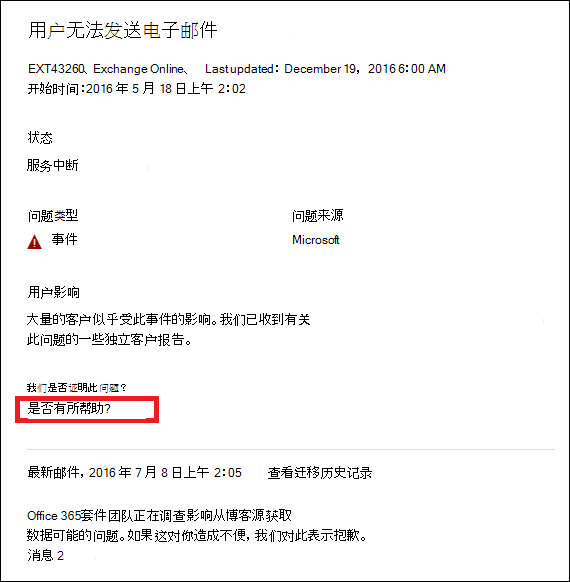

# 用于 Microsoft 365 的 Exchange Online 监视

可以在 <a href="https://go.microsoft.com/fwlink/p/?linkid=2024339" target="_blank">Microsoft 365 管理中心</a> 中使用 Exchange Online 监视来监视组织的Microsoft 365订阅的 Exchange 服务的运行状况。 Exchange Online 监视提供了有关在以下类别中收集的事件和通报的信息：

- **基础结构**：在 Microsoft 所拥有的用于提供定期更新和解决问题的 Microsoft 365 基础结构中检测到了问题。 例如，由于 Exchange 或其他 Microsoft 365 云基础结构的问题，用户无法访问 Exchange Online。
- **第三方基础结构**：在组织已取得相关性的第三方基础结构中检测到问题，并需要组织提供的措施来解决问题。 例如，用户身份验证事务受到阻止用户连接到 Exchange Online 的第三方安全令牌服务 (STS) 提供程序的限制。
- **客户基础结构**：在组织基础结构中检测到问题，并要求组织执行操作以解决问题。 例如，用户无法访问 Exchange Online，因为证书已过期，他们无法获取由组织托管的 STS 提供商提供的身份验证令牌。

以下是 Microsoft 365 管理中心中 **服务运行状况** 页面的示例，可从组织和 [优先级帐户](../admin/setup/priority-accounts.md) 方案的 **运行状况 > 服务运行状况** 中获取。

**组织中的问题** 将由组织级监视和优先级帐户监视识别和使用。

**组织中的问题** 下 **运行状况** 列的值指示组织的基础结构或第三方软件是否会影响组织用户和/或 Exchange Online 中优先级帐户的服务运行状况体验。公告或事件都需要 *你的* 操作才能解决。

**Microsoft 服务运行状况** 下的"**运行状况**"列的值指示服务运行正常，或者有基于 Microsoft 维护云服务的公告或事件。

以下是 Microsoft 365 管理中心中 Exchange Online 监视页面的示例，其中显示了组织级和优先级帐户方案的运行状况(可从 **运行状况 > 服务运行状况 > Exchange Online** 中获取)。

使用 **Exchange Online** 监视页面，可查看 Exchange Online 服务是否运行正常，以及是否存在任何关联的事件或通报。 使用 Exchange Online 监视，可查看特定电子邮件方案的服务运行状况，查看接近的实时信号，确定组织级别方案产生的影响。 还可以查看优先级帐户方案的运行状况。

## 要求

对于满足这些要求的客户，将启用此预览版：

- 你的组织需要至少拥有 5，000 个以下产品的许可证计数：Office 365 E3、Microsoft 365 E3、Office 365 E5 Microsoft 365 E5。

  例如，你的组织可以具有 3,000 个 Office 365 E3 许可证，2,500 个 Microsoft 365 E5，即总计拥有 5,500 个合格产品许可证。

- 对于一个或多个核心Microsoft 365服务（包括 Microsoft Teams、OneDrive for Business、SharePoint Online、Exchange Online 和 Office 应用），组织每月至少需要有 50 个活跃用户。

- 具有服务运行状况仪表板级别权限的任何角色都可以访问 Exchange Online 监控。 有关详细信息，请参阅[如何检查 Microsoft 365 服务的运行状况](view-service-health.md)。

## 组织级别的方案

通过 Exchange Online 监视支持以下方案：

- **电子邮件客户端**：你可以根据电子邮件阅读活动查看以下电子邮件客户端的运行状况：

  - Outlook 桌面版
  - Outlook 网页版
  - iOS 版和 Android 版的本机邮件客户端
  - 用于 iOS 和 Android 的 Outlook 移动应用
  - Outlook Mac 客户端

   通过这些客户端，你可以根据阅读电子邮件的用户以及仪表板中的事件数和建议，查看最近 30 分钟内的活动用户数。 此数据将与前一周的相同间隔进行比较，以查看是否存在问题。

   >[!Note]
   > 活跃用户计数由单个活动测量，例如，用户阅读电子邮件。 该帐户仅适用于最近 30 分钟的活动。

- **应用连接性**：估计的连接基于组织设备和 Exchange Online 之间的成功合成连接百分比，并且可能包括 Microsoft 无法控制的问题。要了解详细信息，请参阅 [Microsoft 365 连接性光学](microsoft-365-connectivity-optics.md)。

- **基本身份验证和新式验证**：Exchange Online 服务中成功验证的用户数。

- **邮件流**：邮件连接到 Microsoft 365 网络后，在不延迟的情况下成功传送到邮箱的邮件数。

  

在所有这些情况下，关键数字是主仪表板中最后 30 分钟的数字。 上述每种情况的详细视图将显示与前一周相比，7 天累计 30 分钟的近实时趋势。  

## 优先级帐户监视方案

使用 Exchange Online 优先级帐户监视，可以在配置 [优先级帐户](/microsoft-365/admin/setup/priority-accounts) 后查看以下方案的运行状况:

- Exchange 许可

- 邮箱存储

- 邮件限制

- 每个文件夹的子文件夹

- 文件夹层次结构

- 可恢复项

Exchange 许可方案会检查优先级帐户是否由于无效的许可证问题而无法登录，租户管理员可以解决这些问题。

以上其余五种方案会检查优先级帐户的邮箱是否即将达到或已达到 [Exchange Online 限制中](/office365/servicedescriptions/exchange-online-service-description/exchange-online-limits#mailbox-storage-limits) 所述的限制。

对于这些方案，可以查看影响优先级帐户的活动和已解决的公告和事件。 优先级帐户的可识别信息将与建议一同显示在公告或事件详细信息中。 以下是 **运行状况 > 服务运行状况 > Exchange Online** 页面中的示例。

:::image type="content" source="../media/microsoft-365-exchange-monitoring/exchange-priority-accounts-example.png" alt-text="影响优先级帐户的活动和已解决的公告和事件的示例":::

在受影响的帐户窗格中，**状态** 列具有以下值:

- 已修复：已为优先级帐户解决导致公告或事件的问题。 

- 活动：导致优先级帐户出现公告或事件的问题仍在继续。问题仍然存在。 

- 已延迟：尚未在 96 小时内为优先级帐户解决导致公告或事件的问题，因此该问题已推迟。问题仍然存在。 

以下是示例。

:::image type="content" source="../media/microsoft-365-exchange-monitoring/exchange-status-column-example.png" alt-text="受影响帐户窗格中状态列的示例":::

在没有帐户保持在 **活动** 状态后，将解决公告或事件。 

## 向我们发送反馈

可以通过下列两种方式提供反馈：

- 使用 **“提供反馈”** 选项，可在 Microsoft 365 管理中心的每个页面上提供反馈。

- 使用 **这篇文章是否有用？** 链接提交特定事件或通报的反馈。

  

## 常见问题解答

#### 1. 为什么在 Microsoft 365 管理中心中的“运行状况”下看不到“Exchange Online 监视”？ 

首先，请确保已在 <a href="https://go.microsoft.com/fwlink/p/?linkid=2024339" target="_blank">Microsoft 365 管理中心</a>的 **主页** 页上启用了新的管理中心。

然后，请确保满足以下两项要求：

- 你的组织需要从以下产品之一或其组合中获取至少 5,000 的许可证计数：Office 365 E3、Microsoft 365 E3、Office 365 E5、Microsoft 365 E5。

- 对于一个或多个核心Microsoft 365服务（包括 Microsoft Teams、OneDrive for Business、SharePoint Online、Exchange Online 和 Office 应用），组织每月至少需要有 50 个活跃用户。

如果组织的许可证数低于 5,000 名用户，且核心服务中的每月活动用户数低于 50，则在满足这些要求之前，将不会启用 Exchange Online 监视。

#### 2. 仪表板中每个客户端的活动用户账户计数似乎很低。 向用户分配了大量活动的许可证。 这意味着什么？

监视中显示的活跃用户计数是基于 30 分钟的窗口，其中用户执行了功能中调用的活动。 这不应该与使用数字相混淆。 若要查看使用情况编号，请使用Microsoft 365 管理中心（**报表** > <a href="https://go.microsoft.com/fwlink/p/?linkid=2074756" target="_blank">**使用情况**</a>）中的活动报告。

#### 3. 其他服务（如 Teams 和 SharePoint）是否有其他监视方案？

Microsoft 在 Microsoft 365 管理中心中的服务运行状况仪表板内直接集成了这种体验。 这将使 Microsoft 有机会扩展其他服务的监视方案，在有新闻可供共享时，将通知这些情况。

#### 4. 此体验的总体可用性计划是什么？

Microsoft 已将 Exchange Online 监视直接集成在Microsoft 365 管理中心中的 <a href="https://go.microsoft.com/fwlink/p/?linkid=842900" target="_blank">**服务运行状况** 仪表板</a>上。

通过这项全新的集成体验，Microsoft 计划收集你的反馈，然后定义我们的总体可用性计划。

#### 5. 这是免费的（含）还是付费的（额外）功能？ 

这是一项处于预览阶段的免费功能，仅适用于满足问题 1 中要求的客户。没有接收此内容的付费选项。

#### 6. 如何提供反馈？

有关一般反馈，请使用 **Exchange Online** 监视页右下角的 **提供反馈** 图标。 

有关事件或通报的反馈，请使用 **这篇文章是否有用？** 链接。

#### 7. 在哪里处理这些用于显示活动趋势的方案的数据？

数据在 Exchange Online 服务中进行处理。如果在请求到达 Exchange Online 之前出现错误，或 Exchange Online 出现错误，将会看到活动信号下降。

#### 8. 是否有隐私问题？

监视重点关注服务元数据，并且不会监视用户内容。

## 另请参阅

- [如何检查 Microsoft 365 服务运行状况](view-service-health.md) 

- [ Exchange Online 限制](/office365/servicedescriptions/exchange-online-service-description/exchange-online-limits#mailbox-storage-limits)

- [管理和监视优先级帐户](/microsoft-365/admin/setup/priority-accounts)

- [在 Microsoft 365 中使用优先级帐户](https://techcommunity.microsoft.com/t5/microsoft-365-blog/using-priority-accounts-in-microsoft-365/ba-p/1873314)

- [Exchange Online 监视中邮箱利用率的服务警报](microsoft-365-mailbox-utilization-service-alerts.md)
