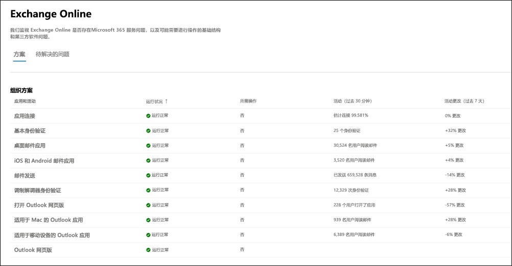
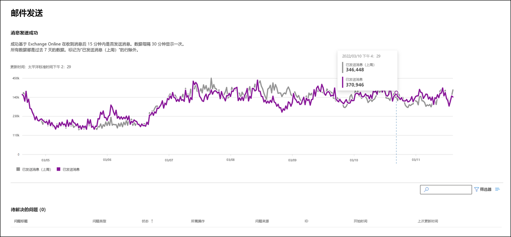

# 用于 Microsoft 365 的 Exchange Online 监视

Exchange Online 监视支持以下组织级方案：

- **电子邮件客户端**：你可以根据电子邮件阅读活动查看以下电子邮件客户端的运行状况：

  - Outlook 桌面版
  - Outlook 网页版
  - iOS 版和 Android 版的本机邮件客户端
  - 用于 iOS 和 Android 的 Outlook 移动应用
  - Outlook Mac 客户端

   通过这些客户端，你可以根据阅读电子邮件的用户以及仪表板中的事件数和建议，查看最近 30 分钟内的活动用户数。 此数据将与前一周的相同间隔进行比较，以查看是否存在问题。

   >[!Note]
   > 活跃用户计数由单个活动测量，例如，用户阅读电子邮件。 该帐户仅适用于最近 30 分钟的活动。

- **应用连接性**：估计的连接基于组织设备和 Exchange Online 之间的成功合成连接百分比，并且可能包括 Microsoft 无法控制的问题。要了解详细信息，请参阅 [Microsoft 365 连接性光学](microsoft-365-connectivity-optics.md)。

- **基本身份验证和新式验证**：Exchange Online 服务中成功验证的用户数。

- **邮件流**：邮件连接到 Microsoft 365 网络后，在不延迟的情况下成功传送到邮箱的邮件数。

- **打开 Outlook 网页版**： 已成功登录并启动 Outlook 网页版的用户数。
  
下面是主仪表板中 Exchange Online 的组织级方案示例。

在所有这些情况下，关键数字是主仪表板中最后 30 分钟的数字。 上述每种情况的详细视图将显示与前一周相比，7 天累计 30 分钟的近实时趋势。  

你会注意到，在标记为"你的组织"的通信中，为组织创建了"问题来源"的事件或公告。 这些通知分别针对你的组织，其中存在需要你注意缓解和解决的问题。 有关在服务运行状况中创建和传达的各种类型的问题的详细信息，请参阅以下文章：

- [邮箱使用率](microsoft-365-mailbox-utilization-service-alerts.md)的服务警报

- [MRS 源延迟的服务警报](microsoft-365-mrs-source-delays-service-alerts.md)

- [等待传递给外部收件人的邮件的服务警报](microsoft-365-external-recipient-service-alerts.md)

## 优先级帐户监视方案

使用 Exchange Online 优先级帐户监视，可以在配置 [优先级帐户](/microsoft-365/admin/setup/priority-accounts) 后查看以下方案的运行状况:

- Exchange 许可

- 邮箱存储

- 邮件限制

- 每个文件夹的子文件夹

- 文件夹层次结构

- 可恢复项

Exchange 许可方案检查优先级帐户是否由于无效的许可证问题而无法登录，租户管理员可以解决这些问题。

以上其余五种方案会检查优先级帐户的邮箱是否即将达到或已达到 [Exchange Online 限制中](/office365/servicedescriptions/exchange-online-service-description/exchange-online-limits#mailbox-storage-limits) 所述的限制。

对于这些方案，可以查看影响优先级帐户的活动和已解决的公告和事件。 优先级帐户的可识别信息将与建议一同显示在公告或事件详细信息中。 以下是 **运行状况 > 服务运行状况 > Exchange Online** 页面中的示例。

:::image type="content" source="../media/microsoft-365-exchange-monitoring/exchange-priority-accounts-example.png" alt-text="影响优先级帐户的活动和已解决的公告和事件的示例":::

在受影响的帐户窗格中，**状态** 列具有以下值:

- 已修复：针对优先级帐户解决了导致咨询或事件的问题。不再存在问题。 

- 活动：导致优先级帐户出现公告或事件的问题仍在继续。问题仍然存在。 

- 延迟：导致优先帐户的公告或事件的问题在 96 小时内未得到解决，因此已暂停。问题仍然存在。 

下面是一个示例。

:::image type="content" source="../media/microsoft-365-exchange-monitoring/exchange-status-column-example.png" alt-text="受影响帐户窗格中状态列的示例":::

在没有帐户保持在 **活动** 状态后，将解决公告或事件。

## 常见问题解答

### 1. 每个客户端的仪表板中的活动用户计数似乎较低。 向用户分配了大量活动的许可证。 这意味着什么？

监视中显示的活跃用户计数是基于 30 分钟的窗口，其中用户执行了功能中调用的活动。 这不应该与使用数字相混淆。 若要查看使用情况编号，请使用Microsoft 365 管理中心（**报表** > <a href="https://go.microsoft.com/fwlink/p/?linkid=2074756" target="_blank">**使用情况**</a>）中的活动报告。

### 2. 在何处检测显示活动趋势的方案的数据？

数据在 Exchange Online 服务中进行检测。如果在请求到达 Exchange Online 之前发生故障或 Exchange Online 中出现故障，则会看到活动信号下降。
