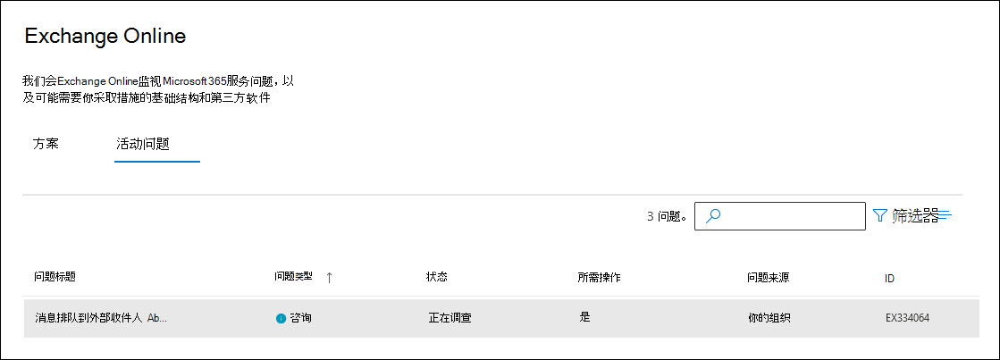
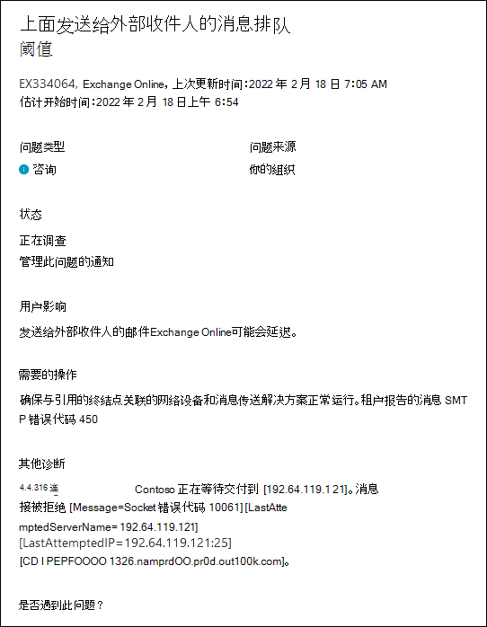

# 等待发送给外部收件人的邮件的服务警报，这些邮件Exchange Online监视

服务警报将邮件排队通知管理员到外部收件人的邮件队列Exchange Online。 这些警报可能需要 Microsoft 之外的修正操作，但它们可以向您提供修正所需信息。

这些服务警报显示在Microsoft 365 管理中心。 若要查看这些服务警报，请转到 <a href="https://go.microsoft.com/fwlink/p/?linkid=842900" target="_blank">**HealthService**</a> >  >  运行状况 **Exchange Online** 然后单击"**活动问题"** 选项卡。这些服务警报的名称为"邮件排队等待外部收件人超过阈值"。

双击服务警报时，将显示类似于以下内容的飞出页。

## 这些服务警报表示什么？

对于等待送达给外部收件人的邮件，服务警报会通知您发往外部收件人的邮件Exchange Online延迟。 邮件排队可能是由本地环境或第三方邮件或日记解决方案导致的。

以下是将邮件排入外部收件人队列的一些常见原因。 但是，导致这些服务警报的问题可能并不限于这些原因。

- DNS 更改

- 发送率过高

- 本地邮件传输代理 (MTA) 或日记解决方案，具有低到无可用磁盘空间

- backpressure 中的 MTA

- 网络问题，包括负载平衡器

- 证书问题

每个服务警报都包含有关修正问题的高级别建议。 服务警报还指示警报时排队的邮件数、邮件排队的域，以及与大多数排队邮件关联的 SMTP 错误代码。

有关确定这些服务警报的根本原因的信息，请参阅 mail [flow intelligence in Exchange Online](../security/office-365-security/mail-flow-intelligence-in-office-365.md)。 本文还包括修复根本原因的建议操作。

> [!NOTE]
> Microsoft 无法说明第三方供应商提供的每一个 SMTP 错误代码。 因此，管理员可能需要调查特定于其 MTA 或组织使用的日记解决方案的错误代码。

## 更多信息

如果您的组织最近在本地或 Exchange Online中创建或更改了邮件流连接器，请参阅以下文章了解详细信息。

- [使用邮箱中的连接器配置Exchange Online](/exchange/mail-flow-best-practices/use-connectors-to-configure-mail-flow/use-connectors-to-configure-mail-flow)

- [设置连接器来进行邮件路由](/exchange/mail-flow-best-practices/use-connectors-to-configure-mail-flow/set-up-connectors-to-route-mail)

- [邮件流最佳做法](/exchange/mail-flow-best-practices/mail-flow-best-practices)

- [安全与合规中心内的邮件流见解](/microsoft-365/security/office-365-security/mail-flow-insights-v2)

- [邮件流仪表板中的队列见解](/microsoft-365/security/office-365-security/mfi-queue-alerts-and-queues#queues-insight-in-the-mail-flow-dashboard)

- [跟踪电子邮件Exchange Online](/exchange/monitoring/trace-an-email-message/trace-an-email-message)
