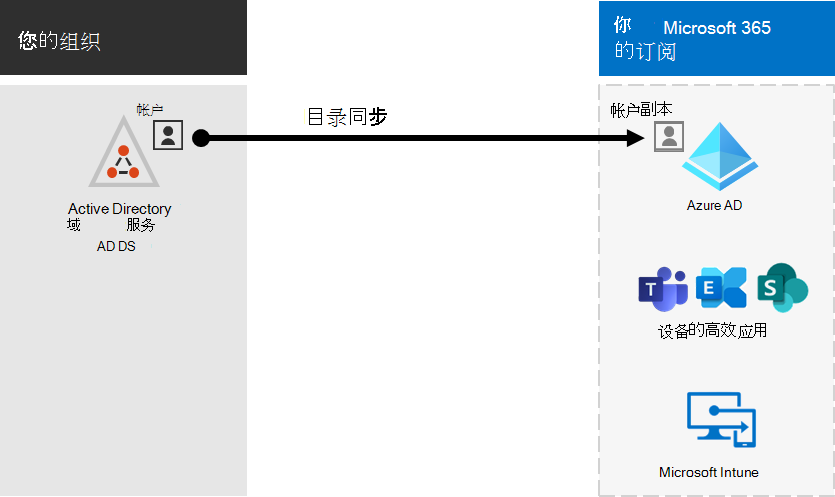

# Microsoft 365本地环境集成

*本文适用于 Microsoft 365 企业版和 Office 365 企业版。*

您可以将 Microsoft 365 与现有本地 Active Directory 域服务 (AD DS) 以及 Exchange Server、Skype for Business Server 2015 或 SharePoint Server 本地安装集成。
  
 - 集成 AD DS 时，可以同步和管理两种环境的用户帐户。 您还可以将密码哈希同步 (PHS) 或单一登录 (SSO) 以便用户可以使用其本地凭据登录到这两个环境。
 - 与本地服务器产品集成时，将创建混合环境。 混合环境可以帮助你将用户或信息迁移到 Microsoft 365，或者你可以继续在本地拥有一些用户或一些信息，而某些信息则位于云中。 有关混合环境详细信息，请参阅 [混合云](../solutions/cloud-architecture-models.md#hybrid)。

此外，还可使用 Azure Active Directory (Azure AD) 顾问，在登录后Microsoft 365 管理中心 (自定义设置Microsoft 365) ：

- [Azure AD设置指南](https://aka.ms/aadpguidance)
- [从组织目录中同步用户](https://aka.ms/aadconnectpwsync)
- [Active Directory 联合身份验证服务 (AD FS) 顾问](https://aka.ms/adfsguidance)
   
## 准备工作

在将Microsoft 365和本地环境集成之前，还需要执行[网络规划和性能调整](network-planning-and-performance.md)。 您还需要了解可用的 [标识模型](deploy-identity-solution-identity-model.md)。 

有关[可用于Microsoft 365](manage-microsoft-365-accounts.md)用户帐户的工具列表，请参阅Microsoft 365帐户。 
  
## 将Microsoft 365 AD DS 集成

如果 AD DS 中已有用户帐户，则不希望在 Microsoft 365 中重新创建所有这些帐户，并存在在环境之间引入差异或错误的风险。 目录同步可帮助你在内部部署和联机环境之间镜像这些帐户。 使用目录同步，用户不必记住每个环境的新信息，也不必创建或更新帐户两次。 您需要准备 [本地目录进行](prepare-for-directory-synchronization.md) 目录同步。
  

  
如果希望用户能够登录以使用Microsoft 365凭据登录，还可以配置 SSO。 使用 SSO，Microsoft 365配置为信任本地环境进行用户身份验证。
  

### 具有或不带密码哈希同步的目录同步或 PTA (传递) 

用户使用其用户帐户登录本地环境， (域\用户名) 。 当他们转到Microsoft 365时，必须使用工作或学校帐户帐户 (user@domain.com) 。 用户名在这两种环境中是相同的。 当你添加 PHS 或 PTA 时，用户在这两种环境中具有相同的密码，但在登录到 MICROSOFT 365 时，必须再次提供这些Microsoft 365。 与 PHS 的目录同步是最常用的目录同步。

若要设置目录同步，请使用Azure AD 连接。 有关说明，请参阅使用快速[设置设置](set-up-directory-synchronization.md)Microsoft 365 Azure AD 连接[和目录同步](/azure/active-directory/hybrid/how-to-connect-install-express)。

了解有关准备[与目录同步Microsoft 365](prepare-for-directory-synchronization.md)。

### 与 SSO 的目录同步

用户使用其用户帐户登录到其本地环境。 当他们转到Microsoft 365时，他们要么自动登录，要么使用用于本地环境的相同凭据登录 (域\用户名) 。

若要设置 SSO，你还可使用Azure AD 连接。 有关说明，请参阅[自定义安装Azure AD 连接](/azure/active-directory/hybrid/how-to-connect-install-custom)。

有关详细信息，请参阅 [单一登录](/azure/active-directory/manage-apps/what-is-single-sign-on)。

## Azure AD Connect

Azure AD 连接 DirSync 和 DirSync 等旧版标识集成工具Azure AD Sync。如果要从"同步Azure Active Directory更新Azure AD 连接，请参阅[升级说明](/azure/active-directory/hybrid/how-to-dirsync-upgrade-get-started)。 

## 另请参阅

[Microsoft 365 企业版概述](microsoft-365-overview.md)