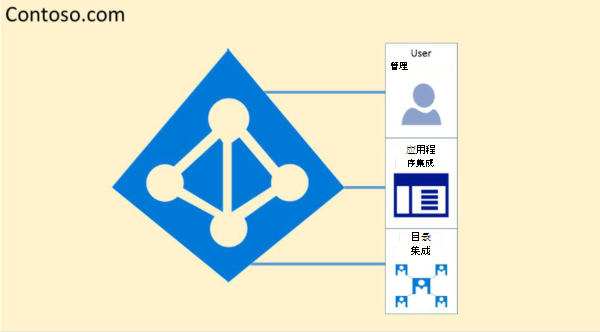
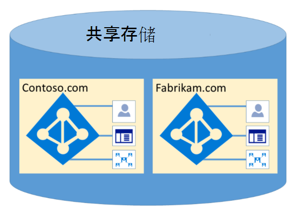

# Microsoft 365隔离和访问控制Azure Active Directory

Azure Active Directory (Azure AD) 旨在通过逻辑数据隔离以高度安全的方式托管多个租户。 对 Azure AD 的访问受授权层限制。 Azure AD 隔离使用租户容器作为安全边界的客户，以保护客户的内容，以便共同租户无法访问或泄露内容。 Azure AD 的授权层执行三项检查：

- 主体是否已启用以访问 Azure AD 租户？
- 是否已启用主体以访问此租户中的数据？
- 此租户中主体的角色是否经过授权，可以请求数据访问类型？

没有适当的身份验证和令牌或证书，任何应用程序、用户、服务器或服务都无法访问 Azure AD。 如果请求未附带正确的凭据，则拒绝请求。

实际上，Azure AD 将每个租户托管在其自己的受保护容器中，并且具有租户单独拥有和管理的容器内的策略和权限。
 

租户容器的概念在所有层（从门户到永久性存储）的目录服务中都根深有理。 即使多个 Azure AD 租户元数据存储在同一物理磁盘上，容器之间也没有任何关系，目录服务定义的其他内容又由租户管理员指示。 在未通过授权层之前，无法从任何请求的应用程序或服务直接连接到 Azure AD 存储。

在下面的示例中，Contoso 和 Fabrikam 都有单独的专用容器，即使这些容器可能共享一些相同的基础结构（如服务器和存储），它们仍然彼此独立，并受到授权和访问控制层的限制。
 

此外，Azure AD 中无法执行任何应用程序组件，并且一个租户无法强制破坏另一个租户的完整性、访问另一个租户的加密密钥，或者从服务器读取原始数据。

默认情况下，Azure AD 禁止由其他租户中的标识发出的所有操作。 通过基于声明的访问控制，每个租户在逻辑上隔离在 Azure AD 中。 读取和写入目录数据的范围为租户容器，并受内部抽象层和基于角色的访问控制 (RBAC) 层限制，这两个层共同强制租户作为安全边界。 每个目录数据访问请求都由这些层处理，并且每个访问请求Microsoft 365上述逻辑进行控制。

Azure AD 具有北美、美国政府、欧盟、德国和万维网分区。 租户存在于单个分区中，而分区可以包含多个租户。 分区信息从用户抽象化。 给定分区 (包括其中所有租户) 复制到多个数据中心。 租户的分区基于租户属性选择 (例如，国家/地区代码) 。 每个分区中的密钥和其他敏感信息都使用专用密钥进行加密。 密钥会在新建分区时自动生成。

Azure AD 系统功能是每个用户会话的唯一实例。 此外，Azure AD 使用加密技术在网络级别隔离共享系统资源，以防止未经授权的和意外的信息传输。
