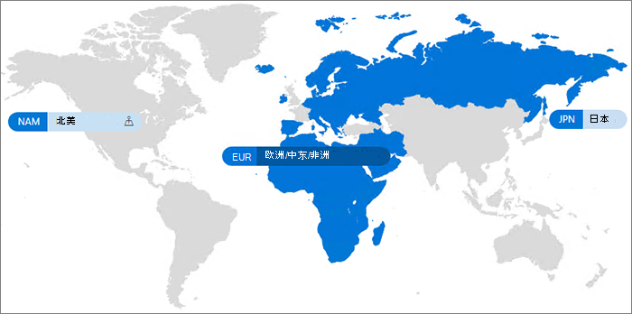

# Microsoft 365 多地理位置Microsoft 365 Multi-Geo

利用 Microsoft 365 多地理位置，你的组织可将其 Microsoft 365 触及范围扩展到你的现有租户内的多个地理区域和/或国家或地区。With Microsoft 365 Multi-Geo, your organization can expand its Microsoft 365 presence to multiple geographic regions and/or countries within your existing tenant. 请联系 Microsoft 帐户团队，为 Microsoft 365 多地理位置注册你的跨国公司。Reach out to your Microsoft Account Team to sign up your Multi-National Company for Microsoft 365 Multi-Geo.
  
通过 Microsoft 365 多地理位置，你可以在选择的地理位置中预配和存储静态数据，以满足数据驻留要求，与此同时，开启面向员工的现代生产力体验的全球推广。With Microsoft 365 Multi-Geo, you can provision and store data at rest in the geo locations that you've chosen to meet data residency requirements, and at the same time unlock your global roll out of modern productivity experiences to your workforce.

有关Microsoft 365 Multi-Geo的视频介绍，请参阅[SharePoint Online和OneDrive Multi-Geo以控制数据所在的位置](https://www.youtube.com/watch?v=Do9U3JuROhk)。For a video introduction to Microsoft 365 Multi-Geo, see [SharePoint Online and OneDrive Multi-Geo to control where your data resides](https://www.youtube.com/watch?v=Do9U3JuROhk).

## 多地理位置Multi-Geo architecture

在多地理位置环境中，Microsoft 365 租户由（最初在其中设置了 Microsoft 365 订阅）的中心位置以及一个或多个附属位置组成。In a Multi-Geo environment, your Microsoft 365 tenant consists of a central location (where your Microsoft 365 subscription was originally provisioned) and one or more satellite locations. 在多地理位置租户中，有关地理位置、组和用户信息的信息是在 Azure Active Directory (Azure AD) 中进行管控。In a multi-geo tenant, the information about geo locations, groups, and user information, is mastered in Azure Active Directory (Azure AD). 由于系统会集中管理你的租户信息并同步到每个地理位置中，因此共享操作以及涉及到公司中任何人的体验均包含全局意识。Because your tenant information is mastered centrally and synchronized into each geo location, sharing and experiences involving anyone from your company contain global awareness.

请注意，Microsoft 365 多地理位置旨在满足数据驻留需求，而不是优化性能。Note that Microsoft 365 Multi-Geo is not designed for performance optimization, it is designed to meet data residency requirements. 若要了解 Microsoft 365 性能优化，请参阅 [Microsoft 365 的网络计划和性能调整](https://support.office.com/article/e5f1228c-da3c-4654-bf16-d163daee8848)，或与支持群组联系。For information about performance optimization for Microsoft 365, see [Network planning and performance tuning for Microsoft 365](https://support.office.com/article/e5f1228c-da3c-4654-bf16-d163daee8848) or contact your support group.

## 术语Terminology

下面是用于描述 Microsoft 365 多地理位置的关键术语：Here are the key terms used in describing Microsoft 365 Multi-Geo:

- **中心位置** - 最初在其中设置你的租户的地理位置。**Central location** - the geo location where your tenant was originally provisioned.
- **地理位置管理员** - 可管理一个或多个指定附属位置的管理员。**Geo administrator** - An administrator who can administer one or more specified satellite locations.
- **地理位置代码** - 给定地理位置的三个字母的代码。**Geo code** - a three-letter code for a given geo location.
- **地理位置** - 可在多地理位置租户中用于托管数据的地理位置，包括 Exchange 邮箱以及 OneDrive 和 SharePoint 站点。**Geo location** – A geographic location that can be used in a multi-geo tenant to host data, including Exchange mailboxes and OneDrive and SharePoint sites.
- **首选数据位置 (PDL)** - 管理员设置的一个用户属性，指明应在其中设置 Exchange 邮箱和 OneDrive 的地理位置。**Preferred Data Location (PDL)** – A user property set by the administrator that indicates where the geo location where the users Exchange mailbox and OneDrive should be provisioned. PDL 还确定在何处设置用户创建的 SharePoint 站点。The PDL also determines where SharePoint sites that are created by the user are provisioned.
- **附属位置** – 多地理位置租户中在其中启用地理位置感知 Microsoft 365 工作负载（SharePoint、OneDrive 和 Exchange）的地理位置。**Satellite location** – The geo locations where the geo-aware Microsoft 365 workloads (SharePoint, OneDrive, and Exchange) are enabled in a multi-geo tenant.
- **租户** - 组织在 Microsoft 365 中的表示形式，通常有一个或多个关联域（例如，contoso.com）。**Tenant** – An organization's representation in Microsoft 365 which typically has one or more domains associated with it (for example, contoso.com).

## 许可Licensing

Microsoft 365对于租户中至少具有 250 Microsoft 365 席位且使用多地理位置的至少 5% 的 企业协议 客户，多地理位置作为以下 Microsoft 365 订阅计划的附加项提供。Microsoft 365 Multi-Geo is available as an add-on to the following Microsoft 365 subscription plans for Enterprise Agreement customers with a minimum of 250 Microsoft 365 seats in their tenant, and a minimum of 5% of those seats using multi-geo. 用户订阅许可证必须与多地理位置企业协议许可证位于同一位置。User subscription licenses must be on the same Enterprise Agreement as the Multi-Geo Services licenses. 有关详细信息，请与 Microsoft 帐户团队联系。Please contact your Microsoft account team for details.

- Microsoft 365 F1, F3, E3, or E5Microsoft 365 F1, F3, E3, or E5
- Office 365 F3, E1, E3, or E5Office 365 F3, E1, E3, or E5
- Exchange Online 计划 1 或计划 2Exchange Online Plan 1 or Plan 2
- OneDrive for Business 计划 1 或计划 2OneDrive for Business Plan 1 or Plan 2
- SharePoint Online 计划 1 或计划 2SharePoint Online Plan 1 or Plan 2

如果将许可证分配给用户，但后来又将其删除，Teams聊天数据将排入队列以移回中心位置。If a license is assigned to a user and later removed, Teams user chat data is queued to be moved back to the central location. SharePoint和Exchange不移动数据。SharePoint and Exchange data is not moved.

## Microsoft 365 多地理位置可用性Microsoft 365 Multi-Geo availability

Microsoft 365 多地理位置当前在以下国家和地区提供：Microsoft 365 Multi-Geo is currently offered in these regions and countries:

[!INCLUDE [Microsoft 365 Multi-Geo locations](../includes/microsoft-365-multi-geo-locations.md)]

## 入门Getting started

请按照以下步骤开始使用多地理位置：Follow these steps to get started with multi-geo:

1. 与你的帐户团队协作，_在 Microsoft 365 服务计划中添加多地理位置功能_。Work with your account team to add the _Multi-Geo Capabilities in Microsoft 365_ service plan. 他们将指导你添加需要的许可证数量。They will guide you to add the number of licenses needed. Microsoft 365 订阅数至少为 250 个的 EA 客户可以使用多地理位置功能。Multi-Geo feature is available to EA customers with a minimum of 250 Microsoft 365 subscriptions.

   Microsoft 需要为多地理位置支持配置你的 Exchange Online 租户，然后你才能开始使用 Microsoft 365 多地理位置。Before you can start using Microsoft 365 Multi-Geo, Microsoft needs to configure your Exchange Online tenant for multi-geo support. 这个一次性配置流程在你订购“*Microsoft 365 中的多地理位置功能*”服务计划之后触发，并且许可证将显示在你的租户中。This one-time configuration process is triggered after you order the *Multi-Geo Capabilities in Microsoft 365* service plan and the licenses show up in your tenant. 一旦租户完成每个工作负载的配置过程，你将在[Microsoft 365](https://support.office.com/article/38FB3333-BFCC-4340-A37B-DEDA509C2093)消息中心收到特定于工作负荷的通知，然后你可以开始配置和使用 Microsoft 365 多地理位置功能。You will receive workload-specific notifications in the [Microsoft 365 message center](https://support.office.com/article/38FB3333-BFCC-4340-A37B-DEDA509C2093) once your tenant has completed the configuration process for each workload, and you then may begin configuring and using your Microsoft 365 Multi-Geo capabilities. 为Multi-Geo支持配置租户所需的时间因租户而异，但是大多数租户在收到功能许可后的一个月内完成。The time required to configure a tenant for Multi-Geo support varies from tenant to tenant, but most tenants finish within a month after receipt of the feature licenses. 更大或更复杂的租户可能需要更多时间才能完成配置过程。Larger or more complex tenants may require more time to complete the configuration process. 如果您需要特定租户的详细信息，请与您的客户团队联系。Please contact your account team for details on your specific tenant should you require it.

2. 阅读[规划多地理位置环境](plan-for-multi-geo.md)。Read [Plan your multi-geo environment](plan-for-multi-geo.md).

3. 了解[管理多地理位置环境](administering-a-multi-geo-environment.md)和[你的用户将对环境有怎样的体验](multi-geo-user-experience.md)。Learn about [administering a multi-geo environment](administering-a-multi-geo-environment.md) and [how your users will experience the environment](multi-geo-user-experience.md).

4. 准备好设置 Microsoft 365 多地理位置时，请[为多地理位置配置你的租户](multi-geo-tenant-configuration.md)。When you are ready to set up Microsoft 365 Multi-Geo, [configure your tenant for multi-geo](multi-geo-tenant-configuration.md).

5. [设置搜索](configure-search-for-multi-geo.md)。[Set up search](configure-search-for-multi-geo.md).

## 另请参阅See also

[Exchange Online 和 OneDrive 中的多地理位置功能Multi-Geo in Exchange Online and OneDrive](https://Aka.ms/GoMultiGeo)

[OneDrive 和 SharePoint Online 中的多地理位置功能Multi-Geo Capabilities in OneDrive and SharePoint Online](multi-geo-capabilities-in-onedrive-and-sharepoint-online-in-microsoft-365.md)

[Exchange Online 中的多地理位置功能Multi-Geo Capabilities in Exchange Online](multi-geo-capabilities-in-exchange-online.md)

[多地理位置环境中的 Teams 体验Teams experience in a multi-geo environment](/microsoftteams/teams-experience-o365odb-spo-multi-geo)