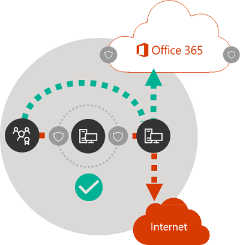

# Microsoft 365 网络连接原则

*本文适用于 Microsoft 365 企业版和 Office 365 企业版。*

在开始为 Microsoft 365 网络连接规划网络之前，请务必了解指导安全管理 Microsoft 365 流量并获取最佳性能的连接原则。 本文将帮助你了解有关安全优化 Microsoft 365 网络连接的最新指南。
  
传统的企业网络旨在为用户提供对由企业运营的数据中心中数据的访问权限，这些数据中心会采用强安全外围。 传统模型假设用户会在企业网络外围内，通过分支机构的广域网链接或通过 VPN 连接远程访问应用程序和数据。
  
采用诸如 Microsoft 365 之类的 SaaS 应用程序将一部分服务和数据组合移动到网络外围之外。 如果不进行优化，用户与 SaaS 应用程序之间的流量将受到包检查、网络环回、无意连接到地理距离遥远的终结点以及其他因素带来的延迟。 可通过理解和实现关键优化原则来确保最佳的 Microsoft 365 性能和可靠性。
  
在本文中，你将学习到：
  
- 当应用于客户到云的连接时，[Microsoft 365 的体系结构](microsoft-365-network-connectivity-principles.md#BKMK_Architecture)
- 更新版 [Microsoft 365 连接原则](microsoft-365-network-connectivity-principles.md#BKMK_Principles)和策略，帮助你优化网络流量和最终用户体验
- [Office 365 终结点 Web 服务](microsoft-365-network-connectivity-principles.md#BKMK_WebSvc)，允许网络管理员在优化网络时使用终结点的结构化列表
- [全新 Office 365 终结点类别](microsoft-365-network-connectivity-principles.md#BKMK_Categories)和优化指南
- [将网络外围安全与终结点安全进行比较](microsoft-365-network-connectivity-principles.md#BKMK_SecurityComparison)
- Microsoft 365 流量[增量优化](microsoft-365-network-connectivity-principles.md#BKMK_IncOpt)选项
- [Microsoft 365 连接测试](https://aka.ms/netonboard)，可用于测试到 Microsoft 365 的基本连接的全新工具

## Microsoft 365 体系结构

Microsoft 365 是一款分布式软件即用服务 (SaaS) 云服务，可通过一系列多样服务和应用程序，例如 Exchange Online、SharePoint Online、Skype for Business Online、Microsoft Teams、Exchange Online Protection、浏览器中的 Office 和许多其他服务和应用，提供生产力和协作场景。 虽然当应用于到云服务的客户网络和连接时，特定 Microsoft 365 应用程序可能会有其独特功能，但它们均共享一些关键主体、目标以及体系结构模式。 这些连接原则和体系结构模式也是很多其他 SaaS 云服务的典型模式，并且与平台即服务和基础结构即服务（例如，Microsoft Azure）的典型部署模式。
  
Microsoft 365 最显著的体系结构功能之一（常常被网络架构师忽略或误解）是，在用户连接到该服务的上下文中，它的确是全球分布式服务。 目标 Microsoft 365 租户的位置对于了解客户数据在云中的存储位置是非常重要的，但 Microsoft 365 的用户体验不涉及直接连接到包含数据的磁盘。 Microsoft 365 中的用户体验（包括性能、可靠性和其他重要的质量特征）涉及到通过高分布式服务前门实现连接，这些前门通过全球数百个 Microsoft 位置进行横向扩展。 大多数情况下，可通过允许客户网络路由到位置最近的 Microsoft 365 服务入口点，而不是通过中心位置或区域中的出口点连接到 Microsoft 365 实现最佳用户体验。
  
绝大多数客户的 Microsoft 365 用户分布在多个位置。 为实现最佳结果，应从横向扩展（而非纵向扩展）角度看待本文所述原则，重点优化到距离最近的 Microsoft 全球网络服务点的连接，而不是到地理位置最近的 Microsoft 365 租户的连接。 从本质而言，这意味着虽然 Microsoft 365 租户数据可能存储在特定地理位置，但该租户的 Microsoft 365 体验仍然是分布式的，并且可以通过距离该租户中的每个最终用户非常近的（网络）距离提供。
  
## Microsoft 365 连接原则

Microsoft 建议按照以下原则获取最佳的 Microsoft 365 连接和性能。 使用这些 Microsoft 365 连接原则管理流量，并在连接到 Microsoft 365 时获得最佳性能。
  
网络设计中的主要目标是通过减少从网络到 Microsoft 全球网络、互连所有低延迟 Microsoft 数据中心的 Microsoft 公共主干网，以及遍布全球的应用程序入口点的往返时间 (RTT)，最大程度地降低延迟。有关 Microsoft 全球网络的详细信息，请参阅 [Microsoft 如何构建其快速可靠的全球网络](https://azure.microsoft.com/blog/how-microsoft-builds-its-fast-and-reliable-global-network/)。
  

### 识别并区分 Microsoft 365 流量

  
若要从普通的 Internet 绑定网络流量中区分 Microsoft 365 网络流量，第一步需要先识别。 可通过采用网络路由优化、防火墙规则、浏览器代理设置，以及免验证特定终结点的网络检测设备，来优化 Microsoft 365 连接。
  
以前的 Microsoft 365 优化指南将 Microsoft 365 终结点分为两个类别，分别为“**必需**”和“**可选**”。 为支持新的 Microsoft 365 服务和功能，已添加相应终结点。目前，我们将 Microsoft 365 终结点分为三个类别：“**优化**”、“**允许**”和“**默认**”。 每个类别的准则适用于相应类别中的所有终结点，让理解和实施优化变得更加简单。
  
有关 Microsoft 365 终结点类别和优化方法的详细信息，请参阅[新的 Office 365 终结点类别](microsoft-365-network-connectivity-principles.md#BKMK_Categories)章节。
  
现在，Microsoft 将所有 Microsoft 365 终结点作为 Web 服务发布，并提供有关如何充分利用这些数据的指南。 有关如何获取和使用 Microsoft 365 终结点的详细信息，请参阅文章 [Office 365 URL 和 IP 地址范围](https://support.office.com/article/office-365-urls-and-ip-address-ranges-8548a211-3fe7-47cb-abb1-355ea5aa88a2?ui=en-US&amp;rs=en-US&amp;ad=US)。
  

### 实现本地连接出口

  
本地 DNS 和 Internet 出口对于降低连接延迟和确保将用户连接到 Microsoft 365 服务的最接近进入点至关重要。 在复杂的网络拓扑中，请务必同时实现本地 DNS 和本地 Internet 出口。 有关 Microsoft 365 如何将客户端连接路由到最近的入口点的详细信息，请参阅文章[客户端连接](https://support.office.com/article/client-connectivity-4232abcf-4ae5-43aa-bfa1-9a078a99c78b)。
  
在 Microsoft 365 等云服务还没有出现之前，作为网络体系结构中一项设计要素的最终用户 Internet 连接相对比较简单。 当 Internet 服务和网站分布在全球各地，公司出口点与任何给定目标终结点之间的延迟基本上就是地理距离的功能。
  
传统的网络体系结构中，所有出站 Internet 连接都会遍历公司网络，并从中央位置流出。 随着 Microsoft 云产品的成熟，面向 Internet 的分布式网络体系结构，对支持对延迟敏感的云服务变得至关重要。 “分布式服务前门”基础结构是一种动态结构，在全球拥有众多入口点，能够将流入的云服务连接路由到最近的入口点。而 Microsoft 全球网络正是采用该基础结构，以满足对于延迟的要求。 其目的是通过有效缩短客户和云服务之间的路线，减少 Microsoft 云客户“最后一公里”的长度。
  
企业广域网通常设计为将网络流量回程到企业总部（通常通过一个或多个代理服务器），以便在流出到 Internet前进行检查。下图描绘了这样的网络拓扑图。
  

  
由于 Microsoft 全球网络（包括世界各地的前端服务器）均在 Microsoft 365 上运行，因此通常会有靠近用户位置的前端服务器。 通过提供本地 Internet 出口，以及通过配置内部 DNS 服务器为 Microsoft 365 终结点提供本地名称解析，发往 Microsoft 365 的网络流量可连接到与用户尽可能近的 Microsoft 365 前端服务器。 下图显示了一个网络拓扑示例。该示例中，用户可以从主办公室、分支机构和远程位置，以最短路径连接到最近的 Microsoft 365 入口点。
  

  
通过这种方式缩短 Microsoft 365 入口点的网络路径，可提高连接性能和 Microsoft 365 的最终用户体验，还能帮助减少未来对网络体系结构的更改对 Microsoft 365 性能和可靠性的影响。
  
此外，如果响应的 DNS 服务器距离太远或忙，则 DNS 请求会导致延迟。 通过预配位于分支位置的 DNS 服务器，并确保将其配置为适当缓存 DNS 记录，可最大限度地降低名称解析延迟。
  
虽然区域出口可供 Microsoft 365 正常工作，但最佳连接模型始终是提供用户所在位置的网络出口，无论这是在公司网络上还是在家、旅馆、咖啡店和机场等远程位置。下图所示为所述的本地直接出口模型。
  

  
已采用 Microsoft 365 的企业可通过确保用户连接到 Microsoft 365 采用尽可能最短的路线，连接到最近的 Microsoft 全球网络入口点，从而充分利用 Microsoft 全球网络分布式服务前门体系结构的优势。 本地出口网络体系结构实现此效果的方式为：无论用户在什么位置，都允许通过最近的出口来路由 Microsoft 365 流量。
  
与传统模型相比，本地出口体系结构具有以下优点：
  
- 通过优化线路长度，提供最佳 Microsoft 365 性能。 最终用户连接通过分布式服务前端基础结构动态路由到最近的 Microsoft 365 入口点。
- 通过允许本地出口，减轻公司网络基础结构负载。
- 通过利用客户端终结点安全和云安全功能，同时确保两端的连接安全。

### 避免网络回流

  
一般来说，用户与最近的 Microsoft 365 终点之间的最短和最佳线路可提供最佳性能。 当绑定到特定目标的广域网或 VPN 通信首次定向到另一个中间位置（例如，安全堆栈、云访问代理、基于云的 web 网关的）时，会出现网络回流，导致延迟以及潜在重定向到地理位置较远的终结点。 路由/对等互连效率低下或次优的（远程）DNS 查找也会导致网络回流。
  
要确保 Microsoft 365 连接不受网络回流的影响（即使是本地出口情况下），请检查用于为用户提供 Internet 出口的 ISP 是否与靠近该位置的 Microsoft 全球网络具有直接对等连接关系。 你还可能想要配置出口路由以直接发送受信任的 Microsoft 365 流量，而不是通过处理 Internet 绑定流量的第三方云或基于云的网络安全供应商进行代理或隧道传输。 Microsoft 365 终结点的本地 DNS 名称解析有助于确保除直接路由外，最近的 Microsoft 365 入口点用于用户连接。
  
如果将基于云的网络或安全服务用于 Microsoft 365 流量，请确保评估回流结果并确保了解其对 Microsoft 365 性能的影响。 可通过以下方式实现此操作：检查通过服务提供商位置的数量和位置转发给有关系的分支机构和 Microsoft 全球网络对等连接点的数量、服务提供商与你的 ISP 和 Microsoft 的网络对等连接关系质量，以及服务提供商基础结构中回程的性能影响。
  
由于 Microsoft 365 入口点及其和最终用户之间的距离存在大量分布式位置，如果将 Microsoft 365 流量路由到任何第三方网络或安全服务提供商，并且提供商网络未针对最佳 Microsoft 365 对等连接进行配置，则会对 Microsoft 365 连接造成负面影响。
  

### 评估跳过代理、流量检查设备以及重复安全技术

  
企业客户应查看其网络安全性和风险降低方法，尤其是针对 Microsoft 365 绑定流量，并使用 Microsoft 365 安全功能来降低对 Microsoft 365 网络流量的侵入性、性能影响和昂贵网络安全技术的依赖性。
  
大多数企业网络使用代理、SSL 检查、包检查和数据丢失防护系统等技术手段加强 Internet 流量的网络安全性。 这些技术为普通的 Internet 请求提供了重要的风险缓解，但在应用到 Microsoft 365 终结点时，可显著降低性能、可扩展性和最终用户体验。
  

#### Office 365 终结点 Web 服务

Microsoft 365 管理员可使用脚本或 REST 调用，从 Office 365 终结点 Web 服务中使用终结点的结构化列表，并更新外围防火墙和其他网络设备的 Web 服务。 这将确保识别 Microsoft 365 的绑定流量，并正确对待和管理来自常规以及通常未知的 Internet 网站的绑定网络流量。 有关如何使用 Office 365 终结点 Web 服务的详细信息，请参阅文章 [Office 365 URL 和 IP 地址范围](https://support.office.com/article/office-365-urls-and-ip-address-ranges-8548a211-3fe7-47cb-abb1-355ea5aa88a2?ui=en-US&amp;rs=en-US&amp;ad=US)。
  
#### PAC（代理自动配置）脚本

Microsoft 365 管理员可以创建 PAC（代理自动配置）脚本，该脚本可通过 WPAD 或 GPO 传送到用户计算机。 可使用 PAC 脚本绕过广域网或 VPN 用户提出的 Microsoft 365 代理请求，允许 Microsoft 365 流量使用直接 Internet 连接，而不是遍历公司网络。
  
#### Microsoft 365 安全功能

Microsoft 对数据中心安全、运营安全、Microsoft 365 服务器附近的风险降低及其代表的网络终结点保持透明。 Microsoft 365 内置安全功能可用于减少网络安全风险，如数据丢失防护、防病毒、多重身份验证、客户锁箱、Defender for Office 365、Microsoft 365 威胁情报、Microsoft 365 安全分数、Exchange Online Protection 和网络 DDOS 安全。
  
有关 Microsoft 数据中心和全球网络安全性的详细信息，请参阅 [Microsoft 信任中心](https://www.microsoft.com/trustcenter/security)。
  
## 新的 Office 365 终结点类别

Office 365 终结点代表一组不同的网络地址和子网。 终结点可能是 URL、IP 地址或 IP 范围，且某些终结点会与特定的 TCP/UDP 端口一起列出。 URL可以是 FQDN，如 *account.office.net* 或通配符 URL，如 *\*office365.com*。
  
> [!NOTE]
> 网络中的 Office 365 终结点的位置与 Microsoft 365 租户数据的位置不直接相关。 因此，客户应将 Microsoft 365 视为分布式全球服务，并且不应尝试根据地理条件阻止到 Office 365 终结点的网络连接。
  
在以前关于如何管理 Microsoft 365 流量的指南中，我们将终结点分为两个类别：“**必需**”和“**可选**”。过去，每个类别中的终结点需要不同的优化，具体取决于服务的关键程度，并且很多客户很难将采用相同网络优化的应用调整为适用于所有 Office 365 URL 和 IP 地址。
  
在新模型中，终结点分为三种类别，“**优化**”、“**允许**”和“**默认**”，能够基于优先级帮助客户专注于网络优化工作，从而实现最佳性能改进和投资回报。 根据对网络质量、容量、场景的性能信封以及实现易用程度等方面的有效用户体验，将终结点在上述类别中进行了整合。 可采用相同方式，将推荐优化应用于给定类别中的所有终结点。
  
- “**优化**”终结点，连接到每项 Office 365 服务时需要使用这一类别的终结点，并占用超过 75% 的 Office 365 带宽、连接和数据量。 这些终结点代表对网络性能、延迟和可用性最敏感的 Office 365 方案。 所在终结点都托管于 Microsoft 数据中心中。 此类别中的终结点的更改速率应小于其他两个类别中终结点的更改速率。 此类别包含一小组密钥 URL（按 ~10 排序）和已定义的 IP 子网集合，专用于核心 Office 365 工作负载，例如 Exchange Online、SharePoint Online、Skype for Business Online 和 Microsoft Teams。

    清晰定义的关键终结点的简明列表应有助于更快、更轻松地规划和实现这些目标的高价值网络优化。

    “*优化*”终结点示例包括 *https://outlook.office365.com*，*https://\<tenant\>.sharepoint.com* 和 *https://\<tenant\>-my.sharepoint.com*。

    优化方法包括：

  - 跳过优化网络设备上的“*优化*”终结点，以及执行通信拦截、SSL 解密、深层包检查和内容筛选的服务。
  - 跳过通常用于普通 Internet 浏览的本地代理设备和基于云的代理服务。
  - 当这些终结点被网络基础结构和外围系统完全信任后，优先对其进行评估。
  - 设置广域网回程减少或消除的优先级，并让这些终结点基于 Internet 的直接分布式出口尽可能接近用户/分支的所在位置。
  - 通过实现拆分隧道，促进 VPN 用户直接连接到这些云终结点。
  - 确保 DNS 名称解析返回的 IP 地址与这些终结点的路由出口路径匹配。
  - 将 SD 广域网集成的这些终结点的优先级设置为直接的最小延迟路由到最近的 Microsoft 全球网络 Internet 对等连接点。

- **允许** - 连接到特定 Office365 服务和功能时需要使用“允许”终结点，但不像“*优化*”类别终结点那样对网络性能和延迟敏感。 从带宽和连接数的角度而言，“允许”终结点的总体网络占用情况也更低。 这些终结点为 Office 365 专用并托管在 Microsoft 数据中心中。 它们代表一整套 Office 365 微服务及其依赖项（按照 ~ 100 URL 的顺序），且预期更改速度会高于“*优化*”类别的更改速度。 此类别中并非所有终结点都与已定义的专用 IP 子网相关联。

    对于“*允许*”终结点的网络优化，可以提升 Office 365 的用户体验，但是某些用户可能选择缩小优化范围，从而在最大程度上减少对其网络的更改。

    “*允许*”终结点示例包括 *https://\*.protection.outlook.com* 和 *https://accounts.accesscontrol.windows.net*。

    优化方法包括：

  - 跳过执行通信拦截、SSL 解密、深层包检查和内容筛选的“*允许*”终结点。
  - 当这些终结点被网络基础结构和外围系统完全信任后，优先对其进行评估。
  - 设置广域网回程减少或消除的优先级，并让这些终结点基于 Internet 的直接分布式出口尽可能接近用户/分支的所在位置。
  - 确保 DNS 名称解析返回的 IP 地址与这些终结点的路由出口路径匹配。
  - 将 SD 广域网集成的这些终结点的优先级设置为直接的最小延迟路由到最近的 Microsoft 全球网络 Internet 对等连接点。

- “**默认**”终结点代表不需要任何优化的 Office 365 服务和依赖项，可被客户网络视为正常的 Internet 绑定流量。 此类别中的某些终结点可能不托管在 Microsoft 数据中心中。 示例包括 *https://odc.officeapps.live.com* 和 *https://appexsin.stb.s-msn.com*。

有关 Office 365 网络优化技术的详细信息，请参阅文章[管理 Office 365 终结点](managing-office-365-endpoints.md)。
  
## 将网络外围安全与终结点安全进行比较

传统的网络安全的目标是强化公司网络外围，防范入侵和恶意漏洞。 随着组织采用 Microsoft 365，部分网络服务和数据被部分或完全迁移到云。 正如对网络体系结构的进行任何基础更改，此过程需考虑到新兴因素，对网络安全进行重新评估：
  
- 随着采用云服务，网络服务和数据分布在本地数据中心和云之间，而外围安全不再足以满足新的需求。
- 远程用户连接到本地数据中心中的公司资源和云中来自不受控制的位置（如家中、酒店和咖啡店）。
- 专门构建的安全功能越来越多地内置到了云服务中，并可以补充或替换现有安全系统。

Microsoft 提供了一系列 Microsoft 365 安全功能，并提供了采用安全性最佳做法的规范性指南，可帮助你确保 Microsoft 365 的数据和网络安全。推荐的最佳做法包括以下内容：
  
- **使用多重身份验证 (MFA)** MFA 向强密码策略中添加一层额外保护，方法是要求用户在正确输入密码后在其智能手机上确认电话呼叫、短信或应用通知。

- **使用 Microsoft Cloud App Security** 配置策略来跟踪反常活动并做出应对。使用 Microsoft Cloud App Security 设置警报，方便管理员查看反常或有风险的用户活动，如下载大量数据、多次登录尝试失败，或者来自未知或危险 IP 地址的连接。

- **配置数据丢失防护 (DLP)** DLP 可用于识别敏感数据并创建有助于防止用户意外或有意共享数据的策略。 DLP 可跨 Microsoft 365 服务进行工作，包括 Exchange Online、SharePoint Online 和 OneDrive，以便你的用户在不中断工作流的情况下保持合规。

- **使用客户密码箱** 作为 Microsoft 365 管理员，你可以使用客户密码箱来控制 Microsoft 技术支持工程师在帮助会话期间访问你数据的方式。如果工程师需要访问你的数据以进行故障排除和解决问题，那么你可以使用客户密码箱批准或拒绝该访问请求。

- **使用 Office 365 安全功能分数** 一种安全分析工具，可为你推荐可执行的操作以进一步降低风险。 安全功能分数会查看你的 Microsoft 365 设置和活动，并将它们与 Microsoft 建立的基线进行比较。 你将根据与最佳安全做法的一致程度获取分数。

要想全面提升安全性，则需要考虑以下方面：
  
- 通过应用基于云的和 Office 客户端安全功能，从关注周边安全转向关注终结点安全。
  - 将安全外围缩小到数据中心
  - 为在办公室或远程位置的用户设备启用同等信任
  - 重点关注保护数据位置和用户位置
  - 托管的用户计算机比终结点安全拥有更高的信任级别
- 全面管理所有信息安全，而不只是专注于外围
  - 通过允许受信任的流量绕过安全设备，并将非托管设备与来宾 Wi-Fi 网络分隔，来重新定义广域网并构建外围网络安全
  - 降低公司广域网边缘的网络安全要求
  - 仍需要某些网络外围安全设备（例如，防火墙），但负载降低了
  - 确保 Microsoft 365 流量的本地出口
- 可按照[增量优化](microsoft-365-network-connectivity-principles.md#BKMK_IncOpt)章节中的说明逐步解决改进。某些优化技术可提供更好的成本/收益率，具体取决于网络体系结构，并且应选择最适合组织的优化。

有关 Microsoft 365 安全性和合规性的详细信息，请参阅文章 [Microsoft 365 安全中心](../security/index.yml)和 [Microsoft 365 合规中心](../compliance/index.yml)。
  
## 增量优化

我们已在本文前面介绍了适用于 SaaS 的理想网络连接模型，但对于过去的网络体系结构复杂的许多大型组织而言，直接进行所有这些更改并不可行。 在本节中，我们将讨论大量的增量更改，这些更改可有助于改进 Microsoft 365 的性能和可靠性。
  
用于优化 Microsoft 365 流量的方法将因你的网络拓扑和你实施的网络设备而异。 拥有许多地点和复杂网络安全做法的大型企业需要开发一整套战略，其中包括 [Microsoft 365 连接原则](microsoft-365-network-connectivity-principles.md#BKMK_Principles)部分中列出的大部分或全部原则，而小型组织可能只需考虑一或两条原则。
  
可采用递增的方式进行优化，即依次应用每个方法。 下表按照列出了主要的优化方法，并按照它们对最大数量用户的延迟和可靠性影响进行排序。
  
|**优化方法**|**说明**|**影响**|
|:-----|:-----|:-----|
|本地 DNS 解析和 Internet 出口    |预配每个位置中的本地 DNS 服务器，并确保 Microsoft 365 连接出口到 Internet 心可能靠近用户位置。    | 最小化延迟     提升与最近的 Microsoft 365 入口点的可靠连接    |
|添加区域出口点    |如果公司网络有多个位置，但仅有一个出口点，则添加区域出口点可让用户能够连接到最近的 Microsoft 365 入口点。    | 最小化延迟     提升与最近的 Microsoft 365 入口点的可靠连接    |
|跳过代理和检查设备    |将带 PAC 文件的浏览器配置为直接向出口点发送 Microsoft 365 请求。    配置边缘路由器和防火墙，无需检查即可允许 Microsoft 365 流量。    | 最小化延迟     减少网络设备负载    |
|为 VPN 用户启用直接连接    |对于 VPN 用户，可通过实现拆分隧道来启用 Microsoft 365 连接，直接从用户的网络进行连接，而不是通过 VPN 隧道。    | 最小化延迟     提升与最近的 Microsoft 365 入口点的可靠连接    |
|从传统广域网迁移到 SD 广域网    |SD 广域网（软件定义的广域网）通过将传统广域网路由器替换为虚拟设备（类似于使用虚拟机 (VM) 实现计算资源的虚拟化），简化广域网管理并提高性能。    | 改善广域网流量的性能和可管理性     减少网络设备负载    |

## 相关主题

[Microsoft 365 网络连接概述](microsoft-365-networking-overview.md)

[管理 Office 365 终结点](managing-office-365-endpoints.md)

[Office 365 URL 和 IP 地址范围](urls-and-ip-address-ranges.md)

[Office 365 IP 地址和 URL Web 服务](microsoft-365-ip-web-service.md)

[评估 Microsoft 365 网络连接](assessing-network-connectivity.md)

[Microsoft 365 网络计划和性能优化](network-planning-and-performance.md)

[使用基线和性能历史记录优化 Office 365 性能](performance-tuning-using-baselines-and-history.md)

[Office 365 性能疑难解答计划](performance-troubleshooting-plan.md)

[内容分发网络](content-delivery-networks.md)

[Microsoft 365 连接测试](https://aka.ms/netonboard)

[Microsoft 如何构建其快速可靠的全球网络](https://azure.microsoft.com/blog/how-microsoft-builds-its-fast-and-reliable-global-network/)

[Office 365 网络工作博客](https://techcommunity.microsoft.com/t5/Office-365-Networking/bd-p/Office365Networking)
