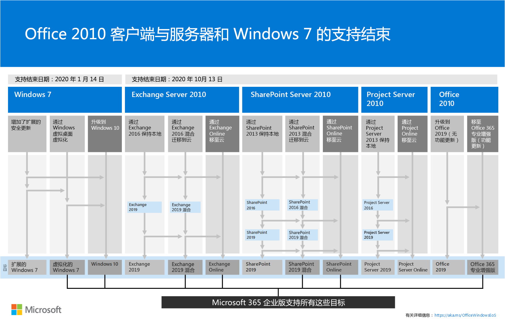

# Microsoft 365 企业版概述

Microsoft 365 企业版是一个完整的智能解决方案，使每个人都能进行创作和安全协作。 

虽然专为大型组织设计，但 Microsoft 365 企业也可用于需要最高级安全性和生产力功能的中型企业和小型企业。 

## 组件

Microsoft 365 企业版包括：

|||
|:-------|:-----|
| 本地和基于云的应用和生产率服务 | 包括 Office 365 专业增强版、电脑和 Mac 的最新 Office 应用程序（如 Word、Excel、PowerPoint、Outlook 和其他用户），以及用于电子邮件、文件存储和协作、会议等的一套完整的在线服务。 |
| Windows 10 企业版 | 满足了大型和中型组织的需求，为用户提供了具有全面部署、设备和应用程序管理的最高效、安全的 Windows 和 IT 专业人员版本。 |
| 设备管理和高级安全服务 | 包括 Microsoft Intune，这是一种基于云的企业移动管理（EMM）服务，可帮助您的员工在保持公司数据受保护的情况下提高工作效率。 |
|||

## 计划

Microsoft 365 企业版提供了三个计划。

|||
|:-------|:-----|
| E3 | 访问 Microsoft 365 中的核心产品和功能，以提高工作效率和促进创新和安全。 |
| E5 | 访问 Microsoft 365 中的最新产品和功能，包括高级威胁防护、安全和协作工具。。 包括所有 E3's 功能，以及高级安全性、语音和数据分析工具。 |
| F1 | 通过专门构建的工具和资源与您的 Firstline 工作人员联系，让他们能够完成其最佳工作。 |
|||

如果你有 Microsoft 365 企业 E3，还可以获取以下[产品](https://www.microsoft.com/microsoft-365/blog/2019/01/02/introducing-new-advanced-security-and-compliance-offerings-for-microsoft-365/)：

- 身份 & 威胁防护
- 信息保护 & 合规性

这些产品包含 Microsoft 365 企业版 E5 附带的其他功能。

有关详细信息，请参阅[每个计划的特性和功能](https://www.microsoft.com/microsoft-365/compare-all-microsoft-365-plans)。

## 获取大图

[Microsoft 365 企业版海报](media/Microsoft365Enterprise.pdf)是查看的中心位置：

- Microsoft 365 企业的优势，以及应用和服务如何映射到其价值支柱
- Microsoft 365 企业版计划及其包含的组件 
- Microsoft 365 企业版支持的新式工作场所的关键组件
- 适用于一些常见组织部门的[Microsoft 365 生产率库](https://www.microsoft.com/microsoft-365/success/)和代表性方案
- 重点介绍了 Microsoft 365 企业版[部署指南](deploy-microsoft-365-enterprise.md)的采用路线图

若要下载海报的副本，请单击[此处](https://github.com/MicrosoftDocs/microsoft-365-docs/raw/public/microsoft-365/enterprise/media/Microsoft365Enterprise.pdf)。

## 转换你的整个组织

若要更好地了解如何将整个组织迁移到 Microsoft 365 企业版中的产品和服务，请下载[转换海报](media/deploy-microsoft-365-enterprise/transition-org-to-m365.pdf)。

此两页海报是一种快速清点现有基础结构的方法，并提供了在 Microsoft 365 企业版中转到相应产品或服务的指南。 它包括 Windows 和 Office 产品以及其他基础结构和安全元素，如设备管理、标识以及信息和威胁保护。

您还可以[下载此海报](https://github.com/MicrosoftDocs/microsoft-365-docs/raw/public/microsoft-365/enterprise/media/deploy-microsoft-365-enterprise/transition-org-to-m365.pdf)并以字母、法律或 tabloid （11 x 17）格式打印。

## 避免对 Windows 7 和 Office 2010 客户端和服务器的支持终止

下面的产品在**2020 年1月 14**日到达支持的末尾：

- [Windows 7](https://aka.ms/win7upgrade)

以下产品在**2020 年10月13日**到达支持的末尾：

- [Office 2010](https://docs.microsoft.com/DeployOffice/office-2010-end-support-roadmap)
- [Exchange Server 2010](https://docs.microsoft.com/office365/enterprise/exchange-2010-end-of-support)
- [SharePoint Server 2010](https://docs.microsoft.com/office365/enterprise/upgrade-from-sharepoint-2010)

有关这些产品的升级、迁移和迁移到云选项的直观摘要，请参阅[支持海报的结尾](media/migration-microsoft-365-enterprise-workload/Office2010Windows7EndOfSupport.pdf)。

此页面海报是一种快速了解您可以采取的各种途径，以防止 Windows 7 和 Office 2010 客户端和服务器产品到达支持的末尾，并突出显示 Microsoft 365 企业版中的首选路径和支持。

您还可以[下载此海报](https://github.com/MicrosoftDocs/microsoft-365-docs/raw/public/microsoft-365/enterprise/media/migration-microsoft-365-enterprise-workload/Office2010Windows7EndOfSupport.pdf)并以字母、法律或 tabloid （11 x 17）格式打印。

## 部署

可通过以下三种方法来部署 Microsoft 365 企业版的产品、功能和组件：

1. 与 FastTrack 的合作关系
  
   通过 FastTrack，Microsoft 工程师可按自己的步调帮助你移动到云。 请参阅 [FastTrack for Microsoft 365](https://fasttrack.microsoft.com/microsoft365)。
  
2. 提供 Microsoft 咨询服务或[microsoft 合作伙伴](https://partner.microsoft.com/)的帮助。

   顾问可以分析您的当前基础结构，并帮助您制定合并 Microsoft 365 企业的所有软件和服务的计划。

3. 自行执行

   [Microsoft 365 企业版部署指南](deploy-microsoft-365-enterprise.md)将指导您逐步构建基础结构和工作效率工作负载。 

有关更多部署信息，请参阅操作方法：

- [客户](deploy-microsoft-365-enterprise.md#how-customers-use-microsoft-365-enterprise)使用 Microsoft 365 企业版。
- [Microsoft](deploy-microsoft-365-enterprise.md#how-microsoft-uses-microsoft-365-enterprise)使用 Microsoft 365 企业版。
- [Contoso Corporation](contoso-overview.md)（一个虚构但具有代表性的跨国组织）部署了 Microsoft 365 企业版。

## 其他 Microsoft 365 解决方案

- [Microsoft 365 商业版](https://docs.microsoft.com/microsoft-365/business/)
 
  将 Office 365 一流的工作效率和协作功能与设备管理和安全解决方案汇集在了一起，可保护中小型企业 (SMB) 业务数据的安全。

- [Microsoft 365 教育版](https://docs.microsoft.com/education)
 
  通过为教育版构建单一、价格合理的解决方案，使教育工作者可以充分发挥创造力、提升团队合作，并提供安全易用的用户体验。

- [Microsoft 365 政府版](https://www.microsoft.com/microsoft-365/government)
 
  使美国公共事业部门员工能够安全地协同工作。

## Microsoft 365 培训

|||
|:-------|:-----|
| 向自己培训并努力处理 Microsoft 365 认证。   从[Microsoft 365 基础](https://docs.microsoft.com/learn/paths/m365-fundamentals/)开始。
|||

## 后续步骤

如果你要自己完成部署，请启动[Microsoft 365 企业版部署旅程](deploy-microsoft-365-enterprise.md)。

## 另请参阅

[Microsoft 365 Enterprise 产品页](https://www.microsoft.com/microsoft-365/enterprise)
